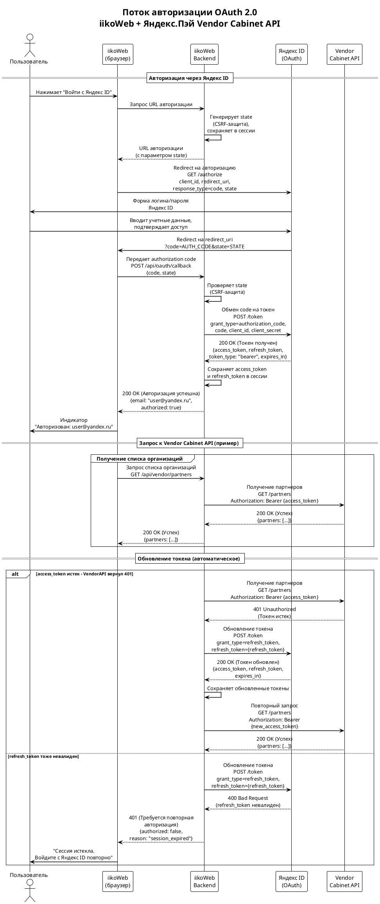

# Техническое задание: Автоматизация онбординга мерчантов Яндекс.Пэй (OAuth 2.0)

> **Версия:** 1.0
> **Дата:** 10 апреля 2026 г.
> **Статус:** Черновик
> **Компонент:** iikoWeb / Панель Яндекс.Пэй

---

## Содержание

1. [Введение](#1-введение)
2. [Общее описание](#2-общее-описание)
3. [Глоссарий](#3-глоссарий)
4. [Функциональные требования](#4-функциональные-требования)
5. [Нефункциональные требования](#5-нефункциональные-требования)
6. [Авторизация OAuth 2.0](#6-авторизация-oauth-20)
7. [Vendor Cabinet API](#7-vendor-cabinet-api)
8. [Пользовательские сценарии](#8-пользовательские-сценарии)
9. [Интерфейс пользователя](#9-интерфейс-пользователя)
10. [Доработка iikoWeb Backend](#10-доработка-iikoweb-backend)
11. [Доработка плагина iikoFront](#11-доработка-плагина-iikofront)
12. [Обработка ошибок и граничные случаи](#12-обработка-ошибок-и-граничные-случаи)
13. [Ограничения и допущения](#13-ограничения-и-допущения)
14. [Обратная совместимость и миграция](#14-обратная-совместимость-и-миграция)
15. [Тестирование](#15-тестирование)
16. [Диаграммы](#16-диаграммы)
17. [Открытые вопросы](#17-открытые-вопросы)
18. [История изменений](#18-история-изменений)

---

## 1. Введение

### 1.1. Цель документа

Настоящее техническое задание описывает доработку панели администрирования Яндекс.Пэй в iikoWeb - автоматизацию онбординга мерчантов через протокол OAuth 2.0.

Документ предназначен для:

- определения функциональных и нефункциональных требований к реализации OAuth-авторизации через Яндекс ID;
- описания изменений в компонентах iikoWeb, iikoWeb Backend и плагине iikoFront;
- предоставления разработчикам полной спецификации для реализации;
- предоставления команде QA достаточной информации для разработки тест-кейсов и проведения приемочного тестирования.

Суть доработки: заменить ручной процесс получения User Token из личного кабинета Яндекс.Пэй и его копирования в iikoWeb на автоматический - пользователь авторизуется через "Войти с Яндекс ID", после чего iiko автоматически получает доступ к Vendor Cabinet API.

### 1.2. Область применения

**Затрагиваемые компоненты:**

| Компонент | Характер изменений |
|-----------|-------------------|
| iikoWeb (панель Яндекс.Пэй) | Основной компонент доработки. Добавление OAuth-авторизации через Яндекс ID, изменение UI панели администрирования |
| iikoWeb Backend | Реализация серверной части OAuth 2.0 - обмен authorization code на токены, взаимодействие с Vendor Cabinet API, хранение токенов |
| Плагин iikoFront (Resto.Front.Api.YandexPayPlugin) | Получение User Token через backend вместо локальной конфигурации |

**Не затрагиваемые компоненты:**

- Платежное API Яндекс.Пэй (операции оплаты, возврата, отмены) - работает без изменений
- iikoOffice - не затрагивается
- Мобильные приложения iiko - не затрагиваются

### 1.3. Связанные документы

| # | Документ | Описание |
|---|----------|----------|
| 1 | Анализ доработки OAuth-онбординг Яндекс.Пэй | Анализ и обоснование доработки |
| 2 | Постановка задачи (спецификация) | Исходная постановка задачи |
| 3 | OpenAPI-спецификация Vendor Cabinet API | schema_upd.html |
| 4 | Техническое задание QR-код от Яндекс.Пэй | ТЗ на базовый функционал оплаты по QR |
| 5 | ТЗ по областям (текущий iikoWeb) | Описание текущих областей iikoWeb |
| 6 | Инструкция Яндекс.Пей | Пользовательская инструкция |
| 7 | API Яндекс.Пэй (платежное API) | Спецификация платежного API |
| 8 | Документация Яндекс ID (OAuth 2.0) | https://yandex.ru/dev/id/doc/ru/ |
| 9 | Архитектура системы Яндекс.Пэй | Описание архитектуры интеграции |
| 10 | Справочник iiko и источники данных | Справочник платформы iiko |

---

## 2. Общее описание

### 2.1. Резюме задачи

Автоматизация процесса подключения мерчантов (ресторанов) к платежному сервису Яндекс.Пэй через OAuth 2.0 / Яндекс ID в интерфейсе iikoWeb.

Текущий процесс требует ручного получения User Token из личного кабинета Яндекс.Пэй и копирования в iikoWeb. Доработка заменяет его на автоматизированный сценарий: ресторатор авторизуется через кнопку "Войти с Яндекс ID", после чего iiko автоматически получает доступ к Vendor Cabinet API для управления мерчантами, заявками и токенами.

### 2.2. Бизнес-цель и выгоды

- Сокращение времени подключения мерчанта с часов/дней до нескольких минут
- Исключение ошибок ручного копирования токенов
- Подача заявок на подключение ресторанов через единый интерфейс (одна заявка = один ресторан, см. ограничение #9)
- Единый интерфейс управления подключениями в iikoWeb
- Автоматический мониторинг статуса заявок

### 2.3. Текущий процесс (AS-IS)

Подключение мерчанта к Яндекс.Пэй выполняется вручную в 4 шага:

1. Ресторатор заходит в личный кабинет Яндекс.Пэй
2. Копирует User Token вручную
3. Вставляет токен в настройки iikoWeb / iikoFront
4. Вручную выбирает QR-табличку

### 2.4. Целевой процесс (TO-BE)

Автоматизированный процесс подключения состоит из 7 шагов:

1. **Авторизация через Яндекс ID (OAuth 2.0)** - кнопка "Войти с Яндекс ID" в iikoWeb
2. **Получение списка организаций** (Partner ID) через Vendor Cabinet API
3. **Создание или выбор организации** (если её нет) - указание реквизитов: ИНН, ОГРН, КПП, адрес, контакты
4. **Подача заявки на подключение ресторана** (Merchant) - одна заявка на один ресторан (MVP), с указанием MCC-кода
5. **Ожидание обработки** (ориентировочно 2 дня) + поллинг статуса (processing -> active / failed)
6. **Получение User Token** отдельным запросом после активации мерчанта
7. **Маппинг QR-табличек** (POS ID) на кассы iikoFront (только на стороне iiko)

Полуручной способ подключения (копирование User Token из ЛК) сохраняется для обеспечения обратной совместимости.

### 2.5. Иерархия сущностей

```
Пользователь (Яндекс ID)
 └── Partner ID (организация / юрлицо)
      └── Merchant ID (магазин / ресторан)
           └── POS ID (QR-таблички, привязаны к кассам iiko)
```

### 2.6. Ключевые даты

| Дата | Событие |
|------|------|
| Q1 2026 | Согласование архитектуры OAuth с Яндекс |
| Q1 2026 | Получена актуальная схема Vendor Cabinet API |
| Q1 2026 | Подготовка спецификации |
| Q2 2026 | Ожидаемая готовность API со стороны Яндекс |

---

## 3. Глоссарий

| Термин | Определение |
|--------|-------------|
| Api-Key | Ключ, идентифицирующий кассовое ПО iiko при обращении к серверу Яндекс.Пэй. Выдается менеджером Яндекс.Пэй |
| Authorization Code Flow | Процесс OAuth 2.0, при котором пользователь авторизуется на стороне провайдера (Яндекс ID), а приложение (iiko) получает временный код для обмена на токен доступа |
| Bearer-токен | Токен доступа OAuth 2.0, передаваемый в заголовке Authorization для авторизации запросов к Vendor Cabinet API. Получается через Authorization Code Flow |
| MCC-код (Merchant Category Code) | Стандартный код категории деятельности торговой точки. Выбирается из справочника при подаче заявки на подключение мерчанта. Получается через GET /mcc-codes |
| Merchant | Ресторан / торговая точка в терминологии Яндекс.Пэй. Привязан к Partner (организации). Имеет статусы: processing, active, failed |
| OAuth 2.0 | Открытый протокол авторизации, позволяющий предоставить доступ к данным без передачи пароля. Используется для авторизации iiko в API Яндекс.Пэй |
| Partner (партнер) | Организация (юридическое лицо) в терминологии Vendor Cabinet API. Содержит реквизиты: ИНН, ОГРН, КПП, адрес. К партнеру привязаны мерчанты |
| POS ID | Идентификатор QR-таблички (кассы) в терминологии Яндекс.Пэй. Аналог Account из платежного API |
| QR-табличка (Account) | Физическая табличка с QR-кодом, размещаемая в торговой точке. Идентифицирует кассу в системе Яндекс.Пэй. Привязывается к терминалу iikoFront |
| User Token | Токен торговой точки в API Яндекс.Пэй. Используется для авторизации платежных операций. Привязан к Merchant (1 активный токен на мерчанта) |
| Vendor Cabinet API | Новый API Яндекс.Пэй для управления партнерами, мерчантами и токенами. Авторизация через OAuth Bearer-токен. Тест: https://test.console.pay.yandex.net/api/vendor/v1, Прод: https://console.pay.yandex.net/api/vendor/v1 |
| iikoWeb | Облачная панель администрирования iiko. Используется для централизованной настройки QR-табличек и управления подключениями |
| Яндекс ID | Единая учетная запись Яндекса. Используется для OAuth-авторизации |

---

## 4. Функциональные требования

Функциональные требования распределены по соответствующим секциям: секция 8 (Пользовательские сценарии), секция 9 (Интерфейс пользователя), секция 10 (Доработка iikoWeb Backend), секция 11 (Доработка плагина iikoFront).

---

## 5. Нефункциональные требования

Нефункциональные требования описаны в соответствующих секциях: безопасность (секция 6.6, секция 10.5), производительность (секция 10.6), тестирование (секция 15).

---

## 6. Авторизация OAuth 2.0

### 6.1. Обзор OAuth 2.0 интеграции

Интеграция iikoWeb с Vendor Cabinet API Яндекс.Пэй требует авторизации по протоколу OAuth 2.0 (Authorization Code Flow) через Яндекс ID. Bearer-токен, полученный в результате OAuth-авторизации, используется для вызовов Vendor Cabinet API - управления партнерами, мерчантами и платежными токенами.

В системе действуют два независимых контура авторизации:

| # | Контур | Механизм | API | Назначение |
|---|--------|----------|-----|------------|
| 1 | OAuth 2.0 (новый) | Bearer-токен (access_token) | Vendor Cabinet API | Управление партнерами, мерчантами, выпуск User-Token |
| 2 | Api-Key + User-Token (существующий) | Статические ключи в заголовках | Платежное API | Операции оплаты, возвраты, отмены |

Контуры независимы: доработка OAuth-авторизации не затрагивает существующий механизм Api-Key / User-Token, используемый плагином iikoFront для платежных операций.

### 6.2. Регистрация OAuth-приложения

Регистрация выполняется командой iiko (разработчиком) однократно. Результат регистрации - пара `client_id` / `client_secret`, используемая для всех инсталляций iikoWeb.

**Параметры регистрации:**

| Параметр | Значение | Примечание |
|----------|----------|------------|
| Консоль регистрации | https://oauth.yandex.ru/ | Требуется аккаунт разработчика |
| Тип приложения | Для доступа к API | Определяет доступные grant types |
| client_id | Выдается при регистрации | Публичный идентификатор приложения |
| client_secret | Выдается при регистрации | Хранится ТОЛЬКО на backend |
| redirect_uri | Один URL для всего SaaS-приложения iiko | Указывается при регистрации, должен совпадать в запросах. Значение: `https://{iiko-web-domain}/api/oauth/callback` (см. Endpoint B в Справочнике endpoints) |
| Тип токена | Продлеваемый (рекомендуется) | TTL не менее 1 года, продлевается при каждой авторизации |
| Scopes | [?] Уточнить при регистрации | Конкретные имена scopes не раскрыты в спецификации |

**Открытый вопрос (Q1):** Конкретные scopes для Vendor Cabinet API не указаны в документации. API возвращает ошибку 403 "Недостаточно прав (scope) для выполнения операции" при отсутствии нужного scope. Необходимо уточнить список scopes при регистрации приложения или у менеджера Яндекс.Пэй.

### 6.3. Authorization Code Flow

#### Последовательность шагов

| Шаг | Инициатор | Действие | Endpoint / Механизм |
|-----|-----------|----------|----------------------|
| 1 | Пользователь | Нажимает "Войти с Яндекс ID" в iikoWeb | Кнопка в UI |
| 2 | iikoWeb Frontend | Перенаправляет браузер на Яндекс OAuth | GET https://oauth.yandex.ru/authorize |
| 3 | Яндекс ID | Отображает форму логина/пароля | Страница Яндекс ID |
| 4 | Пользователь | Вводит учетные данные, подтверждает доступ | Страница Яндекс ID |
| 5 | Яндекс ID | Перенаправляет браузер обратно с `code` | Redirect на redirect_uri |
| 6 | iikoWeb Backend | Обменивает `code` на токены (server-to-server) | POST https://oauth.yandex.ru/token |
| 7 | iikoWeb Backend | Сохраняет access_token и refresh_token в сессии | Серверное хранилище |
| 8 | iikoWeb Frontend | Отображает статус "Авторизован" | UI обновляется |

#### Параметры запроса GET /authorize

```
GET https://oauth.yandex.ru/authorize?
    response_type=code
    &client_id={client_id}
    &redirect_uri={redirect_uri}
    &state={random_csrf_token}
```

| Параметр | Обязательный | Описание |
|----------|:------------:|----------|
| response_type | Да | Фиксированное значение `code` |
| client_id | Да | Идентификатор OAuth-приложения iiko |
| redirect_uri | Да | URL обратного вызова, совпадает с указанным при регистрации |
| state | Да | Случайная строка для защиты от CSRF-атак. Backend генерирует, сохраняет в сессии, проверяет при callback |

#### Обмен code на токен: POST /token

```
POST https://oauth.yandex.ru/token
Content-Type: application/x-www-form-urlencoded

grant_type=authorization_code
&code={authorization_code}
&client_id={client_id}
&client_secret={client_secret}
```

| Параметр | Обязательный | Описание |
|----------|:------------:|----------|
| grant_type | Да | Фиксированное значение `authorization_code` |
| code | Да | Код авторизации, полученный от Яндекс ID |
| client_id | Да | Идентификатор OAuth-приложения |
| client_secret | Да | Секрет приложения. Передается ТОЛЬКО server-to-server |

#### Формат ответа POST /token

```json
{
  "access_token": "y0_AgAAAABx...",
  "refresh_token": "1:GN3s...",
  "token_type": "bearer",
  "expires_in": 31536000
}
```

| Поле | Тип | Описание |
|------|-----|----------|
| access_token | string | Bearer-токен для Vendor Cabinet API |
| refresh_token | string | Токен для обновления access_token без повторной авторизации |
| token_type | string | Всегда `bearer` |
| expires_in | integer | Время жизни access_token в секундах |

### 6.4. Управление токенами (TTL, refresh, хранение)

#### Время жизни токенов (TTL)

Тип токена определяется при регистрации OAuth-приложения:

| Тип токена | TTL | Поведение |
|------------|-----|-----------|
| Продлеваемый (рекомендуется) | Не менее 1 года | Продлевается при каждой авторизации |
| Ограниченный | Устаревает по истечении expires_in | Требует обновления через refresh_token |

Конкретное значение TTL возвращается в поле `expires_in` (секунды) при получении токена.

Время жизни refresh_token совпадает с access_token.

#### Механизм обновления токена (refresh)

```
POST https://oauth.yandex.ru/token
Content-Type: application/x-www-form-urlencoded

grant_type=refresh_token
&refresh_token={refresh_token}
&client_id={client_id}
&client_secret={client_secret}
```

Особенности:
- При обновлении access_token может не измениться, если его срок жизни достаточно длительный
- Рекомендация Яндекса: обновлять долгоживущие токены раз в 3 месяца
- Backend должен реализовать фоновое обновление без участия пользователя

#### Хранение токенов

| Токен / Секрет | Где хранится | Передается на фронтенд |
|----------------|--------------|:----------------------:|
| client_secret | iikoWeb Backend (конфигурация) | Нет |
| access_token | iikoWeb Backend (сессия пользователя) | Нет |
| refresh_token | iikoWeb Backend (сессия пользователя) | Нет |
| state (CSRF) | iikoWeb Backend (сессия, временно) | Нет (только в URL redirect) |

[!] Токены НИКОГДА не передаются на фронтенд (браузер). Все вызовы Vendor Cabinet API выполняются server-to-server с backend iikoWeb.

#### Обработка ошибки 401 (токен недействителен)

При получении HTTP 401 от Vendor Cabinet API backend выполняет:

1. Попытка обновить access_token через refresh_token
2. Если refresh_token тоже недействителен - очистить оба токена из сессии
3. Вернуть на фронтенд статус "не авторизован"
4. Предложить пользователю повторную OAuth-авторизацию (кнопка "Войти с Яндекс ID")

#### Отзыв токенов со стороны пользователя

Пользователь может самостоятельно отозвать доступ приложения iiko:
- Через страницу управления доступом: https://id.yandex.ru/personal/data-access
- При смене пароля Яндекс ID

После отзыва токены становятся недействительными, API возвращает 401.

### 6.5. Кнопка "Войти с Яндекс ID"

#### Расположение

Кнопка размещается в панели iikoWeb, в верхней части DetailPanel (область детализации), выше основного контента секции управления Яндекс.Пэй.

#### Стилизация

Кнопка оформляется по официальным гайдлайнам Яндекс ID:
- Конструктор кнопки: https://yandex.ru/dev/id/doc/ru/suggest/but-const
- Соблюдение фирменного стиля обязательно (логотип, цвета, отступы)

#### Два состояния интерфейса

**Состояние 1 - Не авторизован:**

| Элемент | Описание |
|---------|----------|
| Кнопка "Войти с Яндекс ID" | Стилизована по гайдлайну Яндекса. При нажатии - redirect на https://oauth.yandex.ru/authorize |
| Текст-подсказка | Краткое пояснение: для чего нужна авторизация |
| Функционал Vendor Cabinet | Недоступен (элементы управления заблокированы или скрыты) |

**Состояние 2 - Авторизован:**

| Элемент | Описание |
|---------|----------|
| Индикатор | Текст "Авторизован: user@example.com" (email из профиля Яндекс ID) |
| Кнопка "Выйти" | Очищает Bearer-токен на стороне iiko |
| Функционал Vendor Cabinet | Доступен (элементы управления активны) |

#### Поведение кнопки "Выйти"

При нажатии "Выйти":
- Backend очищает access_token и refresh_token из сессии пользователя
- UI переключается в состояние "Не авторизован"
- Сессия Яндекс ID в браузере пользователя сохраняется (iiko не управляет сессией Яндекса)
- Повторное нажатие "Войти с Яндекс ID" может пройти без ввода пароля, если сессия Яндекс ID активна

### 6.6. Требования к безопасности OAuth

**CSRF-защита:** Параметр `state` обязателен в каждом запросе авторизации. Backend генерирует криптографически стойкое случайное значение, сохраняет в сессии и передает в authorization URL. При получении callback значение `state` сверяется с сохраненным - при несовпадении запрос отклоняется.

**Хранение секретов:**

| Параметр | Где хранится | Доступ фронтенда | Примечание |
|----------|-------------|------------------|------------|
| `client_id` | Backend (конфигурация) | Транзитно (в URL) | Публичный параметр, не является секретом |
| `client_secret` | Backend (конфигурация) | Нет | Используется только в server-to-server вызовах |
| `access_token` | Backend (БД/хранилище) | Нет | Рекомендуется шифрование at rest |
| `refresh_token` | Backend (БД/хранилище) | Нет | Рекомендуется шифрование at rest |
| `authorization_code` | Передается через redirect | Транзитно (в URL) | Одноразовый, короткоживущий |
| `state` | Backend (сессия) | Нет | Генерируется и проверяется на backend |

**Server-to-server архитектура:** Все вызовы к Vendor Cabinet API выполняются исключительно с backend iiko. Фронтенд (браузер) не имеет доступа к токенам и не выполняет прямых запросов к API Яндекс.Пэй. Единственное взаимодействие браузера с Яндекс - страница логина Яндекс ID (redirect).

**Шифрование токенов:** Рекомендуется шифровать `access_token` и `refresh_token` в хранилище (encryption at rest). Минимальное требование - хранение в защищенном хранилище с ограниченным доступом.

**Логирование:**

| Логировать | НЕ логировать |
|-----------|---------------|
| Факт начала/завершения авторизации | `client_secret` |
| HTTP-статусы ответов Яндекс API | `access_token`, `refresh_token` |
| Коды ошибок (без тел ответов с токенами) | `authorization_code` |
| Идентификатор пользователя (account_id) | Полные тела ответов token endpoint |
| Факт обновления/отзыва токена | Значение параметра `state` |
| Timestamp операций | User Token (платежный API) |

### 6.7. Обработка ошибок OAuth

**Ошибки на этапе авторизации (redirect от Яндекс ID):**

| Ситуация | Параметр error | Действие iiko | Сообщение пользователю |
|----------|---------------|---------------|------------------------|
| Пользователь отказал в доступе | `access_denied` | Вернуть на страницу подключения | "Авторизация отклонена. Для подключения необходимо предоставить доступ" |
| Невалидный `state` | - | Отклонить callback, логировать [!] | "Ошибка безопасности. Повторите попытку подключения" |
| Истечение `authorization_code` | `invalid_grant` (на этапе обмена) | Перенаправить на повторную авторизацию | "Время авторизации истекло. Повторите попытку" |
| Некорректный `redirect_uri` | Ошибка на стороне Яндекс | Пользователь не вернется на iiko | - (ошибка конфигурации) |

**Ошибки при работе с токенами (server-to-server):**

| Ситуация | HTTP | Действие iiko | Сообщение пользователю |
|----------|------|---------------|------------------------|
| Токен истек/отозван/отсутствует | 401 | 1) Попытка refresh. 2) При неудаче - сбросить авторизацию, показать кнопку "Войти" | "Сессия авторизации истекла. Необходимо повторно войти через Яндекс ID" |
| Доступ запрещен (чужой ресурс или недостаточно прав scope) | 403 | Записать ошибку в лог. Предложить нажать "Выйти" и войти под другим аккаунтом | "Нет доступа. Убедитесь, что вы авторизовались под корректным аккаунтом Яндекс" |
| Ошибка сервера Яндекс | 500 | Показать toast с ошибкой. Не блокировать остальной функционал. Записать в лог. Не повторять запрос автоматически | "Сервис Яндекс.Пэй временно недоступен. Попробуйте позже" |

**Отзыв токена пользователем:** Пользователь может отозвать доступ через https://id.yandex.ru/personal/data-access или сменой пароля Яндекс ID. В этом случае следующий запрос к Vendor Cabinet API вернет 401 - iiko обработает по стандартному сценарию (refresh, затем повторная авторизация).

### 6.8. Ограничения и открытые вопросы OAuth

**Ограничения MVP:**

| # | Ограничение | Последствие | Планы |
|---|------------|-------------|-------|
| 1 | Один OAuth-аккаунт на сессию iikoWeb | Нельзя подключить несколько аккаунтов Яндекс.Пэй одновременно | Достаточно для MVP |
| 2 | Нет фонового обновления статусов | Статус подключения обновляется при открытии страницы или вручную | Возможно добавить polling/websocket позже |
| 3 | Кнопка "Выйти" не разлогинивает из Яндекс ID | Пользователь остается залогиненным в Яндекс ID в браузере, отключается только связка с iiko | Штатное поведение OAuth |
| 4 | User Token передается в отдельном ответе API | Дополнительный запрос для получения платежного токена после OAuth | Требование безопасности Яндекс |

**Открытые вопросы (OAuth):**

| # | Вопрос | Статус | Комментарий |
|---|--------|--------|-------------|
| Q1 | Конкретные scopes для Vendor Cabinet API | Частично отвечен | Уточняется при регистрации приложения в Яндекс |
| Q8 | `redirect_uri` - один на весь SaaS или per-tenant | Частично отвечен | Предварительно - один URI для всего SaaS |

### 6.9. Sequence-диаграмма потока авторизации

Диаграмма показывает полный цикл OAuth 2.0 Authorization Code Flow: от нажатия кнопки "Войти с Яндекс ID" до получения Bearer-токена, а также сценарии обновления токена и обработки ошибок.



---

## 7. Vendor Cabinet API

### 7.1. Общие сведения

| Параметр | Значение |
|----------|----------|
| Название | Vendor Cabinet API |
| Версия | v1 |
| Base URL (Production) | https://console.pay.yandex.net/api/vendor/v1 |
| Base URL (Sandbox/тест) | https://test.console.pay.yandex.net/api/vendor/v1 |
| Авторизация | OAuth 2.0 Bearer-токен в заголовке `Authorization: Bearer <token>` |
| Content-Type | application/json |
| Формат дат | ISO 8601 |
| Источник спецификации | YAML-схема schema_upd.html от 18.03.2026 |
| Ожидаемая дата готовности | 01 апреля 2026 |

Все запросы к API Vendor Cabinet используют заголовок `Authorization: Bearer <access_token>`. Ответ API возвращается в формате JSON с полем "code" (HTTP-код ответа) и полем "data" (данные результата) или "status" для указания успеха операции. При ошибках в поле "data" содержится описание проблемы.

---

### 7.2. Сводная таблица методов

| # | Группа | HTTP метод | Endpoint | Описание |
|---|--------|-----------|----------|----------|
| 1 | partners | GET | /partners | Получить список партнеров (организаций) пользователя |
| 2 | partners | POST | /partners | Создать нового партнера или получить существующего (по ИНН) |
| 3 | merchants | POST | /merchants/register | Создать заявку на подключение мерчанта (одна заявка = один ресторан) |
| 4 | merchants | GET | /merchants/{merchant_id}/status | Получить статус регистрации мерчанта (поллинг) |
| 5 | merchants | GET | /merchants?partner_id={id} | Получить список мерчантов партнера |
| 6 | usertoken | GET | /merchants/{merchant_id}/usertoken | Получить список user_token (хеши) мерчанта |
| 7 | usertoken | POST | /merchants/{merchant_id}/usertoken | Создать новый user_token для мерчанта |
| 8 | usertoken | DELETE | /merchants/{merchant_id}/usertoken/{token_id} | Удалить user_token мерчанта |
| 9 | reference | GET | /mcc-codes | Получить справочник MCC-кодов |

Детальное описание каждого метода (параметры, JSON-схемы запросов/ответов, curl-примеры, коды ошибок) вынесено в отдельный документ: "Vendor Cabinet API - Детальное описание методов" (см. приложение)

---

## 8. Пользовательские сценарии

В данной секции описаны ключевые сценарии взаимодействия пользователя (администратора ресторанной сети) с доработанным интерфейсом iikoWeb для подключения ресторанов к Яндекс.Пэй через OAuth 2.0. Для каждого сценария указаны предусловия, пошаговые действия пользователя с реакцией системы и ожидаемый результат.

### 8.1. Основной сценарий (Happy Path)

Полный путь нового пользователя - от авторизации через Яндекс ID до работающей QR-оплаты на кассе.

**Предусловия:**

- Пользователь имеет учетную запись iiko с правами администратора
- Пользователь имеет учетную запись Яндекс ID
- Организация ранее не регистрировалась в Яндекс.Пэй

**Шаги:**

| Шаг | Действие пользователя | Реакция системы | API-вызов |
|-----|----------------------|-----------------|-----------|
| 1 | Открывает раздел "Интеграции" -> "Яндекс.Пэй" в iikoWeb | Отображается панель настроек Яндекс.Пэй. В верхней части - блок авторизации с кнопкой "Войти с Яндекс ID" | - |
| 2 | Нажимает кнопку "Войти с Яндекс ID" | Открывается страница авторизации Яндекс ID (в новом окне или popup). Пользователь вводит логин/пароль | Redirect на `https://oauth.yandex.ru/authorize?response_type=code&client_id=...&redirect_uri=...` |
| 3 | Подтверждает доступ на странице Яндекс | Яндекс перенаправляет на redirect_uri с параметром code. Popup закрывается (или пользователь возвращается в iikoWeb) | Callback с `code` |
| 4 | - (автоматически) | Backend обменивает code на access_token. Кнопка "Войти" заменяется на индикатор "Авторизован: user@yandex.ru" + кнопка "Выйти" | Backend -> Яндекс OAuth: `POST /token` |
| 5 | - (автоматически) | Система загружает список организаций. Если нет - кнопка "Создать организацию". Если есть - список для выбора | `GET /partners` (Bearer token) |
| 6 | Нажимает "Создать организацию" | Открывается форма: название, ИНН, ОГРН, КПП, адреса, контактные данные | - |
| 7 | Заполняет форму, нажимает "Создать" | Организация создана, появляется в списке как выбранная | `POST /partners` (тело: registration_data, contact) |
| 8 | - (автоматически) | Система загружает список мерчантов. Список пуст (новая организация). Отображается кнопка "Подать заявку на подключение" | `GET /merchants?partner_id={id}` |
| 9 | Выбирает ресторан из дерева iiko для подключения | Открывается форма заявки: выбранный ресторан, MCC-код (dropdown), физ. адрес, банковские реквизиты, контакт | - |
| 10 | Заполняет данные заявки, нажимает "Подать заявку" | Toast: "Заявка подана". Статус мерчанта = "processing" | `POST /merchants/register` (partner_id, один мерчант) |
| 11 | - (автоматически) | Система запускает поллинг статуса (не чаще 1 раза в 10 мин + при открытии страницы). Индикатор: "Заявка обрабатывается..." | `GET /merchants/{id}/status` |
| 12 | - (автоматически, после одобрения) | Поллинг возвращает registration_status: "active". Статус мерчанта меняется на "Подключен" (зеленый). Появляется кнопка "Перейти в настройки" | `GET /merchants/{id}/status` |
| 13 | - (автоматически) | Система запрашивает User Token и сохраняет token_value в БД. На экране: "User Token получен [OK]" | `POST /merchants/{id}/usertoken` |
| 14 | - (автоматически) | User Token сохраняется в iiko. Поле ключа заполнено автоматически. Пользователю не нужно копировать токен вручную | `POST /api/yandex-pay/codes` (storeId, token_value) |
| 15 | - (автоматически) | Система загружает список QR-табличек. Отображаются карточки табличек (POS) | `POST /api/yandex-pay/codes/{codeId}/refresh`, затем `GET /api/yandex-pay/accounts/{storeId}` |
| 16 | Назначает QR-таблички на кассовые терминалы (dropdown) | Привязка сохраняется мгновенно (без кнопки Save). Toast: "Табличка назначена" | `POST /api/yandex-pay/terminal-accounts` ({terminalId, accountId} в теле) |
| 17 | Выбирает табличку по умолчанию | Default account выбран | `POST /api/yandex-pay/codes/{storeId}/default-account` |

**Результат:** Ресторан полностью подключен к Яндекс.Пэй. QR-таблички назначены на кассы. Оплата работает.

[!] Важно: Шаги 4-5, 8, 11-15 выполняются системой автоматически без участия пользователя.

---

### 8.2. Организация уже существует (идемпотентность ИНН)

Пользователь пытается создать организацию, но организация с таким ИНН уже зарегистрирована в Яндекс.Пэй (возможно, другим сотрудником).

**Предусловия:**

- Пользователь авторизован через Яндекс ID
- Организация с данным ИНН уже существует в Яндекс.Пэй

**Шаги:**

| Шаг | Действие пользователя | Реакция системы | API-вызов |
|-----|----------------------|-----------------|-----------|
| 1 | Заполняет форму создания организации, нажимает "Создать" | API возвращает 200 OK с данными существующей организации (идемпотентность по ИНН) | `POST /partners` (совпадение ИНН) |
| 2 | - | Сообщение: "Организация с ИНН {inn} уже зарегистрирована в Яндекс.Пэй. Данные подтянуты автоматически" | - |
| 3 | - (автоматически) | Система загружает список мерчантов организации (если есть ранее зарегистрированные рестораны) | `GET /merchants?partner_id={id}` |
| 4 | Продолжает работу | Переход к подаче заявок на подключение ресторанов (шаг 9 основного сценария) | - |

**Результат:** Пользователь работает с существующей организацией. Данные подтянуты автоматически, дубликат не создан.

[!] Важно: `POST /partners` при совпадении ИНН не создает дубликат, а возвращает существующего партнера. Это штатное поведение API (идемпотентность).

---

### 8.3. Повторная авторизация (все уже подключено)

Пользователь повторно авторизуется через Яндекс ID, когда организация и мерчанты уже подключены.

**Предусловия:**

- Организация создана, мерчанты активны (registration_status: "active")
- User Token ранее сохранен в iiko
- QR-таблички привязаны к терминалам

**Шаги:**

| Шаг | Действие пользователя | Реакция системы | API-вызов |
|-----|----------------------|-----------------|-----------|
| 1 | Открывает раздел "Яндекс.Пэй" | Текущая панель с заполненным полем ключа и назначенными QR-табличками. Блок авторизации: кнопка "Войти с Яндекс ID" | - |
| 2 | Нажимает "Войти с Яндекс ID" | OAuth-флоу. Индикатор: "Авторизован: user@yandex.ru" + кнопка "Выйти" | OAuth (code -> token) |
| 3 | - (автоматически) | Система загружает организации и мерчантов. Все мерчанты со статусом "active" (зеленый) | `GET /partners`, `GET /merchants?partner_id={id}` |
| 4 | Просматривает статусы | Полная информация о подключениях. Можно управлять QR-табличками, подавать новые заявки | - |

**Результат:** Пользователь видит актуальную информацию обо всех подключениях. Все мерчанты отображаются с зеленым статусом "Подключен".

[!] Важно: Ранее настроенные интеграции (User Token, привязки QR-табличек) работают независимо от OAuth-авторизации. OAuth нужен только для управления мерчантами через Vendor Cabinet API.

---

### 8.4. Ошибка авторизации (чужой аккаунт)

Пользователь авторизовался через Яндекс ID, но его аккаунт не имеет прав на нужную организацию в Яндекс.Пэй.

**Предусловия:**

- Пользователь авторизовался через Яндекс ID
- Аккаунт Яндекс не имеет доступа к нужной организации

**Шаги:**

| Шаг | Действие пользователя | Реакция системы | API-вызов |
|-----|----------------------|-----------------|-----------|
| 1 | Авторизуется через Яндекс ID | Авторизация успешна на уровне Яндекс ID | OAuth-флоу |
| 2 | - (автоматически) | Система запрашивает список организаций. Возвращается пустой список или организации, доступные данному аккаунту | `GET /partners` |
| 3 | Не видит нужную организацию | Подсказка: "Нужной организации нет в списке? Возможно, вы авторизовались под другим аккаунтом. Нажмите 'Выйти' и войдите под корректным аккаунтом" | - |
| 4 | Нажимает "Выйти" | Bearer-токен удаляется из сессии. Кнопка "Войти с Яндекс ID" снова доступна | Удаление Bearer-токена из сессии |
| 5 | Повторно авторизуется с другим аккаунтом | Отображаются организации нового аккаунта | OAuth-флоу, `GET /partners` |

**Результат:** Пользователь авторизуется с корректным аккаунтом и видит нужные организации.

[!] Важно: Для предоставления доступа другому сотруднику к организации используется раздел "Сотрудники" в личном кабинете Яндекс.Пэй (console.pay.yandex.net). Управление правами доступа - на стороне Яндекс.

---

### 8.5. Заявка отклонена Яндексом

Пользователь подал заявку на регистрацию мерчанта, но Яндекс отклонил заявку.

**Предусловия:**

- Пользователь подал заявку на подключение ресторана (`POST /merchants/register`)
- Яндекс отклонил заявку (registration_status: "failed")

**Шаги:**

| Шаг | Действие пользователя | Реакция системы | API-вызов |
|-----|----------------------|-----------------|-----------|
| 1 | - (автоматически) | Поллинг возвращает registration_status: "failed". Статус мерчанта меняется на "Отклонено" (красная метка). Система прекращает поллинг для этого мерчанта | `GET /merchants/{id}/status` |
| 2 | Видит информацию об отклонении | Сообщение: "Заявка на подключение ресторана '{name}' отклонена Яндексом". Рекомендация: "Для уточнения причин обратитесь в поддержку Яндекс.Пэй или проверьте данные заявки" | - |
| 3 | Нажимает "Подать заявку повторно" (при необходимости) | Открывается форма заявки с данными для исправления. Новая заявка создается с новым merchant_id | `POST /merchants/register` |

**Результат:** Старая заявка остается в списке со статусом "Отклонено". Пользователь может подать повторную заявку с исправленными данными.

[!] Важно: Vendor Cabinet API не возвращает причину отклонения заявки. Ответ `GET /merchants/{id}/status` содержит только: merchant_id, registration_status, poses[]. Поля reason/failure_reason нет (источник: schema_upd.html).

---

### 8.6. Перепривязка QR-табличек

Изменение привязки QR-табличек к кассовым терминалам (например, при перемещении кассы).

**Предусловия:**

- Мерчант подключен (registration_status: "active")
- QR-таблички назначены на кассовые терминалы

**Шаги:**

| Шаг | Действие пользователя | Реакция системы | API-вызов |
|-----|----------------------|-----------------|-----------|
| 1 | Открывает настройки ресторана | Отображается таблица: терминал -> привязанная QR-табличка | `GET /api/yandex-pay/terminal-accounts/{storeId}` |
| 2 | Выбирает другую табличку в dropdown для терминала | Привязка обновлена мгновенно (без кнопки Save). Toast: "Табличка переназначена" | `POST /api/yandex-pay/terminal-accounts` |
| 3 | При необходимости меняет табличку по умолчанию | Default account обновлен | `POST /api/yandex-pay/codes/{storeId}/default-account` |

**Результат:** Привязка QR-табличек к терминалам обновлена. Изменения вступают в силу мгновенно.

[!] Важно: Маппинг QR-табличек выполняется только на стороне iiko (iikoWeb или iikoFront). Яндекс не хранит соответствие "табличка - касса".

---

### 8.7. Добавление новых касс к мерчанту

В ресторане появились новые кассовые терминалы, которым нужны QR-таблички.

**Предусловия:**

- Мерчант подключен (registration_status: "active")
- В ресторане установлены новые кассовые терминалы
- Дополнительные QR-таблички заказаны через ЛК Яндекс.Пэй

**Шаги:**

| Шаг | Действие пользователя | Реакция системы | API-вызов |
|-----|----------------------|-----------------|-----------|
| 1 | Заказывает дополнительные QR-таблички | Новые POS-ы создаются в Яндекс.Пэй | Через ЛК Яндекс.Пэй (https://console.pay.yandex.net) |
| 2 | Обновляет список табличек в iikoWeb | Таблички обновлены из Яндекс API | `POST /api/yandex-pay/codes/{codeId}/refresh` |
| 3 | - (автоматически) | Новые таблички появляются в списке без привязки | `GET /api/yandex-pay/accounts/{storeId}` |
| 4 | Назначает таблички на новые терминалы (dropdown) | Привязка сохранена мгновенно. Новые кассы готовы принимать оплату | `POST /api/yandex-pay/terminal-accounts` |

**Результат:** Новые кассовые терминалы привязаны к QR-табличкам и готовы принимать оплату через Яндекс.Пэй.

[!] Важно: Добавление новых QR-табличек (POS) выполняется через личный кабинет Яндекс.Пэй, не через iikoWeb. iikoWeb только забирает уже созданные таблички и привязывает их к терминалам.

---

### 8.8. Смена аккаунта (кнопка "Выйти")

Пользователь хочет войти под другим аккаунтом Яндекс ID - например, для управления другой организацией.

**Предусловия:**

- Пользователь авторизован через Яндекс ID (отображается индикатор "Авторизован: user@yandex.ru")

**Шаги:**

| Шаг | Действие пользователя | Реакция системы | API-вызов |
|-----|----------------------|-----------------|-----------|
| 1 | Нажимает кнопку "Выйти" | Bearer-токен удаляется на стороне iikoWeb Backend. Сессия OAuth очищена | Удаление Bearer-токена |
| 2 | - | Интерфейс возвращается в начальное состояние: кнопка "Войти с Яндекс ID". Секция Vendor Cabinet скрыта | - |
| 3 | Нажимает "Войти с Яндекс ID" | Яндекс может предложить выбрать аккаунт (если в браузере несколько сессий) или запросить логин/пароль | OAuth-флоу (redirect -> code -> token) |
| 4 | Авторизуется под новым аккаунтом | Отображаются организации нового аккаунта | `GET /partners` |

**Результат:** Пользователь авторизован под новым аккаунтом и видит организации, доступные этому аккаунту.

[!] Важно: Смена OAuth-аккаунта НЕ влияет на ранее сохраненные User Token и привязки QR-табличек. Ранее настроенные интеграции продолжают работать на кассах.

[!] Важно: Кнопка "Выйти" очищает только Bearer-токен на стороне iiko. Сессия Яндекс ID в браузере пользователя сохраняется. Для полного выхода из Яндекс-аккаунта пользователю нужно выйти на passport.yandex.ru.

### 8.9. Подключение >10 касс на одном RMS (кофе-поинты)

**Предусловие:** Ресторан (RMS) имеет более 10 касс. Первая заявка на 10 касс уже подана и активна.

| Шаг | Действие | Реакция системы |
|-----|----------|------------------|
| 1 | Пользователь нажимает "Подать заявку на подключение" для того же ресторана | Открывается форма. Кассы 1-10 отображаются disabled с пометкой "Подключена" |
| 2 | Пользователь выбирает кассы 11-20 | Чекбоксы доступны для свободных касс. Лимит: макс. 10 за заявку |
| 3 | Пользователь заполняет данные и подает заявку | Создается новый Merchant ID на стороне Яндекс для того же RMS |
| 4 | Яндекс одобряет заявку | Ресторан получает второй Merchant ID и второй набор QR-кодов. В секции "Подключение" отображаются оба подключения |

**Важно:** У одного RMS может быть несколько Merchant ID. Каждый Merchant ID - независимый набор QR-табличек.

**Ограничение Яндекс:** При проверке заявки менеджер Яндекс может уточнить, почему на одном адресе несколько заявок. Ресторатор должен объяснить ситуацию.

**Результат:** Ресторан с >10 кассами полностью подключен к Яндекс.Пэй через несколько Merchant ID.

---

## 9. Интерфейс пользователя

Данная секция описывает интерфейс пользователя для функционала OAuth-онбординга в iikoWeb. Описаны текущий экран (до доработки), новые элементы интерфейса (блок авторизации, формы организаций и мерчантов, экран статусов), а также изменения в существующей секции маппинга QR-табличек. Описание представлено структурированным текстом с таблицами элементов и полей.

### 9.1. Текущий экран (резюме до доработки)

Текущий интерфейс управления Яндекс.Пэй в iikoWeb состоит из четырех областей, расположенных в рамках стандартного layout приложения.

**Компоновка экрана:**

| Область | Размер | Описание |
|---------|--------|----------|
| Header | Высота 56px | Верхняя панель навигации iikoWeb |
| Sidebar | Ширина 208px | Левое меню, пункт "Интеграции" |
| OrgTree | Ширина 384px | Дерево организаций с поиском (debounce 300ms) |
| DetailPanel | flex-1 (остаток ширины) | Основная область - форма настроек ресторана |

**Иконки статуса в OrgTree:**

| Иконка | Значение |
|--------|----------|
| Зеленая галочка | Ресторан полностью настроен |
| Оранжевое предупреждение | Частичная настройка |
| Серый круг | Не настроен |

**Состояния DetailPanel:**

| # | Состояние | Содержимое |
|---|-----------|-----------|
| 1 | Не выбран ресторан | Текст-заглушка "Выберите ресторан" |
| 2 | Загрузка | Spinner (индикатор загрузки) |
| 3 | Форма настроек | Рабочая форма выбранного ресторана |

**Элементы формы настроек (Состояние 3):**

| Элемент | Описание |
|---------|----------|
| Поле "Ключ" (User Token) | Input с моноширинным шрифтом (font-mono), ручной ввод |
| Кнопка "Сохранить" | Сохраняет введенный ключ |
| Кнопка "Очистить ключ" | Удаляет ключ |
| Секция "QR-таблички" | Dropdown выбора default account, карточки терминалов с dropdown для привязки таблички. Привязка сохраняется мгновенно (без кнопки "Сохранить") |

**Toast-уведомления:** fixed-позиция, bottom-6, right-6, автоскрытие через 3 секунды.

**Технологический стек:** Angular 16 standalone, Tailwind CSS, gray-палитра.

### 9.2. Блок авторизации Яндекс ID

Новый блок, добавляемый в DetailPanel для авторизации через Яндекс ID. Блок имеет два состояния в зависимости от наличия активной OAuth-сессии.

**Расположение:** DetailPanel, верхняя часть, ниже заголовка ресторана, выше поля "Ключ" (User Token).

#### Состояние 1: Не авторизован

| Элемент | Описание |
|---------|----------|
| Заголовок | "Автоматическое подключение" (font-semibold, text-gray-900) |
| Пояснение | "Авторизуйтесь через Яндекс ID для автоматического управления мерчантами и получения User Token" (text-gray-500) |
| Кнопка | "Войти с Яндекс ID" - стилизация по гайдлайнам Яндекс (см. подсекцию 9.8). Размещается по левому краю |
| Разделитель | Горизонтальная линия с текстом "или" - отделяет блок OAuth от ручного ввода ключа |

#### Состояние 2: Авторизован

| Элемент | Описание |
|---------|----------|
| Индикатор авторизации | Текст "Авторизован: {email}" (text-green-600). Email берется из ответа OAuth |
| Кнопка "Выйти" | Текстовая кнопка (text-red-500, underline), справа от индикатора |
| Селектор организации | Dropdown для выбора организации из списка `GET /partners`. Если организация одна - выбирается автоматически (см. подсекцию 9.3) |
| Список мерчантов | Под селектором организации - статусы подключенных мерчантов (см. подсекцию 9.6) |

**Поведение:**

- Блок ручного ввода ключа остается доступным ниже разделителя (альтернативный способ подключения).
- Если User Token получен автоматически через OAuth-флоу - поле ключа заполняется автоматически и становится readonly.
- Кнопка "Очистить ключ" остается доступной независимо от способа получения ключа.
- При нажатии "Выйти" - backend очищает access_token и refresh_token из сессии, UI переключается в состояние 1. Сессия Яндекс ID в браузере пользователя сохраняется (iiko не управляет сессией Яндекса).

> [!] Авторизация через Яндекс ID является точкой входа в процесс онбординга. Рекомендуемый пользовательский flow: (1) Авторизация через Яндекс ID -> (2) Выбор/создание организации -> (3) Подача заявки на мерчанта -> (4) Ожидание одобрения и получение токена. Размещение кнопки авторизации должно быть первичным действием на экране.

### 9.3. Список организаций

Секция отображается после авторизации через Яндекс ID, если у пользователя зарегистрировано несколько организаций (партнеров) в Яндекс.Пэй.

**Расположение:** DetailPanel, под индикатором авторизации.

**Элементы:**

| Элемент | Описание |
|---------|----------|
| Заголовок | "Организации в Яндекс.Пэй" |
| Список организаций | Каждая запись: название, ИНН, количество мерчантов. Клик по записи - выбирает организацию |
| Кнопка "Создать организацию" | Расположена под списком. Открывает форму создания (подсекция 9.4) |
| Текст при пустом списке | "Нет зарегистрированных организаций. Создайте новую для подключения ресторанов к Яндекс.Пэй" |

**Поведение:**

- Если у пользователя одна организация - выбирается автоматически, список не отображается.
- Если организаций нет - сразу предлагается создать (отображается кнопка "Создать организацию" и текст пустого списка).
- Данные загружаются из `GET /partners` при каждом открытии страницы и после создания новой организации.

### 9.4. Форма создания организации

Форма для ввода данных новой организации (партнера) в Яндекс.Пэй. Отображается при нажатии кнопки "Создать организацию".

**Расположение:** Модальное окно (overlay) или раскрывающаяся секция в DetailPanel.

**Поля формы:**

| # | Поле | Тип | Обязательное | Валидация | API-поле (`POST /partners`) |
|---|------|-----|-------------|-----------|----------------------------|
| 1 | Название организации | text input | Нет | Не пустое | `name` |
| 2 | ИНН | text input | Да | 10 или 12 цифр | `registration_data.tax_ref_number` |
| 3 | ОГРН | text input | Нет | 13 или 15 цифр | `registration_data.ogrn` |
| 4 | КПП | text input | Нет | 9 цифр | `registration_data.kpp` |
| 5 | Юридический адрес | text input | Нет | Не пустое | `registration_data.legal_address` |
| 6 | Почтовый адрес | text input | Нет | - | `registration_data.postal_address` |
| 7 | Почтовый индекс | text input | Нет | 6 цифр | `registration_data.postal_code` |
| 8 | Полное наименование | text input | Нет | - | `registration_data.full_company_name` |
| 9 | ФИО руководителя | text input | Нет | - | `registration_data.ceo_name` |
| 10 | URL (сайт) | text input | Нет | Валидный URL | `registration_data.url` |
| 11 | Контакт: Email | text input | Нет | Формат email | `contact.email` |
| 12 | Контакт: Телефон | text input | Нет | Формат телефона | `contact.phone` |
| 13 | Контакт: Фамилия | text input | Нет | Не пустое | `contact.last_name` |
| 14 | Контакт: Имя | text input | Нет | Не пустое | `contact.first_name` |
| 15 | Контакт: Отчество | text input | Нет | - | `contact.middle_name` |

> [!] Обязательно только поле ИНН. Яндекс подтягивает ОГРН, КПП и другие реквизиты по ИНН через сервис DaData. Остальные поля опциональны, но рекомендуются для полноты данных.

**Кнопки:**

| Кнопка | Действие |
|--------|----------|
| "Создать" | Отправляет `POST /partners`. При нажатии - кнопка отображает spinner, поля блокируются |
| "Отмена" | Закрывает форму без сохранения |

> [!] Создание организации - синхронная операция. Ответ от Vendor Cabinet API приходит мгновенно, поллинг статуса создания НЕ требуется.

**Поведение:**

- При успешном создании - организация появляется в списке, форма закрывается.
- При ошибке - toast-уведомление с описанием ошибки, поля остаются заполненными для исправления.
- Если ИНН совпадает с существующей организацией - API возвращает существующего партнера (идемпотентность по ИНН). Пользователю отображается сообщение: "Организация с ИНН {inn} уже зарегистрирована. Данные загружены автоматически".
- Клиентская валидация выполняется перед отправкой: обязательное поле ИНН (формат 10 или 12 цифр). Остальные поля валидируются при заполнении: формат ОГРН/КПП, формат email/телефона.

[!] Важно: Кнопка "Создать" должна быть заблокирована до заполнения поля ИНН с корректной валидацией (10 или 12 цифр).

### 9.5. Форма подачи заявки на мерчанта

Форма для подачи заявки на регистрацию ресторана (мерчанта) в Яндекс.Пэй. Отображается при нажатии кнопки "Подать заявку на подключение" у выбранного ресторана.

**Расположение:** DetailPanel, под выбранной организацией.

**Выбор ресторана:**

| Параметр | Описание |
|----------|----------|
| Расположение | Первый элемент формы, перед полями заявки |
| Тип элемента | Dropdown (select) |
| Источник данных | Список ресторанов из iiko (Cloud API / локальный кэш) |
| Формат элемента | "{название ресторана}" (например, "Кафе Уют - Тверская 12") |
| Поведение при выборе | При смене ресторана: 1) загружается список терминалов (касс) этого ресторана; 2) поле "Название торговой точки" предзаполняется названием ресторана; 3) поле "Физический адрес" предзаполняется адресом RMS; 4) чекбоксы касс обновляются |
| Если один ресторан | Выбирается автоматически, dropdown disabled |
| Уже подключенный ресторан | Ресторан, по которому есть активная заявка (status = active), отображается с пометкой "(подключен)". Повторный выбор допускается (для кейса >10 касс) |

**Поля формы:**

| # | Поле | Тип | Обязательное | Валидация | API-поле (`POST /merchants/register`) |
|---|------|-----|-------------|-----------|--------------------------------------|
| 1 | Название торговой точки | text input (предзаполнено из iiko) | Да | Не пустое | `merchants[].merchant.name` |
| 2 | Физический адрес | text input | Да | Не пустое | `merchants[].merchant.address` |
| 3 | MCC-код | dropdown (select) | Да | Выбор из справочника | `merchants[].onboarding_data.mcc` |
| 4 | БИК банка | text input | Да | 9 цифр | `merchants[].bank_details.bik` |
| 5 | Расчетный счет | text input | Да | 20 цифр | `merchants[].bank_details.settlement_account` |
| 6 | Корреспондентский счет | text input | Да | 20 цифр | `merchants[].bank_details.correspondent_account` |
| 7 | Контакт: Email | text input | Да | Формат email | `merchants[].communication_contact.email` |
| 8 | Контакт: Телефон | text input | Да | Формат телефона | `merchants[].communication_contact.phone` |
| 9 | Контакт: Фамилия | text input | Да | Не пустое | `merchants[].communication_contact.last_name` |
| 10 | Контакт: Имя | text input | Да | Не пустое | `merchants[].communication_contact.first_name` |
| 11 | Контакт: Отчество | text input | Да | Не пустое | `merchants[].communication_contact.middle_name` |

**Layout банковских реквизитов:** Поля 4-6 (БИК, Расчетный счет, Корр. счет) отображаются в одну строку (3 колонки, flex row). Остальные поля - по одному в строке.

**MCC-код (dropdown):**

- Список загружается из `GET /mcc-codes`.
- Формат элемента: "{mcc} - {name}" (например, "5812 - Рестораны").
- По умолчанию подставляется "5812 - Рестораны" (если доступен).
- Справочник MCC-кодов кешируется на стороне iiko.

**Выбор касс (терминалов):**

| Параметр | Описание |
|----------|----------|
| Источник списка | Список касс загружается из iiko для выбранного ресторана (RMS) |
| Формат выбора | Чекбоксы - пользователь отмечает кассы, на которые нужно подключить QR-код |
| Максимум касс | 10 касс на один Merchant ID (ограничение API Яндекс). При достижении лимита - оставшиеся чекбоксы disabled с подсказкой "Достигнут лимит 10 касс" |
| Disabled-состояние | Кассы, уже подключенные в других заявках, отображаются disabled с пометкой "Подключена (заявка от ДД.ММ.ГГГГ)" |
| Валидация | Минимум 1 касса должна быть выбрана. Кнопка "Подать заявку" disabled, если 0 касс выбрано |
| Передача в API | Количество выбранных касс передается как `poses_count` |
| Хранение ID касс | iiko запоминает идентификаторы касс локально, Яндексу ID касс НЕ передаются |
| Маппинг QR-кодов | Яндекс возвращает обезличенные QR-коды, iiko самостоятельно сопоставляет их с кассами |

**Кнопки:**

| Кнопка | Расположение | Действие |
|--------|-------------|----------|
| "Подать заявку" | Низ формы, слева | Отправляет `POST /merchants/register`. При нажатии - spinner, блокировка полей. Disabled если 0 касс выбрано |
| "Добавить новую точку" | Низ формы, рядом с "Подать заявку" | Открывает дополнительный блок формы для нового ресторана. Контактные данные и банковские реквизиты предзаполняются из текущего блока. Предыдущий блок сворачивается (аккордеон) |
| "Удалить" | Правый верхний угол блока ресторана | Удаляет блок ресторана из формы. Доступна только если блоков > 1. Подтверждение не требуется |
| "Отмена" | Под формой | Закрывает форму без сохранения |

**Поведение:**

- Одна заявка = один ресторан (MVP). Каждый блок формы отправляется как отдельный `POST /merchants/register`. Кнопка "Подать заявку" последовательно отправляет по одному запросу на каждый блок. Batch-подача (несколько мерчантов в одном запросе) не реализуется в текущей версии.
- Предзаполнение: если пользователь ранее подавал заявку, контактные данные (поля 7-11) и банковские реквизиты (поля 4-6) предзаполняются из последней поданной заявки. Все предзаполненные поля редактируемые.
- Поле "Название торговой точки" предзаполняется из данных ресторана в iiko.
- При успехе - toast-уведомление "Заявка подана", запускается поллинг статуса (подсекция 9.6).
- При ошибке - toast с описанием ошибки, форма остается заполненной.

[!] Важно: iiko хранит маппинг "QR-код <-> касса" на своей стороне. Яндекс не знает, какой QR-код привязан к какой кассе.

### 9.6. Экран статуса заявок

Секция отображает текущий статус регистрации мерчантов в Яндекс.Пэй. Появляется при наличии поданных заявок.

**Расположение:** DetailPanel, под блоком авторизации (при наличии поданных заявок).

**Элементы:**

| Элемент | Описание |
|---------|----------|
| Заголовок | "Статус подключения" |
| Список мерчантов | Каждый мерчант - строка с полями: Название, Статус, Дата подачи, Действия |

**Индикатор статуса токена** (отображается в строке каждого мерчанта):

| Статус | Текст | Цвет |
|--------|-------|------|
| Токен получен | "Подключено" | Зеленый (text-green-600) |
| Ожидание токена | "Ожидание токена" | Желтый (text-yellow-600) |
| Ошибка получения | "Ошибка токена" | Красный (text-red-600) |

> [!] UI для ручного управления отдельными token_id (удаление, выбор конкретного токена) НЕ реализуется в MVP. Токены управляются автоматически.

**Визуальное отображение статусов:**

| Статус API (`registration_status`) | Текст в UI | Пояснение | Действия |
|-----------|------------|-----------|----------|
| `processing` | "Обрабатывается" | Информационный текст: "Ожидание решения Яндекс" | Нет |
| `active` | "Подключен" | Мерчант одобрен, готов к работе | Кнопка "Перейти в настройки" |
| `failed` | "Отклонен" | Заявка отклонена Яндексом | Кнопка "Подать повторно" |

**Стратегия поллинга статуса** (фоновый опрос, статус = `processing`):

| Параметр | Значение |
|----------|----------|
| Интервал | Не чаще 1 раза в 10 минут |
| Ожидаемое время обработки | Около 2 дней |
| Дополнительно | Обновление статуса при каждом открытии страницы |

**Поведение:**

- При переходе в статус `active` - поллинг прекращается, автоматически запрашивается User Token через `POST /merchants/{id}/usertoken`, полученный токен сохраняется в iiko. Далее автоматически загружается список QR-табличек и выполняется назначение на выбранные кассы (см. подсекцию 9.7).
- При ошибке получения User Token (`POST /merchants/{id}/usertoken`) выполняется автоматический retry: до 3 попыток с интервалом 10 секунд. Одновременно могут существовать до 3 валидных токенов для одного мерчанта (это допустимо по API).
- При переходе в статус `failed` - поллинг прекращается, отображается предупреждение.
- При открытии страницы - статус запрашивается повторно.
- При нажатии "Перейти в настройки" (статус `active`) - навигация в настройки ресторана.
- При нажатии "Подать повторно" (статус `failed`) - открывается форма заявки (подсекция 9.5) с предзаполненными данными.

[!] Важно: Автоматическое получение User Token (при статусе `active`) выполняется без участия пользователя. Токен сохраняется в iiko, поле "Ключ" заполняется автоматически.

### 9.7. Секция маппинга QR-табличек (изменения)

Секция маппинга QR-табличек уже существует в текущей реализации. Доработка заключается в поддержке автоматического получения User Token через OAuth-флоу и обновлении поведения элементов формы.

**Расположение:** DetailPanel, ниже блока авторизации и секции статусов.

**Таблица изменений:**

| Элемент | Текущее поведение | Новое поведение |
|---------|------------------|----------------|
| Поле "Ключ" (User Token) | Ручной ввод | Автозаполнение после OAuth-флоу. Поле становится readonly. Подпись: "Получен автоматически" |
| Кнопка "Сохранить" ключ | Ручное сохранение | Скрыта при автозаполнении (ключ сохраняется автоматически) |
| Кнопка "Очистить ключ" | Удаляет ключ | Остается доступной. При нажатии - предупреждение: "Будет удален автоматически полученный ключ. После удаления потребуется повторное подключение через OAuth или ручной ввод" |
| Список QR-табличек | Ручная загрузка через "Обновить" | Автоматическая загрузка после получения User Token через OAuth |
| Привязка табличек к кассам | Мгновенное сохранение, dropdown, toast | При OAuth-флоу: автоматическое назначение QR-кодов на кассы, выбранные в заявке (см. ниже). При ручном режиме: без изменений (dropdown) |

**Режим совместимости:**

| Сценарий | Поведение поля "Ключ" | Дополнительно |
|----------|-----------------------|---------------|
| Ключ введен вручную (до OAuth) | Форма работает как раньше (ручной ввод, кнопка "Сохранить") | Доработки не затрагивают ручной режим |
| Ключ получен через OAuth | Поле readonly, рядом текст "Получен автоматически через Яндекс ID" | Кнопка "Сохранить" скрыта |
| Смена режима | Ручной и автоматический способы взаимоисключающие для одного ресторана | При очистке автоматического ключа возвращается ручной режим |

**Поведение:**

- Автозаполнение ключа выполняется после получения User Token через `POST /merchants/{id}/usertoken` (см. подсекцию 9.6).
- После автозаполнения ключа список QR-табличек загружается автоматически.
- **Автоназначение QR на кассы (только OAuth-флоу):** после загрузки списка QR-табличек iiko автоматически распределяет QR-коды на кассы, которые были выбраны при подаче заявки (секция 9.5). Алгоритм: QR-коды от Яндекс обезличены (не привязаны к конкретным кассам), поэтому iiko назначает их на кассы в произвольном порядке. Количество QR-кодов = `poses_count` из заявки = количество выбранных касс.
- Переназначение QR вручную: после автоматического назначения пользователь может изменить привязку QR к кассам через dropdown (существующий механизм).
- Кнопка "Очистить ключ" сбрасывает автоматический режим и возвращает возможность ручного ввода.

### 9.8. Кнопка "Войти с Яндекс ID"

Кнопка авторизации должна соответствовать официальным гайдлайнам Яндекс ID. Яндекс предоставляет конструктор кнопок и SDK для реализации.

**Конструктор кнопок Яндекс ID:**

| Параметр | Значение |
|----------|----------|
| URL конструктора | https://yandex.ru/dev/id/doc/ru/suggest/but-const |
| SDK | `YaAuthSuggest.init()` - JavaScript SDK для добавления кнопки на страницу |
| Предпросмотр | Конструктор предоставляет предпросмотр кнопки в реальном времени |

**Параметры стилизации SDK (YaAuthSuggest):**

| Параметр | Допустимые значения | Описание |
|----------|---------------------|----------|
| `buttonSize` | `s` (36px), `m` (44px), `l` (48px), `xl` (56px) | Высота кнопки |
| `buttonView` | `main`, `additional` | Визуальный стиль |
| `buttonTheme` | `light`, `dark` | Цветовая тема |
| `buttonBorderRadius` | число (px) | Скругление углов |
| `buttonIcon` | `ya`, `undefined` | Иконка - логотип Яндекса или без иконки |

**Параметры OAuth-приложения:**

| Параметр | Описание | Где хранится |
|----------|----------|-------------|
| `client_id` | Идентификатор приложения iiko в Яндекс OAuth | Backend (конфигурация). Публичный параметр, передается в URL авторизации |
| `client_secret` | Секрет приложения | Backend (конфигурация). Используется только в server-to-server вызовах |
| `redirect_uri` | URL обратного вызова | `https://{iiko-web-domain}/api/yandex-id/callback` |
| `scopes` | Запрашиваемые разрешения | Определяются при регистрации приложения на https://oauth.yandex.ru/ |

**Требования к реализации:**

| # | Требование | Описание |
|---|-----------|----------|
| 1 | Стилизация | По гайдлайнам Яндекс ID (конструктор). Фирменный логотип, фирменный шрифт. Соблюдение брендбука обязательно |
| 2 | Размещение | DetailPanel, верхняя часть, над полем "Ключ" (User Token) |
| 3 | Механизм авторизации | Два варианта: (a) YaAuthSuggest SDK - рекомендуется Яндексом для веб-платформ, SDK управляет popup и возвратом результата через postMessage; (b) стандартный OAuth redirect - window.open с ручной обработкой callback |
| 4 | Безопасность (CSRF) | Параметр `state` - случайная строка, генерируется на backend, проверяется при возврате |
| 5 | Обработка результата | Frontend получает callback (popup postMessage или redirect), передает `authorization_code` на backend |
| 6 | Обмен кода на токен | Только на backend (`client_secret` не должен попадать на фронтенд) |
| 7 | Хранение токена | Bearer-токен хранится в сессии пользователя на backend. Фронтенд не работает с Bearer-токеном напрямую |
| 8 | Обновление токена | При истечении Bearer-токена - автоматический refresh через `POST /token` с `grant_type=refresh_token`. При неудаче - повторная авторизация |

[!] Важно: YaAuthSuggest - это SDK-виджет, а не простая HTML-кнопка. SDK берет на себя открытие popup-окна, обмен code на token и возврат результата через postMessage. Выбор между SDK и стандартным redirect определяется на этапе разработки.

[!] Важно: `client_secret` хранится исключительно на backend. Все вызовы к Vendor Cabinet API и Яндекс OAuth token endpoint выполняются server-to-server. Фронтенд (браузер) не имеет доступа к токенам.

[!] Важно: Детальное описание OAuth-потока (Authorization Code Flow, обмен кода на токен, refresh-логика) приведено в секции 6 "Авторизация OAuth 2.0" данного документа.

---

## 10. Доработка iikoWeb Backend

### 10.1. Обзор доработки

Доработка iikoWeb Backend направлена на добавление двух новых функциональных блоков:

1. **Блок OAuth-авторизации** - обслуживание потока OAuth 2.0 Authorization Code Flow через Яндекс ID: генерация авторизационного URL, обработка callback, обмен кода на токен, управление сессией.
2. **Блок проксирования** - server-to-server проксирование запросов от Frontend к Vendor Cabinet API Яндекс.Пэй с подстановкой Bearer-токена из сессии.

Существующие endpoints (платежное API, управление QR-табличками, привязка к терминалам) не изменяются в рамках данной доработки (за исключением случая, описанного в секции 10.3).

**Новые обязанности iikoWeb Backend:**

1. Генерация параметра `state` (CSRF-защита) и формирование URL авторизации Яндекс ID
2. Прием OAuth callback, валидация `state`, обмен `code` на `access_token` / `refresh_token` через `POST https://oauth.yandex.ru/token`
3. Хранение `access_token` и `refresh_token` в серверной сессии пользователя (не передаются на Frontend)
4. Проксирование всех запросов к Vendor Cabinet API с подстановкой заголовка `Authorization: Bearer <token>`
5. Обработка ответа 401 от Vendor Cabinet API: попытка обновления токена через `refresh_token`, при неудаче - сброс авторизации
6. Сохранение `token_value` (User Token) в БД iiko при его создании через Vendor Cabinet API
7. Кеширование справочника MCC-кодов для снижения нагрузки на внешний API

**Таблица компонентов:**

| # | Компонент | Ответственность | Статус |
|---|-----------|-----------------|--------|
| 1 | OAuth Controller | Endpoints авторизации: /api/oauth/* (authorize, callback, logout, status) | Новый |
| 2 | Vendor Proxy Controller | Endpoints проксирования: /api/vendor/* (partners, merchants, usertoken, mcc-codes) | Новый |
| 3 | OAuth Token Service | Обмен code на токен, refresh, хранение в сессии, валидация TTL | Новый |
| 4 | Vendor Cabinet Client | HTTP-клиент для server-to-server запросов к Vendor Cabinet API | Новый |
| 5 | MCC Cache Service | Кеширование справочника MCC-кодов (GET /mcc-codes) | Новый |
| 6 | YandexPay Controller | Существующие endpoints /api/yandex-pay/* (codes, accounts, terminal-accounts) | Доработка (минимальная, см. 10.3) |
| 7 | Internal YandexPay Controller | Endpoint /api/internal/yandex-pay/code (pull от плагина) | Без изменений |

**Архитектурная роль Backend:**

iikoWeb Backend выступает в роли прокси-слоя (proxy layer) между iikoWeb Frontend и Vendor Cabinet API Яндекс.Пэй. Frontend никогда не обращается к Vendor Cabinet API напрямую и не имеет доступа к Bearer-токену. Все запросы к внешнему API выполняются server-to-server: Backend извлекает `access_token` из серверной сессии текущего пользователя, добавляет заголовок `Authorization: Bearer <token>` и пересылает запрос. Ответ Vendor Cabinet API возвращается Frontend без модификации (за исключением endpoint POST /api/vendor/merchants/{merchant_id}/usertoken, где Backend дополнительно сохраняет `token_value` в БД iiko).

```
Frontend (браузер)
    |
    |-- /api/oauth/*     --> OAuth Controller ---------> Яндекс ID (oauth.yandex.ru)
    |                            |
    |                            +-- OAuth Token Service (обмен code, refresh, хранение в сессии)
    |
    |-- /api/vendor/*    --> Vendor Proxy Controller --> Vendor Cabinet API
    |                            |                       (console.pay.yandex.net)
    |                            +-- Vendor Cabinet Client (HTTP-клиент, подстановка Bearer)
    |                            +-- MCC Cache Service (кеш MCC-кодов, TTL 24ч)
    |
    |-- /api/yandex-pay/* --> YandexPay Controller --> БД iiko (минимальные изменения, см. 10.3)
    |
    |-- /api/internal/*  --> Internal YandexPay Controller --> БД iiko (без изменений)
```

---

### 10.2. Новые endpoints iikoWeb Backend

#### 10.2.1. Сводная таблица

| # | Метод | URL | Группа | Описание |
|---|-------|-----|--------|----------|
| A | GET | /api/oauth/authorize | OAuth | Инициирование OAuth-авторизации |
| B | POST | /api/oauth/callback | OAuth | Обработка OAuth callback |
| C | POST | /api/oauth/logout | OAuth | Выход из OAuth-сессии |
| D | GET | /api/oauth/status | OAuth | Проверка статуса авторизации |
| E | GET | /api/vendor/partners | Proxy | Список партнеров (организаций) |
| F | POST | /api/vendor/partners | Proxy | Создание партнера |
| G | POST | /api/vendor/merchants/register | Proxy | Создание заявок на подключение мерчантов |
| H | GET | /api/vendor/merchants/{merchant_id}/status | Proxy | Статус регистрации мерчанта |
| I | GET | /api/vendor/merchants | Proxy | Список мерчантов партнера |
| J | GET | /api/vendor/merchants/{merchant_id}/usertoken | Proxy | Список user_token мерчанта |
| K | POST | /api/vendor/merchants/{merchant_id}/usertoken | Proxy | Создание user_token (+ сохранение в БД iiko) |
| L | DELETE | /api/vendor/merchants/{merchant_id}/usertoken/{token_id} | Proxy | Удаление user_token |
| M | GET | /api/vendor/mcc-codes | Proxy | Справочник MCC-кодов (с кешированием) |

Детальное описание каждого endpoint (назначение, параметры, тело запроса/ответа, коды ответов, серверная логика) вынесено в отдельный справочник: [Справочник_endpoints_iikoWeb_Backend.md](Справочник_endpoints_iikoWeb_Backend.md).

---

### 10.3. Изменения в существующих endpoints

#### Общий принцип

Существующие endpoints iikoWeb Backend для работы с Яндекс.Пэй (группа `/api/yandex-pay/*`) сохраняют текущее поведение без изменений. Новый OAuth-онбординг работает параллельно через отдельную группу endpoints (`/api/oauth/*`, `/api/vendor/*`).

#### Endpoints без изменений

| # | Метод | URL | Комментарий |
|---|-------|-----|-------------|
| 1 | GET | /api/yandex-pay/codes | Список ключей аккаунта - без изменений |
| 2 | GET | /api/yandex-pay/codes/by-store/{storeId} | Ключ и таблички для ресторана - без изменений |
| ~~3~~ | ~~POST~~ | ~~/api/yandex-pay/codes~~ | ~~см. ниже: "Endpoint с минимальными изменениями"~~ |
| 4 | DELETE | /api/yandex-pay/codes/{id} | Удаление ключа + каскадное удаление привязок - без изменений (существующая логика каскадного удаления YandexPayTerminalAccount и push-уведомления корректно обрабатывает коды независимо от source) |
| 5 | GET | /api/yandex-pay/accounts/{storeId} | Список QR-табличек из БД - без изменений |
| 6 | POST | /api/yandex-pay/codes/{codeId}/refresh | Принудительное обновление табличек - без изменений |
| 7 | GET | /api/yandex-pay/terminal-accounts/{storeId} | Терминалы с привязками - без изменений |
| 8 | POST | /api/yandex-pay/terminal-accounts | Назначение привязки таблички - без изменений |
| 9 | POST | /api/internal/yandex-pay/code | Pull-запрос от плагина iikoFront - без изменений (pull-интерфейс работает с YandexPayCode одинаково для source = 'manual' и 'oauth') |

#### Endpoint с минимальными изменениями

**POST /api/yandex-pay/codes** - Сохранение ключа (User Token)

| Параметр | Было (текущее) | Стало (после доработки) |
|----------|---------------|----------------------|
| Источник token_value | Только ручной ввод пользователем | Ручной ввод ИЛИ автоматическое создание через Endpoint K |
| Поле source | Отсутствует | Заполняется: "manual" (ручной ввод) или "oauth" (через OAuth) |
| Поле merchant_id | Отсутствует | Заполняется при source = "oauth" |
| Валидация через API Яндекс | Выполняется | Без изменений |

**Описание изменения:**

При OAuth-потоке (Endpoint K: POST /api/vendor/merchants/{merchant_id}/usertoken) Backend автоматически получает `token_value` от Vendor Cabinet API и программно вызывает внутреннюю логику endpoint `POST /api/yandex-pay/codes` для сохранения `token_value` в БД iiko с привязкой к `storeId` (через маппинг `merchant_id -> storeId` из таблицы `YandexPayMerchantMapping`).

Ручной способ ввода User Token через Frontend и существующий endpoint `POST /api/yandex-pay/codes` продолжает работать без изменений. Пользователь, не использующий OAuth-авторизацию, по-прежнему может скопировать User Token из личного кабинета Яндекс.Пэй и вставить его в поле ввода.

### 10.4. Схема БД (новые таблицы и поля)

Для хранения маппинга между сущностями iiko и Яндекс.Пэй создаются две новые таблицы. Также вносятся изменения в существующую таблицу YandexPayCode.

#### 10.4.1. Таблица YandexPayPartnerMapping

Хранит связь "юридическое лицо iiko" <-> "партнер (организация) Яндекс.Пэй". Создается при регистрации организации через POST /partners или при загрузке существующих организаций через GET /partners.

| Поле | Тип | PK/FK/UQ | Nullable | Описание |
|------|-----|----------|----------|----------|
| id | UUID | PK | NOT NULL | Первичный ключ (генерируется на стороне backend) |
| account_id | INT | - | NOT NULL | ID аккаунта iikoWeb (изоляция данных между аккаунтами) |
| jur_person_id | UUID | - | NOT NULL | ID юридического лица в системе iiko |
| partner_id | VARCHAR(255) | - | NOT NULL | ID партнера в Яндекс.Пэй (возвращается Vendor Cabinet API) |
| inn | VARCHAR(12) | - | NOT NULL | ИНН организации (ключ идемпотентности при создании партнера) |
| partner_name | VARCHAR(500) | - | NULL | Название организации (для отображения в UI) |
| created_at | TIMESTAMP | - | NOT NULL | Дата создания записи |
| updated_at | TIMESTAMP | - | NOT NULL | Дата последнего обновления |

**Ограничения:**

| Тип ограничения | Поля | Описание |
|-----------------|------|----------|
| PRIMARY KEY | id | Уникальный идентификатор записи |
| UNIQUE | (account_id, jur_person_id) | Одно юр. лицо может быть связано только с одним партнером в рамках аккаунта |
| INDEX | (account_id) | Быстрая фильтрация по аккаунту |
| INDEX | (partner_id) | Поиск по ID партнера Яндекс |

#### 10.4.2. Таблица YandexPayMerchantMapping

Хранит связь "торговая точка (ресторан) iiko" <-> "мерчант Яндекс.Пэй". Создается при подаче заявки на регистрацию через POST /merchants/register.

| Поле | Тип | PK/FK/UQ | Nullable | Описание |
|------|-----|----------|----------|----------|
| id | UUID | PK | NOT NULL | Первичный ключ |
| account_id | INT | - | NOT NULL | ID аккаунта iikoWeb |
| store_id | INT | - | NOT NULL | ID ресторана (торговой точки) в iiko |
| merchant_id | VARCHAR(255) | - | NOT NULL | ID мерчанта в Яндекс.Пэй (возвращается API при регистрации) |
| partner_id | VARCHAR(255) | FK | NOT NULL | ID партнера - ссылка на YandexPayPartnerMapping.partner_id |
| registration_status | VARCHAR(50) | - | NULL | Статус регистрации мерчанта: "processing", "active", "failed" |
| status_checked_at | TIMESTAMP | - | NULL | Дата/время последней проверки статуса через GET /merchants/{id}/status |
| created_at | TIMESTAMP | - | NOT NULL | Дата создания записи |
| updated_at | TIMESTAMP | - | NOT NULL | Дата последнего обновления |

**Ограничения:**

| Тип ограничения | Поля | Описание |
|-----------------|------|----------|
| PRIMARY KEY | id | Уникальный идентификатор записи |
| UNIQUE | (account_id, store_id) | Один ресторан может быть связан только с одним мерчантом в рамках аккаунта |
| INDEX | (account_id) | Быстрая фильтрация по аккаунту |
| INDEX | (merchant_id) | Поиск по ID мерчанта Яндекс |
| INDEX | (partner_id) | Поиск мерчантов по партнеру |

#### 10.4.3. Изменения в существующей таблице YandexPayCode

В таблицу YandexPayCode добавляются два поля для отслеживания источника создания User Token и связи с мерчантом.

**Существующая структура YandexPayCode:**

| Поле | Тип | Описание |
|------|-----|----------|
| id | UUID | PK |
| storeId | INT | ID ресторана в iiko |
| code | VARCHAR | User Token (значение токена для платежного API) |
| updatedAt | TIMESTAMP | Дата обновления |

**Новые поля:**

| Поле | Тип | Nullable | Default | Описание |
|------|-----|----------|---------|----------|
| source | VARCHAR(20) | NOT NULL | "manual" | Источник создания токена: "manual" - ручной ввод, "oauth" - получен через OAuth-онбординг |
| merchant_id | VARCHAR(255) | NULL | NULL | ID мерчанта Яндекс.Пэй. Заполняется только для токенов, полученных через OAuth (source = "oauth"). Связь с YandexPayMerchantMapping.merchant_id |

Поле `source` позволяет различать токены, введенные вручную (текущий процесс) и полученные автоматически через OAuth. Поле `merchant_id` необходимо для операций с токеном (удаление, перегенерация) через Vendor Cabinet API.

#### 10.4.4. Связи между таблицами (ER)

Описание связей между существующими и новыми таблицами:

```
YandexPayPartnerMapping (1) --- (*) YandexPayMerchantMapping
    |                                     |
    | partner_id                          | merchant_id
    |                                     |
    | Одна организация (партнер)          | Один мерчант может иметь
    | может иметь несколько               | один User Token
    | мерчантов (торговых точек)           |
    |                                     v
    |                              YandexPayCode (существующая)
    |                                     |
    |                                     | через storeId -> accounts
    |                                     v
    |                              YandexPayAccount (существующая)
    |                                     |
    |                                     | через accountId
    |                                     v
    |                              YandexPayTerminalAccount (существующая)
```

**Связи:**

| Связь | Тип | Описание |
|-------|-----|----------|
| YandexPayPartnerMapping -> YandexPayMerchantMapping | 1:N | Один партнер (организация) может иметь несколько мерчантов (торговых точек) |
| YandexPayMerchantMapping -> YandexPayCode | 1:1 | Один мерчант связан с одним User Token (через merchant_id) |
| YandexPayCode -> YandexPayAccount | 1:N | Один User Token (ресторан) может иметь несколько QR-табличек |
| YandexPayAccount -> YandexPayTerminalAccount | 1:N | Одна QR-табличка может быть привязана к нескольким терминалам |

**Изоляция данных:** Все таблицы содержат поле `account_id`, обеспечивающее изоляцию данных между аккаунтами iikoWeb. Запросы к БД всегда фильтруются по `account_id` текущей сессии.

### 10.5. Безопасность

#### 10.5.1. Хранение OAuth-токенов

| Токен | Место хранения | Шифрование | Время жизни |
|-------|---------------|------------|-------------|
| access_token | Сессия пользователя iikoWeb (серверная) | Рекомендуется encryption at rest | Определяется Яндекс OAuth (expires_in), обычно 1 год |
| refresh_token | Сессия пользователя iikoWeb (серверная) | Рекомендуется encryption at rest | Совпадает с access_token |

Токены хранятся в серверной сессии iikoWeb Backend, а не в отдельной таблице БД. Это означает:

- Токены привязаны к пользовательской сессии и автоматически удаляются при завершении сессии
- При повторном входе в iikoWeb требуется новая OAuth-авторизация
- Фоновое обновление токенов не выполняется (ограничение MVP, см. секцию 13.1)

Рекомендация Яндекса: обновлять долгоживущие токены раз в 3 месяца через refresh_token (см. секцию 6.4).

#### 10.5.2. Хранение client_secret

Параметр `client_secret` хранится в конфигурации backend (переменная окружения или файл конфигурации). Требования:

- Не хранить в исходном коде (репозитории)
- Не передавать на фронтенд (браузер)
- Не логировать значение
- Доступ ограничен серверным процессом iikoWeb Backend

#### 10.5.3. Принцип server-to-server

Все запросы к внешним API (Яндекс OAuth, Vendor Cabinet API) выполняются исключительно с iikoWeb Backend. Браузер пользователя не выполняет прямых запросов к API Яндекс.Пэй.

| Компонент | Взаимодействие | Примечание |
|-----------|---------------|------------|
| Браузер -> Яндекс ID | Только redirect на страницу логина | Пользователь подтверждает доступ |
| Браузер -> iikoWeb Backend | REST API запросы (проксирование) | Без передачи токенов |
| iikoWeb Backend -> Яндекс OAuth | POST /token (обмен code, refresh) | Server-to-server, с client_secret |
| iikoWeb Backend -> Vendor Cabinet API | GET/POST запросы | Server-to-server, с Bearer-токеном |

#### 10.5.4. CSRF-защита (параметр state)

Защита от CSRF-атак при OAuth-авторизации реализуется через параметр `state` (подробно описано в секции 6.6):

1. Backend генерирует криптографически стойкое случайное значение
2. Значение сохраняется в серверной сессии
3. Передается в URL авторизации как параметр `state`
4. При получении callback значение `state` из ответа сравнивается с сохраненным
5. При несовпадении - callback отклоняется, событие логируется

#### 10.5.5. Разграничение доступа

Backend обеспечивает изоляцию данных между аккаунтами iikoWeb:

- Все запросы к БД фильтруются по `account_id` текущей сессии
- Пользователь видит только организации (партнеров) и мерчантов, созданных в рамках своего аккаунта
- Маппинг partner/merchant привязан к `account_id`
- OAuth-токен в сессии действует только для одного пользователя

При попытке доступа к данным чужого аккаунта (изменение account_id в запросе) backend должен возвращать HTTP 403.

#### 10.5.6. Защита от SSRF

Backend проксирует запросы только к заранее определенным (whitelisted) внешним хостам:

| Хост | Назначение |
|------|-----------|
| oauth.yandex.ru | OAuth-авторизация (обмен code на токен, refresh) |
| console.pay.yandex.net | Vendor Cabinet API (продакшн) |
| test.console.pay.yandex.net | Vendor Cabinet API (тестовая среда) |

Запросы к любым другим хостам через backend запрещены. URL-адреса для каждого endpoint формируются на backend из конфигурации (Base URL) и фиксированных путей API, а не из данных, полученных от фронтенда.

#### 10.5.7. Логирование

Правила логирования для backend-операций, связанных с OAuth и Vendor Cabinet API (расширение правил из секции 6.6):

**Что логировать:**

| Событие | Уровень | Пример |
|---------|---------|--------|
| Начало OAuth-авторизации | INFO | "OAuth flow started, account_id=123" |
| Успешное получение access_token | INFO | "OAuth token obtained, account_id=123" |
| Обновление access_token через refresh | INFO | "OAuth token refreshed, account_id=123" |
| Создание партнера (POST /partners) | INFO | "Partner created, partner_id=xxx, account_id=123" |
| Регистрация мерчанта (POST /merchants/register) | INFO | "Merchant registered, merchant_id=xxx, account_id=123" |
| Изменение статуса мерчанта | INFO | "Merchant status changed: processing -> active, merchant_id=xxx" |
| Ошибки API (HTTP 4xx/5xx) | WARN/ERROR | "Vendor Cabinet API error: 403, endpoint=/partners" |
| Несовпадение state (CSRF) | ERROR | "CSRF validation failed, account_id=123" |

**Что НЕ логировать:**

- access_token, refresh_token, authorization_code
- client_secret
- User Token (token_value)
- Полные тела ответов, содержащих токены
- Значение параметра state
- Персональные данные (ИНН, адреса) в открытом виде

### 10.6. Кеширование

| Endpoint | Стратегия | TTL | Инвалидация | Обоснование |
|----------|-----------|-----|-------------|-------------|
| GET /mcc-codes | In-memory cache | 24 часа (1 сутки) | По истечении TTL | Справочник MCC-кодов - статичные данные, обновляются редко |
| GET /partners | Без кеширования | - | - | Данные могут измениться в ЛК Яндекс.Пэй. При каждом открытии страницы загружаются заново |
| GET /merchants | Без кеширования | - | - | Статус мерчанта может измениться (processing -> active/failed) |
| GET /merchants/{id}/status | Без кеширования | - | - | Поллинг статуса заявки, данные критичны для актуальности |
| POST /merchants/{id}/usertoken | Без кеширования | - | - | Операция создания, результат сохраняется в БД (YandexPayCode) |
| POST /partners | Без кеширования | - | - | Операция создания, результат сохраняется в БД (YandexPayPartnerMapping) |

**Маппинг partner/merchant:** Данные о связи iiko-сущностей с сущностями Яндекс.Пэй (таблицы YandexPayPartnerMapping и YandexPayMerchantMapping) хранятся в БД PostgreSQL. Это постоянное хранение, а не кеш - данные не инвалидируются автоматически.

**Реализация кеша MCC-кодов:**

- Тип: in-memory (в памяти процесса backend)
- Ключ: фиксированный (один справочник на все аккаунты)
- Загрузка: при первом запросе GET /mcc-codes (lazy loading)
- Обновление: по истечении TTL (24 часа) при следующем запросе
- Аварийная ситуация: если API недоступен - использовать данные из кеша (stale-while-revalidate), если кеш пуст - вернуть ошибку

### 10.7. Миграции БД

Миграции выполняются последовательно при обновлении iikoWeb Backend. Каждая миграция идемпотентна (повторное выполнение не вызывает ошибок).

#### Миграция 1: Создание таблицы YandexPayPartnerMapping

```sql
CREATE TABLE IF NOT EXISTS yandex_pay_partner_mapping (
    id UUID PRIMARY KEY DEFAULT gen_random_uuid(),
    account_id INT NOT NULL,
    jur_person_id UUID NOT NULL,
    partner_id VARCHAR(255) NOT NULL,
    inn VARCHAR(12) NOT NULL,
    partner_name VARCHAR(500),
    created_at TIMESTAMP NOT NULL DEFAULT now(),
    updated_at TIMESTAMP NOT NULL DEFAULT now(),

    CONSTRAINT uq_partner_account_jurperson
        UNIQUE (account_id, jur_person_id)
);

CREATE INDEX IF NOT EXISTS ix_partner_mapping_account_id
    ON yandex_pay_partner_mapping (account_id);

CREATE INDEX IF NOT EXISTS ix_partner_mapping_partner_id
    ON yandex_pay_partner_mapping (partner_id);
```

#### Миграция 2: Создание таблицы YandexPayMerchantMapping

```sql
CREATE TABLE IF NOT EXISTS yandex_pay_merchant_mapping (
    id UUID PRIMARY KEY DEFAULT gen_random_uuid(),
    account_id INT NOT NULL,
    store_id INT NOT NULL,
    merchant_id VARCHAR(255) NOT NULL,
    partner_id VARCHAR(255) NOT NULL,
    registration_status VARCHAR(50),
    status_checked_at TIMESTAMP,
    created_at TIMESTAMP NOT NULL DEFAULT now(),
    updated_at TIMESTAMP NOT NULL DEFAULT now(),

    CONSTRAINT uq_merchant_account_store
        UNIQUE (account_id, store_id)
);

CREATE INDEX IF NOT EXISTS ix_merchant_mapping_account_id
    ON yandex_pay_merchant_mapping (account_id);

CREATE INDEX IF NOT EXISTS ix_merchant_mapping_merchant_id
    ON yandex_pay_merchant_mapping (merchant_id);

CREATE INDEX IF NOT EXISTS ix_merchant_mapping_partner_id
    ON yandex_pay_merchant_mapping (partner_id);
```

#### Миграция 3: Добавление полей в YandexPayCode

```sql
ALTER TABLE yandex_pay_code
    ADD COLUMN IF NOT EXISTS source VARCHAR(20) NOT NULL DEFAULT 'manual';

ALTER TABLE yandex_pay_code
    ADD COLUMN IF NOT EXISTS merchant_id VARCHAR(255);
```

**Порядок выполнения миграций:**

| # | Миграция | Зависимости | Обратимость |
|---|----------|-------------|-------------|
| 1 | CREATE TABLE yandex_pay_partner_mapping | Нет | DROP TABLE yandex_pay_partner_mapping |
| 2 | CREATE TABLE yandex_pay_merchant_mapping | Нет (FK логическая, не на уровне DDL) | DROP TABLE yandex_pay_merchant_mapping |
| 3 | ALTER TABLE yandex_pay_code (добавление source, merchant_id) | Таблица yandex_pay_code должна существовать | ALTER TABLE yandex_pay_code DROP COLUMN source, DROP COLUMN merchant_id |

[!] Миграции 1 и 2 не зависят друг от друга и могут выполняться в любом порядке. Миграция 3 не зависит от миграций 1 и 2, но логически связана с ними. Связь между таблицами (partner_id, merchant_id) реализуется на уровне приложения, а не через DDL-ограничения (FOREIGN KEY), что упрощает миграцию и обслуживание.

[!] Значение DEFAULT 'manual' для поля `source` в миграции 3 обеспечивает обратную совместимость: все существующие записи YandexPayCode (токены, введенные вручную) автоматически получат source = "manual" без дополнительной миграции данных.

---

## 11. Доработка плагина iikoFront

Секция описывает доработку плагина iikoFront: автоматическое получение User Token через backend, обратную совместимость, fallback, изменения конфигурации. Будет дополнена в следующей версии.

---

## 12. Обработка ошибок и граничные случаи

Обработка ошибок описана в соответствующих секциях: OAuth-ошибки (секция 6.7), API-ошибки (см. справочник Vendor Cabinet API методов, секция 7.7), sequence-диаграмма ошибок (секция 16.2), негативные тест-кейсы (секция 15.3), граничные случаи (секция 15.4).

---

## 13. Ограничения и допущения

### 13.1 Ограничения

1. **Глубокая синхронизация между кабинетами не реализуется** - изменения, сделанные в личном кабинете Яндекс.Пэй, не отражаются в iiko автоматически
2. **QR-маппинг только на стороне iiko** - Яндекс не хранит привязку QR-табличка <-> касса, маппинг выполняется и хранится в iikoWeb
3. **Back-to-back взаимодействие серверов отложено** - все запросы к Vendor Cabinet API выполняются через iikoWeb Backend только в контексте пользовательской сессии
4. **Добавление новых QR-табличек только через ЛК Яндекс.Пэй** - API Vendor Cabinet в версии MVP не имеет метода создания POS
5. **Частичные возвраты не поддерживаются** - ограничение платежного API Яндекс.Пэй, доступен только полный возврат
6. **Один OAuth-аккаунт на сессию** - для управления разными организациями необходимо выйти и войти под другим аккаунтом Яндекс ID
7. **Нет фонового обновления статусов** - статус заявки обновляется при открытии панели или вручную, push-уведомления не реализуются
8. **Api-Key плагина iikoFront не редактируется через OAuth** - Api-Key и User Token - разные ключи; OAuth-процесс получает только User Token
9. **Одна заявка = один ресторан (MVP)** - batch-подача нескольких мерчантов одним запросом не реализуется. Расширение batch-режима запланировано на будущие версии
10. **Управление токенами автоматическое** - UI для ручного управления отдельными token_id (удаление, выбор конкретного токена) не реализуется. Токены создаются и выбираются автоматически
11. **Маппинг существующих мерчантов из ЛК Яндекс не входит в MVP** - связывание уже зарегистрированных мерчантов (из личного кабинета Яндекс.Пэй) с ресторанами iiko не реализуется. Существующие клиенты продолжают использовать ручной ввод User Token
12. **Максимум 10 касс на один Merchant ID** - API Яндекс.Пэй поддерживает до 10 POS (касс) на одну торговую точку. Если требуется больше - необходима вторая заявка (создается новый Merchant ID)
13. **Касса (терминал) iiko не имеет атрибута физического адреса** - физический адрес доступен только на уровне RMS (ресторана). Для кофе-поинтов с распределенными кассами адрес в заявке будет совпадать с адресом RMS

### 13.2 Допущения

1. **Полуручной способ сохраняется как резервный** - ресторатор может ввести User Token вручную, минуя OAuth-процесс (обратная совместимость)
2. **API Яндекс.Пэй готов к 01.04.2026** - целевая дата, подтверждение ожидается от Яндекса

---

## 14. Обратная совместимость и миграция

### 14.1. Стратегия обратной совместимости

OAuth-онбординг реализуется как **опциональное дополнение** к существующему функционалу. Текущий (ручной) способ подключения мерчантов к Яндекс.Пэй через копирование User Token из личного кабинета Яндекс.Пэй - сохраняется полностью и работает без каких-либо изменений.

**Принципы:**

| Принцип | Описание |
|---------|----------|
| **Аддитивность** | OAuth-флоу добавляет новые endpoints, UI-элементы и таблицы БД. Существующие endpoints и таблицы не удаляются; минимальные изменения затрагивают только POST /api/yandex-pay/codes (добавление полей source и merchant_id, см. секцию 10.3) |
| **Параллельность** | Оба режима (ручной и OAuth) доступны одновременно. Разные рестораны в рамках одного iikoWeb могут использовать разные способы подключения. Для одного ресторана активен только один способ (взаимоисключение) |
| **Прозрачность для плагина iikoFront** | Плагин iikoFront работает одинаково вне зависимости от способа получения User Token. Pull-запрос плагина (POST /api/internal/yandex-pay/code) возвращает QR-код и параметры из БД - без различия между source="manual" и source="oauth" |
| **Независимость контуров авторизации** | Платежный контур (Api-Key + User Token) и контур онбординга (OAuth Bearer-токен) изолированы друг от друга. Отзыв OAuth-токена не влияет на работу плагина iikoFront, если User Token уже получен и сохранен |
| **Минимальность миграции** | Для перехода на OAuth существующим клиентам не требуется миграция данных или переустановка плагина. Существующие записи в БД автоматически получают source="manual" через DEFAULT-значение при миграции схемы |

**Гарантии для существующих клиентов:**

- Ручной ввод User Token в поле "Ключ" iikoWeb - доступен всегда, независимо от наличия OAuth-авторизации
- Api-Key плагина iikoFront - настраивается через конфигурационный файл плагина, OAuth-флоу его не затрагивает (ограничение MVP, см. секцию 13.1 #8)
- Создание типа оплаты "Яндекс.Пэй" в iikoOffice - процедура не изменяется
- Привязка QR-табличек к кассам в iikoWeb - работает одинаково для обоих режимов

---

### 14.2. Матрица совместимости

Таблица сравнивает поведение системы при ручном и OAuth-способе подключения мерчанта. Колонка "Влияние на существующий функционал" показывает, как внедрение OAuth-онбординга отражается на текущей работе системы.

| Аспект | Текущий (ручной) | Новый (OAuth) | Влияние на существующий функционал |
|--------|-----------------|---------------|-------------------------------------|
| Получение User Token | Копирование из ЛК Яндекс.Пэй (pay.yandex.ru/qr), вставка в iikoWeb вручную | Автоматически: POST /merchants/{id}/usertoken, сохранение в БД iiko | Нет влияния. Ручной ввод остается доступным. Поле "Ключ" присутствует в интерфейсе |
| Настройка плагина iikoFront | Редактирование XML-конфига плагина: apiKey, server, userToken. Ввод User Token в настройках плагина | Без изменений. Api-Key настраивается через XML-конфиг. User Token плагин получает из БД iiko через pull-запрос | Нет влияния. Плагин не знает о способе получения User Token (source). Конфиг плагина не модифицируется через OAuth |
| Создание типа оплаты в iikoOffice | В iikoOffice: создание типа оплаты "Яндекс.Пэй", привязка к группе | Без изменений. Процедура не автоматизируется в рамках OAuth-онбординга | Нет влияния. Шаг остается обязательным и выполняется вручную |
| Привязка QR-табличек к кассам | В iikoWeb: выбор таблички в dropdown для каждого терминала | Без изменений. Привязка выполняется в iikoWeb через тот же интерфейс | Нет влияния. Механизм привязки единый для обоих способов |
| Получение списка QR-табличек | По User Token через платежное API: GET /api/v1/s1/accounts | OAuth: таблички (POS ID) приходят из GET /merchants/{merchant_id}/status. Дополнительно доступен список через платежное API | Нет влияния. Существующий endpoint GET /api/v1/s1/accounts работает без изменений |
| Платежные операции (оплата, возврат, отмена) | Через плагин iikoFront -> платежное API (Api-Key + User Token) | Без изменений. OAuth не затрагивает платежный контур | Нет влияния. Платежные операции полностью изолированы от OAuth-онбординга |
| Работа кассира (iikoFront) | Кассир выбирает тип оплаты "Яндекс.Пэй", гость оплачивает QR-кодом | Без изменений | Нет влияния. Процесс на кассе идентичен |
| БД: таблица YandexPayCode | Существующие записи, поле source отсутствует | Добавлено поле source (VARCHAR(20), NOT NULL, DEFAULT "manual") и merchant_id (VARCHAR(255), NULL) | Обратно совместимо. DEFAULT "manual" - все существующие записи автоматически получают source="manual" при миграции. Дополнительная миграция данных не требуется |
| Каскадное удаление | Удаление YandexPayCode удаляет связанные YandexPayTerminalAccount | Без изменений. Каскадное удаление корректно работает для source="manual" и source="oauth" | Нет влияния |

---

### 14.3. Совместимость по компонентам

Таблица описывает статус совместимости каждого компонента системы с доработкой OAuth-онбординга. Статусы: "Без изменений" - компонент не затрагивается; "Дополнен" - добавлен новый функционал, существующий не изменен; "Модифицирован" - внесены изменения в существующий функционал.

| Компонент | Статус | Описание |
|-----------|--------|----------|
| iikoWeb Frontend (существующий UI) | Дополнен | Поле "Ключ" (ручной ввод User Token), кнопка "Сохранить", кнопка "Очистить ключ", секция QR-табличек - без изменений. Добавлен блок авторизации "Войти с Яндекс ID" над полем "Ключ", разделитель "или" между блоками. Поведение существующих элементов зависит от source: если ключ получен через OAuth - поле "Ключ" становится Readonly, кнопка "Сохранить" скрыта, отображается подпись "Получен автоматически" |
| iikoWeb Backend (существующие endpoints) | Без изменений (кроме POST /api/yandex-pay/codes) | Endpoints /api/yandex-pay/* в целом сохраняют текущее поведение. POST /api/internal/yandex-pay/code (pull-запрос от плагина iikoFront) работает одинаково для записей с source="manual" и source="oauth". Исключение: POST /api/yandex-pay/codes имеет минимальные изменения - добавлены поля source и merchant_id (см. секцию 10.3) |
| iikoWeb Backend (новые endpoints) | Дополнен | Добавлены отдельные endpoints: /api/oauth/* (OAuth-флоу, обмен кодов на токены), /api/vendor/* (проксирование запросов к Vendor Cabinet API Яндекс.Пэй). Новые endpoints не пересекаются с существующими и не влияют на их работу |
| Плагин iikoFront (Resto.Front.Api.YandexPayPlugin) | Без изменений | Плагин получает User Token из БД iiko через pull-запрос (POST /api/internal/yandex-pay/code). Способ получения токена (ручной или OAuth) прозрачен для плагина. Конфигурационный XML-файл, Api-Key, платежное API - без изменений. Обновление версии плагина не требуется |
| iikoOffice | Без изменений | Создание типа оплаты "Яндекс.Пэй", привязка к группе, настройка - процедура не затрагивается доработкой. Дополнительных настроек со стороны iikoOffice не требуется |
| Платежное API Яндекс.Пэй | Без изменений | Endpoints платежного API (/api/v1/s1/*): создание операции, проверка статуса, отмена, возврат, получение списка касс - работают по тому же протоколу (Api-Key + User Token). OAuth-онбординг использует отдельное API (Vendor Cabinet), не связанное с платежным |
| БД PostgreSQL | Модифицирован | Таблица YandexPayCode: добавлены колонки source (VARCHAR(20), NOT NULL, DEFAULT "manual") и merchant_id (VARCHAR(255), NULL). DEFAULT "manual" обеспечивает автоматическую совместимость - все существующие записи получают source="manual" без необходимости в скрипте миграции данных. Новые таблицы YandexPayPartnerMapping и YandexPayMerchantMapping добавляются отдельно, не затрагивая существующую схему |

---

### 14.4. План миграции для существующих клиентов

Данная секция описывает пошаговый план перехода на OAuth-онбординг для клиентов, которые уже используют Яндекс.Пэй через ручной ввод User Token.

**Принцип:** OAuth-онбординг - опциональное дополнение. Существующая интеграция продолжает работать без изменений. Миграция выполняется по желанию клиента и не является обязательной.

#### Предварительные условия

| # | Условие | Описание |
|---|---------|----------|
| 1 | Версия iikoWeb | Обновить iikoWeb до версии, содержащей OAuth-функционал (версия определяется при релизе) |
| 2 | Feature toggle | OAuth-функционал включен в конфигурации iikoWeb Backend (параметр `YandexPayOAuthEnabled = true`, см. секцию 14.5) |
| 3 | Яндекс-аккаунт | У клиента есть аккаунт Яндекс, связанный с личным кабинетом Яндекс.Пэй, в котором зарегистрированы его организации |

#### Шаги перехода

| Шаг | Действие | Описание |
|-----|----------|----------|
| 1 | Обновить iikoWeb | Установить версию с поддержкой OAuth-онбординга. Обновление не влияет на работу существующего ручного подключения |
| 2 | Включить OAuth (при необходимости) | Убедиться, что параметр `YandexPayOAuthEnabled = true` в конфигурации backend. При обновлении по умолчанию значение `false` - требуется явное включение |
| 3 | Авторизоваться через Яндекс ID | В панели Яндекс.Пэй нажать "Войти с Яндекс ID" и пройти OAuth-авторизацию под аккаунтом, связанным с ЛК Яндекс.Пэй |
| 4 | Подтянуть организацию | Система загрузит список организаций из Vendor Cabinet API. Если организация с нужным ИНН уже зарегистрирована - она отобразится автоматически (идемпотентность по ИНН) |
| 5 | Связать рестораны с мерчантами | Для ресторанов, которые уже подключены к Яндекс.Пэй - связать маппинг (storeId <-> merchant_id). Для новых ресторанов - подать заявку через OAuth-интерфейс |
| 6 | Проверить работу | Убедиться, что оплата через QR работает. Привязки QR-табличек к кассам сохранены |

#### Что НЕ нужно делать при миграции

| Действие | Почему не нужно |
|----------|----------------|
| Переустанавливать плагин iikoFront | Плагин `Resto.Front.Api.YandexPayPlugin` работает с User Token независимо от способа его получения (ручной или OAuth). Изменения в плагине не требуются |
| Перенастраивать iikoOffice | Тип оплаты "Яндекс.Пэй" и его параметры остаются без изменений |
| Удалять старый User Token | Существующий User Token (source = "manual") продолжает работать. При получении нового токена через OAuth (source = "oauth") он будет сохранен рядом. Удаление старого токена не требуется и не рекомендуется |
| Перепривязывать QR-таблички | Привязки QR-табличек к кассовым терминалам сохраняются при любом сценарии миграции |
| Менять конфигурацию Api-Key | Api-Key плагина iikoFront не затрагивается OAuth-интеграцией. Он по-прежнему редактируется только через конфиг-файл |

#### Частичная миграция

OAuth-онбординг и ручной ввод работают параллельно. Это позволяет выполнить частичную миграцию:

- **Часть ресторанов через OAuth** - новые рестораны подключаются через OAuth-интерфейс, User Token получается автоматически
- **Часть ресторанов вручную** - для существующих подключений User Token введен вручную и продолжает работать
- Оба типа токенов (source = "manual" и source = "oauth") работают одновременно в рамках одного аккаунта iikoWeb
- Ограничений на соотношение "ручных" и "OAuth" подключений нет

#### Действия по компонентам при миграции

| Компонент | Действие | Обязательно | Примечание |
|-----------|----------|-------------|-----------|
| iikoWeb Frontend | Обновить до версии с OAuth | Да | Блок OAuth появляется в панели Яндекс.Пэй после обновления и включения toggle |
| iikoWeb Backend | Обновить, включить feature toggle | Да | Миграции БД выполняются автоматически при обновлении. Toggle включается вручную |
| Плагин iikoFront | Никаких действий | Нет | Плагин не требует обновления или перенастройки для работы с OAuth |
| iikoOffice | Никаких действий | Нет | Тип оплаты "Яндекс.Пэй" остается без изменений |
| Конфигурация плагина | Никаких действий | Нет | Api-Key и прочие параметры конфигурации не меняются |
| QR-таблички | Никаких действий | Нет | Привязки сохраняются. При подключении новых ресторанов через OAuth - привязка выполняется через UI |
| БД PostgreSQL | Автоматическая миграция | Да (автоматически) | Создаются таблицы yandex_pay_partner_mapping, yandex_pay_merchant_mapping; в yandex_pay_code добавляются поля source, merchant_id. Миграции идемпотентны (IF NOT EXISTS) |

---

### 14.5. Управление доступностью OAuth-функционала

OAuth-функционал управляется через конфигурацию iikoWeb Backend. Отдельного переключателя в пользовательском интерфейсе нет.

#### Параметр конфигурации

| Параметр | Значение | Описание |
|----------|----------|----------|
| `YandexPayOAuthEnabled` | `true` / `false` | Включение/отключение всей OAuth-инфраструктуры для Яндекс.Пэй |
| Расположение | Конфигурация iikoWeb Backend | Файл конфигурации или переменная окружения (определяется при реализации) |
| Значение по умолчанию | `false` | При обновлении OAuth выключен для безопасного развертывания (safe roll-out) |

#### Поведение при выключенном toggle (`YandexPayOAuthEnabled = false`)

- Блок "Войти с Яндекс ID" **не отображается** в панели Яндекс.Пэй
- Вся OAuth-инфраструктура неактивна: авторизация, управление организациями и мерчантами через Vendor Cabinet API недоступны
- Endpoints `/api/oauth/*` и `/api/vendor/*` возвращают **HTTP 404 Not Found**
- Ручной ввод User Token работает без ограничений
- Существующие User Token (полученные ранее через OAuth, source = "oauth") продолжают работать на кассовых терминалах

#### Поведение при включенном toggle (`YandexPayOAuthEnabled = true`)

- Блок "Войти с Яндекс ID" (автоматическое подключение) отображается в верхней части панели
- Блок ручного ввода User Token отображается ниже, под разделителем "или"
- Все OAuth-endpoints (`/api/oauth/*`, `/api/vendor/*`) активны и обрабатывают запросы
- Ручной ввод User Token работает параллельно без ограничений
- Переключение между блоками - логическое: наличие Bearer-токена в сессии определяет, какой блок активен

#### Таблица поведения системы

| Состояние toggle | UI: блок OAuth | UI: ручной ввод | Backend: /api/oauth/* | Backend: /api/vendor/* | Backend: /api/yandex-pay/* | Плагин iikoFront |
|-----------------|----------------|-----------------|----------------------|----------------------|---------------------------|-----------------|
| Выключен (`false`) | Скрыт | Доступен | HTTP 404 | HTTP 404 | Без изменений | Без изменений |
| Включен (`true`), OAuth-сессия неактивна | Видна кнопка "Войти с Яндекс ID" | Доступен | Активны (ожидают авторизацию) | HTTP 401 (нет Bearer-токена) | Без изменений | Без изменений |
| Включен (`true`), OAuth-сессия активна | Видна панель управления (организации, мерчанты, статусы) | Доступен | Активны | Активны (Bearer-токен в сессии) | Без изменений | Без изменений |

#### Рекомендации по развертыванию

1. **Первое обновление:** установить версию с OAuth-кодом, toggle оставить в значении `false`. Убедиться, что ручной режим работает корректно
2. **Включение OAuth:** установить `YandexPayOAuthEnabled = true`. Протестировать на ограниченной группе пользователей
3. **Массовое включение:** после успешного пилота - включить для всех

---

### 14.6. Rollback-стратегия

Стратегия отката определяет порядок действий в случае критических проблем после развертывания. Предусмотрено два уровня отката с различной степенью воздействия.

#### Уровень 1: Отключение feature toggle

**Сценарий:** Обнаружены проблемы в OAuth-функционале (ошибки авторизации, некорректная работа Vendor Cabinet API, проблемы в UI), при этом ручной режим работает корректно.

**Действия:**
1. Установить `YandexPayOAuthEnabled = false` в конфигурации iikoWeb Backend
2. Перезапустить iikoWeb Backend (при необходимости, в зависимости от реализации)

**Результат:**
- OAuth-блок скрыт из интерфейса
- Endpoints `/api/oauth/*` и `/api/vendor/*` возвращают HTTP 404
- Ручной ввод User Token продолжает работать без ограничений
- User Token, полученные через OAuth (source = "oauth"), **сохраняются** в БД и продолжают работать на кассах
- Привязки QR-табличек к кассовым терминалам **не теряются**
- Таблицы yandex_pay_partner_mapping и yandex_pay_merchant_mapping остаются в БД, но не используются

#### Уровень 2: Откат версии iikoWeb (полный rollback)

**Сценарий:** Критические проблемы затрагивают не только OAuth, но и базовую функциональность iikoWeb (регрессия). Требуется полный откат к предыдущей версии.

**Действия:**
1. Выполнить rollback deployment iikoWeb на предыдущую стабильную версию
2. Выполнить обратные миграции БД:
   - `DROP TABLE IF EXISTS yandex_pay_partner_mapping;`
   - `DROP TABLE IF EXISTS yandex_pay_merchant_mapping;`
   - `ALTER TABLE yandex_pay_code DROP COLUMN IF EXISTS source;`
   - `ALTER TABLE yandex_pay_code DROP COLUMN IF EXISTS merchant_id;`
3. Перезапустить iikoWeb Backend
4. Проверить работу ручного режима

**Результат:**
- Система возвращается к состоянию до развертывания OAuth-функционала
- Таблицы маппинга партнеров и мерчантов удалены
- Поля source и merchant_id в yandex_pay_code удалены
- Все User Token с source = "manual" продолжают работать (строки сохраняются, удаленные поля не влияют на существующие данные)
- User Token с source = "oauth" становятся обычными записями (поле source удалено, значение утрачено, но сам токен остается в таблице)

#### Влияние отката на данные

| Данные | Уровень 1 (toggle off) | Уровень 2 (rollback) |
|--------|----------------------|---------------------|
| User Token (source = "manual") | Сохраняются, работают | Сохраняются, работают |
| User Token (source = "oauth") | Сохраняются, работают | Строки сохраняются, поле source удалено. Токены продолжают работать как обычные записи |
| Привязки QR-табличек к кассам | Сохраняются | Сохраняются |
| Маппинг партнеров (yandex_pay_partner_mapping) | Сохраняется в БД, не используется | Таблица удалена |
| Маппинг мерчантов (yandex_pay_merchant_mapping) | Сохраняется в БД, не используется | Таблица удалена |
| Настройки плагина iikoFront | Не затрагиваются | Не затрагиваются |
| Тип оплаты в iikoOffice | Не затрагивается | Не затрагивается |

#### Сводная таблица уровней отката

| Уровень | Действие | Время | Влияние на клиентов | Обратимость |
|---------|----------|-------|--------------------|-----------  |
| 1 - Toggle off | Установить `YandexPayOAuthEnabled = false`, перезапуск backend | Минуты | Минимальное: OAuth-блок скрыт, ручной режим работает, все токены и привязки сохранены. Клиенты, использующие ручной ввод, не замечают изменений | Полная: повторное включение toggle восстанавливает OAuth-функционал, данные маппинга сохранены |
| 2 - Rollback deployment | Откат версии iikoWeb + обратные миграции БД | Десятки минут (зависит от процедуры обновления) | Среднее: OAuth-данные (маппинг партнеров/мерчантов) утрачены. Ручной режим работает. Токены и привязки QR сохранены. Для повторного подключения через OAuth потребуется заново пройти онбординг | Частичная: повторное обновление восстанавливает OAuth-код, но данные маппинга требуют повторного онбординга |

---

## 15. Тестирование

### 15.1. Тестовое окружение

Для тестирования OAuth-онбординга необходим доступ к следующим компонентам:

| Компонент | Тестовый URL/среда | Примечание |
|-----------|-------------------|-----------|
| Vendor Cabinet API (тестовая) | https://test.console.pay.yandex.net/api/vendor/v1 | Основное API для онбординга: создание организаций, подача заявок, получение User Token. Авторизация: `Authorization: Bearer {oauth_token}` |
| Vendor Cabinet API (продакшн) | https://console.pay.yandex.net/api/vendor/v1 | Продакшн-среда. Не использовать для тестирования |
| Платежное API (тестовое) | https://tester.newpay.pro/api/v1/s1 | API для проверки оплаты: operation/create, result, cancel, return. Авторизация: `Api-Key` + `User-Token` |
| Платежное API (продакшн) | https://api.qr.yandex.net/api/v1/s1 | Продакшн-среда. Не использовать для тестирования |
| Яндекс OAuth | https://oauth.yandex.ru/ | Регистрация тестового OAuth-приложения и получение authorization code |
| iikoWeb Backend | Тестовая среда iikoWeb (внутренний URL) | Проксирует запросы к Vendor Cabinet API, хранит User Token, управляет привязкой QR-табличек |
| Браузер | Chrome / Edge (последняя версия) | Для OAuth popup-окна и тестирования UI |
| Postman | Коллекция из секции 14 документа "Анализ доработки OAuth-онбординг" | Для изолированного тестирования API-вызовов вне UI |

**Тестовые данные:**

| Параметр | Требование | Пример |
|----------|-----------|--------|
| Яндекс-аккаунт | Тестовый аккаунт на yandex.ru | test-iiko@yandex.ru |
| ИНН (10 цифр) | Фиктивный, формат юр. лица | 7707123456 |
| ИНН (12 цифр) | Фиктивный, формат ИП | 771234567890 |
| ОГРН (13 цифр) | Фиктивный, формат юр. лица | 1027700123456 |
| ОГРН (15 цифр) | Фиктивный, формат ИП | 304770012345678 |
| Email | Валидный email для организации | partner@test-restaurant.ru |
| Телефон | Формат +7XXXXXXXXXX | +79001234567 |

**Настройка тестового OAuth-приложения:**

Для работы OAuth-флоу необходимо зарегистрировать тестовое приложение:

1. Перейти на https://oauth.yandex.ru/ и авторизоваться под тестовым Яндекс-аккаунтом
2. Создать новое приложение (кнопка "Зарегистрировать новое приложение")
3. Указать название (например, "iikoWeb OAuth Test")
4. В разделе "Redirect URI" указать URL тестового iikoWeb: `https://{iiko-test-host}/api/oauth/callback`
5. Запросить необходимые права доступа (scope) для Vendor Cabinet API
6. Сохранить `client_id` и `client_secret` - они потребуются для конфигурации iikoWeb Backend

[!] Redirect URI должен точно совпадать с адресом callback-эндпоинта тестового iikoWeb Backend (endpoint B из секции 10.2: POST /api/oauth/callback). Несовпадение приведет к ошибке OAuth-авторизации.

---

### 15.2. Позитивные тестовые сценарии (Happy Path)

Тест-кейсы покрывают штатные (успешные) сценарии работы OAuth-онбординга. Каждый тест-кейс привязан к пользовательскому сценарию из секции 8.

| ID | Сценарий | Предусловия | Шаги | Ожидаемый результат | Покрывает сценарий |
|----|---------|-------------|------|--------------------|--------------------|
| TC-001 | Полный цикл онбординга (Happy Path) | 1. Тестовый Яндекс-аккаунт создан. 2. Организация ранее не регистрировалась в Яндекс.Пэй. 3. Тестовое OAuth-приложение настроено (см. 15.1) | 1. Открыть раздел "Яндекс.Пэй" в iikoWeb. 2. Нажать "Войти с Яндекс ID" - пройти OAuth-авторизацию. 3. Нажать "Создать организацию", заполнить форму (название, ИНН, ОГРН, юр. адрес, email, телефон, имя, фамилия). 4. Подать заявку на мерчанта: выбрать ресторан, MCC-код, банковские реквизиты, контакт, нажать "Подать заявку". 5. Дождаться одобрения заявки (статус "active"). 6. Убедиться, что User Token получен автоматически. 7. Привязать QR-таблички к кассовым терминалам. 8. Выбрать табличку по умолчанию | Ресторан полностью подключен к Яндекс.Пэй. Статус мерчанта "Подключен" (зеленый). User Token заполнен автоматически. QR-таблички назначены на кассы. Оплата через QR-код работает | 8.1 (шаги 1-17) |
| TC-002 | Авторизация OAuth (успешная) | 1. Тестовый Яндекс-аккаунт существует. 2. OAuth-приложение зарегистрировано. 3. Пользователь не авторизован (кнопка "Войти с Яндекс ID" видна) | 1. Нажать кнопку "Войти с Яндекс ID". 2. В открывшемся popup-окне ввести логин/пароль тестового аккаунта. 3. Подтвердить доступ приложению | Popup-окно закрывается. Кнопка "Войти с Яндекс ID" заменяется на индикатор "Авторизован: user@yandex.ru" и кнопку "Выйти". Секция Vendor Cabinet становится видимой. Bearer-токен сохранен в сессии iikoWeb Backend | 8.1 (шаги 2-4) |
| TC-003 | Создание организации (нового партнера) | 1. Пользователь авторизован через OAuth. 2. Организация с данным ИНН не существует в Яндекс.Пэй | 1. Нажать "Создать организацию". 2. Заполнить обязательное поле: ИНН (10 или 12 цифр). 3. Опционально заполнить: название организации, ОГРН, КПП, юридический адрес, почтовый адрес, email, телефон, фамилия, имя и др. (Яндекс подтягивает данные по ИНН через DaData). 4. Нажать "Создать" | POST /partners выполнен успешно. Организация появляется в списке. partner_id сохранен. Форма закрывается, отображается список мерчантов (пустой) | 8.1 (шаги 5-7) |
| TC-004 | Идемпотентность создания (ИНН совпадает) | 1. Пользователь авторизован через OAuth. 2. Организация с данным ИНН уже существует в Яндекс.Пэй | 1. Нажать "Создать организацию". 2. Заполнить форму с ИНН существующей организации. 3. Нажать "Создать" | POST /partners возвращает 200 OK с данными существующей организации. Сообщение: "Организация с ИНН {inn} уже зарегистрирована в Яндекс.Пэй. Данные подтянуты автоматически". Организация появляется в списке. Дубликат не создается | 8.2 |
| TC-005 | Подача заявки на мерчанта (1 ресторан) | 1. Организация создана (partner_id получен). 2. Справочник MCC-кодов загружен | 1. Нажать "Подать заявку на подключение". 2. Выбрать 1 ресторан из дерева торговых точек iiko. 3. Выбрать MCC-код из dropdown. 4. Заполнить обязательные поля: название точки, БИК (9 цифр), расчетный счет (20 цифр), корр. счет (20 цифр), email, телефон, фамилия, имя. 5. Нажать "Подать заявку" | POST /merchants/register выполнен успешно. Toast: "Заявка подана". Мерчант появляется в списке со статусом "На рассмотрении" (processing). merchant_id сохранен. Запускается поллинг статуса | 8.1 (шаги 9-10) |
| TC-006 | Повторная подача заявки на второй ресторан | 1. Организация создана. 2. Первый мерчант уже подан. 3. В iiko есть второй ресторан | 1. Нажать "Подать заявку на подключение". 2. Выбрать второй ресторан. 3. Заполнить данные (MCC-код, банковские реквизиты, физ. адрес, контакт). 4. Нажать "Подать заявку" | POST /merchants/register выполнен с одним мерчантом. Второй мерчант появляется в списке со статусом "На рассмотрении". merchant_id сохранен. Поллинг запущен. Первый мерчант не затронут | 8.1, 13.1 #9 |
| TC-007 | Поллинг статуса мерчанта (до одобрения) | 1. Заявка на мерчанта подана, статус "processing". 2. Поллинг активен | 1. Дождаться, пока Яндекс одобрит заявку (в тестовой среде). 2. Наблюдать за изменением статуса в UI | Система выполняет периодические запросы GET /merchants/{id}/status. При получении registration_status: "active" - статус мерчанта в UI меняется на "Подключен" (зеленый). Поллинг для данного мерчанта прекращается | 8.1 (шаги 11-12) |
| TC-008 | Автоматическое получение User Token | 1. Мерчант получил статус "active" (одобрен Яндексом). 2. User Token ещё не создан для данного мерчанта | 1. Статус мерчанта переходит в "active". 2. Наблюдать за автоматическим получением токена | Система автоматически выполняет POST /merchants/{id}/usertoken. token_value получен и сохранен в БД iiko (POST /api/yandex-pay/codes). Поле "Ключ" заполнено автоматически. На экране: "User Token получен [OK]" | 8.1 (шаги 13-14) |
| TC-009 | Привязка QR-табличек к кассовым терминалам | 1. User Token получен и сохранен. 2. QR-таблички (POS) загружены из Яндекс.Пэй. 3. Кассовые терминалы зарегистрированы в iiko | 1. В строке терминала выбрать QR-табличку из dropdown. 2. Подтвердить выбор | POST /api/yandex-pay/terminal-accounts выполнен успешно ({terminalId, accountId} в теле). Привязка сохранена мгновенно (без кнопки Save). Toast: "Табличка назначена" | 8.1 (шаг 16), 8.6 |
| TC-010 | Выбор таблички по умолчанию | 1. Хотя бы одна QR-табличка привязана к терминалу | 1. Выбрать табличку по умолчанию для торговой точки. 2. Подтвердить выбор | POST /api/yandex-pay/codes/{storeId}/default-account выполнен успешно. Выбранная табличка помечена как default. Ресторан готов принимать оплату через Яндекс.Пэй | 8.1 (шаг 17) |
| TC-011 | Повторная авторизация (все уже подключено) | 1. Организация создана, мерчанты активны, User Token сохранен, QR-таблички назначены. 2. Пользователь не авторизован через OAuth (сессия не активна) | 1. Нажать "Войти с Яндекс ID". 2. Авторизоваться под тем же аккаунтом. 3. Проверить состояние данных | Все мерчанты отображаются со статусом "Подключен" (зеленый). User Token заполнен. QR-таблички назначены. Никаких повторных действий не требуется | 8.3 |
| TC-012 | Перепривязка QR-табличек | 1. QR-таблички назначены на терминалы. 2. Необходимо изменить привязку | 1. В dropdown терминала выбрать другую табличку (вместо текущей). 2. Подтвердить выбор | POST /api/yandex-pay/terminal-accounts выполнен с обновленными данными. Привязка обновлена мгновенно. Toast: "Табличка переназначена" | 8.6 |
| TC-013 | Обновление списка QR-табличек | 1. Мерчант подключен, User Token сохранен. 2. В ЛК Яндекс.Пэй были добавлены новые POS (QR-таблички) | 1. Нажать кнопку обновления списка табличек. 2. Дождаться ответа | POST /api/yandex-pay/codes/{codeId}/refresh выполнен успешно. Список QR-табличек обновлен. Новые таблички появляются в dropdown без привязки | 8.7 |
| TC-014 | Смена OAuth-аккаунта | 1. Пользователь авторизован через OAuth под аккаунтом A. 2. Необходимо войти под аккаунтом B | 1. Нажать кнопку "Выйти". 2. Убедиться, что интерфейс вернулся в начальное состояние (кнопка "Войти с Яндекс ID"). 3. Нажать "Войти с Яндекс ID". 4. Авторизоваться под другим аккаунтом | Сессия OAuth очищена. Отображаются организации нового аккаунта. Ранее настроенные интеграции (User Token, привязки QR-табличек) продолжают работать независимо от смены OAuth-аккаунта | 8.8 |
| TC-015 | Загрузка справочника MCC-кодов | 1. Пользователь авторизован через OAuth. 2. Кеш MCC-кодов отсутствует или устарел (старше 24 часов) | 1. Открыть форму подачи заявки на мерчанта. 2. Проверить dropdown MCC-кодов | GET /mcc-codes выполнен успешно. Dropdown MCC-кодов заполнен актуальными данными. Результат закеширован на 24 часа. При повторном открытии формы в течение 24 часов данные берутся из кеша (без запроса к API) | 8.1 (шаг 9) |
| TC-016 | Авторизация под чужим аккаунтом | 1. Тестовый Яндекс-аккаунт существует. 2. Аккаунт не имеет организаций в Яндекс.Пэй (или не имеет доступа к нужной организации) | 1. Нажать "Войти с Яндекс ID". 2. Авторизоваться под аккаунтом, у которого нет нужной организации. 3. Проверить список организаций. 4. Нажать "Выйти". 5. Повторно авторизоваться под другим аккаунтом | GET /partners возвращает пустой список или организации другого аккаунта. Подсказка: "Нужной организации нет в списке? Возможно, вы авторизовались под другим аккаунтом. Нажмите 'Выйти' и войдите под корректным аккаунтом". После "Выйти" Bearer-токен удаляется, кнопка "Войти" доступна. После повторной авторизации - организации нового аккаунта | 8.4 |

---

### 15.3. Негативные тестовые сценарии

Тест-кейсы покрывают ошибочные сценарии: ошибки OAuth, ошибки API (HTTP 400-500), невалидные данные.

| ID | Сценарий | Предусловия | Шаги | Ожидаемый результат | Покрывает |
|----|----------|-------------|------|---------------------|-----------|
| TC-101 | Отмена авторизации пользователем (access_denied) | Пользователь на экране Яндекс.Пэй, OAuth popup открыт | 1. Нажать "Войти с Яндекс ID". 2. В popup Яндекс ID нажать "Отмена" или закрыть окно | Popup закрывается. Кнопка "Войти с Яндекс ID" снова доступна. Сообщение: "Авторизация отклонена. Для подключения необходимо предоставить доступ". Состояние экрана не изменилось | Ошибка OAuth: access_denied |
| TC-102 | Невалидный state (CSRF-защита) | OAuth popup открыт, callback получен | 1. Нажать "Войти с Яндекс ID". 2. Подменить параметр `state` в callback URL (имитация CSRF-атаки) | Код авторизации (code) НЕ обменивается на токен. Сообщение: "Ошибка безопасности. Повторите попытку подключения". Инцидент записан в лог сервера. Кнопка "Войти" снова доступна | Ошибка OAuth: невалидный state |
| TC-103 | Истечение authorization_code | OAuth popup открыт, code получен, но истек срок его жизни | 1. Нажать "Войти с Яндекс ID". 2. Авторизоваться в Яндекс ID. 3. Имитировать задержку обмена code на token (code истекает) | Сервер возвращает ошибку `invalid_grant`. Сообщение: "Время авторизации истекло. Повторите попытку". Кнопка "Войти" доступна | Ошибка OAuth: invalid_grant |
| TC-104 | Popup заблокирован браузером | Браузер настроен на блокировку всплывающих окон | 1. Отключить всплывающие окна в настройках браузера. 2. Нажать "Войти с Яндекс ID" | Система определяет блокировку (window.open возвращает null). Сообщение: "Разрешите всплывающие окна для данного сайта и попробуйте снова". Кнопка "Войти" остается доступной | Ошибка OAuth: popup blocked |
| TC-105 | Timeout callback (5 мин) | OAuth popup открыт, пользователь не завершает авторизацию | 1. Нажать "Войти с Яндекс ID". 2. В открывшемся popup не выполнять никаких действий. 3. Подождать 5 минут | Popup закрывается. Сообщение: "Время ожидания авторизации истекло. Попробуйте еще раз". Кнопка "Войти" снова доступна | Ошибка OAuth: timeout |
| TC-106 | Ошибка 400 - невалидный ИНН | Пользователь авторизован, открыта форма создания организации | 1. В поле "ИНН" ввести "12345" (менее 10 цифр), нажать "Создать". 2. Очистить, ввести "12345ABCDE" (буквы), нажать "Создать" | Клиентская валидация: поле ИНН подсвечено красным. Сообщение: "ИНН должен содержать 10 или 12 цифр". Форма не отправляется на сервер | Валидация: ИНН, HTTP 400 |
| TC-107 | Ошибка 400 - пустые обязательные поля организации | Пользователь авторизован, открыта форма создания организации | 1. Оставить все поля пустыми. 2. Нажать "Создать" | Все обязательные поля подсвечены: название, ИНН, ОГРН, юр. адрес, email, телефон, фамилия, имя. Сообщение под каждым: "Обязательное поле". Форма не отправляется | Валидация: обязательные поля |
| TC-108 | Ошибка 400 - невалидный формат email | Пользователь авторизован, открыта форма | 1. В поле "Email" ввести "not-an-email". 2. Нажать "Создать" | Поле email подсвечено красным. Сообщение: "Введите корректный адрес электронной почты". Форма не отправляется | Валидация: email |
| TC-109 | Ошибка 400 - невалидные банковские реквизиты | Пользователь авторизован, открыта форма заявки на мерчанта | 1. В поле "БИК" ввести "12345" (не 9 цифр). 2. В поле "Расчетный счет" ввести "1234567890" (не 20 цифр). 3. Нажать "Подать заявку" | Поле "БИК" подсвечено: "БИК должен содержать 9 цифр". Поле "Расчетный счет" подсвечено: "Расчетный счет должен содержать 20 цифр". Форма не отправляется | Валидация: банковские реквизиты |
| TC-110 | Ошибка 401 - истечение OAuth-токена | Пользователь авторизован, access_token истек | 1. Авторизоваться через Яндекс ID. 2. Имитировать истечение access_token. 3. Выполнить любое действие (загрузка списка организаций) | Система пытается обновить токен через refresh_token. a) Если refresh_token валиден - запрос повторяется автоматически (прозрачно для пользователя). b) Если refresh_token тоже истек - авторизация сбрасывается, сообщение: "Сессия авторизации истекла. Необходимо повторно войти через Яндекс ID", кнопка "Войти" доступна | HTTP 401, refresh_token |
| TC-111 | Ошибка 403 - доступ к чужому ресурсу | Пользователь авторизован под аккаунтом A | 1. Авторизоваться под аккаунтом A. 2. Имитировать запрос к ресурсу аккаунта B (через API) | Сообщение: "Нет доступа. Убедитесь, что вы авторизовались под корректным аккаунтом Яндекс". Ошибка записана в лог. Предложение нажать "Выйти" и войти под другим аккаунтом | HTTP 403 |
| TC-112 | Ошибка 404 - мерчант не найден | Мерчант был создан и затем удален на стороне Яндекс | 1. Открыть экран Яндекс.Пэй. 2. Имитировать запрос к удаленному мерчанту | Сообщение: "Объект не найден. Возможно, он был удален". Списки организаций/мерчантов обновлены. Устаревшая запись в маппинге iiko удалена | HTTP 404 |
| TC-113 | Ошибка 500 - сервер Яндекс недоступен | Vendor Cabinet API возвращает 500 | 1. Авторизоваться. 2. Выполнить любой запрос к API при недоступности сервера | Сообщение: "Сервис Яндекс.Пэй временно недоступен. Попробуйте позже". Запрос НЕ повторяется автоматически. Остальной функционал не блокирован. Ошибка записана в лог | HTTP 500 |
| TC-114 | Заявка отклонена Яндексом | Мерчант зарегистрирован, заявка на модерации | 1. Подать заявку на регистрацию мерчанта. 2. Дождаться результата модерации. 3. Яндекс отклоняет заявку (registration_status: "failed") | Статус мерчанта = "Отклонено" (красная метка). Поллинг прекращен. Сообщение: "Заявка на подключение ресторана '{name}' отклонена Яндексом". Рекомендация: "Для уточнения причин отклонения обратитесь в поддержку Яндекс.Пэй или проверьте данные заявки". Можно подать повторную заявку (новый merchant_id). [!] API не возвращает причину отклонения | 8.5 |
| TC-115 | Сетевая ошибка (потеря соединения) | Пользователь авторизован, работает с экраном | 1. Отключить сетевое соединение. 2. Выполнить любое действие | Toast: "Нет соединения с сервером. Проверьте сеть и попробуйте снова". Запрос НЕ повторяется автоматически. Данные на экране остаются в последнем известном состоянии | Сетевая ошибка |

---

### 15.4. Граничные случаи

Тест-кейсы покрывают нестандартные ситуации, пограничные значения и редкие сценарии использования.

| ID | Сценарий | Предусловия | Шаги | Ожидаемый результат | Покрывает |
|----|----------|-------------|------|---------------------|-----------|
| TC-201 | Пустой список организаций | Пользователь авторизован, в Vendor Cabinet нет организаций | 1. Авторизоваться через Яндекс ID. 2. Загрузить экран управления Яндекс.Пэй | GET /partners возвращает пустой массив. Отображается placeholder: "Нет зарегистрированных организаций. Создайте новую для подключения ресторанов к Яндекс.Пэй". Кнопка "Создать организацию" доступна и заметна. Секция мерчантов скрыта | Граничный: пустой список, 9.3 |
| TC-202 | Пустой список мерчантов | Пользователь авторизован, организация создана, мерчантов нет | 1. Авторизоваться. 2. Выбрать организацию. 3. Загрузить список мерчантов | GET /merchants возвращает пустой массив. Отображается кнопка "Подать заявку на подключение". Таблица маппинга QR скрыта | Граничный: пустой список |
| ~~TC-203~~ | ~~Максимум 20 мерчантов в одном батче~~ | N/A - батч-режим удален в v0.9 (ограничение #9: одна заявка = один ресторан) | - | - | - |
| ~~TC-204~~ | ~~Превышение лимита батча~~ | N/A - батч-режим удален в v0.9 (ограничение #9: одна заявка = один ресторан) | - | - | - |
| TC-205 | Поллинг не завершился за 10 мин | Мерчант зарегистрирован, статус "processing" | 1. Зарегистрировать мерчанта. 2. Начать поллинг статуса. 3. Статус остается "processing" более 10 минут | Поллинг прекращается через 10 минут. Сообщение: "Обработка заявки занимает больше времени. Статус обновится автоматически при следующем открытии страницы". Мерчант остается со статусом "На рассмотрении" | Граничный: timeout поллинга, 9.6 |
| TC-206 | Потеря User Token (необходимость перегенерации) | Мерчант со статусом "active", User Token ранее получен, но утерян (сбой БД) | 1. Обнаружить мерчанта без User Token. 2. Запросить генерацию нового токена | POST /merchants/{id}/usertoken - создается новый токен. Предыдущий токен автоматически отзывается. Новый token_value сохраняется в iiko. [!] Если старый токен использовался на терминале - оплата перестанет работать до синхронизации нового | Граничный: потеря токена, 7.2 #7 |
| TC-207 | Параллельные сессии (два администратора) | Два администратора авторизованы в iikoWeb одновременно | 1. Администратор A открывает экран Яндекс.Пэй. 2. Администратор B открывает экран Яндекс.Пэй. 3. Администратор A привязывает табличку X к терминалу T. 4. Администратор B пытается привязать табличку X к терминалу T2 | Каждый администратор видит данные на момент загрузки. Операция первого выполняется успешно. Операция второго: зависит от реализации (ошибка конфликта или перезапись). [?] Точное поведение при конфликте QR-маппинга требует уточнения | Граничный: параллельные сессии |
| TC-208 | Смена аккаунта при активных мерчантах | Пользователь авторизован, есть активные мерчанты с User Token | 1. Нажать "Выйти". 2. Нажать "Войти с Яндекс ID". 3. Авторизоваться под другим аккаунтом | OAuth-токен старого аккаунта удаляется. Загружаются организации нового аккаунта. Ранее полученные User Token продолжают работать на кассах. Привязки QR-табличек сохраняются | 8.8 |
| TC-209 | Удаление ресторана в iiko при активном мерчанте | Ресторан привязан к мерчанту, User Token получен и используется | 1. Удалить ресторан в системе iiko. 2. Открыть экран Яндекс.Пэй | Маппинг storeId <-> merchant_id удаляется. Мерчант в Яндекс.Пэй остается (не удаляется автоматически). Ресторан больше не отображается в таблице маппинга | Граничный: удаление ресторана |
| TC-210 | ИНН 10 цифр и ИНН 12 цифр (оба валидны) | Открыта форма создания организации | 1. Ввести ИНН из 10 цифр (юр. лицо): "7707123456", нажать "Создать". 2. Повторить с ИНН из 12 цифр (ИП): "771234567890" | ИНН 10 цифр - принимается, форма отправляется. ИНН 12 цифр - принимается, форма отправляется. ИНН 11 цифр - отклоняется: "ИНН должен содержать 10 или 12 цифр". ИНН 9 цифр - отклоняется. ИНН 13 цифр - отклоняется | Валидация: ИНН (граничные значения) |

---

### 15.5. Критерии приемки

---

#### 15.5.1. Критерии приемки по сценариям

Для каждого пользовательского сценария из секции 8 определены критерии приемки. Приоритеты:
- **P0** - блокирующий (без выполнения этого критерия сценарий не работает)
- **P1** - высокий (функционал работает, но с заметными ограничениями)
- **P2** - средний (удобство использования, второстепенный функционал)

**Сценарий 8.1. Happy Path**

| Сценарий | # | Критерий приемки | Приоритет |
|----------|---|-----------------|-----------|
| 8.1 | AC-101 | Кнопка "Войти с Яндекс ID" отображается в верхней части панели Яндекс.Пэй | P0 |
| 8.1 | AC-102 | Нажатие кнопки инициирует OAuth 2.0 Authorization Code Flow (redirect на oauth.yandex.ru с параметрами client_id, redirect_uri, response_type=code, state) | P0 |
| 8.1 | AC-103 | После успешной авторизации кнопка заменяется на индикатор "Авторизован: user@yandex.ru" и кнопку "Выйти" | P0 |
| 8.1 | AC-104 | iikoWeb Backend обменивает authorization code на access_token через server-to-server POST /token (client_secret не передается на клиент) | P0 |
| 8.1 | AC-105 | После авторизации система автоматически загружает список организаций через GET /partners | P0 |
| 8.1 | AC-106 | При пустом списке организаций отображается кнопка "Создать организацию" | P0 |
| 8.1 | AC-107 | Форма создания организации содержит обязательное поле ИНН и опциональные поля: название, ОГРН, КПП, юр. адрес, email, телефон, имя, фамилия (Яндекс подтягивает данные по ИНН через DaData) | P0 |
| 8.1 | AC-108 | POST /partners с заполненными данными создает организацию; при успехе организация появляется в списке | P0 |
| 8.1 | AC-109 | POST /merchants/register с выбранным рестораном создает заявку на подключение мерчанта (одна заявка = один ресторан, см. ограничение #9) | P0 |
| 8.1 | AC-110 | Поллинг GET /merchants/{id}/status определяет статус заявки (не чаще 1 раза в 10 мин + при открытии страницы) | P0 |
| 8.1 | AC-111 | При registration_status = "active" User Token автоматически запрашивается через POST /merchants/{id}/usertoken и сохраняется в БД iiko | P0 |
| 8.1 | AC-112 | Поле "Ключ" (User Token) заполняется автоматически без ручного копирования | P0 |
| 8.1 | AC-113 | QR-таблички загружаются автоматически после получения User Token | P1 |
| 8.1 | AC-114 | QR-таблички привязываются к кассовым терминалам через POST /api/yandex-pay/terminal-accounts; сохранение мгновенное (без кнопки Save) | P1 |
| 8.1 | AC-115 | При привязке таблички отображается Toast "Табличка назначена" | P2 |
| 8.1 | AC-116 | Default account выбирается для торговой точки через POST /api/yandex-pay/codes/{storeId}/default-account | P2 |
| 8.1 | AC-117 | Форма подачи заявки содержит: дерево ресторанов iiko, MCC-код (dropdown из справочника GET /mcc-codes), банковские реквизиты (БИК, расчетный и корр. счет), контакт | P1 |

**Сценарий 8.2. Идемпотентность ИНН**

| Сценарий | # | Критерий приемки | Приоритет |
|----------|---|-----------------|-----------|
| 8.2 | AC-201 | POST /partners с совпадающим ИНН возвращает существующую организацию (HTTP 200 OK), не создает дубликат | P1 |
| 8.2 | AC-202 | Отображается сообщение "Организация с ИНН {inn} уже зарегистрирована в Яндекс.Пэй. Данные подтянуты автоматически" | P1 |
| 8.2 | AC-203 | После подтягивания существующей организации загружается список ее мерчантов | P1 |

**Сценарий 8.3. Повторная авторизация**

| Сценарий | # | Критерий приемки | Приоритет |
|----------|---|-----------------|-----------|
| 8.3 | AC-301 | При повторной OAuth-авторизации отображаются ранее созданные организации и мерчанты | P1 |
| 8.3 | AC-302 | Мерчанты со статусом "active" отображаются с зеленым индикатором "Подключен" | P1 |
| 8.3 | AC-303 | Мерчанты со статусом "processing" отображаются с индикатором "Заявка обрабатывается..." | P1 |
| 8.3 | AC-304 | Ранее настроенные интеграции (User Token, QR-таблички) продолжают работать независимо от авторизации OAuth | P0 |

**Сценарий 8.4. Чужой аккаунт**

| Сценарий | # | Критерий приемки | Приоритет |
|----------|---|-----------------|-----------|
| 8.4 | AC-401 | При пустом списке организаций отображается подсказка "Нужной организации нет в списке? Возможно, вы авторизовались под другим аккаунтом. Нажмите 'Выйти' и войдите под корректным аккаунтом" | P1 |
| 8.4 | AC-402 | Кнопка "Выйти" очищает Bearer-токен из сессии на стороне iikoWeb Backend | P1 |
| 8.4 | AC-403 | После нажатия "Выйти" блок авторизации возвращается в исходное состояние | P1 |

**Сценарий 8.5. Отклонение заявки**

| Сценарий | # | Критерий приемки | Приоритет |
|----------|---|-----------------|-----------|
| 8.5 | AC-501 | Статус "failed" отображается с красным индикатором "Отклонено" | P1 |
| 8.5 | AC-502 | При статусе "failed" система прекращает поллинг данного мерчанта | P1 |
| 8.5 | AC-503 | Отображается рекомендация обратиться в поддержку Яндекс.Пэй | P1 |
| 8.5 | AC-504 | Пользователь может подать повторную заявку (создается новый merchant_id) | P1 |
| 8.5 | AC-505 | Старая заявка остается в списке со статусом "failed" | P2 |

**Сценарий 8.6. Перепривязка QR-табличек**

| Сценарий | # | Критерий приемки | Приоритет |
|----------|---|-----------------|-----------|
| 8.6 | AC-601 | Изменение привязки QR-таблички к терминалу применяется мгновенно (без кнопки Save) | P1 |
| 8.6 | AC-602 | Toast "Табличка переназначена" | P2 |
| 8.6 | AC-603 | Изменение default account применяется мгновенно | P2 |

**Сценарий 8.7. Добавление новых касс**

| Сценарий | # | Критерий приемки | Приоритет |
|----------|---|-----------------|-----------|
| 8.7 | AC-701 | POST /api/yandex-pay/codes/{codeId}/refresh обновляет список QR-табличек | P1 |
| 8.7 | AC-702 | Новые таблички появляются в списке после обновления | P1 |
| 8.7 | AC-703 | Новые таблички отображаются без привязки к терминалу | P1 |

**Сценарий 8.8. Смена аккаунта**

| Сценарий | # | Критерий приемки | Приоритет |
|----------|---|-----------------|-----------|
| 8.8 | AC-801 | Кнопка "Выйти" очищает только Bearer-токен; не затрагивает User Token и привязки QR-табличек | P1 |
| 8.8 | AC-802 | Ранее настроенные интеграции продолжают работать на кассах после смены OAuth-аккаунта | P0 |
| 8.8 | AC-803 | Повторная авторизация под новым аккаунтом загружает организации нового аккаунта | P1 |
| 8.8 | AC-804 | Секция Vendor Cabinet скрывается после "Выйти" и показывается после повторной авторизации | P1 |

---

#### 15.5.2. Общие критерии приемки

Критерии, не привязанные к конкретному пользовательскому сценарию. Распространяются на всю доработку.

| # | Критерий | Приоритет | Описание |
|---|---------|-----------|----------|
| AC-G01 | Обратная совместимость | P0 | Ручной ввод User Token (поле "Ключ") продолжает работать. Пользователь может ввести токен вручную, минуя OAuth-авторизацию. Все ранее настроенные интеграции сохраняются |
| AC-G02 | CSRF-защита (state) | P0 | Параметр state генерируется как криптографически стойкая случайная строка перед OAuth-редиректом и проверяется при получении callback. При несовпадении - обмен code на token не выполняется, инцидент записывается в лог |
| AC-G03 | Безопасное хранение OAuth-токенов | P0 | access_token, refresh_token и client_secret хранятся только на стороне iikoWeb Backend. Токены не передаются на клиент, не хранятся в cookies и localStorage |
| AC-G04 | Server-to-server взаимодействие | P0 | Все запросы к Vendor Cabinet API выполняются с iikoWeb Backend. Браузер пользователя не обращается к Vendor Cabinet API напрямую |
| AC-G05 | Обновление токена при 401 | P0 | При получении HTTP 401 от Vendor Cabinet API система выполняет попытку обновления через POST /token с grant_type=refresh_token. При неудаче - сброс OAuth-сессии |
| AC-G06 | Обработка HTTP 500 | P1 | При получении HTTP 500 запрос не повторяется автоматически. Toast "Сервис Яндекс.Пэй временно недоступен. Попробуйте позже". Ошибка записывается в лог |
| AC-G07 | Логирование | P1 | Все ошибки OAuth (access_denied, invalid_grant, несовпадение state) и ошибки API (400-500) записываются в лог с timestamp, HTTP-кодом, текстом ошибки и контекстом запроса (без токенов) |
| AC-G08 | Кеширование MCC-кодов | P1 | Справочник MCC-кодов кешируется на стороне iikoWeb Backend с TTL = 24 часа |
| ~~AC-G09~~ | ~~Батч-ограничение мерчантов~~ | N/A | Удалено в v0.9 - батч-режим не реализуется (ограничение #9, секция 13.1) |
| AC-G10 | Обработка невалидных данных (400) | P1 | При HTTP 400 подсвечиваются невалидные поля формы. Форма не закрывается, пользователь может исправить данные |
| AC-G11 | Timeout callback OAuth | P1 | Если callback не получен в течение 5 минут, popup закрывается с сообщением "Время ожидания авторизации истекло" |
| AC-G12 | Блокировка popup | P1 | Если браузер заблокировал popup, отображается инструкция "Разрешите всплывающие окна для данного сайта" |
| AC-G13 | Ограничения MVP соблюдены | P1 | Реализация не выходит за рамки согласованных ограничений (секция 13): нет глубокой синхронизации, нет back-to-back, нет частичных возвратов, один OAuth-аккаунт на сессию, нет фонового обновления статусов |
| AC-G14 | Postman-коллекция актуальна | P2 | Postman-коллекция (секция 14) покрывает все endpoints Vendor Cabinet API и OAuth-флоу |

---

## 16. Диаграммы

### 16.1. Основной сценарий онбординга (Happy Path)

Диаграмма показывает полный цикл подключения ресторана к Яндекс.Пэй через OAuth-онбординг - от авторизации через Яндекс ID до назначения QR-табличек на кассы. Покрывает все 17 шагов основного сценария (см. секцию 8.1).

Участники:
- **Пользователь** - администратор ресторанной сети
- **Браузер (iikoWeb)** - веб-интерфейс iikoWeb в браузере пользователя
- **iikoWeb Backend** - серверная часть iikoWeb, проксирует запросы к Vendor Cabinet API
- **Яндекс ID (OAuth)** - сервис авторизации Яндекс (oauth.yandex.ru)
- **Vendor Cabinet API** - API управления мерчантами Яндекс.Пэй

```plantuml
@startuml
!pragma teoz true
skinparam shadowing false
skinparam maxMessageSize 250
skinparam sequenceMessageAlign center
skinparam responseMessageBelowArrow true

title Основной сценарий онбординга (Happy Path)

actor "Пользователь" as User
participant "Браузер\n(iikoWeb)" as Browser
participant "iikoWeb\nBackend" as Backend
participant "Яндекс ID\n(OAuth)" as YandexID
participant "Vendor Cabinet\nAPI" as VCAPI

== 1. Авторизация (OAuth 2.0) ==

User -> Browser : 1. Открывает раздел\n"Интеграции" -> "Яндекс.Пэй"
activate Browser

User -> Browser : 2. Нажимает "Войти с Яндекс ID"

Browser -> YandexID : Перенаправление на авторизацию\nGET /authorize\n?client_id=...&redirect_uri=...\n&response_type=code
activate YandexID

User -> YandexID : 3. Подтверждает доступ\nна странице Яндекса

YandexID --> Browser : 302 Redirect\nredirect_uri?code={auth_code}
deactivate YandexID

Browser -> Backend : Передача authorization code
activate Backend

Backend -> YandexID : 4. Обмен code на access_token\nPOST /token\n{grant_type=authorization_code,\ncode, client_id, client_secret}
activate YandexID

YandexID --> Backend : 200 OK (Токен получен)\n{access_token, token_type: "bearer",\nexpires_in}
deactivate YandexID

note right of Backend
  access_token сохраняется
  в сессии iikoWeb Backend
  для последующих вызовов
  Vendor Cabinet API
end note

== 2. Организация (Partner) ==

Backend -> VCAPI : 5. Загрузка списка организаций\nGET /partners\nAuthorization: Bearer {access_token}
activate VCAPI

VCAPI --> Backend : 200 OK (Список организаций)\n{code: 200, data: {partners:\n[{partner_id, name, registration_data}]}}
deactivate VCAPI

Backend --> Browser : Отображение списка организаций\n(или пустой список)
Browser --> User : Экран управления организациями

User -> Browser : 6. Нажимает "Создать организацию"
User -> Browser : 7. Заполняет форму организации,\nнажимает "Создать"

Browser -> Backend : Данные новой организации

Backend -> VCAPI : Создание организации\nPOST /partners\n{name, registration_data:\n{tax_ref_number, full_company_name,\nlegal_address}, contact: {email, phone}}
activate VCAPI

VCAPI --> Backend : 200 OK (Организация создана)\n{code: 200, data: {partner_id,\nname, registration_data, contact}}
deactivate VCAPI

Backend --> Browser : Организация успешно создана
Browser --> User : Отображение созданной организации

== 3. Подача заявки (Merchant) ==

Backend -> VCAPI : 8. Загрузка списка торговых точек\nGET /merchants\n?partner_id={partner_id}
activate VCAPI

VCAPI --> Backend : 200 OK (Список точек)\n{code: 200, data: {merchants:\n[{merchant_id, registration_status}]}}
deactivate VCAPI

Backend --> Browser : Список торговых точек
Browser --> User : Экран подачи заявки

User -> Browser : 9. Выбирает рестораны\nиз дерева организаций iiko

User -> Browser : 10. Заполняет заявку,\nнажимает "Подать заявку"

Browser -> Backend : Данные заявки

Backend -> VCAPI : Регистрация торговой точки\nPOST /merchants/register\n{partner_id, merchants: [{merchant:\n{name}, onboarding_data: {mcc},\nbank_details, poses_count: 0}]}\n(одна заявка = один ресторан)
activate VCAPI

VCAPI --> Backend : 200 OK (Заявка принята)\n{code: 200, data: {merchants:\n[{merchant_id,\nregistration_status: "processing"}]}}
deactivate VCAPI

Backend --> Browser : Заявка подана успешно
Browser --> User : Статус: "На рассмотрении"

== 4. Ожидание одобрения ==

note right of Backend
  Поллинг статуса:
  - не чаще 1 раза в 10 минут
  - при открытии страницы
end note

loop 11. Поллинг статуса (каждые 10 мин или при открытии страницы)

  Backend -> VCAPI : Проверка статуса заявки\nGET /merchants/{merchant_id}/status
  activate VCAPI

  VCAPI --> Backend : 200 OK (Статус точки)\n{code: 200, data: {merchant_id,\nregistration_status: "processing"}}
  deactivate VCAPI

end

Backend -> VCAPI : Проверка статуса заявки\nGET /merchants/{merchant_id}/status
activate VCAPI

VCAPI --> Backend : 200 OK (Одобрено)\n{code: 200, data: {merchant_id,\nregistration_status: "active",\nposes: [{pos_id, qrc_id, bind_status}]}}
deactivate VCAPI

note right of Backend
  12. Яндекс одобрил заявку:
  registration_status = "active"
end note

Backend --> Browser : Статус обновлен
Browser --> User : Статус: "Активна"

== 5. Генерация User Token ==

Backend -> VCAPI : 13. Запрос User Token\nPOST /merchants/{merchant_id}/usertoken
activate VCAPI

VCAPI --> Backend : 200 OK (Токен получен)\n{code: 200, data: {id,\nmerchant_id,\ntoken_value: "ut_..."}}
deactivate VCAPI

Backend -> Backend : 14. Сохранение User Token\nPOST /api/yandex-pay/codes\n{storeId, token_value}

note right of Backend
  User Token привязан
  к торговой точке (storeId)
  в базе iikoWeb
end note

== 6. Назначение QR-табличек ==

Backend -> Backend : 15. Загрузка QR-табличек\nPOST /api/yandex-pay/codes\n/{codeId}/refresh

Backend -> Backend : Получение списка табличек\nGET /api/yandex-pay/accounts\n/{storeId}

Backend --> Browser : Список QR-табличек
Browser --> User : Экран назначения QR-табличек\nна кассовые терминалы

User -> Browser : 16. Назначает QR-таблички\nна кассовые терминалы

Browser -> Backend : Привязка таблички к терминалу\nPOST /api/yandex-pay/terminal-accounts\n{terminalId, accountId}

Backend --> Browser : Табличка привязана

User -> Browser : 17. Выбирает табличку\nпо умолчанию

Browser -> Backend : Установка таблички по умолчанию\nPOST /api/yandex-pay/codes\n/{storeId}/default-account

Backend --> Browser : Табличка по умолчанию установлена

deactivate Backend

Browser --> User : Онбординг завершен успешно!\nСистема готова к приему\nплатежей Яндекс.Пэй
deactivate Browser

@enduml
```



### 16.2. Обработка ошибок при онбординге

Диаграмма показывает обработку ошибок на трех уровнях: ошибки OAuth-авторизации (пользователь отменил, CSRF, таймаут), ошибки Vendor Cabinet API (400, 401, 403, 404, 500) и отклонение заявки мерчанта. Для каждого типа ошибки указаны: сообщение пользователю и действие системы.

Участники - те же, что в диаграмме 16.1 (см. выше).

```plantuml
@startuml
skinparam shadowing false
skinparam maxMessageSize 250
skinparam responseMessageBelowArrow true
skinparam sequenceMessageAlign center

title Обработка ошибок при онбординге

actor "Пользователь" as User
participant "Браузер\n(iikoWeb)" as Browser
participant "iikoWeb\nBackend" as Backend
participant "Яндекс ID\n(OAuth)" as YandexID
participant "Vendor Cabinet\nAPI" as VCAPI

== 1. Ошибки OAuth-авторизации ==

User -> Browser : Нажимает "Войти с Яндекс ID"
Browser -> Browser : Генерация state (CSRF-токен)\nwindow.open(auth_url)

alt Popup заблокирован (window.open вернул null)
    Browser --> Browser : Обнаружен блок popup\n(window.open = null)
    Browser --> User : "Разрешите всплывающие окна\nдля данного сайта\nи попробуйте снова"
    note right of Browser
        Показать инструкцию
        по разрешению popup
    end note

else Пользователь отменил авторизацию
    User -> YandexID : Отмена / закрытие окна
    YandexID --> Browser : Callback: error=access_denied
    Browser --> User : "Авторизация отменена.\nДля автоматического подключения нажмите\n'Войти с Яндекс ID'"
    note right of Browser
        Закрыть popup,
        восстановить кнопку "Войти"
    end note

else Таймаут callback (5 минут)
    User -> YandexID : Пользователь не завершает\nавторизацию
    Browser -> Browser : Таймер 5 мин истек
    Browser -> Browser : Закрыть popup
    Browser --> User : "Время ожидания авторизации\nистекло. Попробуйте еще раз"
    note right of Browser
        Показать кнопку "Войти"
    end note

else Невалидный state (CSRF)
    YandexID --> Browser : Callback:\ncode=xxx&state=INVALID
    Browser -> Backend : Обмен кода на токен\nPOST /auth/callback\n{code, state}
    Backend -> Backend : Проверка state\n!= сохраненному
    Backend --> Browser : 400 (Ошибка CSRF)\n{error: "invalid_state"}
    note right of Backend
        Логировать инцидент
        (возможная CSRF-атака).
        НЕ обменивать code на токен!
    end note
    Browser --> User : "Ошибка безопасности\nпри авторизации.\nПопробуйте еще раз"

else Ошибка обмена code на токен
    YandexID --> Browser : Callback:\ncode=xxx&state=OK
    Browser -> Backend : Обмен кода на токен\nPOST /auth/callback\n{code, state}
    Backend -> YandexID : Обмен authorization code\nPOST /token\n{grant_type=authorization_code, code}
    YandexID --> Backend : 400 (Ошибка)\n{error: "invalid_grant"}
    Backend --> Browser : 401 (Ошибка авторизации)\n{error: "code_exchange_failed"}
    note right of Backend
        Логировать ошибку
    end note
    Browser --> User : "Не удалось завершить\nавторизацию.\nПопробуйте еще раз"
    note right of Browser
        Показать кнопку "Войти"
    end note
end

== 2. Ошибки Vendor Cabinet API ==

User -> Browser : Отправка данных формы
Browser -> Backend : Создание партнера\nPOST /partners\n{name, registration_data, contact}

alt HTTP 400 - Невалидные данные (некорректный ИНН, пустое поле)
    Backend -> VCAPI : Создание партнера\nPOST /partners\n{name, registration_data, contact}
    VCAPI --> Backend : 400 (Ошибка валидации)\n{error: "Невалидные параметры запроса"}
    Backend --> Browser : 400 (Ошибка в данных)\n{field: "tax_ref_number", message: "..."}
    Browser -> Browser : Подсветить невалидные поля,\nоставить форму открытой
    Browser --> User : "Ошибка в данных:\n{описание из ответа API}.\nПроверьте заполнение формы"

else HTTP 401 - Не авторизован (токен истек/невалиден)
    Backend -> VCAPI : Создание партнера\nPOST /partners\n{name, registration_data, contact}
    VCAPI --> Backend : 401 (Токен истек)\n{error: "unauthorized"}

    opt Попытка обновить токен (refresh_token)
        Backend -> YandexID : Обновление токена\nPOST /token\n{grant_type=refresh_token,\nrefresh_token=xxx}

        alt refresh_token успешен
            YandexID --> Backend : 200 OK (Токен обновлен)\n{access_token, refresh_token,\nexpires_in}
            Backend -> Backend : Сохранить новые токены
            Backend -> VCAPI : Повтор запроса\nPOST /partners\n{name, registration_data, contact}
            VCAPI --> Backend : 200 OK (Успех)\n{code: 200, data: {partner_id}}
            Backend --> Browser : 200 OK\n{partner_id}

        else refresh_token не удался
            YandexID --> Backend : 401 (Невалидный refresh_token)\n{error: "invalid_grant"}
            Backend -> Backend : Сброс авторизации,\nудаление токенов
            Backend --> Browser : 401 (Сброс сессии)\n{error: "auth_reset"}
            Browser --> User : "Сессия авторизации истекла.\nНеобходимо повторно войти\nчерез Яндекс ID"
            note right of Browser
                Показать кнопку "Войти"
            end note
        end
    end

else HTTP 403 - Нет доступа (чужая организация/мерчант)
    Backend -> VCAPI : Создание партнера\nPOST /partners\n{name, registration_data, contact}
    VCAPI --> Backend : 403 (Доступ запрещен)\n{error: "forbidden"}
    note right of Backend
        Логировать ошибку
    end note
    Backend --> Browser : 403 (Нет доступа)
    Browser --> User : "Нет доступа. Убедитесь,\nчто вы авторизовались\nпод корректным аккаунтом Яндекс"
    note right of Browser
        Предложить "Выйти"
        и повторный вход
    end note

else HTTP 404 - Ресурс не найден
    Backend -> VCAPI : Проверка статуса мерчанта\nGET /merchants/{merchant_id}/status
    VCAPI --> Backend : 404 (Не найден)\n{error: "not_found"}
    Backend -> Backend : Обновить данные из API,\nудалить устаревший маппинг
    Backend --> Browser : 404 (Объект не найден)
    Browser --> User : "Объект не найден.\nВозможно, он был удален"

else HTTP 500 - Внутренняя ошибка сервера
    Backend -> VCAPI : Создание партнера\nPOST /partners\n{name, registration_data, contact}
    VCAPI --> Backend : 500 (Внутренняя ошибка)\n{error: "internal_server_error"}
    note right of Backend
        Логировать ошибку.
        Не повторять запрос
        автоматически!
    end note
    Backend --> Browser : 502 (Сервис недоступен)
    Browser --> User : "Сервис Яндекс.Пэй временно\nнедоступен. Попробуйте позже"
    note right of Browser
        Показать toast-уведомление.
        Не блокировать другие функции
    end note
end

== 3. Отклонение заявки мерчанта ==

Backend -> VCAPI : Проверка статуса регистрации\nGET /merchants/{merchant_id}/status
VCAPI --> Backend : 200 OK (Заявка отклонена)\n{code: 200, data: {merchant_id,\nregistration_status: "failed"}}

Backend -> Backend : Прекратить поллинг\nстатуса мерчанта

note right of Backend
    API не возвращает причину
    отклонения (нет поля reason).
    Только registration_status
end note

Backend --> Browser : Статус: отклонено
Browser --> User : Статус: "Отклонено"

note right of Browser
    Рекомендация пользователю:
    - Повторно подать заявку
      с исправленными данными
    - Обратиться в поддержку
      Яндекс.Пэй для уточнения
      причины отклонения
end note

@enduml
```



## 17. Открытые вопросы

Вопросы, требующие уточнения перед финализацией ТЗ.

| # | Вопрос | Адресат | Срок | Статус |
|---|--------|---------|------|--------|
| 1 | Можно ли повторно подать заявку на подключение мерчанта после отклонения (registration_status = failed)? | Яндекс | - | Косвенно закрыт |
| 2 | Подтверждение готовности API к 01.04.2026 | Яндекс | - | Косвенно подтверждено |
| 3 | Конкретные scope OAuth-приложения для Vendor Cabinet API (в документации не раскрыты) | Яндекс | - | Открыт |
| 4 | Формат тела ошибки HTTP 400 (по полям или общий текст?) | Яндекс | - | Открыт |
| 5 | Точные имена API endpoints: POST /merchants vs /merchants/register? POST /merchants/{id}/tokens vs /usertoken? | iiko | YAML-схема | Открыт |
| 6 | Формат контактных данных в API: full_name или first_name + last_name? | iiko | YAML-схема | Открыт |
| 7 | Интеграция с DaData для подтягивания данных по ИНН - чья сторона (Яндекс или iiko)? | Яндекс | - | Открыт |
| 8 | Обновленная YAML-схема API от Яндекса | Яндекс | - | Ожидается от Яндекс |
| 9 | MCC-код: передавать в API slug или ID? | Яндекс | - | Открыт |
| 10 | Как отображать несколько Merchant ID для одного RMS (кейс кофе-поинтов)? Одна строка со счетчиком или отдельные строки? | iiko + Яндекс | - | Открыт |
| 11 | Нужна ли синхронизация disabled-состояния касс между сессиями разных пользователей iikoWeb? | iiko | - | Открыт |

---

## 18. История изменений

| Версия | Дата | Описание изменений |
|--------|------|---------------------|
| 0.1-0.4 | 03.2026 | Формирование документа: введение, глоссарий, авторизация OAuth 2.0, Vendor Cabinet API |
| 0.5-0.6 | 03.2026 | UI-спецификация экранов, пользовательские сценарии, sequence-диаграммы |
| 0.7-0.8 | 03.2026 | Тестовые сценарии, обратная совместимость и миграция, аудит документа |
| 0.9 | 04.2026 | Корректировки по результатам согласования с Яндекс |
| 1.0 | 04.2026 | Финализация: доработка UI-спецификации, ограничения, новые сценарии |
