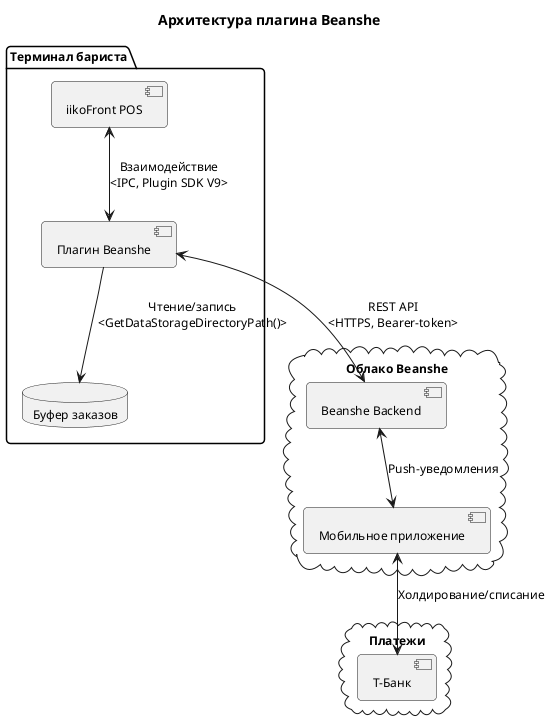
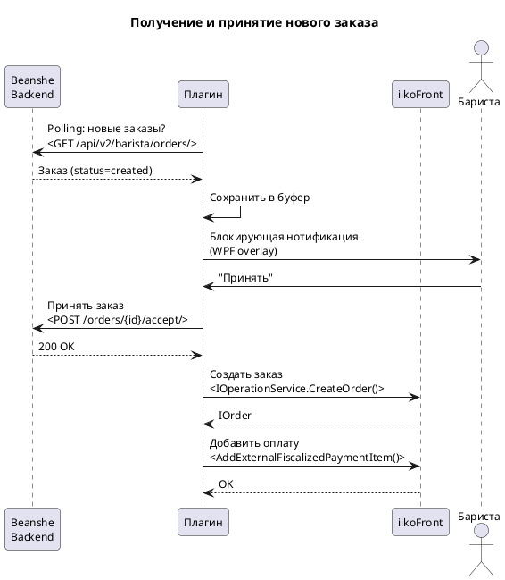
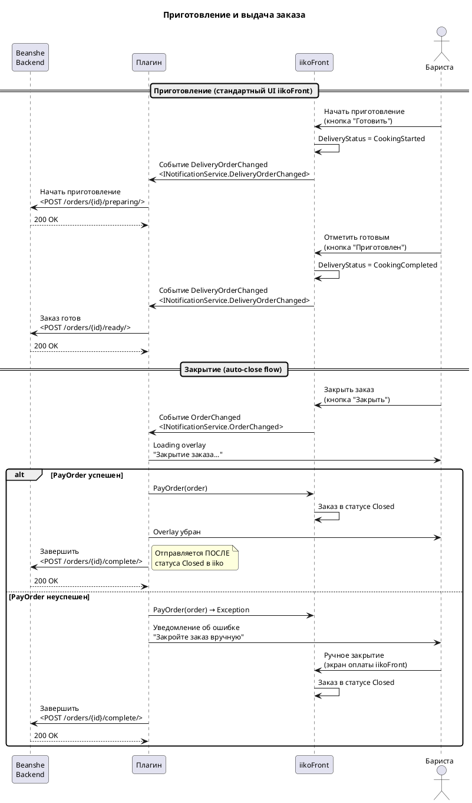
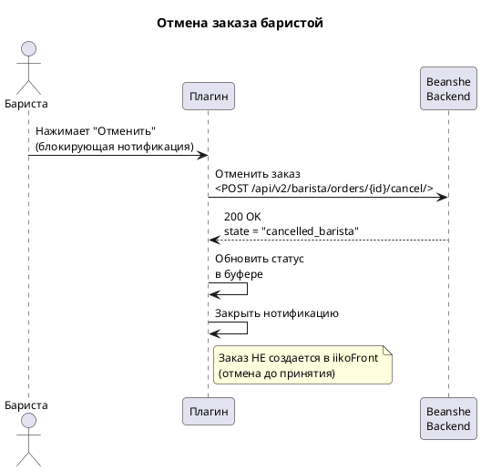
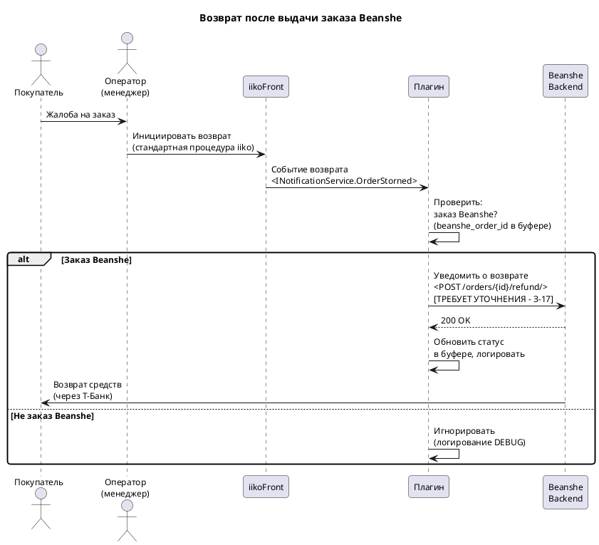
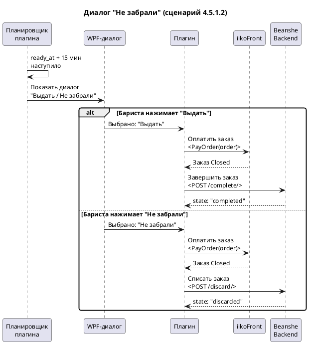
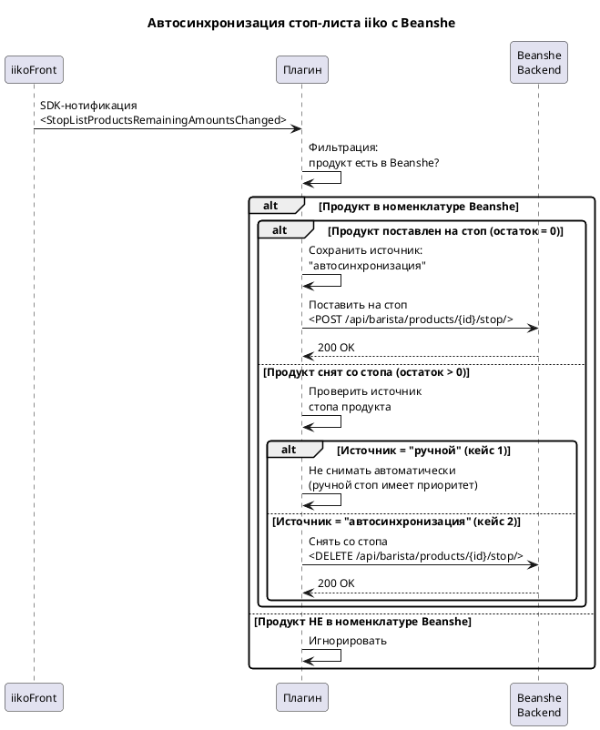
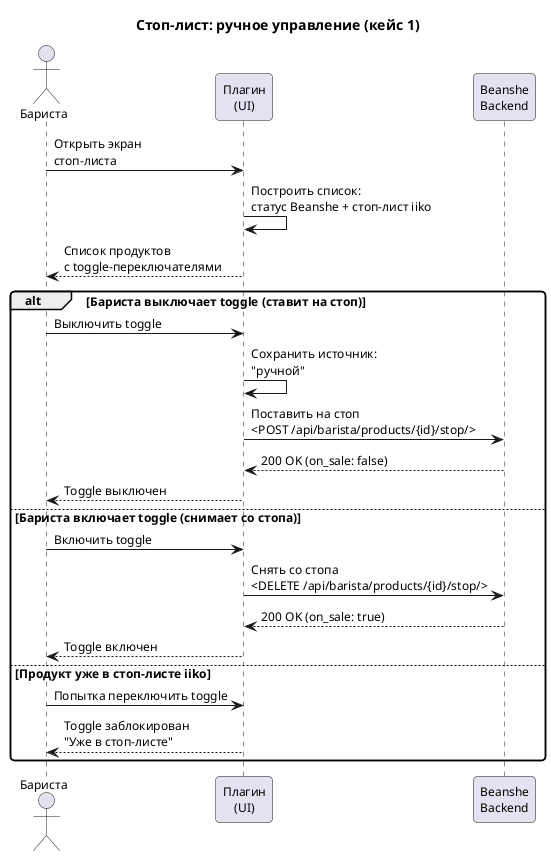
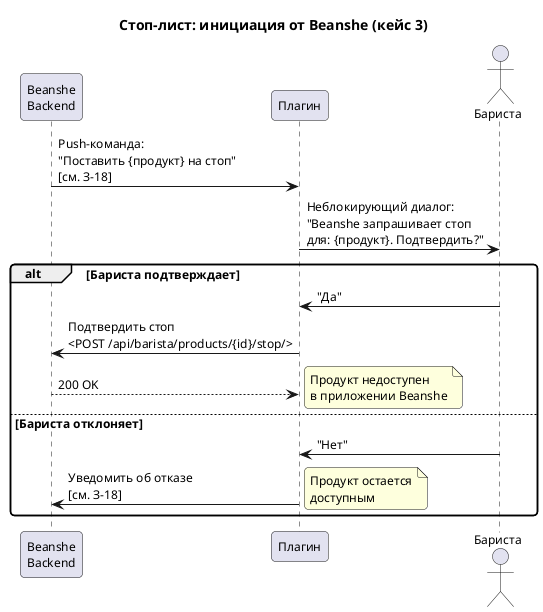
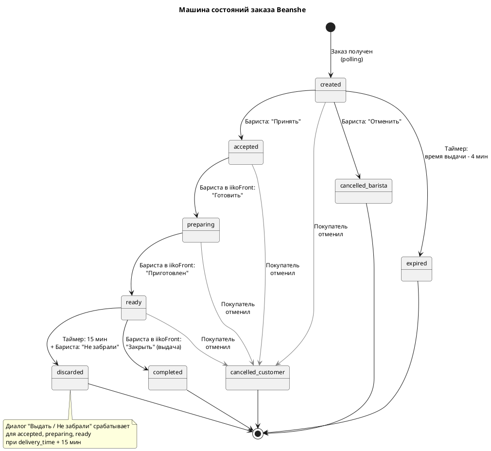

# Beanshe - Спецификация интеграции

> **Тип документа:** E - INTEGRATION_SPEC
> **Версия:** 0.2 | **Дата:** 2026-05-19 | **Автор:** Кирилл (Тюрин)

---

## Оглавление

- [0. Метаданные](#0-метаданные)
- [1. Глоссарий](#1-глоссарий)
- [2. Обзор интеграции](#2-обзор-интеграции)
- [3. Ключевые решения и ограничения](#3-ключевые-решения-и-ограничения)
- [4. Функциональные требования](#4-функциональные-требования)
- [5. Информация о внешней системе](#5-информация-о-внешней-системе)
- [6. Entity Mapping](#6-entity-mapping)
- [7. Конфигурация плагина](#7-конфигурация-плагина)
- [8. Обработка ошибок](#8-обработка-ошибок)
- [9. Интерфейс плагина (UI)](#9-интерфейс-плагина-ui)
- [10. Обратная совместимость](#10-обратная-совместимость)
- [10.1. Ограничения и допущения](#101-ограничения-и-допущения)
- [11. Corner Cases](#11-corner-cases)
- [12. Связанные документы](#12-связанные-документы)

> **Состав документации:**
> - Настоящая спецификация - описание функциональных требований и архитектуры
> - API-справочник - описание endpoint'ов, запросов, ответов и аутентификации
> - Доступы - URL, учетные данные и среды тестирования

---

## 0. Метаданные

| Поле | Значение |
|------|----------|
| Плагин | Resto.Front.Api.BeanshePlugin |
| Внешняя система | Beanshe Backend |
| Категория интеграции | Delivery (онлайн-заказы) |
| Версия API партнера | v2 (barista orders) |
| Версия SDK | v9 |
| Jira | OUT-1667 |

---

## 1. Глоссарий

> Термины, специфичные для данной интеграции. Общие термины iiko (плагин, пречек, ФЧ, КСО и т.д.) описаны в базе знаний iiko и здесь не дублируются.

| Термин партнера | Эквивалент в iiko | Определение |
|-----------------|-------------------|-------------|
| Beanshe Backend | - | Серверная часть экосистемы Beanshe, обрабатывающая заказы и управляющая мобильным приложением |
| Буфер | - | Локальное персистентное хранилище заказов плагина |
| Свитч "На смене" | - | Переключатель доступности кофейни для онлайн-заказов Beanshe; при выключенном свитче заказы не поступают |
| Стоп-лист Beanshe | - | Механизм управления доступностью продуктов для онлайн-заказов на стороне Beanshe. Три кейса: (1) бариста вручную управляет стоп-листом через UI плагина, (2) автоматическая синхронизация со стоп-листом iiko через SDK-нотификации, (3) Beanshe инициирует постановку на стоп с подтверждением бариста. Стоп-лист iiko не затрагивается плагином ни в одном из кейсов |
| Слот | - | Временной интервал выдачи заказа. Время приготовления блюда (CookingTime) задается в бэк-офисе iiko (графа производства) и доступно через внешнее меню iikoCloud (поле cookingTime, единица: секунды). Beanshe использует это значение при расчете слотов |
| Холдирование | - | Блокировка средств на карте покупателя через Т-Банк при создании заказа; списание происходит при статусе "Закрыт" |

---

## 2. Обзор интеграции

### 2.1. Цель интеграции

Кофейни Beanshe теряют некоторое количество онлайн-заказов из-за ограничений текущей интеграции через iiko Cloud API и модуль Доставка. Плагин обеспечивает прямое взаимодействие с Beanshe Backend через Plugin SDK V9, предоставляя альтернативный канал управления онлайн-заказами на терминале баристы.

- Устранить потерю заказов, вызванную отсутствием промежуточного статуса "Принят"
- Исключить пропуск заказов за счет блокирующих нотификаций (WPF overlay)
- Предоставить возможность приостановить прием онлайн-заказов (свитч "На смене")

> [!NOTE]
> **Назначение спецификации.** Документ создается для проверки возможности реализации функционала через Plugin SDK API, а не как рабочий проект для немедленной реализации интеграции (встреча #6, 20.05.2026, Руслан).

### 2.2. Scope

**В scope (MVP):**

| # | Функция | Описание |
|---|---------|----------|
| 1 | Прием заказов | Плагин получает заказы от Beanshe Backend через REST API, сохраняет в локальный буфер, отображает баристе |
| 2 | Жизненный цикл заказа | Полный цикл: Создан ->> Принят ->> Готовится ->> Готов ->> Закрыт / Не забран / Отменен (два типа: отменен баристой, отменен клиентом) |
| 3 | Блокирующие нотификации | Кастомное WPF-окно поверх iikoFront при поступлении заказа и при наступлении времени действия |
| 4 | Свитч "На смене" | Переключатель доступности точки для онлайн-заказов Beanshe (управляет только приемом заказов плагином, не влияет на работу iikoFront) |
| 5 | Фиксация внешней оплаты | Техническая фиксация факта оплаты, выполненной на стороне Beanshe, в системе iiko через `AddExternalFiscalizedPaymentItem()`; фискализация выполняется на стороне Beanshe (облачная ККТ). Плагин не управляет деньгами - он сообщает iiko, что заказ уже оплачен снаружи |
| 6 | Предупреждение при закрытии смены | Неблокирующее уведомление о незавершенных заказах при выключении свитча "На смене" |
| 7 | Автоотмена | Автоматическая отмена непринятого заказа за настраиваемое количество минут до времени выдачи; диалог "Выдать / Не забрали" через настраиваемый интервал после времени выдачи |
| 8 | Стоп-лист Beanshe | Управление стоп-листом Beanshe: три механизма синхронизации (ручной через UI, автосинхронизация с iiko, инициация от Beanshe). Стоп-лист Beanshe не влияет на стоп-лист iiko. Ручной стоп (кейс 1) снимается только баристой; автосинхронизация (кейс 2) снимает стоп автоматически при возврате продукта в iiko |
| 9 | Healthcheck | Периодический сигнал "плагин жив" в Beanshe Backend |
| 10 | Возврат после выдачи | Оператор на терминале инициирует возврат стандартными средствами iiko ->> плагин обнаруживает факт возврата ->> уведомляет Beanshe Backend для возврата средств покупателю |

**MVP+ (планируется, не в первую итерацию):**

| # | Функция | Описание |
|---|---------|----------|
| 1 | FAQ / Watch dog | Отслеживание изменений organization_id / terminal_group_id |
| 2 | Сообщение покупателю | Бариста отправляет сообщение в активном заказе. Технически реализуемо через Plugin SDK, ограничений со стороны iiko нет. Детальное проектирование - за рамками данной спецификации |
| 3 | Триггеры саппорта | Предопределенные кейсы для быстрой связи с поддержкой: (1) заказ не пришел, (2) общая неработоспособность, (3) не получается изменить статус, (4) покупатель не пришел (покрывается MVP: диалог "Не забрали"), (5) непредсказуемое поведение iiko, (6) стоп-лист не работает, (7) ошибка в переводах статусов |

**Вне scope:**

| # | Функция | Причина |
|---|---------|---------|
| 1 | Синхронизация меню через плагин | Остается на Cloud API Beanshe.  |
| 2 | Удаленная инициация возвратов от Beanshe | Внешние системы не могут инициировать возврат удаленно. Возврат инициируется только оператором на терминале (см. scope #10) |
| 3 | Модификация меню iiko через плагин | Номенклатура управляется через iikoOffice/iikoWeb |
| 4 | Валидация/синхронизация цен меню | цены - ответственность Beanshe (внешнее меню) |
| 5 | Дублирование функционала модуля Доставка | Плагин не воспроизводит функции модуля Доставка iikoFront: не отображает список доставочных заказов и не предоставляет интерфейс для управления их статусами. Работа плагина с доставочными заказами ограничена получением уведомлений об изменении статуса и передачей этой информации в Beanshe Backend |
| 6 | Детальное проектирование чата/сообщений баристе | Функционал чата технически реализуем через Plugin SDK, ограничений со стороны iiko нет. Реализация чата не входит в периметр данного проекта |
| 7 | Программная блокировка отмены доставочных заказов через стандартные механизмы iikoFront | Принцип невмешательства: плагин не ограничивает бизнес-процессы терминала. Ограничение отмены обеспечивается настройкой прав пользователей и договорными обязательствами |
| 8 | Модификация стоп-листа iiko плагином | Плагин не изменяет стоп-лист iiko - только читает его состояние через SDK-нотификацию. Управление стоп-листом iiko остается за iikoFront/iikoOffice |

### 2.3. Архитектура интеграции

##### UML-диаграмма



### 2.4. Потоки данных

| Поток | Направление | Триггер | Данные |
|-------|-------------|---------|--------|
| Polling заказов | Плагин ->> Beanshe Backend | Таймер (5 сек) | Список заказов со статусом created |
| Обновление статуса | Плагин ->> Beanshe Backend | Действие баристы в плагине (accept, complete, cancel, discard) или SDK-событие iikoFront (preparing, ready) | ID заказа + новый статус |
| Свитч "На смене" | Плагин ->> Beanshe Backend | Действие баристы | at_work: true/false |
| Создание заказа в iiko | Плагин ->> iikoFront | После "Принять" | Состав заказа + оплата |
| Отмена покупателем | Плагин ->> Beanshe Backend (polling) | Обнаружение при polling (status=cancelled_customer) | ID заказа + статус отмены |
| Стоп-лист (кейсы 1-2) | Плагин ->> Beanshe Backend | SDK-нотификация StopListProductsRemainingAmountsChanged или действие баристы в UI плагина | ID продукта + статус (стоп / снят со стопа) |
| Стоп-лист (кейс 3) | Beanshe Backend ->> Плагин (polling) | Beanshe инициирует постановку на стоп ->> плагин обнаруживает при polling ->> бариста подтверждает | ID продукта + решение баристы (подтвердить / отклонить) |
| Возврат после выдачи | Плагин ->> Beanshe Backend | SDK-события OrderStorned / PastOrderStorned | ID заказа + уведомление о возврате |
| Healthcheck | Плагин ->> Beanshe Backend | Таймер (HealthcheckIntervalMinutes) | Сигнал "плагин жив" |
| Закрытие заказа в iiko | Плагин ->> iikoFront | Нажатие "Закрыть" баристой в iikoFront или кнопка "Выдать" / "Не забрали" в WPF-диалоге | Auto-close flow: PayOrder → complete/discard в Beanshe |

---

## 3. Ключевые решения и ограничения

Раздел фиксирует принципиальные решения руководства iiko, определяющие границы и подход к данной спецификации. Все пункты являются обязательными ограничениями.

### 3.1. Принцип невмешательства

Плагин не должен блокировать, ограничивать или модифицировать бизнес-процессы терминала iikoFront. Никакие действия плагина не должны мешать работе кассира/баристы. Альтернатива любой блокировке - неблокирующее предупреждение, которое бариста может проигнорировать.

> Источник: встреча #2, 30.04.2026, Руслан.

### 3.2. Назначение спецификации

Спецификация создается для проверки возможности реализации функционала через Plugin SDK API. Это не рабочий проект для немедленной реализации интеграции.

> Источник: встреча #6, 20.05.2026, Руслан. Цитата: "Мы сейчас пишем эту спецификацию не для того, чтобы по ней сделать интеграцию. Наша задача сделать спецификацию на предмет проверки возможности реализации этого функционала через API."

### 3.3. Чат / сообщения баристе

Функционал чата (обмен сообщениями между поддержкой Beanshe и баристой) технически реализуем через Plugin SDK, ограничений со стороны iiko нет. Детальное проектирование чата не входит в периметр данной спецификации.

> Источник: встреча #6, 20.05.2026, Руслан. Цитата: "Ты можешь написать, что данный функционал может быть реализован. Каких-то технических ограничений на это, например, нет." / "Мы это описывать не будем, поскольку мы не будем с вами делать интеграцию."

### 3.4. Дублирование модуля Доставка

Плагин не воспроизводит функции модуля Доставка iikoFront. Работа плагина с доставочными заказами ограничена получением SDK-нотификаций об изменении статуса и передачей этой информации в Beanshe Backend через REST API.

> Источник: встреча #6, 20.05.2026, Руслан. Цитата: "Мы не будем делать эту интеграцию, еще раз повторяю. Что они там себе на придумывают дублировать, тоже их проблемы, мы это делать не будем."

### 3.5. Блокировка отмены заказа

Плагин не блокирует и не ограничивает отмену заказа через стандартные механизмы iikoFront. Предотвращение нежелательной отмены обеспечивается: (1) настройкой прав пользователей в iikoFront, (2) договорными обязательствами Beanshe с рестораном.

> Источник: встреча #6, 20.05.2026, Руслан. На вопрос о запрете отмены после "Принят": "Нет."

### 3.6. Инициация возврата извне

Возврат средств может быть инициирован только оператором на терминале iikoFront. Внешние системы (Beanshe Backend) не могут инициировать возврат удаленно. Плагин обнаруживает факт возврата и уведомляет Beanshe.

> Источник: встреча #4, 19.05.2026, Руслан; подтверждено на встрече #5.

---

## 4. Функциональные требования

---

### 4.1. Свитч "На смене"

Группа покрывает механизм включения/выключения доступности кофейни для онлайн-заказов и неблокирующее предупреждение при выключении.

| # | Требование |
|---|-----------|
| 1 | Плагин должен предоставить переключатель "На смене" для управления доступностью точки |
| 2 | При выключенном свитче плагин не должен принимать новые заказы |
| 3 | Плагин не должен позволять выключить свитч при наличии незавершенных заказов |
| 4 | При попытке выключения с незавершенными заказами плагин должен показать неблокирующее предупреждение со списком заказов |
| 5 | Свитч привязан к терминалу (не к сотруднику) |
| 6 | Плагин должен синхронизировать состояние свитча с Beanshe Backend |
| 7 | Плагин должен автоматически активировать свитч при наступлении времени начала рабочего дня (working_hours из профиля Beanshe) |
| 8 | Плагин должен автоматически деактивировать свитч при наступлении времени окончания рабочего дня (working_hours из профиля Beanshe) |
| 9 | При автодеактивации с незавершенными заказами плагин должен показать неблокирующее предупреждение и НЕ выключать свитч до завершения всех заказов |

#### 4.1.1. Режим "Самовывоз"

##### Сценарий 4.1.1.1: Включение свитча "На смене"

**Предусловия**

- Бариста авторизован на терминале
- Свитч "На смене" выключен

| Шаг | Действие пользователя | Реакция системы | Результат |
|:---:|----------------------|-----------------|----------|
| 1 | Бариста включает свитч "На смене" | Плагин отправляет at_work=true в Beanshe | Кофейня доступна для заказов |
| 2 | - | Плагин начинает polling заказов | Новые заказы будут поступать |

**Постусловия**

- Beanshe Backend принимает заказы для данной кофейни
- Плагин активно опрашивает API

##### Детальная логика обработки шагов

**Шаг 1. Включение свитча**

Вызов API-метода: `POST /api/barista/switch/`

**Request:**

| Заголовок | Значение |
|-----------|----------|
| Authorization | Bearer {token} (получен при авторизации, POST /api/barista/auth/) |
| Content-Type | application/json |

Тело запроса:

| Поле | Тип | Значение | Источник |
|------|-----|----------|----------|
| at_work | boolean | true | Действие баристы (включение свитча) |

**Response (200 OK):**

| Поле ответа | Тип | Обработка плагином |
|-------------|-----|-------------------|
| at_work | boolean | Проверить: true = свитч успешно включен. Запустить polling заказов |

> working_hours для автоактивации/автодеактивации (сценарий 4.1.1.3) получается из ответа авторизации (POST /api/barista/auth/, поле shop.working_hours) и кешируется плагином. Обновление - при каждом запросе GET /api/barista/profile/.

**Ошибки:**

| HTTP-код | Реакция плагина |
|----------|----------------|
| 401 | Токен невалиден - переавторизация |
| 500 | Сервер недоступен - показать ошибку баристе, повторить через 30 сек |

*Результат: кофейня принимает онлайн-заказы, polling запущен*

---

##### Сценарий 4.1.1.2: Выключение свитча с незавершенными заказами

**Предусловия**

- Свитч "На смене" включен
- В буфере есть заказы со статусом, отличным от "Закрыт" / "Отменен" / "Не забран"

| Шаг | Действие пользователя | Реакция системы | Результат |
|:---:|----------------------|-----------------|----------|
| 1 | Бариста пытается выключить свитч | Плагин показывает неблокирующее предупреждение | Список незавершенных заказов на экране |
| 2 | - | Свитч не выключается | Бариста должен завершить заказы |

**Постусловия**

- Свитч остается включенным
- Бариста информирован о незавершенных заказах
- предупреждение не блокирует Z-отчет и другие действия в iikoFront

##### Ошибки

| Ситуация | Реакция системы |
|----------|----------------|
| Нет незавершенных заказов | Свитч выключается, плагин останавливает polling |
| Ошибка сети при вызове switch | Свитч не переключается, ошибка отображается баристе |

##### Детальная логика обработки шагов

**Шаг 1. Проверка незавершенных заказов**

При попытке выключить свитч плагин проверяет буфер:
1. Отфильтровать заказы со статусом: `created`, `accepted`, `preparing`, `ready`
2. Если список не пуст - показать диалог-предупреждение: "Есть незавершенные заказы: {список номеров}" с кнопкой "Понятно"
3. Свитч НЕ переключается (действие отменяется)
4. Если список пуст - вызвать `POST /api/barista/switch/` со значением `at_work: false`

**Request:**

| Поле | Тип | Значение | Источник |
|------|-----|----------|----------|
| at_work | boolean | false | Действие баристы (выключение свитча) |

**Response (200 OK):**

| Поле ответа | Тип | Обработка плагином |
|-------------|-----|-------------------|
| at_work | boolean | Проверить: false = свитч успешно выключен. Остановить polling |

**Ошибки:**

| HTTP-код | Реакция плагина |
|----------|----------------|
| 401 | Переавторизация |
| 500 | Показать ошибку баристе |

*Результат: свитч выключен только при отсутствии незавершенных заказов*

---

##### Сценарий 4.1.1.3: Автоактивация/автодеактивация свитча по режиму работы

**Предусловия**

- Плагин авторизован в Beanshe API
- Профиль бариста содержит working_hours (GET /api/barista/profile/)
- Текущее время находится в пределах или за пределами рабочих часов

| Шаг | Действие пользователя | Реакция системы | Результат |
|:---:|----------------------|-----------------|----------|
| 1 | - | Наступило время начала рабочего дня (working_hours.start) | Плагин автоматически активирует свитч |
| 2 | - | Плагин отправляет POST /api/barista/switch/ (at_work=true) | Кофейня принимает заказы |
| 3 | - | Наступило время окончания рабочего дня (working_hours.end) | Плагин проверяет наличие незавершенных заказов |
| 4a | - | Незавершенных заказов нет | Плагин деактивирует свитч (at_work=false) |
| 4b | - | Есть незавершенные заказы | Плагин показывает неблокирующее предупреждение, свитч не выключается |

**Постусловия (автоактивация)**

- Свитч включен автоматически, кофейня принимает заказы
- Бариста может вручную выключить свитч до окончания рабочего дня

**Постусловия (автодеактивация)**

- При отсутствии незавершенных заказов: свитч выключен, polling остановлен
- При наличии незавершенных заказов: свитч остается включенным, предупреждение показано

##### Детальная логика обработки шагов

**Источник working_hours**

Рабочие часы получены из `GET /api/barista/profile/` (поле `shop.working_hours`). Плагин кеширует их при авторизации (POST /api/barista/auth/) и обновляет при каждом успешном запросе профиля.

**Request (GET /api/barista/profile/):**

| Заголовок | Значение |
|-----------|----------|
| Authorization | Bearer {token} |

**Response (200 OK):**

| Поле ответа | Тип | Обработка плагином |
|-------------|-----|-------------------|
| at_work | boolean | Текущее состояние свитча |
| shop.working_hours | object | Расписание работы кофейни (кешировать) |

**Логика автоактивации**

1. Плагин проверяет текущее время по таймеру (раз в минуту или при polling-итерации)
2. Если текущее время >= working_hours.start И свитч выключен И ранее не был выключен вручную баристой в текущем рабочем дне ->> автоактивация
3. Если бариста вручную выключил свитч в течение рабочего дня - автоактивация не повторяется до следующего рабочего дня

**Логика автодеактивации**

1. Если текущее время >= working_hours.end И свитч включен
2. Проверка буфера на незавершенные заказы (аналогично сценарию 4.1.1.2)
3. Если заказы есть - предупреждение, свитч не выключается
4. Если заказов нет - вызов `POST /api/barista/switch/` c `at_work: false` (аналогично сценарию 4.1.1.2)

**Ошибки автоактивации/автодеактивации:**

| Ситуация | Реакция плагина |
|----------|----------------|
| GET /api/barista/profile/ вернул ошибку | Использовать кешированные working_hours. Если кеш пуст - автоактивация/автодеактивация не выполняется |
| POST /api/barista/switch/ при автоактивации вернул ошибку (401/500) | Повторить попытку через 1 минуту (при следующей проверке таймера). Свитч остается выключенным |
| POST /api/barista/switch/ при автодеактивации вернул ошибку | Повторить попытку через 1 минуту. Свитч остается включенным, polling продолжается |

---
### 4.2. Прием и жизненный цикл заказов

Группа покрывает получение заказов от Beanshe Backend, их сохранение в локальный буфер, создание в iikoFront и полный цикл статусов до завершения.

| # | Требование |
|---|-----------|
| 1 | Плагин должен опрашивать Beanshe Backend на наличие новых заказов с интервалом из конфигурации (polling, по умолчанию 5 сек) |
| 2 | Плагин должен сохранять каждый полученный заказ в локальное хранилище для восстановления при перезапуске |
| 3 | Плагин должен восстанавливать незавершенные заказы из буфера при перезапуске |
| 4 | Плагин должен создавать заказ в iikoFront немедленно при нажатии баристой "Принять" |
| 5 | Плагин должен передавать изменение статуса приготовления в Beanshe Backend при обнаружении изменений статуса доставочного заказа в iikoFront (подписка `INotificationService.DeliveryOrderChanged`) |
| 6 | Плагин должен поддерживать полный цикл статусов доставочного заказа - самовывоз |
| 7 | UI плагина не предоставляет кнопку "Отменить" после статуса "Принят". Плагин не блокирует и не ограничивает отмену заказа через стандартные механизмы iikoFront (принцип невмешательства). Предотвращение отмены после принятия обеспечивается: (1) на стороне Beanshe - правила оферты, (2) на стороне ресторана - настройка прав пользователей в iikoFront. Клиент (покупатель) не может отменить заказ после принятия баристой - это обеспечивается на стороне Beanshe Backend |
| 8 | Плагин должен отображать заказ баристе немедленно при обнаружении через polling, без дополнительных задержек (ключевой KPI: устранение потери заказов из-за пропущенных уведомлений). Нотификация показывается до создания заказа в iiko |
| 9 | Плагин должен показывать напоминание (WPF-нотификация), если изменение статуса приготовления в iikoFront не обнаружено в течение настраиваемого интервала: из "Принят" в "Готовится" и из "Готовится" в "Готов" (StatusReminderMinutes). Напоминание информирует баристу о необходимости обновить статус через стандартный UI iikoFront |
| 10 | Плагин должен обнаруживать факт возврата на терминале для заказов Beanshe (как для текущих, так и для закрытых заказов) |
| 11 | При обнаружении возврата плагин должен отправить уведомление в Beanshe Backend |
| 12 | Плагин не должен инициировать возврат самостоятельно или по команде от Beanshe (принцип невмешательства) |
| 13 | Инициация возврата - исключительно оператором на терминале iikoFront |

#### 4.2.1. Режим "Самовывоз"

##### Сценарий 4.2.1.1: Получение и принятие нового заказа

**Предусловия**

- Свитч "На смене" включен
- Плагин авторизован в Beanshe API (токен валиден)
- Покупатель создал и оплатил заказ в мобильном приложении

| Шаг | Действие пользователя | Реакция системы | Результат |
|:---:|----------------------|-----------------|----------|
| 1 | - | Плагин обнаруживает новый заказ (polling) | Заказ сохранен в буфер, статус "Создан" |
| 2 | - | Плагин показывает блокирующую нотификацию | WPF overlay поверх iikoFront |
| 3 | Бариста нажимает "Принять" в блокирующей нотификации (WPF overlay) | Плагин отправляет accept в Beanshe | Статус "Принят", покупатель уведомлен |
| 4 | - | Плагин создает заказ в iikoFront | Заказ виден в iikoFront |
| 5 | - | Плагин добавляет оплату | AddExternalFiscalizedPaymentItem выполнен |

**Постусловия**

- Заказ в буфере со статусом "Принят"
- Заказ создан в iikoFront с типом оплаты Beanshe
- Покупатель видит статус "Принят" в приложении
- В основном окне плагина заказ доступен только для просмотра (раздел 9.2). Отмена через стандартные механизмы iikoFront не ограничивается (см. раздел 3.5)

##### UML-диаграмма



##### Ошибки

| Ситуация | Реакция системы |
|----------|----------------|
| Beanshe Backend недоступен при polling | Плагин повторяет попытку через интервал polling; заказы из буфера остаются доступны |
| Ошибка при accept (сеть) | Плагин показывает ошибку баристе, заказ остается в статусе "Создан", повторная попытка доступна |
| Ошибка CreateOrder в iiko | Плагин логирует ошибку; статус в Beanshe уже "Принят"; повторная попытка создания при следующем действии |
| Ошибка AddExternalFiscalizedPaymentItem | Плагин логирует ошибку; заказ создан без оплаты; требуется ручное вмешательство |

##### Детальная логика обработки шагов

**Шаг 1. Polling новых заказов**

Вызов API-метода: `GET /api/v2/barista/orders/`

**Request:**

| Заголовок | Значение |
|-----------|----------|
| Authorization | Bearer {token} (из авторизации, сценарий 4.1.1.1) |

| Параметр (query string) | Тип | Значение | Назначение |
|--------------------------|-----|----------|------------|
| state | string | "created" | Фильтр: только новые заказы |
| ordering | string | "-created_at" | Сортировка: новые первыми |

Фильтрация по кофейне: CoffeeShopId из конфигурации (параметр #5). [ТРЕБУЕТ УТОЧНЕНИЯ - см. З-5: заказы могут фильтроваться автоматически на стороне Beanshe по токену авторизации баристы. Если фильтрация серверная, CoffeeShopId как query-параметр не нужен.]

**Response (200 OK):**

| Поле ответа | Тип | Обработка плагином |
|-------------|-----|-------------------|
| results[] | array(OrderV2List) | Массив новых заказов |
| results[].id | integer | ID заказа Beanshe - ключ для всех последующих операций |
| results[].number | string | Номер заказа для отображения баристе |
| results[].state | string (StateAedEnum) | Проверить: должен быть "created" |
| results[].ready_at | datetime | Время выдачи - для таймера автоотмены (сценарий 4.5.1.1) |
| results[].products[] | array(OrderProduct) | Позиции заказа - для создания в iikoFront |
| results[].products[].id | integer | ID продукта Beanshe - маппинг на номенклатуру iiko по IProduct.ExternalId (см. раздел 6.3) |
| results[].price_after_discount | decimal | Итоговая сумма (со скидкой) - для AddExternalFiscalizedPaymentItem |
| results[].payment | TBankPayment | Данные оплаты Т-Банк |
| results[].comment | string | Комментарий покупателя - передать в заказ iiko |
| results[].coffee_shop | ShopWithWorkStatus | Кофейня - для проверки привязки |

Плагин для каждого нового заказа из results[]:
1. Проверяет: заказ уже есть в локальном буфере? Если да - пропустить
2. Сохраняет заказ в локальный буфер (статус: "created")
3. Показывает блокирующую нотификацию баристе (сценарий 4.3.1.1)

*Результат: новые заказы в буфере со статусом "Создан"*

**Шаг 2. Блокирующая нотификация**

Плагин создает WPF-окно поверх iikoFront. Окно содержит: номер заказа, имя покупателя, состав, время выдачи, кнопки "Принять" / "Отменить". Нотификация блокирует работу с терминалом до действия баристы. При наличии нескольких одновременных нотификаций - FIFO-очередь (одна за другой).

*Результат: бариста видит заказ и принимает решение*

**Шаг 3. Принятие заказа**

Перед отправкой accept плагин запрашивает актуальный статус заказа через `GET /api/v2/barista/orders/{id}/`. Если заказ уже отменен клиентом (state = "cancelled_customer") - плагин показывает уведомление "Заказ отменен клиентом", закрывает нотификацию, accept не выполняется.

Вызов API-метода: `POST /api/v2/barista/orders/{id}/accept/`

**Request:**

| Заголовок | Значение |
|-----------|----------|
| Authorization | Bearer {token} (из авторизации, сценарий 4.1.1.1) |
| Content-Type | application/json |

| Поле URL | Источник |
|----------|----------|
| {id} | order.id из буфера плагина |

Тело запроса: пустое (Content-Length: 0)

**Response (200 OK):**

Beanshe возвращает объект BaristaOrderV2:

| Поле ответа | Ожидаемое значение | Обработка плагином |
|-------------|-------------------|-------------------|
| state | "accepted" | Обновить статус в буфере на "accepted" |
| id | order.id | Проверить совпадение |

Плагин после успешного accept:
1. Обновляет статус в буфере: "created" ->> "accepted"
2. Закрывает нотификацию для этого заказа
3. Переходит к шагу 4 (создание в iikoFront)

**Ошибки:**

| HTTP-код | Причина | Реакция плагина |
|----------|---------|----------------|
| 400 | Заказ уже принят / в невалидном статусе | Обновить статус из response, закрыть нотификацию |
| 404 | Заказ не найден | Удалить из буфера, закрыть нотификацию |
| 401 | Токен невалиден | Переавторизация |

*Результат: Beanshe подтвердил принятие, покупатель уведомлен*

**Шаг 4. Создание заказа в iikoFront**

Плагин вызывает `IOperationService.CreateOrder()` с параметрами:
- Тип заказа: обычный IOrder (режим самовывоз)
- Продукты: маппинг из данных заказа Beanshe на номенклатуру iiko (по OrderProduct.id ->> IProduct.ExternalId; fallback по Name)
- Гость: создается или находится по имени покупателя

Подробный маппинг полей, алгоритм поиска по ExternalId и обработка ошибок маппинга - см. раздел 6.3.

*Результат: заказ создан в iikoFront*

**Шаг 5. Добавление оплаты**

Плагин вызывает `AddExternalFiscalizedPaymentItem()`:
- Сумма: итоговая сумма заказа из Beanshe (уже со скидкой)
- Тип оплаты: "Beanshe" (настроен в iikoOffice)
- Фискализация выполнена на стороне Beanshe (облачная ККТ)

*Результат: факт оплаты зафиксирован в iiko*

---

##### Сценарий 4.2.1.2: Приготовление и выдача заказа

**Предусловия**

- Заказ в статусе "Принят"
- Заказ создан в iikoFront
- Оплата зафиксирована (AddExternalFiscalizedPaymentItem выполнен, сценарий 4.4.1.1)

| Шаг | Действие пользователя | Реакция системы | Результат |
|:---:|----------------------|-----------------|----------|
| 1 | Бариста нажимает "Готовить" в стандартном UI iikoFront | iikoFront устанавливает DeliveryStatus = CookingStarted. Плагин обнаруживает изменение через подписку `DeliveryOrderChanged` и отправляет preparing в Beanshe | Статус "Готовится" |
| 2 | Бариста нажимает "Приготовлен" в стандартном UI iikoFront | iikoFront устанавливает DeliveryStatus = CookingCompleted. Плагин обнаруживает изменение через подписку `DeliveryOrderChanged` и отправляет ready в Beanshe | Статус "Готов", покупатель уведомлен |
| 3 | Покупатель приходит, бариста нажимает "Закрыть" в стандартном UI iikoFront | Плагин перехватывает намерение закрытия (подписка `OrderChanged`) и инициирует авто-закрытие (auto-close flow): показывает loading overlay, вызывает PayOrder | Попытка авто-закрытия |
| 3a | - (PayOrder успешен) | Заказ автоматически закрывается в iikoFront и переходит в статус Closed. Loading overlay убирается. Экран оплаты iikoFront не показывается баристе — процесс прозрачен | Заказ в статусе Closed в iiko |
| 3b | - (PayOrder неуспешен) | Плагин логирует ошибку, убирает overlay, показывает уведомление. Бариста перенаправляется на стандартный экран оплаты iikoFront для ручного закрытия | Fallback на ручное закрытие |
| 4 | - | Плагин отправляет complete в Beanshe (после Closed в iiko — как при авто-закрытии, так и при ручном) | Деньги списываются |

**Постусловия**

- Заказ закрыт в iikoFront (статус Closed)
- Заказ в буфере со статусом "Закрыт"
- Beanshe уведомлен о закрытии (complete отправлен после Closed в iiko)
- Beanshe инициирует списание через Т-Банк
- Все переходы статусов приготовления выполнены баристой через стандартный UI iikoFront; плагин выполнял роль наблюдателя (подписка `DeliveryOrderChanged`) и транслятора событий в Beanshe Backend

##### UML-диаграмма



##### Ошибки

| Ситуация | Реакция системы |
|----------|----------------|
| Ошибка сети при отправке статуса в Beanshe (preparing / ready / complete) | Плагин повторяет отправку (retry); статус в iikoFront уже изменен, синхронизация с Beanshe при восстановлении связи |
| HTTP 400 от preparing ("Заказ не принят") | Заказ не в статусе accepted на стороне Beanshe. Плагин обновляет статус из буфера, логирует ошибку |
| HTTP 400 от ready ("Нельзя перевести в статус готов") | Заказ не в статусе preparing на стороне Beanshe. Плагин обновляет статус из буфера, логирует ошибку |
| HTTP 400 от complete ("Платеж не найден") | Beanshe не обнаружил подтвержденного платежа. Плагин логирует ошибку, повторяет попытку |
| HTTP 401 (токен невалиден) | Плагин выполняет переавторизацию (сценарий 4.1.1.1) и повторяет запрос |
| HTTP 404 (заказ не найден) | Плагин удаляет заказ из буфера, логирует ошибку |
| Ошибка PayOrder (SDK exception) | Плагин логирует ошибку, убирает loading overlay и показывает уведомление баристе. Бариста перенаправляется на стандартный экран оплаты iikoFront для ручного закрытия. Complete в Beanshe отправляется после успешного закрытия заказа в iiko |

##### Детальная логика обработки шагов

**Шаг 1. Переход в статус "Готовится"**

Бариста нажимает кнопку "Готовить" в стандартном UI iikoFront. iikoFront устанавливает DeliveryStatus = CookingStarted. Плагин обнаруживает это изменение через подписку `INotificationService.DeliveryOrderChanged` и отправляет уведомление в Beanshe Backend.

Вызов API-метода: `POST /api/v2/barista/orders/{id}/preparing/`

**Request:**

| Заголовок | Значение |
|-----------|----------|
| Authorization | Bearer {token} |

| Поле URL | Источник |
|----------|----------|
| {id} | order.id из буфера |

Тело запроса: пустое

**Response (200 OK):**

| Поле ответа | Ожидаемое значение | Обработка плагином |
|-------------|-------------------|-------------------|
| state | "preparing" | Обновить статус в буфере |

Плагин после успешного preparing:
1. Обновляет статус в буфере

*Результат: статус обновлен в буфере и Beanshe. DeliveryStatus в iikoFront уже установлен самим iikoFront*

**Шаг 2. Переход в статус "Готов"**

Бариста нажимает кнопку "Приготовлен" в стандартном UI iikoFront. iikoFront устанавливает DeliveryStatus = CookingCompleted. Плагин обнаруживает это изменение через подписку `INotificationService.DeliveryOrderChanged` и отправляет уведомление в Beanshe Backend.

Вызов API-метода: `POST /api/v2/barista/orders/{id}/ready/`

**Request:**

| Заголовок | Значение |
|-----------|----------|
| Authorization | Bearer {token} |

| Поле URL | Источник |
|----------|----------|
| {id} | order.id из буфера |

Тело запроса: пустое

**Response (200 OK):**

| Поле ответа | Ожидаемое значение | Обработка плагином |
|-------------|-------------------|-------------------|
| state | "ready" | Обновить статус в буфере |

Плагин после успешного ready:
1. Обновляет статус в буфере
2. Покупатель получает push "Заказ готов"

*Результат: покупатель уведомлен, идет к кофейне. DeliveryStatus в iikoFront уже установлен самим iikoFront*

**Шаг 3. Закрытие заказа в iiko (auto-close flow)**

Бариста нажимает "Закрыть" в стандартном UI iikoFront. Плагин перехватывает намерение закрытия через подписку `INotificationService.OrderChanged` и автоматически инициирует процесс авто-закрытия. К этому моменту оплата уже зафиксирована через AddExternalFiscalizedPaymentItem (сценарий 4.4.1.1) и покрывает полную сумму заказа.

**Процесс авто-закрытия (auto-close flow):**

1. Плагин показывает loading overlay поверх iikoFront (индикатор загрузки: "Закрытие заказа...")
2. Плагин программно вызывает PayOrder
3. **Успех:** заказ автоматически закрывается в iikoFront и переходит в статус Closed. Overlay убирается. Экран оплаты iikoFront не показывается баристе — процесс прозрачен
4. **Ошибка:** плагин логирует ошибку, убирает overlay и показывает уведомление. Бариста перенаправляется на стандартный экран оплаты iikoFront для ручного закрытия. После ручного закрытия плагин обнаруживает статус Closed и отправляет complete в Beanshe

Закрытие заказа самовывоза Beanshe всегда означает выдачу клиенту (complete).

Предусловия PayOrder:
- AddExternalFiscalizedPaymentItem уже выполнен (сценарий 4.4.1.1, требование #5)
- Сумма оплаты покрывает полную сумму заказа

*Результат: заказ закрыт в iiko*

**Шаг 4. Уведомление Beanshe о закрытии**

Вызов API-метода: `POST /api/v2/barista/orders/{id}/complete/`

**Request:**

| Заголовок | Значение |
|-----------|----------|
| Authorization | Bearer {token} |

| Поле URL | Источник |
|----------|----------|
| {id} | order.id из буфера |

Тело запроса: пустое

**Response (200 OK):**

| Поле ответа | Ожидаемое значение | Обработка плагином |
|-------------|-------------------|-------------------|
| state | "completed" | Обновить статус в буфере на "completed" |

Плагин после успешного complete:
1. Обновляет статус в буфере: "ready" ->> "completed"
2. Удаляет заказ из активного списка (перемещает в историю)
3. Beanshe инициирует списание средств через Т-Банк

**Ошибки:**

| HTTP-код | Причина | Реакция плагина |
|----------|---------|----------------|
| 400 | "Платеж не найден. Невозможно завершить заказ." | Логировать ошибку, проверить статус оплаты в Beanshe |
| 401 | Токен невалиден | Переавторизация (сценарий 4.1.1.1), повторить запрос |
| 404 | Заказ не найден | Удалить из буфера, логировать |

*Результат: заказ полностью закрыт*

---

##### Сценарий 4.2.1.3: Отмена заказа баристой

**Предусловия**

- Заказ в статусе "Создан" (еще не принят)
- Блокирующая нотификация на экране

| Шаг | Действие пользователя | Реакция системы | Результат |
|:---:|----------------------|-----------------|----------|
| 1 | Бариста нажимает "Отменить" в блокирующей нотификации (WPF overlay) | Плагин отправляет cancel в Beanshe | Статус "Отменен", деньги возвращаются |
| 2 | - | Плагин удаляет заказ из активных | Нотификация закрыта |

**Постусловия**

- Заказ в буфере со статусом "Отменен баристой"
- Заказ НЕ создается в iikoFront
- Покупатель получает push об отмене и возврат средств

##### Ошибки

| Ситуация | Реакция системы |
|----------|----------------|
| Попытка отмены после "Принят" | Кнопка "Отменить" доступна только в блокирующей нотификации для заказов со статусом "Создан". После принятия нотификация закрывается — кнопка отсутствует. Отмена через стандартные механизмы iikoFront не ограничивается (см. раздел 3.5) |

##### Детальная логика обработки шагов

**Шаг 1. Отмена заказа**

Бариста нажимает "Отменить" в блокирующей нотификации (WPF overlay) - плагин сразу отправляет запрос отмены без выбора причины.

Вызов API-метода: `POST /api/v2/barista/orders/{id}/cancel/`

**Request:**

| Заголовок | Значение |
|-----------|----------|
| Authorization | Bearer {token} |

| Поле URL | Источник |
|----------|----------|
| {id} | order.id из буфера |

Тело запроса: пустое

**Response (200 OK):**

| Поле ответа | Ожидаемое значение | Обработка плагином |
|-------------|-------------------|-------------------|
| state | "cancelled_barista" | Обновить статус в буфере |

Плагин после cancel:
1. Обновляет статус в буфере
2. Если заказ был создан в iiko - DeleteOrder() или SetDeliveryDeliveryStatus(Cancelled)
3. Закрывает нотификацию (если была)

**Ошибки:**

| HTTP-код | Причина | Реакция плагина |
|----------|---------|----------------|
| 400 | Заказ в невалидном статусе для отмены | Обновить статус из response |
| 404 | Заказ не найден | Удалить из буфера |
| 401 | Токен невалиден | Переавторизация |

*Результат: заказ отменен, деньги возвращаются покупателю через Beanshe/Т-Банк*

##### UML-диаграмма



---

##### Сценарий 4.2.1.4: Возврат после выдачи

**Предусловия**

- Заказ Beanshe выдан покупателю (статус "Закрыт")
- Покупатель обратился с жалобой
- Оператор (менеджер/бариста) инициирует возврат на терминале iikoFront

| Шаг | Действие пользователя | Реакция системы | Результат |
|:---:|----------------------|-----------------|----------|
| 1 | Оператор выполняет возврат в iikoFront (стандартная процедура) | Плагин перехватывает SDK-событие INotificationService.OrderStorned (получает: исходный заказ, ID нового заказа, оператор) | Возврат зафиксирован |
| 2 | - | Плагин определяет, что заказ связан с Beanshe (по beanshe_order_id в буфере) | Заказ идентифицирован |
| 3 | - | Плагин отправляет уведомление о возврате в Beanshe Backend | Beanshe получает сигнал |
| 4 | - | Beanshe возвращает средства покупателю | Возврат завершен |

**Постусловия**

- Возврат зафиксирован на стороне iiko (фискальный документ)
- Beanshe уведомлен и выполняет возврат средств покупателю
- Статус заказа в буфере обновлен

##### Ошибки

| Ситуация | Реакция системы |
|----------|----------------|
| OrderStorned не сработал (ошибка подписки или edge-case) | Логирование ошибки (ERROR); PastOrderStorned подписан при инициализации параллельно и покрывает закрытые заказы |
| Beanshe Backend недоступен при отправке уведомления о возврате | Логирование ошибки (WARN); повторная отправка при восстановлении связи |
| Заказ не найден в буфере (не заказ Beanshe) | Плагин игнорирует возврат - это внутренний заказ iiko |

##### Детальная логика обработки шагов

**Шаг 1. Перехват SDK-события возврата**

Плагин подписывается на два SDK-события при инициализации:

| Событие | Назначение | Данные |
|---------|-----------|--------|
| `INotificationService.OrderStorned` | Возврат текущего (открытого) заказа | (IOrder originalOrder, Guid newOrderId, IUser operator) |
| `INotificationService.PastOrderStorned` | Возврат закрытого (исторического) заказа | (IOrder originalOrder, Guid newOrderId, IUser operator) |

При срабатывании любого из событий:
1. Получить `originalOrder` из callback
2. Перейти к шагу 2

*Результат: плагин зафиксировал факт возврата на терминале*

**Шаг 2. Идентификация заказа Beanshe**

Плагин определяет, связан ли возвращаемый заказ с Beanshe:
1. Получить `iiko_order_id` из `originalOrder.Id`
2. Найти в локальном буфере запись, где `iiko_order_id == originalOrder.Id`
3. Если запись найдена - это заказ Beanshe, извлечь `beanshe_order_id`
4. Если запись не найдена - это внутренний заказ iiko, игнорировать (логирование уровня DEBUG)

*Результат: заказ идентифицирован как заказ Beanshe (или проигнорирован)*

**Шаг 3. Уведомление Beanshe Backend о возврате**

Вызов API-метода: `POST /api/v2/barista/orders/{id}/refund/` [ТРЕБУЕТ УТОЧНЕНИЯ - см. З-17: эндпоинт отсутствует в текущем API Beanshe, необходимо создание нового эндпоинта]

**Request:**

| Заголовок | Значение |
|-----------|----------|
| Authorization | Bearer {token} (из авторизации, сценарий 4.1.1.1) |
| Content-Type | application/json |

| Поле URL | Источник |
|----------|----------|
| {id} | beanshe_order_id из буфера плагина |

Тело запроса [ТРЕБУЕТ УТОЧНЕНИЯ - см. З-17]:

| Поле | Тип | Источник | Описание |
|------|-----|----------|----------|
| beanshe_order_id | int | Буфер плагина | ID заказа в системе Beanshe |
| amount | decimal | originalOrder (сумма возврата) | Сумма возврата |
| iiko_operator | string | callback (IUser operator) | Оператор, инициировавший возврат |

**Response (200 OK)** [ТРЕБУЕТ УТОЧНЕНИЯ - см. З-17]:

| Поле ответа | Ожидаемое значение | Обработка плагином |
|-------------|-------------------|-------------------|
| state | "refunded" (или аналог) | Обновить статус в буфере |
| refund_id | string | Сохранить для трассировки |

Плагин после успешного уведомления:
1. Обновляет статус заказа в буфере
2. Логирует событие (уровень INFO): "Возврат для заказа Beanshe #{beanshe_order_id}, оператор: {operator_name}"

**Ошибки:**

| HTTP-код | Причина | Реакция плагина |
|----------|---------|----------------|
| 400 | Заказ в невалидном статусе для возврата | Логирование (ERROR); повторить не удастся |
| 401 | Токен невалиден | Переавторизация, повтор запроса |
| 404 | Заказ не найден в Beanshe | Логирование (ERROR); возможно, заказ удален |
| 500 | Ошибка сервера Beanshe | Логирование (WARN); повторная отправка при восстановлении связи |

*Результат: Beanshe уведомлен о возврате, инициирует возврат средств покупателю через Т-Банк*

**Шаг 4. Возврат средств**

Выполняется на стороне Beanshe Backend (вне зоны ответственности плагина):
1. Beanshe получает уведомление о возврате
2. Beanshe инициирует возврат средств через Т-Банк
3. Покупатель получает возврат на карту

Плагин не участвует в процессе возврата средств - его роль ограничивается уведомлением Beanshe.

##### UML-диаграмма



---

### 4.3. Блокирующие нотификации

Группа покрывает механизм отображения нотификаций поверх iikoFront, их приоритизацию и управление очередью.

| # | Требование |
|---|-----------|
| 1 | Плагин должен отображать нотификации как кастомное WPF-окно поверх всех окон iikoFront |
| 2 | Нотификация должна блокировать работу с терминалом до действия баристы |
| 3 | При нескольких одновременных нотификациях плагин должен использовать FIFO-очередь |
| 4 | Нотификация должна содержать: номер заказа, имя покупателя, состав, время выдачи, доступные действия |
| 5 | Плагин должен отображать нотификации на экране блокировки iikoFront |

#### 4.3.1. Режим "Самовывоз"

##### Сценарий 4.3.1.1: Отображение блокирующей нотификации нового заказа

**Предусловия**

- Плагин обнаружил новый заказ через polling
- Свитч "На смене" включен
- Очередь нотификаций пуста (или предыдущая обработана)

| Шаг | Действие пользователя | Реакция системы | Результат |
|:---:|----------------------|-----------------|----------|
| 1 | - | Плагин создает WPF-окно поверх iikoFront | Окно видимо на всех экранах, включая блокировку |
| 2 | Бариста нажимает "Принять" или "Отменить" | Нотификация закрывается | Следующая из очереди (если есть) |

**Постусловия**

- Нотификация обработана
- Если в очереди есть следующая - показывается немедленно

##### Детальная логика обработки шагов

**Шаг 1. Создание WPF-окна**

Плагин создает WPF-окно в отдельном STA-потоке. Окно устанавливается поверх всех окон (Topmost=true). Для отображения на экране блокировки используется SetParent (прецедент тестового плагина Максима). Alt-Tab неактуален: iikoFront работает в режиме киоска, служебные клавиши недоступны баристе.

Содержимое нотификации нового заказа:
- Номер заказа Beanshe
- Имя покупателя
- Состав заказа (продукты, размеры, модификации)
- Время выдачи
- Комментарий покупателя (если есть)
- Кнопки: "Принять" / "Отменить"

*Результат: бариста видит полную информацию о заказе*

---

##### Сценарий 4.3.1.2: Очередь нотификаций (FIFO)

**Предусловия**

- На экране уже отображается блокирующая нотификация
- Поступает новый заказ или срабатывает таймер другого заказа

| Шаг | Действие пользователя | Реакция системы | Результат |
|:---:|----------------------|-----------------|----------|
| 1 | - | Плагин добавляет нотификацию в FIFO-очередь | Новая нотификация ждет |
| 2 | Бариста обрабатывает текущую | Текущая нотификация закрывается | Следующая из очереди отображается |

**Постусловия**

- Все нотификации обработаны по порядку поступления

##### Детальная логика обработки шагов

**Шаг 1. FIFO-очередь**

Слотовая система Beanshe привязана к времени приготовления, установленному партнером - заказы распределены по слотам. Одновременное поступление нотификаций - редкий edge-case. Очередь реализуется как List с порядком добавления. Приоритет нотификаций (из PRD):
1. Заказ нужно принять или отменить
2. Заказ нужно закрыть или отметить невыданным

*Результат: нотификации обрабатываются без потерь*


### 4.4. Фиксация внешней оплаты и закрытие заказа

Группа покрывает механизм технической фиксации факта оплаты, выполненной на стороне Beanshe, в системе iiko и закрытие заказа.

> **Пояснение.** Покупатель оплачивает заказ в мобильном приложении Beanshe (через Т-Банк, онлайн) до прихода в кофейню. К моменту принятия заказа баристой оплата уже произведена и зафиксирована на стороне Beanshe/Т-Банк. Фискализация выполняется на стороне Beanshe (облачная ККТ). Плагин фиксирует факт этой внешней оплаты в iiko через `AddExternalFiscalizedPaymentItem()`, чтобы iiko знала, что заказ оплачен и его можно закрыть через `PayOrder()`. Термин "предоплата" в SDK-методе - это название механизма iiko, а не бизнес-процесс.

| # | Требование |
|---|-----------|
| 1 | Плагин должен фиксировать факт внешней оплаты через AddExternalFiscalizedPaymentItem() |
| 2 | Сумма оплаты - итоговая сумма заказа из Beanshe (уже со скидкой) |
| 3 | Скидка реализуется через внешний тип оплаты |
| 4 | Закрытие заказа в iiko выполняется автоматически плагином через auto-close flow: при нажатии баристой "Закрыть" в стандартном UI iikoFront (подписка `OrderChanged`) или при нажатии "Выдать" / "Не забрали" в WPF-диалоге плагина. Плагин показывает loading overlay, вызывает PayOrder. При ошибке PayOrder — fallback на стандартный экран оплаты iikoFront (см. сценарий 4.2.1.2, шаг 3) |
| 5 | PayOrder должен вызываться только после AddExternalFiscalizedPaymentItem - оплата должна покрывать полную сумму заказа, иначе PayOrder выбросит исключение |

#### 4.4.1. Режим "Самовывоз"

##### Сценарий 4.4.1.1: Фиксация внешней оплаты

**Предусловия**

- Бариста принял заказ (шаг 3 сценария 4.2.1.1 выполнен)
- Заказ создан в iikoFront

| Шаг | Действие пользователя | Реакция системы | Результат |
|:---:|----------------------|-----------------|----------|
| 1 | - | Плагин вызывает AddExternalFiscalizedPaymentItem | Оплата зафиксирована |

**Постусловия**

- В заказе iiko зафиксирован платеж типа "Beanshe"
- Заказ готов к автоматическому закрытию через PayOrder после выдачи

##### Детальная логика обработки шагов

**Шаг 1. Фиксация оплаты**

SDK-вызов: `IOperationService.AddExternalFiscalizedPaymentItem()`

| Параметр | Источник | Описание |
|----------|----------|----------|
| sum | order.price_after_discount из буфера (данные Beanshe) | Итоговая сумма со скидкой |
| paymentType | "Beanshe" (внешний тип оплаты из iikoOffice) | Настраивается администратором |
| isFiscalized | true | Фискализация выполнена на стороне Beanshe (облачная ККТ) |

DeliveryStatus не изменяется на данном этапе. Переход в CookingStarted выполняется позже баристой через стандартный UI iikoFront (сценарий 4.2.1.2, шаг 1).

*Результат: оплата зафиксирована, заказ готов к закрытию через PayOrder после выдачи*

---

### 4.5. Автоотмена и таймеры

Группа покрывает автоматическую отмену непринятых заказов и диалог "Не забрали".

| # | Требование |
|---|-----------|
| 1 | Плагин должен автоматически отменить заказ за N минут до времени выдачи (N = AutoCancelMinutesBeforePickup, по умолчанию 4), если он не принят |
| 2 | Плагин должен показать диалог "Выдать / Не забрали", если текущее время >= ready_at + NotPickedUpTimeoutMinutes (по умолчанию 15 мин), независимо от текущего статуса (accepted, preparing или ready) |
| 3 | При автоотмене плагин должен уведомить Beanshe Backend (cancel) |
| 4 | При статусе "Не забрали" плагин должен отправить discard в Beanshe |

#### 4.5.1. Режим "Самовывоз"

##### Сценарий 4.5.1.1: Автоотмена непринятого заказа

**Предусловия**

- Заказ в статусе "Создан" (не принят баристой)
- Время: менее N минут до времени выдачи (N = AutoCancelMinutesBeforePickup из конфигурации)

| Шаг | Действие пользователя | Реакция системы | Результат |
|:---:|----------------------|-----------------|----------|
| 1 | - | Планировщик определяет: время выдачи - 4 мин наступило | Таймер сработал |
| 2 | - | Плагин автоматически отменяет заказ | Cancel отправлен в Beanshe |
| 3 | - | Нотификация закрывается (если была на экране) | Бариста информирован |

**Постусловия**

- Заказ в буфере со статусом "cancelled_barista"
- Покупатель получает push об отмене
- Деньги возвращаются покупателю
- Заказ НЕ создан в iikoFront

##### Детальная логика обработки шагов

**Шаг 2. Автоотмена**

Планировщик проверяет: `текущее_время >= ready_at - AutoCancelMinutesBeforePickup мин` И `статус == "created"`.

Вызов API-метода: `POST /api/v2/barista/orders/{id}/cancel/`

**Request:**

| Заголовок | Значение |
|-----------|----------|
| Authorization | Bearer {token} (из авторизации, сценарий 4.1.1.1) |

| Поле URL | Источник |
|----------|----------|
| {id} | order.id из буфера (заказ со статусом "created") |

Тело запроса: пустое

Триггер: `текущее_время >= ready_at - AutoCancelMinutesBeforePickup`

**Response (200 OK):**

| Поле ответа | Ожидаемое значение | Обработка плагином |
|-------------|-------------------|-------------------|
| state | "cancelled_barista" | Обновить статус в буфере |

*Результат: заказ отменен, покупатель уведомлен, деньги возвращаются*

##### Ошибки

| Ошибка | Обработка плагином |
|--------|-------------------|
| 400 / invalid (заказ не в состоянии "created") | Заказ уже обработан (принят или отменен другим способом); обновить статус из ответа, закрыть нотификацию (если отображается) |
| 401 / unauthorized | Переавторизация (сценарий 4.1.1.1), повторная попытка cancel |
| Сетевая ошибка / timeout | Повторить через PollingIntervalSeconds; если заказ все еще "created" в буфере, повторить cancel |

---

##### Сценарий 4.5.1.2: Диалог "Не забрали"

**Предусловия**

- Заказ в статусе accepted, preparing или ready
- Оплата зафиксирована (AddExternalFiscalizedPaymentItem выполнен, сценарий 4.4.1.1)
- Текущее время >= ready_at + NotPickedUpTimeoutMinutes (по умолчанию 15 мин)

| Шаг | Действие пользователя | Реакция системы | Результат |
|:---:|----------------------|-----------------|----------|
| 1 | - | Плагин показывает WPF-диалог "Выдать / Не забрали" (этот диалог -- собственный UI плагина, т.к. он реализует бизнес-логику Beanshe) | WPF-окно |
| 2a | Бариста нажимает "Выдать" в диалоге плагина | Плагин инициирует auto-close flow (аналогично шагу 3 сценария 4.2.1.2): loading overlay → PayOrder → complete в Beanshe. При ошибке PayOrder — fallback на экран оплаты iikoFront | Заказ завершен |
| 2b | Бариста нажимает "Не забрали" в диалоге плагина | Плагин инициирует auto-close flow: loading overlay → PayOrder → discard в Beanshe. При ошибке PayOrder — fallback на экран оплаты iikoFront | Заказ списан |

**Постусловия (вариант "Выдать")**

- Заказ закрыт в iikoFront (статус Closed)
- Заказ в буфере со статусом "completed"
- Beanshe инициирует списание средств через Т-Банк (уведомление отправлено после Closed в iiko)
- Покупатель уведомлен о завершении

**Постусловия (вариант "Не забрали")**

- Заказ закрыт в iikoFront (статус Closed, через PayOrder)
- Заказ в буфере со статусом "discarded"
- Beanshe уведомлен (discard отправлен после Closed в iiko)
- Деньги зачисляются кофейне (заказ приготовлен)
- Покупатель уведомлен

##### Детальная логика обработки шагов

**Шаг 2a. Выдача заказа**

Бариста нажимает "Выдать" в диалоге. Оплата уже зафиксирована (AddExternalFiscalizedPaymentItem, сценарий 4.4.1.1). Плагин инициирует auto-close flow (аналогично шагу 3 сценария 4.2.1.2): показывает loading overlay, вызывает PayOrder. При успехе — заказ закрывается в iikoFront, плагин отправляет `POST /api/v2/barista/orders/{id}/complete/`. При ошибке PayOrder — fallback на экран оплаты iikoFront для ручного закрытия.

Полное описание логики auto-close flow - в шаге 3 сценария 4.2.1.2.

*Результат: заказ закрыт в iiko, Beanshe уведомлен*

**Шаг 2b. Списание заказа**

Бариста нажимает "Не забрали" в диалоге. Оплата уже зафиксирована (AddExternalFiscalizedPaymentItem, сценарий 4.4.1.1). Плагин инициирует auto-close flow (аналогично шагу 3 сценария 4.2.1.2): показывает loading overlay, вызывает PayOrder. При успехе — заказ закрывается в iikoFront, плагин отправляет `POST /api/v2/barista/orders/{id}/discard/`. При ошибке PayOrder — fallback на экран оплаты iikoFront для ручного закрытия.

Полное описание логики auto-close flow - в шаге 3 сценария 4.2.1.2.

Вызов API-метода: `POST /api/v2/barista/orders/{id}/discard/`

**Request:**

| Заголовок | Значение |
|-----------|----------|
| Authorization | Bearer {token} (из авторизации, сценарий 4.1.1.1) |

| Поле URL | Источник |
|----------|----------|
| {id} | order.id из буфера |

Тело запроса: пустое

**Response (200 OK):**

| Поле ответа | Ожидаемое значение | Обработка плагином |
|-------------|-------------------|-------------------|
| state | "discarded" | Обновить статус в буфере |

*Результат: заказ списан, деньги зачисляются кофейне*

##### UML-диаграмма



---

### 4.6. Стоп-лист Beanshe

Группа покрывает управление доступностью продуктов для онлайн-заказов на стороне Beanshe. Плагин поддерживает три механизма синхронизации стоп-листа Beanshe. Ни один из них не затрагивает стоп-лист iiko.

| Кейс | Инициатор | Механизм |
|:----:|-----------|----------|
| 1 | Бариста | Ручное управление через UI плагина (переключатели для позиций Beanshe) |
| 2 | Событие iiko | Автосинхронизация через SDK-нотификацию StopListProductsRemainingAmountsChanged |
| 3 | Beanshe Backend | Push-команда от Beanshe с подтверждением бариста в плагине |

| # | Требование |
|---|-----------|
| 1 | Плагин должен подписаться на SDK-нотификацию `INotificationService.StopListProductsRemainingAmountsChanged` при инициализации [ТРЕБУЕТ УТОЧНЕНИЯ - см. И-10: доступность нотификации в v9 SDK] |
| 2 | При получении нотификации об изменении стоп-листа iiko плагин должен определить, какие продукты поставлены на стоп, а какие сняты |
| 3 | Плагин должен фильтровать изменения: отправлять в Beanshe только те продукты, которые присутствуют в номенклатуре Beanshe (маппинг по ExternalId) |
| 4 | При постановке продукта на стоп плагин должен отправить `POST /api/barista/products/{id}/stop/` в Beanshe Backend |
| 5 | При снятии продукта со стопа плагин должен отправить `DELETE /api/barista/products/{id}/stop/` в Beanshe Backend |
| 6 | Стоп-лист iiko не должен затрагиваться плагином (плагин только читает состояние, не модифицирует) |
| 7 | ID товара для API стоп-листа Beanshe: ExternalId продукта из номенклатуры iiko (тот же, который Beanshe получает при синхронизации внешнего меню) |
| 8 | При ошибке отправки в Beanshe (сеть недоступна) плагин должен повторить при следующем изменении стоп-листа без дополнительной логики retry |
| 9 | Плагин должен предоставить UI со списком продуктов Beanshe и переключателями (вкл/выкл) для ручного управления стоп-листом (кейс 1) |
| 10 | При ручном переключении продукта баристой плагин должен отправить соответствующий запрос в Beanshe Backend (POST stop / DELETE stop) (кейс 1) |
| 11 | Плагин должен получать push-команды от Beanshe Backend о необходимости поставить продукт на стоп [ТРЕБУЕТ УТОЧНЕНИЯ - см. З-18: механизм доставки команд] (кейс 3) |
| 12 | При получении push-команды от Beanshe плагин должен показать баристе неблокирующий диалог подтверждения: "Beanshe запрашивает стоп для: {название продукта}. Подтвердить?" с кнопками "Да" / "Нет" (кейс 3) |
| 13 | При подтверждении баристой плагин должен отправить POST /api/barista/products/{id}/stop/ в Beanshe Backend (кейс 3) |
| 14 | При отказе баристы плагин должен уведомить Beanshe Backend об отказе [ТРЕБУЕТ УТОЧНЕНИЯ - см. З-18: формат уведомления об отказе] (кейс 3) |
| 15 | Инициация от Beanshe (кейс 3) не должна блокировать работу терминала - диалог неблокирующий (кейс 3) |
| 16 | Плагин должен отслеживать источник постановки каждого продукта на стоп-лист Beanshe: "ручной" (кейс 1), "автосинхронизация" (кейс 2), "инициация Beanshe" (кейс 3) |
| 17 | При возврате продукта из стоп-листа iiko (остаток > 0) автосинхронизация (кейс 2) должна отправить `DELETE /api/barista/products/{id}/stop/` только для продуктов, поставленных на стоп автосинхронизацией (кейс 2). Продукты, поставленные вручную баристой (кейс 1), не снимаются автоматически - только вручную баристой |
| 18 | В UI стоп-листа продукты, уже находящиеся в стоп-листе iiko (остаток = 0), должны отображаться с визуальной меткой "Уже в стоп-листе" и быть недоступными для ручного переключения (toggle заблокирован): они управляются автосинхронизацией (кейс 2) |

#### 4.6.1. Режим "Самовывоз"

##### Сценарий 4.6.1.1: Автосинхронизация стоп-листа с Beanshe

**Предусловия**

- Плагин инициализирован, подписка на StopListProductsRemainingAmountsChanged активна
- Плагин авторизован в Beanshe API (токен валиден)

| Шаг | Действие пользователя | Реакция системы | Результат |
|:---:|----------------------|-----------------|----------|
| 1 | Бариста/менеджер ставит продукт на стоп через iikoFront | SDK-нотификация StopListProductsRemainingAmountsChanged | Плагин получает событие |
| 2 | - | Плагин проверяет: продукт из списка Beanshe? (фильтр по ExternalId) | Если нет - игнорирует |
| 3 | - | Плагин отправляет POST /api/barista/products/{id}/stop/ | Продукт недоступен в приложении Beanshe |

**Постусловия**

- Продукт помечен как недоступный в мобильном приложении Beanshe
- Покупатели не могут заказать данный продукт
- Стоп-лист iiko не изменен плагином

##### Сценарий 4.6.1.2: Снятие продукта со стопа (автосинхронизация)

**Предусловия**

- Продукт ранее был поставлен на стоп в iiko
- Плагин отправил POST /api/barista/products/{id}/stop/ ранее (источник: "автосинхронизация")

| Шаг | Действие пользователя | Реакция системы | Результат |
|:---:|----------------------|-----------------|----------|
| 1 | Бариста/менеджер снимает продукт со стопа в iikoFront | SDK-нотификация StopListProductsRemainingAmountsChanged | Плагин получает событие |
| 2 | - | Плагин проверяет: продукт из списка Beanshe? (фильтр по ExternalId) | Если нет - игнорирует |
| 3 | - | Плагин проверяет источник стопа: продукт поставлен вручную баристой (кейс 1)? | Если да - не снимает автоматически, ручной стоп имеет приоритет |
| 4 | - | Плагин отправляет DELETE /api/barista/products/{id}/stop/ | Продукт снова доступен в приложении Beanshe |

**Постусловия**

- Продукт доступен для заказа в мобильном приложении Beanshe
- Стоп-лист iiko не изменен плагином

##### Сценарий 4.6.1.3: Постановка на стоп по инициативе Beanshe (кейс 3)

**Предусловия**

- Плагин авторизован в Beanshe API
- Бариста на смене (свитч включен)
- Beanshe Backend отправляет push-команду "поставить продукт на стоп" [ТРЕБУЕТ УТОЧНЕНИЯ - см. З-18: механизм push]

| Шаг | Действие пользователя | Реакция системы | Результат |
|:---:|----------------------|-----------------|----------|
| 1 | - | Плагин получает push-команду от Beanshe | Команда обработана |
| 2 | - | Плагин показывает баристе неблокирующий диалог: "Beanshe запрашивает стоп для: {продукт}. Подтвердить?" | Бариста видит запрос |
| 3a | Бариста нажимает "Да" | Плагин отправляет POST /api/barista/products/{id}/stop/ | Продукт на стопе в Beanshe |
| 3b | Бариста нажимает "Нет" | Плагин уведомляет Beanshe Backend об отказе | Продукт остается доступным |

**Постусловия (подтверждение)**

- Продукт недоступен для заказа в мобильном приложении Beanshe
- Стоп-лист iiko не изменен
- Бариста может вернуть продукт через UI плагина (кейс 1)

**Постусловия (отказ)**

- Продукт остается доступным в Beanshe
- Beanshe Backend уведомлен об отказе
- Стоп-лист iiko не изменен

##### UML-диаграмма



##### Сценарий 4.6.1.4: Ручное управление стоп-листом через UI (кейс 1)

**Предусловия**

- Плагин авторизован в Beanshe API
- Бариста на смене (свитч включен)
- Бариста открыл экран стоп-листа в UI плагина

| Шаг | Действие пользователя | Реакция системы | Результат |
|:---:|----------------------|-----------------|----------|
| 1 | Бариста открывает экран стоп-листа | Плагин отображает список продуктов Beanshe с текущим статусом (вкл/выкл). Продукты в стоп-листе iiko отмечены меткой "Уже в стоп-листе" (toggle заблокирован) | Бариста видит актуальный список |
| 2a | Бариста выключает toggle для доступного продукта | Плагин отправляет POST /api/barista/products/{id}/stop/. Источник стопа: "ручной" | Продукт недоступен в Beanshe |
| 2b | Бариста включает toggle для продукта, поставленного вручную | Плагин отправляет DELETE /api/barista/products/{id}/stop/ | Продукт снова доступен в Beanshe |
| 2c | Бариста пытается переключить toggle для продукта в стоп-листе iiko | Toggle заблокирован, отображается метка "Уже в стоп-листе" | Действие невозможно |

**Постусловия**

- Статус продукта в Beanshe соответствует выбору баристы
- Ручной стоп защищен от автоснятия (кейс 2): только бариста может вернуть продукт в продажу
- Стоп-лист iiko не изменен плагином

##### UML-диаграмма



##### UML-диаграмма



##### Ошибки

| Ситуация | Реакция системы |
|----------|----------------|
| Beanshe Backend недоступен при отправке стоп/снятии | Логирование ошибки (WARN); повторная отправка при следующем изменении стоп-листа |
| Продукт не найден в Beanshe (404) | Логирование (INFO); возможно, продукт удален из меню Beanshe |
| ExternalId не задан для продукта iiko | Продукт не имеет маппинга с Beanshe - игнорируется |
| Beanshe push-команда получена, но бариста не на смене (свитч выключен) (кейс 3) | Игнорировать push-команду; логирование (INFO) |
| Бариста не отреагировал на диалог в течение 5 минут (кейс 3) | Автоотклонение; уведомить Beanshe об отсутствии реакции |
| Push-команда для продукта, который уже на стопе (кейс 3) | Игнорировать; логирование (DEBUG) |
| Продукт поставлен вручную (кейс 1), iiko вернул его из стоп-листа (кейс 2) | Не снимать со стоп-листа Beanshe автоматически - ручной стоп имеет приоритет. Бариста снимает вручную через UI |
| Заказ содержит продукт, только что поставленный на стоп | Заказ уже принят Beanshe Backend - обработать штатно. Стоп-лист влияет только на будущие заказы в мобильном приложении |

---

### 4.7. Healthcheck

Группа покрывает механизм периодической отправки сигнала "плагин жив" в Beanshe Backend для мониторинга доступности терминала.

| # | Требование |
|---|-----------|
| 1 | Плагин должен периодически отправлять healthcheck-сигнал в Beanshe Backend с интервалом из конфигурации (HealthcheckIntervalMinutes, по умолчанию 5 мин) |
| 2 | Healthcheck должен работать независимо от polling заказов |
| 3 | При выключенном свитче "На смене" healthcheck должен продолжать отправляться (терминал жив, но не принимает заказы) |
| 4 | При невозможности отправить healthcheck (сеть недоступна) плагин должен повторить при следующем интервале без дополнительной логики retry |
| 5 | Healthcheck не должен влиять на работу терминала iikoFront (принцип невмешательства) |
| 6 | Эндпоинт healthcheck (URL, метод, формат ответа) уточняется у Beanshe [ТРЕБУЕТ УТОЧНЕНИЯ - см. З-15] |
| 7 | Возможность предзаказной проверки доступности Beanshe (healthcheck перед критическими операциями) [ТРЕБУЕТ УТОЧНЕНИЯ - см. З-16] |

#### 4.7.1. Режим "Самовывоз"

##### Сценарий 4.7.1.1: Периодическая отправка healthcheck

**Предусловия**

- Плагин инициализирован
- Плагин авторизован в Beanshe API (токен валиден)
- Независимо от состояния свитча "На смене"

| Шаг | Действие пользователя | Реакция системы | Результат |
|:---:|----------------------|-----------------|----------|
| 1 | - | Таймер healthcheck срабатывает (каждые N мин) | Плагин отправляет сигнал |
| 2 | - | Плагин отправляет healthcheck в Beanshe Backend | Beanshe знает, что терминал доступен |

**Постусловия**

- Beanshe Backend обновляет timestamp последнего healthcheck для данного терминала
- При отсутствии healthcheck в течение заданного периода Beanshe может приостановить отправку заказов на данную точку [ТРЕБУЕТ УТОЧНЕНИЯ - см. З-15: поведение при отсутствии healthcheck]

##### Ошибки

| Ситуация | Реакция системы |
|----------|----------------|
| Beanshe Backend недоступен | Логирование (WARN); повтор при следующем интервале |
| Токен истек | Автоматическая реавторизация перед следующим healthcheck |

---

## 5. Информация о внешней системе

| Параметр | Значение |
|----------|----------|
| Название | Beanshe Backend |
| Тип | REST API (HTTPS) |
| Документация | OpenAPI schema (schema.yaml) + Postman-коллекция |
| Особенности | Токен обновляется при каждом вызове auth; формат `Bearer {token}` (не `Token {token}`); интервал polling настраивается |

Beanshe - цифровая экосистема для кофеен, пекарен и ресторанов. Мобильное приложение позволяет покупателям заказывать напитки к выбранному времени ("coffee to go" с предзаказом).

Доступы к средам (URL, реквизиты, ключи) описаны в документе "Доступы".
Полный API-справочник предоставляется отдельным документом.

### 5.1. CookingTime (время приготовления)

Время приготовления блюда (CookingTime) - ключевой параметр слотовой системы Beanshe.

| Параметр | Значение |
|----------|----------|
| Источник данных | Бэк-офис iiko (графа производства) |
| Доступность | Внешнее меню iikoCloud (поле `cookingTime`, единица: секунды) |
| Как получает Beanshe | Через синхронизацию внешнего меню iiko Cloud API (не через плагин) |
| Формат в заказе Beanshe | Поле `cooking_time_in_minutes` (integer, минуты) |
| Роль плагина | Информационная: плагин НЕ передает и НЕ рассчитывает cookingTime |
| Fallback | Если cookingTime не задан в бэк-офисе - Beanshe использует дефолт (4 мин) |

Плагин не участвует в передаче cookingTime. Beanshe получает это поле самостоятельно через Cloud API при синхронизации меню. Значение используется Beanshe для расчета слотов (pickup_time = время заказа + cooking_time + буферное время).

В ответе API `/api/v2/barista/orders/` поле `cooking_time_in_minutes` присутствует в каждом заказе и может использоваться плагином для информирования баристы о расчетном времени приготовления.

### Обзорная таблица API

| # | Метод | URL | Назначение | Используется в |
|:-:|-------|-----|------------|---------------|
| 1.1 | POST | /api/barista/auth/ | Аутентификация баристы | Инициализация плагина |
| 2.1 | GET | /api/barista/profile/ | Профиль баристы | Инициализация, отображение данных |
| 2.2 | POST | /api/barista/switch/ | Переключение "На смене" | 4.1 (Свитч) |
| 2.3 | GET | /api/barista/state/app/ | Состояние приложения | Инициализация |
| 3.1 | GET | /api/v2/barista/orders/ | Список заказов | 4.2 (polling) |
| 4.2 | GET | /api/v2/barista/orders/{id}/ | Детали заказа | UI: карточка заказа |
| 4.3 | POST | /api/v2/barista/orders/{id}/accept/ | Принять заказ | 4.2 |
| 4.4 | POST | /api/v2/barista/orders/{id}/preparing/ | Начать приготовление | 4.2 |
| 4.5 | POST | /api/v2/barista/orders/{id}/ready/ | Заказ готов | 4.2 |
| 4.6 | POST | /api/v2/barista/orders/{id}/cancel/ | Отмена заказа | 4.2, 4.5 |
| 4.7 | POST | /api/v2/barista/orders/{id}/complete/ | Завершить (выдать) | 4.2 |
| 4.8 | POST | /api/v2/barista/orders/{id}/discard/ | Списать (не забрали) | 4.5 |
| 5.1 | GET | /api/barista/products/ | Список продуктов (статус on_sale) | 4.6 (Стоп-лист) |
| 5.2 | POST | /api/barista/products/{id}/stop/ | Поставить продукт на стоп | 4.6 (Стоп-лист) |
| 5.3 | DELETE | /api/barista/products/{id}/stop/ | Снять продукт со стопа | 4.6 (Стоп-лист) |
| 6.1 | POST | [ТРЕБУЕТ УТОЧНЕНИЯ - см. З-15] | Healthcheck (плагин жив) | 4.7 (Healthcheck) |

---

## 6. Entity Mapping

### 6.1. Основные сущности

#### Заказ (Order) - локальный буфер

```json
{
  "beanshe_order_id": 12345,
  "local_id": "uuid-v4",
  "status": "accepted",
  "iiko_order_id": "guid",
  "customer_name": "Иван",
  "items": [
    {
      "product_id": 101,
      "product_name": "Капучино",
      "size": "Большой",
      "modifications": ["Овсяное молоко"],
      "quantity": 1,
      "price": 350.00
    }
  ],
  "total_price": 350.00,
  "discount_amount": 0.00,
  "pickup_time": "2026-05-03T12:05:00",
  "preparation_time_minutes": 4,
  "comment": "Без сахара",
  "created_at": "2026-05-03T11:50:00",
  "accepted_at": "2026-05-03T11:51:00",
  "completed_at": null,
  "cancellation_reason": null
}
```

#### Таблица полей заказа

| Поле | Тип | Обязательно | Описание | Источник |
|------|-----|:-----------:|----------|----------|
| beanshe_order_id | int | Да | ID заказа в системе Beanshe | GET /api/v2/barista/orders/ |
| local_id | string (UUID) | Да | Локальный ID в буфере плагина | Генерируется плагином |
| status | string | Да | Текущий статус заказа | Управляется плагином |
| iiko_order_id | string (GUID) | Нет | ID заказа в iikoFront (null до создания) | IOperationService.CreateOrder() |
| customer_name | string | Да | Имя покупателя | GET /api/v2/barista/orders/ |
| items | array | Да | Состав заказа | GET /api/v2/barista/orders/ |
| total_price | decimal | Да | Итоговая сумма (со скидкой) | GET /api/v2/barista/orders/ |
| discount_amount | decimal | Нет | Размер скидки | GET /api/v2/barista/orders/ |
| pickup_time | datetime | Да | Время выдачи | GET /api/v2/barista/orders/ |
| preparation_time_minutes | int | Да | Время приготовления (мин) | GET /api/v2/barista/orders/ |
| comment | string | Нет | Комментарий покупателя | GET /api/v2/barista/orders/ |
| created_at | datetime | Да | Время создания заказа | GET /api/v2/barista/orders/ |
| accepted_at | datetime | Нет | Время принятия | Фиксируется плагином |
| completed_at | datetime | Нет | Время завершения | Фиксируется плагином |
| cancellation_reason | string | Нет | Причина отмены (устанавливается системой) | Beanshe Backend (при отмене покупателем) / Плагин ("expired" при автоотмене, "mapping_error" при ошибке маппинга) |

#### Enum: cancellation_reason

Значения статуса отмены в буфере плагина. Бариста НЕ выбирает причину - она определяется системой автоматически.

В schema.yaml поле `cancellation_reason` присутствует только в `OrderV2List` (клиентская схема) как `readOnly: true` - значения устанавливает Beanshe Backend.

| Значение (в буфере) | Описание | Кто устанавливает |
|---------------------|----------|------------------|
| customer_cancelled | Покупатель отменил через приложение | Beanshe Backend |
| cancelled_barista | Бариста нажал "Отменить" | Плагин (POST cancel/) |
| expired | Автоотмена по таймеру (не принят за 4 мин до выдачи) | Плагин (планировщик) |
| mapping_error | Продукт не найден в номенклатуре iiko (автоотмена) | Плагин (маппинг, раздел 6.3) |

### 6.2. Машина состояний заказа

Beanshe API определяет 10 состояний заказа (StateAedEnum в schema.yaml). Плагин работает с 9 из них - состояние `awaiting_payment` (ожидание оплаты) не передается плагину, так как Beanshe направляет заказы баристе только после успешной оплаты.

| Статус | Описание | Переходы |
|--------|----------|----------|
| created | Получен от Beanshe, ожидает действия баристы | ->> accepted, cancelled_barista, cancelled_customer, expired |
| accepted | Принят баристой | ->> preparing, cancelled_customer; диалог 15 мин: completed, discarded |
| preparing | Бариста готовит заказ (событие DeliveryOrderChanged: CookingStarted) | ->> ready, cancelled_customer; диалог 15 мин: completed, discarded |
| ready | Заказ готов, ожидает покупателя (событие DeliveryOrderChanged: CookingCompleted) | ->> completed, discarded, cancelled_customer |
| completed | Выдан покупателю | Финальный |
| cancelled_barista | Отменен баристой (до принятия) | Финальный |
| cancelled_customer | Отменен покупателем | Финальный |
| expired | Автоотмена (не принят за 4 мин до выдачи) | Финальный |
| discarded | Списан (не забрали за 15 мин) | Финальный |

##### UML-диаграмма



### 6.3. Маппинг статусов Beanshe ↔ iikoFront

Плагин осуществляет двусторонний маппинг между статусами заказа Beanshe и статусами доставочного заказа iikoFront (DeliveryOrderStatus):

| Beanshe (плагин) | iikoFront (DeliveryOrderStatus) | Примечание |
|---|---|---|
| created | Unconfirmed | Заказ получен, ожидает действия баристы |
| accepted | New | Бариста принял заказ |
| preparing | CookingStarted | Бариста начал готовить |
| ready | CookingCompleted | Заказ готов к выдаче |
| completed | Closed | Выдан покупателю, PayOrder вызван |
| discarded | Closed | Списан ("Не забрали"), PayOrder вызван |
| cancelled_barista | — (заказ не создан в iiko) | Отменён баристой до принятия |
| cancelled_customer | Cancelled | Отменён покупателем |
| expired | — (заказ не создан в iiko) | Автоотмена по таймеру |

> **Примечание:** `completed` и `discarded` оба маппятся в `Closed` в iikoFront — различие отражается только на стороне Beanshe. Статус `on-the-way` в iikoFront не используется в сценарии самовывоза. Статусы `cancelled_barista` и `expired` не имеют маппинга в iikoFront, т.к. при этих статусах заказ не создаётся в iiko (отмена происходит до принятия).

### 6.4. Маппинг данных по методам

#### GET /api/v2/barista/orders/ ->> локальный буфер

| Поле API | Тип | Направление | Целевое поле (буфер) | Обработка |
|----------|-----|:-----------:|---------------------|-----------|
| id | int | IN | beanshe_order_id | Прямое присваивание |
| customer.name | string | IN | customer_name | Извлечь из объекта `customer` (CustomerOrder) |
| products | array | IN | items | Маппинг OrderProduct: .id ->> product_id, .name ->> product_name, .modification.name ->> size, .options[].name ->> modifications, .count ->> quantity, .price_after_discount ->> price |
| price_after_discount | decimal | IN | total_price | Прямое присваивание |
| discount | decimal | IN | discount_amount | 0.00 если null |
| ready_at | datetime | IN | pickup_time | ISO 8601, хранится как UTC |
| cooking_time_in_minutes | int | IN | preparation_time_minutes | Прямое присваивание |
| comment | string | IN | comment | null если отсутствует |
| created_at | datetime | IN | created_at | ISO 8601, хранится как UTC |
| - | - | - | local_id | Генерируется плагином (UUID v4) |
| - | - | - | status | Устанавливается "created" |
| - | - | - | iiko_order_id | null (заполняется при создании заказа в iiko) |

#### Локальный буфер ->> IOperationService.CreateOrder()

**Алгоритм маппинга продуктов:** Плагин ищет соответствие по `product_id` из Beanshe в номенклатуре iiko через `IProductService.GetAllProducts()`, сравнивая с полем `ExternalId` продукта iiko. Если `ExternalId` не задан - fallback на сравнение по `Name` (точное совпадение с `product_name` из заказа Beanshe).

**Поведение при отсутствии маппинга:** Если продукт из заказа Beanshe не найден в номенклатуре iiko, плагин:
1. Логирует ошибку (ERROR): "Продукт Beanshe ID={product_id}, name={product_name} не найден в номенклатуре iiko", причина: mapping_error
2. Пропускает создание заказа в iiko (заказ остается только в буфере плагина)
3. Отправляет отмену в Beanshe: `POST /api/v2/barista/orders/{id}/cancel/` (причина mapping_error фиксируется локально в буфере)
4. Показывать ли баристе уведомление об ошибке маппинга - [ТРЕБУЕТ УТОЧНЕНИЯ - см. ОС-4]. Предположение: баристе уведомление не нужно (не может повлиять на маппинг)

**Пример маппинга с реальными данными:**

| Поле Beanshe | Значение | Поле iiko | Значение |
|--------------|----------|-----------|----------|
| product_id | 101 | IProduct.ExternalId | "101" |
| product_name | "Капучино 300мл" | IProduct.Name | "Капучино 300мл" |
| modifications[0] | "Овсяное молоко" | IProductModifier.Name | "Овсяное молоко" |
| quantity | 1 | Amount | 1 |
| price | 350.00 | - | Цена из номенклатуры iiko (не из Beanshe) |

| Поле буфера | Тип | Направление | Параметр iiko SDK | Обработка |
|-------------|-----|:-----------:|-------------------|-----------|
| items[].product_id | int | OUT | IProduct (поиск по ExternalId) | Маппинг через ExternalId; fallback по Name |
| items[].quantity | int | OUT | количество в заказе | Прямое присваивание |
| items[].modifications | array | OUT | IProductModifier | Маппинг через Name модификатора |
| customer_name | string | OUT | Комментарий к заказу | Имя покупателя в комментарии |
| comment | string | OUT | Комментарий к заказу | Добавляется к комментарию |
| total_price | decimal | OUT | AddExternalFiscalizedPaymentItem() сумма | Сумма внешнего платежа |

#### POST /api/v2/barista/orders/{id}/accept/ - подтверждение заказа

| Поле | Тип | Направление | Источник | Обработка |
|------|-----|:-----------:|----------|-----------|
| id (path) | int | OUT | beanshe_order_id из буфера | Подставляется в URL |
| - | - | - | status | Локально: "created" ->> "accepted" |
| - | - | - | accepted_at | Фиксируется текущее время |

---

## 7. Конфигурация плагина

### 7.1. Расположение файлов

| Файл | Путь | Описание |
|------|------|----------|
| Manifest.xml | Корень папки плагина | Декларация плагина |
| Resto.Front.Api.BeanshePlugin.dll.config | Корень папки плагина | Конфигурация |
| orders.json | GetDataStorageDirectoryPath() | Персистентный буфер заказов |

### 7.2. Параметры конфигурации

| # | Параметр | Тип | Значение по умолчанию | Описание | Связь |
|---|----------|-----|----------------------|----------|-------|
| 1 | BeansheApiBaseUrl | string | https://app.beanshe.com | Base URL API Beanshe | 4.2.1.1 шаг 1 (polling) |
| 2 | BaristaEmail | string | - | Email для авторизации | Инициализация (auth) |
| 3 | BaristaPassword | string | - | Пароль для авторизации | Инициализация (auth) |
| 4 | PollingIntervalSeconds | int | 5 | Интервал опроса заказов (сек) | 4.2.1.1 шаг 1 |
| 5 | CoffeeShopId | int | - | ID кофейни в системе Beanshe | 4.2.1.1 (фильтрация заказов) |
| 6 | AutoCancelMinutesBeforePickup | int | 4 | Минуты до выдачи для автоотмены | 4.5.1.1 шаг 2 |
| 7 | NotPickedUpTimeoutMinutes | int | 15 | Таймаут "Не забрали" (мин) | 4.5.1.2 шаг 1 |
| 8 | PaymentTypeName | string | Beanshe | Название типа оплаты в iiko | 4.4.1.1 шаг 1 |
| 9 | RequestTimeoutSeconds | int | 30 | Таймаут HTTP-запросов | Все API-вызовы |
| 10 | StatusReminderMinutes | int | 5 | Интервал напоминания о смене статуса (мин) | 4.1, требование 9 |
| 11 | HealthcheckIntervalMinutes | int | 5 | Интервал отправки healthcheck (мин) | 4.7, требование 1 |

### 7.3. Правила валидации конфигурации

| Параметр | Правило | При невалидном значении |
|----------|---------|------------------------|
| BeansheApiBaseUrl | Формат URL (https://...), не пустой | Плагин не запускается, ERROR в лог |
| BaristaEmail | Формат email, не пустой | Плагин запускается, auth невозможен |
| BaristaPassword | Не пустой, минимум 1 символ | Плагин запускается, auth невозможен |
| PollingIntervalSeconds | int, диапазон 1-60 | Используется default = 5 |
| CoffeeShopId | int > 0 | Плагин не запускается, ERROR в лог |
| AutoCancelMinutesBeforePickup | int, диапазон 1-30 | Используется default = 4 |
| NotPickedUpTimeoutMinutes | int, диапазон 1-60 | Используется default = 15 |
| PaymentTypeName | Не пустой; тип оплаты существует в iiko | Плагин не может фиксировать оплату, ERROR в лог |
| RequestTimeoutSeconds | int, диапазон 5-120 | Используется default = 30 |
| StatusReminderMinutes | int, диапазон 1-30 | Используется default = 5 |
| HealthcheckIntervalMinutes | int, диапазон 1-10 | Используется default = 5 |

#### Открытые вопросы

| # | Уточнение | К чему относится |
|---|-----------|-----------------|
| 1 | CoffeeShopId: каким образом плагин определяет идентификатор кофейни -- из конфигурационного файла (ручная настройка при установке) или из API Beanshe при авторизации баристы (автоматически)? (З-5) | Параметр 5 |

### 7.4. Пример конфигурации

###### PluginConfig

```xml
<?xml version="1.0" encoding="utf-8"?>
<configuration>
  <appSettings>
    <add key="BeansheApiBaseUrl" value="https://app.beanshe.com" />
    <add key="BaristaEmail" value="barista@coffeeshop.com" />
    <add key="BaristaPassword" value="*****" />
    <add key="PollingIntervalSeconds" value="5" />
    <add key="CoffeeShopId" value="304" />
    <add key="AutoCancelMinutesBeforePickup" value="4" />
    <add key="NotPickedUpTimeoutMinutes" value="15" />
    <add key="PaymentTypeName" value="Beanshe" />
    <add key="RequestTimeoutSeconds" value="30" />
    <add key="StatusReminderMinutes" value="5" />
    <add key="HealthcheckIntervalMinutes" value="5" />
  </appSettings>
</configuration>
```

---

## 8. Обработка ошибок

### 8.1. Реестр ошибок

| # | Код | Ситуация | Серьезность | Действие плагина | Действие баристы |
|---|-----|----------|:-----------:|-----------------|-----------------|
| 1 | NET_TIMEOUT | Таймаут HTTP-запроса к Beanshe | Средняя | Повторить через интервал polling; логировать | Ожидать; при повторении - "Отправить отчет" |
| 2 | NET_UNREACHABLE | Beanshe Backend недоступен | Высокая | Перейти в offline-режим; работать с буфером; повторять попытки | Продолжать работу с принятыми заказами |
| 3 | AUTH_EXPIRED | Токен стал невалидным (401) | Средняя | Автоматически повторить авторизацию | Не требуется |
| 4 | AUTH_FAILED | Неверные credentials | Критическая | Остановить polling; показать ошибку | Проверить конфигурацию; связаться с поддержкой |
| 5 | ORDER_CREATE_FAIL | Ошибка создания заказа в iiko (CreateOrder / AddOrderProductItem) после успешного accept() в Beanshe | Высокая | Логировать (ERROR); заказ остается в буфере со статусом accepted; повторная попытка при следующем действии баристы (макс. 3) [ТРЕБУЕТ УТОЧНЕНИЯ - см. З-11: компенсационная отмена после исчерпания попыток] | Повторить через UI плагина; при повторении - связаться с поддержкой |
| 6 | PAYMENT_FAIL | Ошибка оплаты (AddExternalFiscalizedPaymentItem / PayOrder) [ТРЕБУЕТ УТОЧНЕНИЯ - см. И-12] | Высокая | Логировать (ERROR); заказ создан без оплаты; complete в Beanshe не отправляется до закрытия заказа в iiko | Связаться с поддержкой |
| 7 | STATUS_TRANSITION_FAIL | Ошибка перехода статуса (4xx от Beanshe) | Средняя | Показать ошибку; не менять локальный статус | Повторить действие |
| 8 | BUFFER_CORRUPT | Повреждение JSON-буфера | Критическая | Создать резервную копию; пересоздать буфер из Beanshe API | Связаться с поддержкой |
| 9 | WPF_CRASH | Падение WPF-окна | Высокая | Пересоздать окно; восстановить очередь нотификаций | Не требуется |
| 10 | IIKO_UNAVAILABLE | iikoFront SDK недоступен | Критическая | Остановить создание заказов в iiko; продолжать работу с Beanshe | Перезапустить iikoFront |
| 11 | MENU_MAPPING_FAIL | Ошибка внешнего меню: некорректная конфигурация добавок (модификаторов) | Высокая | Логировать (mapping_error - локально); отменить заказ POST cancel/ | Отправить отчет |
| 12 | TIMEZONE_MISMATCH | Расхождение таймзоны между плагином и Beanshe | Средняя | Логировать; использовать UTC для всех сравнений | Отправить отчет |
| 13 | ORG_ID_CHANGED | Смена organization_id или terminal_group_id в iikoFront | Критическая | Логировать; остановить работу; показать ошибку | Связаться с поддержкой |
| 14 | DISCOUNT_NOT_FOUND | Скидка из заказа Beanshe не найдена в iiko | Средняя | Логировать; создать заказ без скидки | Отправить отчет |
| 15 | MODIFIER_NOT_FOUND | Модификатор продукта не найден в номенклатуре iiko | Высокая | Логировать (mapping_error - локально); отменить заказ POST cancel/ | Отправить отчет |
| 16 | PRODUCT_SIZE_MISMATCH | Размер продукта из Beanshe не соответствует номенклатуре iiko | Средняя | Логировать; создать заказ без размера (fallback) | Отправить отчет |
| 17 | ORDER_NOT_FOUND | HTTP 404 от Beanshe (или код ошибки not_found) при операции с заказом (accept, cancel, preparing, ready, complete, discard) | Средняя | Удалить заказ из буфера; закрыть нотификацию (если отображается); логировать (WARN) | Не требуется |
| 18 | STOPLIST_API_FAIL | Ошибка при отправке стоп-листа в Beanshe (POST/DELETE /products/{id}/stop/) - сеть, 404 (продукт не найден), 4xx/5xx | Средняя | Логировать (WARN); повторить при следующем изменении стоп-листа или через интервал polling | Не требуется |
| 19 | COFFEESHOP_CLOSED | Beanshe вернул availability_coffeeshop_closed_error - кофейня закрыта в системе Beanshe | Высокая | Отключить свитч; показать баристе уведомление "Кофейня закрыта в системе Beanshe"; логировать (INFO) | Проверить статус кофейни в Beanshe |

> [!NOTE]
> Полный реестр кодов ошибок Beanshe API [ТРЕБУЕТ УТОЧНЕНИЯ - см. ОС-5]. Текущий реестр составлен на основании schema.yaml и тестирования API. После получения официального реестра от разработчика Beanshe (Alexander Mihovich) таблица 8.1 будет дополнена.

### 8.2. Стратегия повторных попыток

| Тип ошибки | Стратегия | Максимум попыток | Интервал |
|------------|-----------|:----------------:|----------|
| Сетевые (timeout, unreachable) | Exponential backoff | 5 | 5, 10, 20, 40, 60 сек |
| Авторизация (401) | Немедленная повторная авторизация | 3 | 0, 5, 30 сек |
| Бизнес-ошибки (4xx) | Не повторять автоматически | - | - |
| Ошибки iiko SDK | Повторить при следующем действии | 3 | По действию баристы |
| Стоп-лист (POST/DELETE stop) | Повтор при следующем событии | 3 | При изменении остатков iiko или ручном действии баристы |

После исчерпания попыток: плагин переводит операцию в статус "sync_failed", показывает баристе уведомление "Не удалось синхронизировать статус, обратитесь в поддержку", записывает в лог уровня ERROR с полным контекстом ошибки.

### 8.3. Идемпотентность

Плагин обеспечивает идемпотентность при повторных запросах:
- Каждый заказ в буфере имеет уникальный `beanshe_order_id` - повторное получение того же заказа через polling не создает дубль
- При retry HTTP-запросов на переход статуса (accept, preparing, ready, complete, cancel, discard) - повторный запрос для заказа, уже находящегося в целевом статусе, возвращает 200 OK (подтверждено тестированием API)
- CreateOrder в iiko: перед вызовом плагин проверяет `iiko_order_id` в буфере - если не null, заказ уже создан
- POST /products/{id}/stop/ для продукта, уже находящегося в стоп-листе Beanshe, возвращает 200 OK - повторный вызов безопасен
- DELETE /products/{id}/stop/ для продукта, не находящегося в стоп-листе, обрабатывается аналогично (идемпотентен)
- Приоритет источника стоп-листа: ручной стоп баристой (кейс 1) имеет приоритет над автосинхронизацией (кейс 2); автосинхронизация не снимает ручной стоп (см. раздел 4.6, требование 17)

### 8.4. Логирование

Плагин записывает логи в файл в директории GetDataStorageDirectoryPath(). Формат: `beanshe_{date}.log`. Ротация: 7 дней. Уровни: ERROR, WARN, INFO, DEBUG (настраивается в конфиге).

Логируемые события:
- Все HTTP-запросы и ответы (уровень DEBUG)
- Все переходы статусов заказов (уровень INFO)
- Все ошибки с полным контекстом (уровень ERROR)
- Действия баристы: принятие, отмена, выдача (уровень INFO)
- Включение/выключение свитча (уровень INFO)
- Стоп-лист: постановка/снятие продукта, источник (ручной/авто/push) (уровень INFO)
- Конфликт приоритетов стоп-листа: попытка автосинхронизации снять ручной стоп (уровень WARN)
- Healthcheck: отправка и ответ (уровень DEBUG)

---

## 9. Интерфейс плагина (UI)

Плагин имеет пользовательский интерфейс, состоящий из кнопки входа в меню плагинов, основного окна управления заказами и блокирующих нотификаций (WPF overlay).

### 9.1. Точка входа

Плагин регистрирует кнопку через `AddButtonToPluginsMenu`. Доступ: Дополнения ->> Beanshe. При нажатии открывается основное окно плагина.

### 9.2. Основное окно (список заказов)

Кастомное WPF-окно в отдельном STA-потоке. Содержит:

| Элемент | Описание | Функция |
|---------|----------|---------|
| Свитч "На смене" | Переключатель вверху экрана | Включение/выключение приема заказов |
| Вкладки | Активные / Отмененные / Закрытые | Фильтрация заказов за сегодня |
| Список заказов | Карточки с сортировкой по времени выдачи | Просмотр заказов (только чтение) |
| Карточка заказа | Номер, покупатель, состав, статус, время выдачи, сумма, комментарий | Детальная информация (без кнопок управления) |
| Кнопка "Отправить отчет" | Отправка логов в поддержку Beanshe | Связь с саппортом |

#### Режим "только просмотр" (read-only)

Основное окно плагина предоставляет **только просмотр** заказов. Карточка заказа отображает информацию без кнопок управления заказом. Все действия над заказами выполняются через:

- **Блокирующие нотификации (WPF overlay)**: кнопки "Принять" / "Отменить" для новых заказов, "Выдать" / "Не забрали" для просроченных (раздел 9.3)
- **Стандартный UI iikoFront**: статусы приготовления ("Готовить", "Приготовлен") и закрытие заказа ("Закрыть") — через модуль Доставка

Плагин мониторит события через подписки `INotificationService.DeliveryOrderChanged` и `INotificationService.OrderChanged`, автоматически отправляя соответствующие уведомления в Beanshe Backend (preparing, ready, complete).

#### Элементы управления в основном окне

| Элемент | Действие | Результат | API-метод |
|---------|----------|-----------|-----------|
| Свитч "На смене" | Включить/выключить прием заказов | Прием заказов вкл/выкл | POST /barista/switch/ |
| "Отправить отчет" | Отправить логи в поддержку | Логи переданы в Beanshe | [ТРЕБУЕТ УТОЧНЕНИЯ - см. З-2: URL эндпоинта для приема отчетов] |

#### Навигация

| Откуда | Куда | Триггер | Возврат |
|--------|------|---------|---------|
| iikoFront | Основное окно плагина | Дополнения ->> Beanshe | Закрытие окна (крестик / Escape) |
| Любой экран | Нотификация (overlay) | Автоматически (FIFO) | Действие баристы (кнопка в нотификации) |

#### Поведение при загрузке

При выполнении HTTP-запроса (свитч "На смене", кнопка "Отправить отчет"; для кнопок в нотификациях — аналогичное поведение):
- Нажатая кнопка переходит в состояние Disabled + индикатор загрузки (спиннер)
- Таймаут отображения загрузки: RequestTimeoutSeconds из конфигурации (по умолчанию 30 сек)
- При успехе: UI обновляется, кнопка скрывается (переход статуса)
- При ошибке: кнопка возвращается в Active, показывается inline-сообщение об ошибке (5 сек)

#### Уведомления и обратная связь

| Событие | Тип | Текст | Длительность |
|---------|-----|-------|:------------:|
| Заказ принят | Inline (успех) | "Заказ #{id} принят" | 3 сек |
| Ошибка сети | Inline (ошибка) | "Не удалось выполнить действие. Повторите попытку" | 5 сек |
| Свитч выключен | Inline (инфо) | "Прием заказов выключен" | 3 сек |
| Незавершенные заказы при выкл. свитча | Диалог (предупреждение) | "Есть незавершенные заказы: {список}" | До закрытия |

#### Доступ к плагину

- Кнопка "Beanshe" в меню "Дополнения" видна всем сотрудникам на терминале (не требует прав администратора)
- Плагин работает при условии: credentials настроены в конфигурации (BaristaEmail, BaristaPassword)
- Если credentials не настроены: при открытии плагин показывает сообщение "Настройте учетные данные в конфигурации плагина"
- Авторизация в Beanshe привязана к терминалу (один аккаунт на кофейню), не к конкретному сотруднику iiko

### 9.3. Блокирующие нотификации (WPF overlay)

Полноэкранное кастомное WPF-окно поверх всех элементов iikoFront (Topmost=true, SetParent для экрана блокировки). Функциональные требования и сценарии нотификаций описаны в разделе 4.3. Содержимое зависит от типа нотификации [ТРЕБУЕТ УТОЧНЕНИЯ - см. З-14: концепция нотификаций ожидает согласования с Beanshe]:

| Тип | Содержимое | Кнопки (в WPF-диалоге плагина) |
|-----|-----------|--------|
| Новый заказ | Номер, покупатель, состав, время выдачи, комментарий | "Принять" / "Отменить" |
| Не забрали (15 мин) | Номер, покупатель | "Выдать" / "Не забрали" (бизнес-логика Beanshe, остается в плагине) |

Звуковое сопровождение нотификаций не предусмотрено в MVP. Привлечение внимания баристы обеспечивается полноэкранным блокирующим окном.

### 9.4. Управление стоп-листом (UI)

Отдельная вкладка или экран в основном окне плагина для ручного управления стоп-листом Beanshe. Содержит список продуктов Beanshe с toggle-переключателями (вкл/выкл). Продукты, находящиеся в стоп-листе iiko, отображаются с меткой "Уже в стоп-листе" (toggle заблокирован). Функциональные требования и сценарии описаны в разделе 4.6 (требования #9, #10, #16-#18, сценарий 4.6.1.4).

---

## 10. Обратная совместимость

Плагин проектируется как новый модуль (v1.0), обратная совместимость с предыдущими версиями не требуется. Ниже описаны зависимости от внешних компонентов.

| Область | Влияние | Совместимость |
|---------|---------|---------------|
| SDK (V8/V9) | Плагин использует только v9 API | Обратная совместимость с V8 не требуется |
| config.xml | Новые параметры при обновлении плагина | Обратно совместимо: default values для новых параметров |
| API Beanshe (v1 ->> v2) | Заказы используют v2 (prefix `/api/v2/`), остальное - v1 | При обновлении API Beanshe - обновить плагин |
| Модуль Доставка | Рекомендация: отключить модуль Доставка для заказов Beanshe. Плагин не дублирует функционал модуля (не показывает список доставочных заказов, не предоставляет UI для изменения статусов). Контроль доставочных заказов - только перехват SDK-нотификаций и уведомление Beanshe Backend | Модуль Доставка можно отключить после внедрения плагина |

---

## 10.1. Ограничения и допущения

| # | Ограничение | Тип | Обоснование |
|---|-------------|-----|-------------|
| 1 | Интервал polling: 1-60 сек (default 5) | Производительность | Баланс между нагрузкой на API и скоростью получения заказов |
| 2 | Максимальный размер буфера: 200 заказов | Память | Один терминал обслуживает одну кофейню; > 200 активных заказов нереалистично |
| 3 | Ротация логов: 7 дней | Дисковое пространство | Достаточно для диагностики; старые логи удаляются автоматически |
| 4 | Поддерживаемые ОС: Windows 10+ | Платформа iikoFront | iikoFront работает только на Windows; WPF требует .NET Framework |
| 5 | Один аккаунт Beanshe на терминал | Архитектура | Привязка к кофейне, не к сотруднику |
| 6 | Healthcheck (периодический "плагин жив") включен в MVP (раздел 4.7). Полный мониторинг (метрики, алерты, дашборды) вне scope MVP | Scope | Метрики и алерты могут быть добавлены в последующих итерациях |
| 7 | SLA Beanshe Backend не определен | Зависимость | [ТРЕБУЕТ УТОЧНЕНИЯ - см. З-8] |

---

## 11. Corner Cases

| # | Сценарий | Входные данные | Ожидаемое поведение |
|---|----------|----------------|---------------------|
| 1 | Beanshe Backend недоступен при polling | Сетевая ошибка / таймаут | Повторить через интервал; заказы из буфера доступны; бариста работает с принятыми заказами |
| 2 | Перезапуск iikoFront с незавершенными заказами | Буфер содержит заказы в промежуточных статусах | Восстановить заказы из буфера; синхронизировать статусы с Beanshe API; показать нотификации для pending-действий |
| 3 | Покупатель отменил заказ во время приготовления | Заказ в статусе "preparing" | При следующем polling плагин обнаруживает cancelled_customer; показывает баристе неблокирующее уведомление; удаляет из активных |
| 4 | Два заказа с одинаковым временем выдачи | Коллизия нотификаций | FIFO-очередь: первая нотификация показана, вторая ждет; слотовая система Beanshe минимизирует вероятность |
| 5 | Ошибка CreateOrder при создании заказа в iiko | iiko SDK вернул ошибку | Заказ остается в статусе "accepted" в буфере; статус в Beanshe уже "accepted"; повторная попытка при следующем действии баристы |
| 6 | Нет лицензии плагина | LicenseModuleId не активирован | Плагин не загружается, запись в лог |
| 7 | Буфер поврежден | Некорректный JSON | Создать резервную копию; пересоздать буфер из текущих заказов Beanshe API (polling) |
| 8 | Токен истек во время серии запросов | 401 Unauthorized | Автоматическая реавторизация; повтор неудавшегося запроса |
| 9 | Интернет пропал после "Принять" | Заказ принят локально, но не синхронизирован | Сохранить в буфер со статусом "accepted"; при восстановлении сети - синхронизировать |
| 10 | Бариста не реагирует на нотификации | Нотификация висит на экране | Автоотмена за 4 мин до выдачи; нотификация закрывается автоматически |
| 11 | Polling возвращает пустой список заказов | API возвращает `[]` (0 заказов) | Плагин корректно обрабатывает пустой ответ; буфер не изменяется; следующий polling по расписанию |
| 12 | Массовое поступление заказов | Polling возвращает 200+ заказов одновременно | Все заказы сохраняются в буфер; нотификации выстраиваются в FIFO-очередь; производительность терминала не деградирует |

---

## 12. Связанные документы

| Документ | Описание |
|----------|----------|
| [Beanshe-API-справочник](Beanshe-API-справочник.md) | Описание endpoint'ов, запросов, ответов и аутентификации Beanshe API |
| [Beanshe-API-collection](Beanshe-API-collection.postman_collection.json) | Postman-коллекция для тестирования API |
| [Beanshe-доступы](Beanshe-доступы.md) | URL, учетные данные и среды тестирования |
| [Открытые вопросы](../../03_Рабочие_материалы/Вопросы/Открытые-вопросы.md) | Реестр открытых вопросов к команде iiko и компании |
| [Grooming-спека](beanshe-grooming-spec.md) | Grooming-спецификация (предварительный анализ) |
