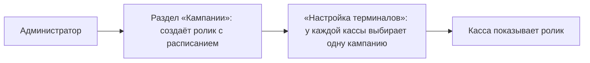
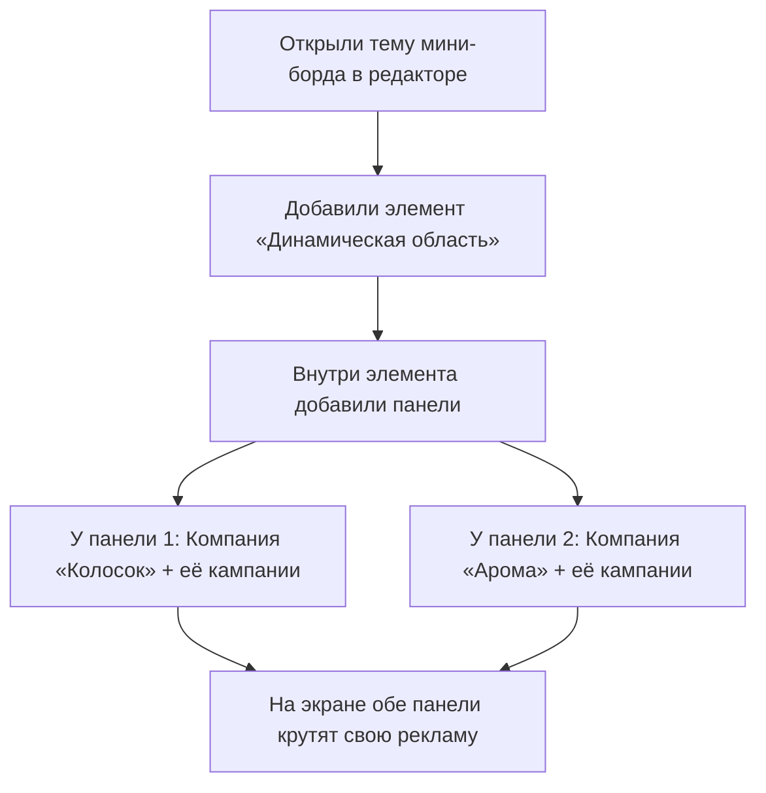
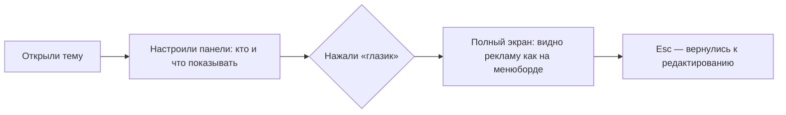

# Объяснение на пальцах: «Динамическая область» — как работает сейчас и как должно быть после переделки

> **Для кого:** для любого сотрудника, который не обязан знать технические детали.
> **Дата:** 2026-09-10
> **Основа:** исследование стенда `stand3-iikoweb`, спецификация DS-1121, задача 8 (Михаил, 02.09), итоги встречи 08.09 (Руслан, Михаил).

---

## Шаг 0. Словарик (очень простыми словами)

| Слово | Что это по-человечески |
|---|---|
| **Тема** | Готовая «картинка» для рекламного экрана — как обои рабочего стола, но для менюборда |
| **Динамическая область** | «Окошко для рекламы» на этой картинке |
| **Панель** | «Полочка» внутри окошка. В одном окошке может быть несколько полочек |
| **Компания** | **КТО** рекламируется. Например, «Пекарня „Колосок“» — показываем их рекламу |
| **Кампания** | **ЧТО** крутится: ролик или картинки с расписанием («с 1 по 31 января, с 9 до 21 часа»). Создаётся в разделе «Кампании» |

**Запоминалка:** Компания = **кто**. Кампания = **что и когда**.

---

## Аналогия с кинотеатром

- Экран менюборда — это **афиша у входа в кинотеатр**.
- «Динамическая область» — **рамка на афише**, где крутятся ролики.
- Панели — **секции внутри рамки** (в каждой секции — своя реклама).
- Компания — **студия или спонсор** («эта секция афиши продана пекарне»).
- Кампания — **трейлер**, который крутится по расписанию.

---

## 1. Как работает СЕЙЧАС

### 1.1. На боевом стенде (что есть по факту)

- Реклама на кассе появляется так: **создали кампанию → назначили её на кассу**.
- Назначается **одна** кампания на кассу (колонка «Кампании» в таблице терминалов).
- **Компаний на стенде нет вообще** — только кампании.

### 1.2. В прототипе (что уже сделано нами)

- Назначение рекламы — **внутри темы**, как договорились (в менюбордах так правильно, в отличие от касс).
- У каждой панели два поля: **«Компания панели»** (кто) и **«Кампании панели»** (что).
- Под полями мы добавили подсказки, чтобы не путать: «Компания — рекламодатель…», «Кампании — медиаплан с расписанием…».

---

## 2. Как ДОЛЖНО быть ПОСЛЕ переделки (по итогам встреч этой недели)

Что решили Михаил и Руслан на встречах **02.09** (поручение) и **08.09** (показ прототипа):

| # | Договорённость | Статус |
|---|---|---|
| 1 | Назначение компаний — **внутри темы** мини-борда («мы должны сразу видеть, что получается» — Руслан) | ✅ Уже есть |
| 2 | Элемент «Динамическая область» = набор панелей; у панели — компания и кампании | ✅ Уже есть |
| 3 | **Полноэкранное превью («глазик»):** нажал — видно «как на телевизоре»: без шахматки, без сетки, без панелей инструментов; выход по Esc. «Нажал — хоп на весь экран» (Миша) | ❌ **Ещё не сделано — это и есть оставшаяся переделка** |
| 4 | Компания — **без страниц/режимов**; выбор страниц не добавляем | ✅ Так и есть |
| 5 | Второй «лист» темы (видео на всех экранах) — **следующим этапом**, не сейчас | ✅ Не делаем |
| 6 | Настройки менюбордов («зрительные настройки») — вне скоупа | ✅ Не делаем |
| 7 | Справочник компаний — отдельный экран НЕ делаем (в прототипе мок-список) | ✅ Так и есть |

### Целевой сценарий после переделки (коротко)

То есть после переделки пользователь сможет **одним нажатием увидеть результат** — как это будет выглядеть на настоящем менюборде.

---

## 3. Что уже сделано и что осталось

| Что | Статус |
|---|---|
| Панели внутри «Динамической области» | ✅ Сделано |
| «Компания панели» / «Кампании панели» с подсказками | ✅ Сделано (вариант А из исследования) |
| Поиск кампаний, счётчик, валидация «хотя бы одна кампания» | ✅ Сделано |
| Подпись на канвасе: «Панель: Компания — кампании» | ✅ Сделано |
| Слой ниже QR-кода | ✅ Сделано |
| **Кнопка полноэкранного превью («глазик»)** | ⏳ **Осталось сделать** |
| Компания без страниц/режимов | ✅ Так и оставлено |
| Второй лист темы | ⏭️ Следующий этап (по решению Михаила) |

**Открытый вопрос к Мише:** принадлежат ли кампании компаниям (фильтровать ли список кампаний по выбранной компании).

---

## 4. Откуда это взято (обсуждения недели)

- **02.09, Михаил:** «Нужен прототип, как добавляются компании в рекламные блоки мини-бордов» (задача 8, DS-1121 / задача 160).
- **08.09, показ прототипа:** Руслан подтвердил «назначение внутри темы»; Михаил и Рома — полноэкранное превью: «нажал — хоп на весь экран, как просмотр… шахматки не будет»; Михаил: «компания без листов», второй лист — следующим этапом.
- **Исследование стенда:** `UNDERSTANDING_Кампании_vs_Компании_на_стенде.md` (в этой же папке проекта).

> Следующий шаг после этого документа — реализовать кнопку полноэкранного превью («глазик») в редакторе темы мини-борда.
