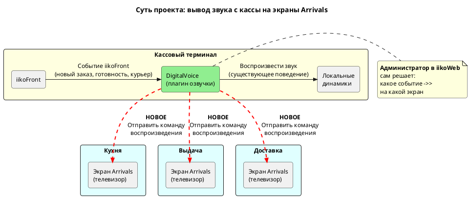
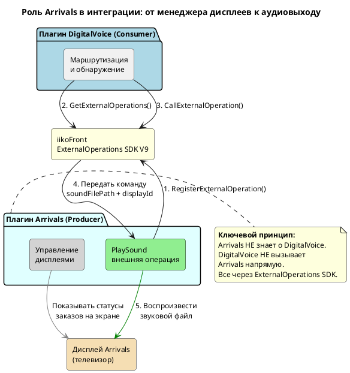
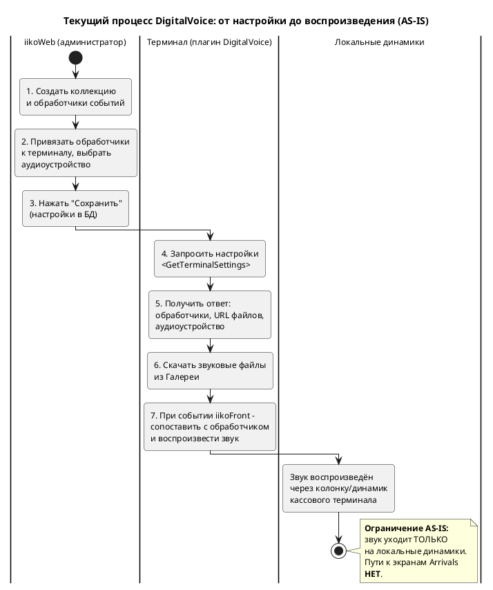
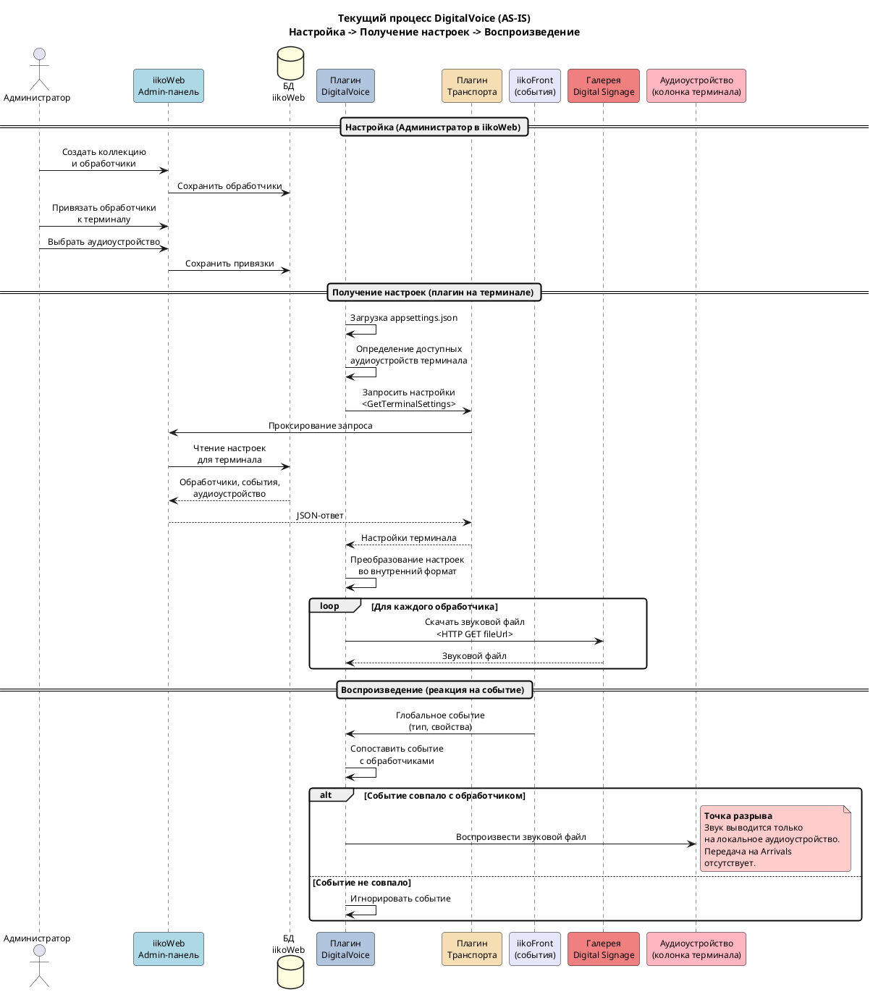
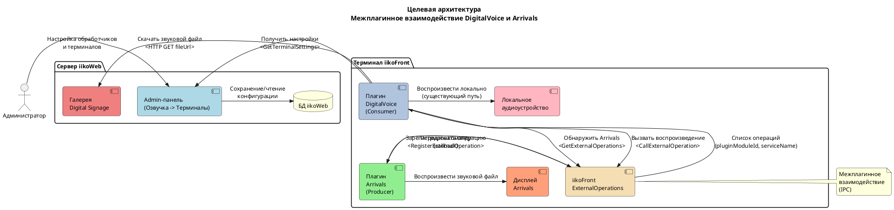
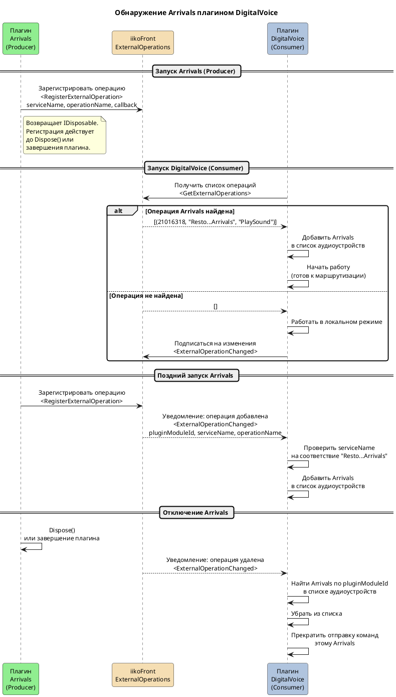
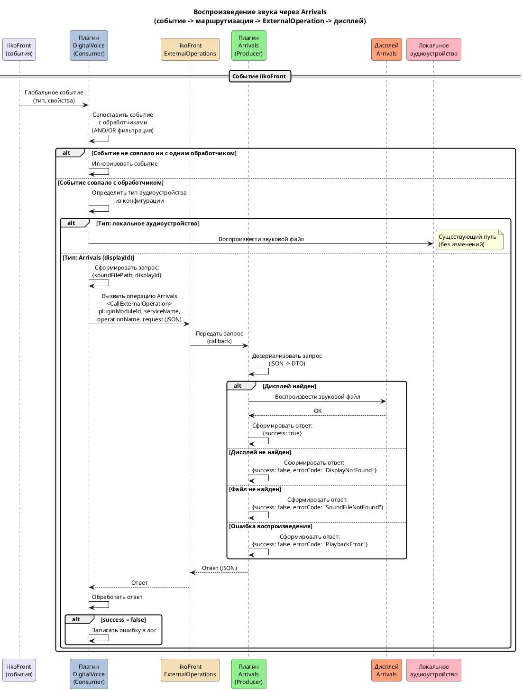
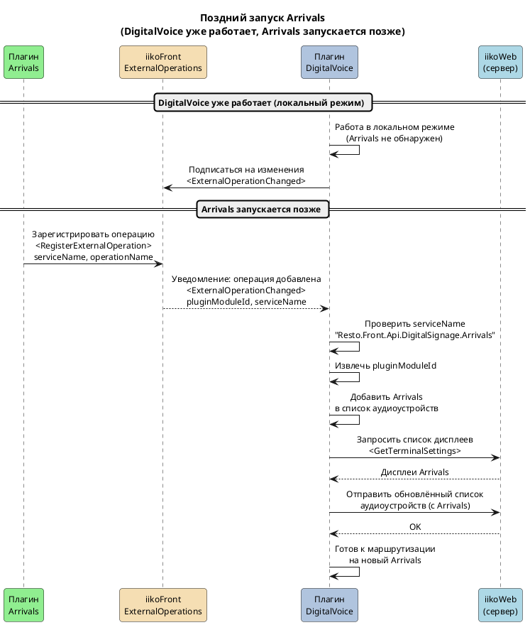
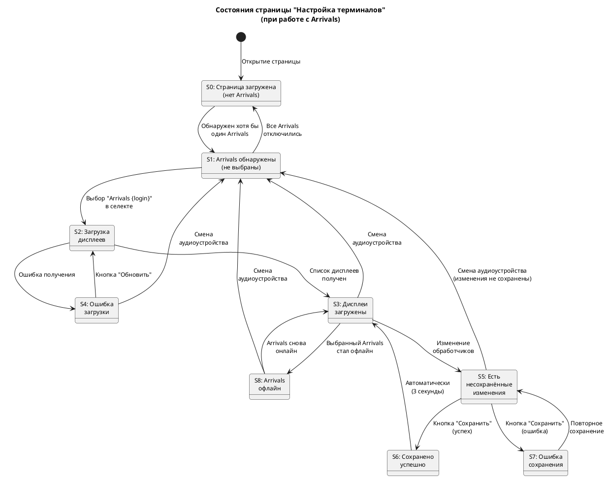
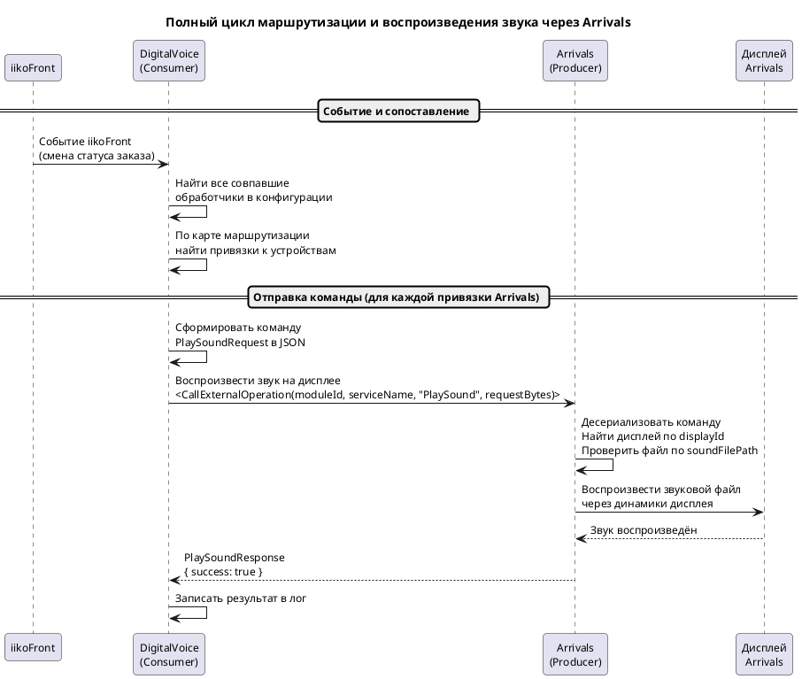

# Межплагинное взаимодействие DigitalVoice и Arrivals - Спецификация

| Связанные документы | |
|------|---|
| API-справочник | [Спецификация_Межплагин_DigitalVoice_Arrivals-API-справочник.md](Спецификация_Межплагин_DigitalVoice_Arrivals-API-справочник.md) |
| Открытые вопросы | [Открытые-вопросы.md](../../../03_Рабочие_материалы/Вопросы/Открытые-вопросы.md) |
| Метаданные | [Спецификация_Межплагин_DigitalVoice_Arrivals-метаданные.md](Спецификация_Межплагин_DigitalVoice_Arrivals-метаданные.md) |

---

## Содержание

- [Межплагинное взаимодействие DigitalVoice и Arrivals - Спецификация](#межплагинное-взаимодействие-digitalvoice-и-arrivals---спецификация)
  - [Содержание](#содержание)
  - [1. Введение и цель проекта](#1-введение-и-цель-проекта)
    - [1.1. Назначение документа](#11-назначение-документа)
    - [1.2. Бизнес-цель](#12-бизнес-цель)
        - [UML-диаграмма](#uml-диаграмма)
    - [1.3. Объём работ](#13-объём-работ)
      - [MVP](#mvp)
      - [Вне scope](#вне-scope)
  - [2. Глоссарий](#2-глоссарий)
  - [3. Общие сведения о плагине Arrivals](#3-общие-сведения-о-плагине-arrivals)
    - [3.1. Как Arrivals участвует в интеграции](#31-как-arrivals-участвует-в-интеграции)
        - [UML-диаграмма](#uml-диаграмма-1)
    - [3.1.1. Источники звуковых файлов](#311-источники-звуковых-файлов)
    - [3.2. Допущения](#32-допущения)
      - [Открытые вопросы](#открытые-вопросы)
  - [4. Текущее состояние (AS-IS)](#4-текущее-состояние-as-is)
    - [4.1. Полный цикл: от настройки до воспроизведения](#41-полный-цикл-от-настройки-до-воспроизведения)
        - [UML-диаграмма](#uml-диаграмма-2)
    - [4.2. Текущий UI раздела "Терминалы"](#42-текущий-ui-раздела-терминалы)
    - [4.3. Существующие ограничения](#43-существующие-ограничения)
    - [4.4. Диаграмма текущего процесса](#44-диаграмма-текущего-процесса)
        - [UML-диаграмма](#uml-диаграмма-3)
  - [5. Целевое решение](#5-целевое-решение)
    - [5.1. Что меняется](#51-что-меняется)
    - [5.2. Целевой процесс (8 шагов)](#52-целевой-процесс-8-шагов)
    - [5.3. Ключевое отличие от AS-IS](#53-ключевое-отличие-от-as-is)
  - [6. Архитектура решения](#6-архитектура-решения)
    - [6.1. Роли плагинов](#61-роли-плагинов)
    - [6.2. Именование ExternalOperation](#62-именование-externaloperation)
    - [6.3. Способ сериализации](#63-способ-сериализации)
    - [6.4. Component Diagram](#64-component-diagram)
        - [UML-диаграмма](#uml-диаграмма-4)
    - [6.5. Sequence Diagram: Обнаружение и регистрация Arrivals](#65-sequence-diagram-обнаружение-и-регистрация-arrivals)
        - [UML-диаграмма](#uml-диаграмма-5)
    - [6.6. Sequence Diagram: Воспроизведение звука через Arrivals](#66-sequence-diagram-воспроизведение-звука-через-arrivals)
        - [UML-диаграмма](#uml-диаграмма-6)
    - [6.7. Жизненный цикл связи](#67-жизненный-цикл-связи)
    - [6.8. Компоненты и их взаимодействие](#68-компоненты-и-их-взаимодействие)
    - [6.9. Manifest.xml](#69-manifestxml)
  - [7. Функциональные требования](#7-функциональные-требования)
    - [7.1. Обнаружение Arrivals (Discovery)](#71-обнаружение-arrivals-discovery)
      - [7.1.1. Регистрация операции плагином Arrivals](#711-регистрация-операции-плагином-arrivals)
      - [7.1.2. Обнаружение при нормальном запуске](#712-обнаружение-при-нормальном-запуске)
      - [7.1.3. Поздний запуск Arrivals](#713-поздний-запуск-arrivals)
        - [UML-диаграмма](#uml-диаграмма-7)
      - [7.1.4. Отключение Arrivals](#714-отключение-arrivals)
      - [7.1.5. Отсутствие Arrivals (локальный режим)](#715-отсутствие-arrivals-локальный-режим)
      - [7.1.6. Несколько экземпляров Arrivals](#716-несколько-экземпляров-arrivals)
      - [7.1.7. Сводная таблица сценариев Discovery](#717-сводная-таблица-сценариев-discovery)
    - [7.2. Конфигурация в iikoWeb (Admin UI)](#72-конфигурация-в-iikoweb-admin-ui)
      - [7.2.1. Отображение Arrivals как аудиоустройства](#721-отображение-arrivals-как-аудиоустройства)
      - [7.2.2. Загрузка и отображение дерева дисплеев](#722-загрузка-и-отображение-дерева-дисплеев)
      - [7.2.3. Назначение обработчиков на дисплеи](#723-назначение-обработчиков-на-дисплеи)
      - [7.2.4. Сохранение конфигурации](#724-сохранение-конфигурации)
      - [7.2.5. Состояния страницы](#725-состояния-страницы)
  - [8. Интерфейс плагина (UI)](#8-интерфейс-плагина-ui)
    - [8.1. Точка входа и навигация](#81-точка-входа-и-навигация)
    - [8.2. Структура страницы (сетка, блоки)](#82-структура-страницы-сетка-блоки)
    - [8.3. Уровень 1 - Строка ресторана](#83-уровень-1---строка-ресторана)
    - [8.4. Уровень 2 - Строка терминала](#84-уровень-2---строка-терминала)
      - [8.4.1. Колонка "Терминал"](#841-колонка-терминал)
      - [8.4.2. Колонка "Обработчики"](#842-колонка-обработчики)
      - [8.4.3. Колонка "Аудиоустройство" (ИЗМЕНЕНИЯ)](#843-колонка-аудиоустройство-изменения)
    - [8.5. Уровень 3 - Строка дисплея Arrivals (НОВЫЙ)](#85-уровень-3---строка-дисплея-arrivals-новый)
    - [8.6. Мультиселект обработчиков дисплея](#86-мультиселект-обработчиков-дисплея)
    - [8.7. Кнопка "Обновить" (НОВАЯ)](#87-кнопка-обновить-новая)
    - [8.8. Кнопка "Сохранить"](#88-кнопка-сохранить)
    - [8.9. Сообщения обратной связи](#89-сообщения-обратной-связи)
    - [8.10. Поиск и фильтрация](#810-поиск-и-фильтрация)
    - [8.11. Диаграмма состояний UI](#811-диаграмма-состояний-ui)
    - [8.12. Сводная таблица изменений относительно текущего UI](#812-сводная-таблица-изменений-относительно-текущего-ui)
    - [7.3. Маршрутизация звука (DigitalVoice - Consumer)](#73-маршрутизация-звука-digitalvoice---consumer)
      - [7.3.1. Целевой алгоритм обработки события](#731-целевой-алгоритм-обработки-события)
      - [7.3.2. Карта маршрутизации](#732-карта-маршрутизации)
      - [7.3.3. Ветвления маршрутизации](#733-ветвления-маршрутизации)
      - [7.3.4. Порядок выполнения](#734-порядок-выполнения)
      - [7.3.5. Выбор источника звука на дисплее Arrivals](#735-выбор-источника-звука-на-дисплее-arrivals)
      - [7.3.6. Sequence Diagram: полный цикл маршрутизации](#736-sequence-diagram-полный-цикл-маршрутизации)
    - [7.4. Воспроизведение звука (Arrivals - Producer)](#74-воспроизведение-звука-arrivals---producer)
      - [7.4.1. Регистрация операции](#741-регистрация-операции)
      - [7.4.2. Приём и обработка команды](#742-приём-и-обработка-команды)
      - [7.4.3. Формат команды (Request DTO)](#743-формат-команды-request-dto)
      - [7.4.4. Формат ответа (Response DTO)](#744-формат-ответа-response-dto)
      - [7.4.5. Коды ошибок Arrivals](#745-коды-ошибок-arrivals)
      - [7.4.6. Обработка busy-состояния дисплея](#746-обработка-busy-состояния-дисплея)
      - [7.4.7. Ограничение](#747-ограничение)
    - [7.5. Неочевидные параметры (для разработчика)](#75-неочевидные-параметры-для-разработчика)
    - [7.6. Сводная таблица сценариев маршрутизации](#76-сводная-таблица-сценариев-маршрутизации)
  - [9. Обзор API межплагинного взаимодействия](#9-обзор-api-межплагинного-взаимодействия)
    - [9.1. Общая информация](#91-общая-информация)
    - [9.2. Идентификация операции](#92-идентификация-операции)
    - [9.3. Обзорная таблица методов](#93-обзорная-таблица-методов)
    - [9.4. Краткое описание контракта](#94-краткое-описание-контракта)
    - [9.5. Открытые вопросы](#95-открытые-вопросы)
  - [10. Модель данных](#10-модель-данных)
    - [10.1. Расширение OutputDevice](#101-расширение-outputdevice)
    - [10.2. Объект DisplayInfo](#102-объект-displayinfo)
    - [10.3. Унификация: handlerIds](#103-унификация-handlerids)
    - [10.4. Сводный маппинг данных](#104-сводный-маппинг-данных)
    - [10.5. Полный пример ответа GetTerminalSettings (с Arrivals)](#105-полный-пример-ответа-getterminalsettings-с-arrivals)
  - [11. Конфигурация плагина](#11-конфигурация-плагина)
    - [11.1. Существующие параметры](#111-существующие-параметры)
    - [11.2. Новые параметры](#112-новые-параметры)
    - [11.3. Поведение ArrivalsModuleId](#113-поведение-arrivalsmoduleid)
    - [11.4. Полный пример appsettings.json (с новыми параметрами)](#114-полный-пример-appsettingsjson-с-новыми-параметрами)
    - [11.5. ModuleId Arrivals](#115-moduleid-arrivals)
    - [11.6. Расположение файла](#116-расположение-файла)
  - [12. Обработка ошибок](#12-обработка-ошибок)
    - [12.1. Сводный реестр ошибок](#121-сводный-реестр-ошибок)
      - [12.1.1. Ошибки обнаружения Arrivals](#1211-ошибки-обнаружения-arrivals)
      - [12.1.2. Ошибки вызова ExternalOperation](#1212-ошибки-вызова-externaloperation)
      - [12.1.3. Ошибки воспроизведения на стороне Arrivals](#1213-ошибки-воспроизведения-на-стороне-arrivals)
      - [12.1.4. Ошибки конфигурации](#1214-ошибки-конфигурации)
      - [12.1.5. Ошибки Admin UI](#1215-ошибки-admin-ui)
    - [12.2. Стратегия retry при NetworkProblem](#122-стратегия-retry-при-networkproblem)
    - [12.3. Стратегия переобнаружения Arrivals](#123-стратегия-переобнаружения-arrivals)
      - [12.3.1. Переобнаружение при OperationNotRegistered](#1231-переобнаружение-при-operationnotregistered)
      - [12.3.2. Периодическое переобнаружение](#1232-периодическое-переобнаружение)
    - [12.4. Fallback-стратегии](#124-fallback-стратегии)
      - [12.4.1. Режимы работы в зависимости от доступности компонентов](#1241-режимы-работы-в-зависимости-от-доступности-компонентов)
      - [12.4.2. Правила деградации и восстановления](#1242-правила-деградации-и-восстановления)
    - [12.5. Граничные случаи](#125-граничные-случаи)
    - [12.6. Логирование](#126-логирование)
      - [12.6.1. Уровни логирования](#1261-уровни-логирования)
      - [12.6.2. Формат сообщений](#1262-формат-сообщений)
      - [12.6.3. Что не логируется](#1263-что-не-логируется)

---

## 1. Введение и цель проекта

В этом разделе определены назначение, бизнес-цель и границы проекта межплагинного взаимодействия DigitalVoice и Arrivals.

### 1.1. Назначение документа

Спецификация описывает доработку плагинов **DigitalVoice** (`Resto.Front.Api.DigitalVoice`) и **Arrivals** (`Resto.Front.Api.DigitalSignage`) для реализации межплагинного взаимодействия через механизм ExternalOperations SDK V9. Документ предназначен для разработчиков, QA-инженеров и технической поддержки продукта iiko Digital Signage.

Документ определяет:

- механизм обнаружения плагином DigitalVoice запущенных экземпляров плагина Arrivals;
- изменения в Admin-панели iikoWeb (раздел "Озвучка") для конфигурации вывода звука на дисплеи Arrivals;
- контракт ExternalOperation для передачи команд воспроизведения звука от DigitalVoice к Arrivals;
- требования к обработке ошибок и граничных случаев.

### 1.2. Бизнес-цель

Плагин DigitalVoice обеспечивает звуковые оповещения о событиях iikoFront (новый заказ, готовность блюда, прибытие курьера). 
В текущей реализации звук воспроизводится только через локальные аудиоустройства кассового терминала - колонки или динамики, подключённые непосредственно к кассе. 
При этом персонал ресторана (повара на кухне, сотрудники на выдаче) работает с экранами Arrivals - телевизорами, отображающими статусы заказов, - и не слышит звуковые оповещения с кассового терминала.

Цель доработки - дать ресторанам возможность выводить звуковые оповещения о событиях iikoFront на дисплеи Arrivals, чтобы звук звучал там, где находится персонал, работающий с этими экранами.

Бизнес-ценность:

- **Повышение оперативности.** 
  - Персонал на кухне и выдаче слышит звуковые оповещения непосредственно у экрана, с которым работает, и реагирует быстрее.
- **Гибкость настройки.** 
  - Администратор ресторана сам определяет, какие звуковые события на каких дисплеях воспроизводятся. Одно и то же событие может быть направлено на разные экраны в зависимости от потребностей конкретного ресторана.
- **Разделение зон.** 
  - Звуковые оповещения для кухни, выдачи и зала могут быть направлены на разные экраны - персонал каждой зоны слышит только релевантные события.

##### UML-диаграмма



На схеме показана суть доработки: 
- плагин DigitalVoice на кассовом терминале получает события от iikoFront и, помимо локального воспроизведения (зелёная стрелка - существующее поведение), отправляет команды воспроизведения на экраны Arrivals в разных зонах ресторана (красные пунктирные стрелки - новая функциональность). 
- Администратор сам настраивает, какое событие на какой экран направлять.

### 1.3. Объём работ

#### MVP

| № | Функция / доработка | Описание |
|---|---------------------|----------|
| 1 | Регистрация Arrivals как внешней операции | Плагин Arrivals регистрирует операцию воспроизведения звука через `RegisterExternalOperation` SDK V9 |
| 2 | Обнаружение Arrivals плагином DigitalVoice | DigitalVoice при старте находит все запущенные экземпляры Arrivals через `GetExternalOperations`. При позднем запуске Arrivals - обнаруживает через подписку на `ExternalOperationChanged` |
| 3 | Отображение Arrivals в Admin-панели как аудиоустройства | В разделе "Озвучка" -> "Терминалы" каждый обнаруженный Arrivals отображается как аудиоустройство с именем "Arrivals {login}" |
| 4 | Подгрузка дерева дисплеев Arrivals | При выборе устройства "Arrivals {login}" подгружается список дисплеев этого экземпляра Arrivals |
| 5 | Привязка обработчиков к дисплеям | Для каждого дисплея администратор назначает обработчики событий - какие звуки на каком дисплее воспроизводить |
| 6 | Маршрутизация команды воспроизведения | При наступлении события DigitalVoice определяет по конфигурации целевой Arrivals и дисплей, вызывает `CallExternalOperation` |
| 7 | Воспроизведение звука плагином Arrivals | Arrivals принимает команду, находит указанный дисплей и воспроизводит звуковой файл через его динамики |
| 8 | Выбор источника звука | Возможность выбора: динамики телевизора Arrivals (по умолчанию) или централизованные колонки ресторана |
| 9 | Поддержка нескольких экземпляров Arrivals | DigitalVoice одновременно работает с несколькими плагинами Arrivals. Каждый отображается как отдельное аудиоустройство со своим списком дисплеев |

#### Вне scope

| № | Функция / доработка | Причина |
|---|---------------------|---------|
| 1 | Поддержка MenuBoard как устройства вывода звука | Требует отдельного обсуждения и оценки. Не входит в текущую задачу |
| 2 | Изменение архитектуры плагина Arrivals | Arrivals дорабатывается только в части добавления ExternalOperation. Существующая архитектура не меняется |

---

## 2. Глоссарий

| Термин | Определение |
|--------|------------|
| **Межплагинное взаимодействие** | Механизм ExternalOperations SDK V9 для вызова методов одного плагина из другого в рамках одного экземпляра iikoFront. Реализуется через `RegisterExternalOperation` (регистрация операции) и `CallExternalOperation` (вызов операции) |
| **ExternalOperation** | Зарегистрированная операция плагина-сервера, доступная для вызова плагинами-клиентами. Идентифицируется парой `serviceName` + `operationName`. Регистрация действует до вызова `Dispose()` или завершения плагина-сервера |
| **Плагин-сервер (Producer)** | Плагин, который регистрирует внешнюю операцию через `RegisterExternalOperation` и выполняет её при вызове. В контексте данной спецификации: плагин **Arrivals** |
| **Плагин-клиент (Consumer)** | Плагин, который вызывает внешнюю операцию через `CallExternalOperation`. В контексте данной спецификации: плагин **DigitalVoice** |
| **Аудиоустройство** | Устройство вывода звука. В текущей реализации DigitalVoice: физическое устройство (колонка/динамик), подключённое к терминалу. После доработки включает также **виртуальные** устройства - экземпляры плагина Arrivals, способные воспроизводить звук на своих дисплеях |
| **Аудиоустройство Arrivals** | Экземпляр плагина Arrivals, зарегистрированный в DigitalVoice как устройство вывода звука. Идентифицируется по moduleId плагина Arrivals. Отображается в Admin-панели как "Arrivals {login}" |
| **Дисплей (экран) Arrivals** | Физический экран (телевизор), управляемый плагином Arrivals и способный воспроизводить звук через встроенные или подключённые динамики. Каждый экземпляр Arrivals управляет одним или несколькими дисплеями |
| **Дерево дисплеев** | Иерархическая структура в Admin-панели: аудиоустройство Arrivals -> список его дисплеев -> назначенные обработчики событий для каждого дисплея |
| **Маршрутизация** | Процесс определения целевого Arrivals и дисплея для воспроизведения звука на основе конфигурации, полученной из iikoWeb. Выполняется плагином DigitalVoice при наступлении события |

---

## 3. Общие сведения о плагине Arrivals

Плагин Arrivals (`Resto.Front.Api.DigitalSignage`) - компонент iiko Digital Signage, реализующий функциональность электронной очереди. Управляет отображением статусов заказов на экранах (телевизорах) в ресторане.

| Параметр | Значение |
|----------|----------|
| Назначение | Отображение статусов готовности заказов на экранах ресторана (кухня, доставка, самовывоз) |
| Тип интеграции | ExternalOperations SDK V9 (межплагинное взаимодействие) |
| Роль в интеграции | **Плагин-сервер (Producer):** регистрирует операцию воспроизведения звука, принимает команды от DigitalVoice |
| Экземпляры | На одном терминале iikoFront может быть запущено несколько экземпляров Arrivals. Каждый обслуживает свой набор дисплеев. [ДОПУЩЕНИЕ: до 40 экземпляров] |
| Дисплеи | Каждый экземпляр Arrivals управляет одним или несколькими физическими экранами (телевизорами). Дисплей имеет уникальный идентификатор и человекочитаемое имя |
| Конфигурация | Дисплеи Arrivals настраиваются в iikoWeb (раздел "iikoArrivals"). Имена дисплеев задаются администратором |

### 3.1. Как Arrivals участвует в интеграции

Плагин Arrivals дорабатывается для поддержки роли аудиовывода:

1. При запуске регистрирует ExternalOperation - операцию воспроизведения звука.
2. При получении команды от DigitalVoice через `CallExternalOperation` находит указанный дисплей и воспроизводит звуковой файл через его динамики.
3. Возвращает результат: успех или ошибку с указанием причины.

Arrivals **не знает** о существовании DigitalVoice - он только предоставляет операцию и не зависит от того, какой плагин её вызывает. Вся логика маршрутизации (какое событие на какой дисплей) находится в конфигурации DigitalVoice.

##### UML-диаграмма



- Arrivals предоставляет две независимые функции:
  - управление дисплеями (существующая, серая)
  - операцию воспроизведения звука (новая, зелёная). 
- Arrivals не знает, кто вызывает операцию.

### 3.1.1. Источники звуковых файлов

Плагин DigitalVoice может получать звуковые файлы из двух источников. 
Для межплагинного взаимодействия источник не имеет значения - Arrivals получает готовый локальный путь к файлу (`soundFilePath`).

| Источник | Как работает | Статус |
|----------|-------------|:------:|
| **Галерея iikoWeb** | Администратор загружает готовые WAV/MP3 в Галерею. Плагин скачивает файлы по URL из ответа `GetTerminalSettings` | Работает в текущей реализации |
| **TTS-микросервис** (DigitalVoiceGenerator) | Администратор задаёт текст фразы. Микросервис генерирует WAV. Плагин получает файл через API микросервиса | Отдельная доработка (см. `../../Микросервис/TTS-микросервис-спецификация.md`) |

Оба источника выдают **одинаковый результат** - локальный путь к WAV-файлу на диске терминала.
- Контракт `PlaySound` (раздел 9) спроектирован как source-agnostic:
  - он оперирует только готовым путём к файлу и не зависит от того, как этот файл был получен.

### 3.2. Допущения

- Звуковой файл к моменту вызова уже должен быть доступен плагину Arrivals (скачан и сохранён локально). Ответственность за скачивание файла - на стороне DigitalVoice (И-20, решён).
- ModuleId плагина Arrivals: **21016318**??
- Для ExternalOperation предлагаются имена:
  -  `serviceName = "Resto.Front.Api.DigitalSignage.Arrivals"` (40 символов, в пределах 1-50), `operationName = "PlaySound"` (в пределах 1-50). Имена проверены на соответствие ограничениям SDK. **Требуется согласование** между разработчиками DigitalVoice (Даша) и Arrivals (Ваня) - имена должны быть идентичны в коде обоих плагинов (см. вопрос И-18).
- ExternalOperations доступен с V8. Текущий `manifest.xml` рабочей копии Arrivals содержит `ApiVersion = V8`. Методы `RegisterExternalOperation`, `CallExternalOperation` и `GetExternalOperations` присутствуют в `IOperationService` обеих версий (проверено по SDK Reference). Обновление с V8 до V9 не требуется.

#### Открытые вопросы

| № | Уточнение | К чему относится |
|---|----------|-----------------|
| И-18 | Какие serviceName и operationName будут использоваться для ExternalOperation? Требуется согласование Даши и Вани | Контракт ExternalOperation |

## 4. Текущее состояние (AS-IS)

Процесс работы плагина DigitalVoice в текущей реализации - до внедрения межплагинного взаимодействия с Arrivals.

### 4.1. Полный цикл: от настройки до воспроизведения

| Шаг | Этап | Где | Действие | Данные |
|:---:|------|-----|----------|--------|
| 1 | Настройка | iikoWeb | Администратор создаёт коллекцию и обработчики в разделе "Озвучка" -> "Обработчик событий" | Название коллекции, события-триггеры, звуковой файл из Галереи |
| 2 | Настройка | iikoWeb | Администратор переходит в раздел "Терминалы", привязывает обработчики к терминалу и выбирает аудиоустройство | Терминал, список обработчиков, аудиоустройство |
| 3 | Настройка | iikoWeb | Администратор нажимает "Сохранить". Настройки сохраняются в БД iikoWeb | Конфигурация обработчиков + привязки к терминалу |
| 4 | Получение | Терминал | Плагин DigitalVoice при старте запрашивает настройки через GetTerminalSettings | Запрос: terminalId, companyId, outputDevices |
| 5 | Получение | Терминал | Плагин получает ответ: список обработчиков, URL звуковых файлов, выбранное аудиоустройство | Ответ: eventHandlers, events, outputDevices, defaultOutputDeviceHash |
| 6 | Получение | Терминал | Плагин скачивает звуковые файлы по URL из Галереи и сохраняет локально | Бинарные данные звуковых файлов |
| 7 | Воспроизведение | Терминал | При наступлении глобального события iikoFront плагин сопоставляет его с обработчиками и воспроизводит звук | Тип события, свойства -> звуковой файл -> аудиоустройство |

- звук воспроизводится **только через локальные аудиоустройства терминала** - колонку или динамик, физически подключённые к кассовому терминалу. 
- Плагин DigitalVoice не имеет механизма передачи звука на другие устройства или плагины.

##### UML-диаграмма



- администратор настраивает обработчики в iikoWeb ->> плагин получает настройки и скачивает файлы ->> при событии звук воспроизводится только локально. Главное ограничение AS-IS: **отсутствует путь передачи звука на экраны Arrivals**.

### 4.2. Текущий UI раздела "Терминалы"

Раздел "Озвучка" -> "Терминалы" (страница "Настройки дисплея") в текущей реализации предоставляет следующие возможности:

- Иерархическая таблица: рестораны (уровень 1) -> терминалы (уровень 2)
- Поиск по ресторану и терминалу
- Для каждого терминала: колонка "Обработчики" (мультиселект) и колонка "Аудиоустройство" (сингл-селект)
- Кнопка "Сохранить" для явного сохранения изменений

Поле "Аудиоустройство" содержит **только физические аудиоустройства**, переданные плагином DigitalVoice при запросе GetTerminalSettings. Это локальные колонки и динамики, подключённые к терминалу. Список устройств не редактируется вручную - он формируется автоматически из данных, полученных от плагина.

**Текущий вид поля "Аудиоустройство":**

- Источник данных: плагин DigitalVoice передаёт список outputDevices в запросе GetTerminalSettings
- Тип устройств: только физические (realid вида `win-mm:Speakers-Realtek-High-Definition`)
- Отсутствует: возможность выбора плагина Arrivals как аудиоустройства

### 4.3. Существующие ограничения

В текущей реализации зафиксированы следующие ограничения, непосредственно связанные с отсутствием межплагинного взаимодействия:

| # | Ограничение | Влияние |
|---|------------|---------|
| 1 | Плагин DigitalVoice не взаимодействует с другими плагинами iikoFront (кроме Плагина Транспорта) | Звук не может быть передан для воспроизведения на плагин Arrivals |
| 2 | Аудиоустройство - только физическое устройство терминала | Невозможно выбрать дисплей Arrivals как точку вывода звука |
| 3 | Координация между экземплярами плагина на разных терминалах отсутствует | Каждый терминал работает автономно, не обмениваясь информацией о событиях |
| 4 | В поле "Аудиоустройство" раздела "Терминалы" отображаются только локальные устройства | Отсутствует возможность привязать обработчик к дисплею Arrivals |

**Точка разрыва:** после шага 7 полного цикла (воспроизведение звука) - звук выводится на локальное аудиоустройство терминала. Механизм передачи звука на экран Arrivals отсутствует полностью: ни в плагине DigitalVoice, ни в конфигурации iikoWeb, ни в плагине Arrivals.

### 4.4. Диаграмма текущего процесса

Диаграмма показывает полный цикл AS-IS - от настройки обработчика администратором до воспроизведения звука на локальном аудиоустройстве. Точка разрыва (отсутствие связи с Arrivals) обозначена на диаграмме.

##### UML-диаграмма



---

## 5. Целевое решение

В этом разделе описан целевой процесс работы после внедрения межплагинного взаимодействия. По сравнению с AS-IS добавляется новый поток: маршрутизация звука на дисплеи Arrivals через ExternalOperations.

### 5.1. Что меняется

| Аспект | AS-IS (текущее) | TO-BE (целевое) |
|--------|-----------------|-----------------|
| Аудиоустройства | Только физические (колонки/динамики терминала) | Физические + виртуальные (экземпляры Arrivals) |
| Маршрутизация звука | Всегда на локальное аудиоустройство | Локальное устройство ИЛИ дисплей Arrivals - в зависимости от конфигурации |
| Плагин Arrivals | Не взаимодействует с DigitalVoice | Регистрирует ExternalOperation, принимает команды воспроизведения |
| Плагин DigitalVoice | Воспроизводит звук только локально | Обнаруживает Arrivals, маршрутизирует события, вызывает ExternalOperation |
| UI раздела "Терминалы" | Выпадающий список с локальными колонками | Выпадающий список с локальными колонками + "Arrivals {login}" + дерево дисплеев |
| Ответ GetTerminalSettings | OutputDevice только типа "digital-voice" | OutputDevice типа "digital-voice" ИЛИ "Arrivals" с деревом дисплеев |

### 5.2. Целевой процесс (8 шагов)

| Шаг | Этап | Где | Действие | Что изменилось |
|:---:|------|-----|----------|:--------------:|
| 1 | Настройка | iikoWeb | Администратор создаёт коллекцию и обработчики | Без изменений |
| 2 | Настройка | iikoWeb | Администратор переходит в "Терминалы", выбирает аудиоустройство - теперь доступен тип "Arrivals {login}" | **Новое:** Arrivals в списке устройств |
| 3 | Настройка | iikoWeb | При выборе Arrivals подгружается дерево дисплеев. Администратор назначает обработчики на дисплеи | **Новое:** дерево дисплеев |
| 4 | Настройка | iikoWeb | Администратор нажимает "Сохранить". Конфигурация с типом "Arrivals" сохраняется в БД | **Новое:** тип OutputDevice "Arrivals" |
| 5 | Получение | Терминал | DigitalVoice запрашивает GetTerminalSettings. В ответе - OutputDevice с типом "Arrivals" и деревом дисплеев | **Расширен:** новый тип устройства |
| 6 | Обнаружение | Терминал | DigitalVoice обнаруживает Arrivals через GetExternalOperations, подписывается на ExternalOperationChanged | **Новое** |
| 7 | Получение | Терминал | DigitalVoice скачивает звуковые файлы из Галереи | Без изменений |
| 8 | Воспроизведение | Терминал | При событии DigitalVoice проверяет тип аудиоустройства: если локальное - воспроизводит локально; если Arrivals - вызывает CallExternalOperation. Arrivals воспроизводит звук на дисплее | **Новое:** ветвление + ExternalOperation |

### 5.3. Ключевое отличие от AS-IS

В AS-IS шаг 7 (воспроизведение) имеет единственный путь: событие -> локальное аудиоустройство. В TO-BE шаг 8 имеет два пути:

- **Путь A (существующий):** событие -> локальное аудиоустройство (без изменений)
- **Путь B (новый):** событие -> DigitalVoice -> CallExternalOperation -> Arrivals -> дисплей

Выбор пути определяется типом аудиоустройства в конфигурации терминала. Одно и то же событие может быть направлено и на локальное устройство, и на дисплей Arrivals одновременно.

---

## 6. Архитектура решения

В этом разделе описана целевая архитектура: компоненты системы, их взаимодействие, протоколы и жизненный цикл связи между плагинами.

### 6.1. Роли плагинов

Межплагинное взаимодействие построено по модели **Producer-Consumer** (механизм ExternalOperations SDK V9):

| Роль | Плагин | Действие | Метод SDK |
|------|--------|----------|-----------|
| **Producer** (сервер) | Arrivals | Регистрирует операцию воспроизведения звука при запуске | `RegisterExternalOperation(serviceName, operationName, callback)` |
| **Consumer** (клиент) | DigitalVoice | Обнаруживает Producer, вызывает операцию при наступлении события | `GetExternalOperations()` + `ExternalOperationChanged` + `CallExternalOperation(...)` |

**Принцип разделения:** Arrivals не знает о существовании DigitalVoice - он только предоставляет операцию. DigitalVoice управляет всей логикой маршрутизации: какое событие, на какой Arrivals, на какой дисплей.

### 6.2. Именование ExternalOperation

Для идентификации операции используются следующие имена (требуют согласования с разработчиками):

| Параметр | Значение | Ограничение |
|----------|----------|-------------|
| `serviceName` | `"Resto.Front.Api.DigitalSignage.Arrivals"` | 1-50 символов |
| `operationName` | `"PlaySound"` | 1-50 символов |

**ModuleId плагина Arrivals:** `21016318` (из `Manifest.xml`). Это значение используется DigitalVoice при вызове `CallExternalOperation(21016318, ...)`.

### 6.3. Способ сериализации

Для передачи данных между плагинами используется **byte[] overload + JSON**:

- **Формат:** JSON (сериализация/десериализация на стороне каждого плагина)
- **Преимущества:** не требует shared-сборки, кросс-версионная совместимость (Arrivals на V8, DigitalVoice на V9), легко отлаживать
- **Альтернатива (Generic overload):** требует `[Serializable]` атрибутов и одинаковой версии API на обоих плагинах - не рекомендуется для данного сценария

### 6.4. Component Diagram

Диаграмма показывает все компоненты системы и их взаимодействие в целевой архитектуре. Пунктирными линиями выделены новые связи, отсутствующие в AS-IS.

##### UML-диаграмма



### 6.5. Sequence Diagram: Обнаружение и регистрация Arrivals

Диаграмма показывает процесс обнаружения плагином DigitalVoice запущенных экземпляров Arrivals. Покрывает два сценария: нормальный запуск (оба плагина работают) и поздний запуск Arrivals.

##### UML-диаграмма



### 6.6. Sequence Diagram: Воспроизведение звука через Arrivals

Диаграмма показывает полный цикл: от наступления события iikoFront до воспроизведения звука на дисплее Arrivals. Включает ветвление: локальное воспроизведение vs воспроизведение через Arrivals.

##### UML-диаграмма



### 6.7. Жизненный цикл связи

Связь между DigitalVoice и Arrivals проходит через следующие состояния:

| Состояние | Условие | Действия DigitalVoice |
|-----------|--------|----------------------|
| **Поиск** | DigitalVoice запущен, Arrivals не обнаружен | Вызвать `GetExternalOperations()`. Если не найден - подписаться на `ExternalOperationChanged` |
| **Подключён** | Arrivals обнаружен (через GetExternalOperations или ExternalOperationChanged) | Добавить в список аудиоустройств. Отправить обновлённый список в GetTerminalSettings. Начать маршрутизацию |
| **Потеря связи** | ExternalOperationChanged с событием "удаление" | Убрать из списка аудиоустройств. Прекратить отправку команд. Отправить обновлённый список в GetTerminalSettings |
| **Переподключение** | ExternalOperationChanged с событием "добавление" для ранее известного pluginModuleId | Восстановить в списке аудиоустройств. Возобновить маршрутизацию |

### 6.8. Компоненты и их взаимодействие

| Компонент | Роль | Ключевые протоколы/методы |
|-----------|------|--------------------------|
| **iikoWeb (Admin + БД)** | Настройка обработчиков, хранение конфигурации, API GetTerminalSettings | HTTPS (UI), SQL (БД), GetTerminalSettings (через транспорт) |
| **DigitalVoice (Consumer)** | Обнаружение Arrivals, получение настроек, маршрутизация событий, вызов ExternalOperation, локальное воспроизведение | GetTerminalSettings, GetExternalOperations, CallExternalOperation, HTTP GET (Галерея), System Audio API |
| **Arrivals (Producer)** | Регистрация ExternalOperation, приём команд воспроизведения, управление дисплеями | RegisterExternalOperation, callback (request -> response), System Audio API |
| **iikoFront ExternalOperations** | Транспорт межплагинных вызовов | RegisterExternalOperation, CallExternalOperation, GetExternalOperations, ExternalOperationChanged |
| **Дисплей Arrivals** | Физический экран с динамиками | System Audio API (через Arrivals) |
| **Локальное аудиоустройство** | Колонка/динамик терминала | System Audio API (через DigitalVoice) |
| **Галерея Digital Signage** | Хранилище звуковых файлов | HTTP GET (скачивание файлов по URL) |

### 6.9. Manifest.xml

**Изменений не требуется.** Оба плагина сохраняют текущие Manifest.xml:

- **Arrivals:** `LicenseModuleId=21016318` уже определён и используется для ExternalOperation
- **DigitalVoice:** ModuleId не требуется для вызова ExternalOperation (указывается ModuleId целевого плагина)

---

## 7. Функциональные требования

В этом разделе описаны функциональные требования к межплагинному взаимодействию, сгруппированные по сценариям. Каждый сценарий включает предусловия, таблицу шагов, постусловия, диаграмму (если применимо) и возможные ошибки.

### 7.1. Обнаружение Arrivals (Discovery)

Этот раздел описывает требования к механизму обнаружения плагином DigitalVoice запущенных экземпляров плагина Arrivals через ExternalOperations SDK V9. Discovery - фоновый процесс, не требующий взаимодействия с кассиром.

#### 7.1.1. Регистрация операции плагином Arrivals

Плагин Arrivals (Producer) должен зарегистрировать внешнюю операцию для приёма команд воспроизведения звука от других плагинов.

**Предусловие:** плагин Arrivals запущен, лицензия активна.

| # | Шаг | Действие | Метод SDK |
|---|-----|----------|-----------|
| 1 | Инициализация | В конструкторе плагина Arrivals вызвать `RegisterExternalOperation` | `IOperationService.RegisterExternalOperation` |
| 2 | Передача параметров | Передать `serviceName = "Resto.Front.Api.DigitalSignage.Arrivals"`, `operationName = "PlaySound"`, callback-функцию | - |
| 3 | Реализация callback | В callback: десериализовать JSON-запрос, найти дисплей по `displayId`, воспроизвести файл по `soundFilePath`, вернуть JSON-ответ | - |
| 4 | Сохранение IDisposable | Сохранить возвращённый `IDisposable` для освобождения при завершении плагина | - |

**Постусловие:** операция зарегистрирована в реестре ExternalOperations iikoFront. Другие плагины могут обнаружить её через `GetExternalOperations()`.

**Ошибки:**

| Ситуация | Реакция |
|----------|---------|
| `serviceName` длиннее 50 символов | Исключение при регистрации, плагин не запускается |
| `operationName` длиннее 50 символов | Исключение при регистрации, плагин не запускается |
| Исключение в callback | Записывается в `api.log` (стектрейс). Consumer получает `ExternalOperationCallingException` с `Reason = OperationFailed` |

#### 7.1.2. Обнаружение при нормальном запуске

Плагин DigitalVoice запускается, когда Arrivals уже работает. DigitalVoice должен обнаружить все запущенные экземпляры Arrivals и добавить их в список доступных аудиоустройств.

**Предусловие:** плагин Arrivals запущен и зарегистрировал ExternalOperation (выполнен сценарий 7.1.1). Плагин DigitalVoice запускается.

| # | Шаг | Действие | Метод SDK / API |
|---|-----|----------|-----------------|
| 1 | Запрос списка | Вызвать `GetExternalOperations()` для получения всех зарегистрированных операций | `IOperationService.GetExternalOperations` |
| 2 | Фильтрация | Отфильтровать результат по `serviceName = "Resto.Front.Api.DigitalSignage.Arrivals"` | - |
| 3 | Извлечение данных | Для каждой найденной операции извлечь `pluginModuleId` | - |
| 4 | Добавление в список | Добавить Arrivals в словарь `_arrivalsDevices[pluginModuleId]` | - |
| 5 | Получение дисплеев | Запросить список дисплеев Arrivals через GetTerminalSettings (поле `outputDevices` с типом `"Arrivals"`) | `GetTerminalSettings` |
| 6 | Отправка на сервер | Отправить обновлённый список аудиоустройств на сервер iikoWeb | `GetTerminalSettings` |
| 7 | Подписка | Подписаться на `ExternalOperationChanged` для отслеживания изменений | `INotificationService.ExternalOperationChanged` |

**Постусловие:** DigitalVoice имеет актуальный список всех запущенных Arrivals. В Admin-панели в поле "Аудиоустройство" отображаются пункты "Arrivals {login}" для каждого обнаруженного экземпляра.

**Ошибки:**

| Ситуация | Реакция |
|----------|---------|
| `GetExternalOperations()` завершился с исключением | DigitalVoice переходит в локальный режим (сценарий 7.1.5) |
| Список операций пуст (нет Arrivals) | DigitalVoice переходит в локальный режим (сценарий 7.1.5) |
| Не удалось получить дисплеи Arrivals | Arrivals добавляется в список, но без дисплеев. В Admin-панели отображается с пометкой "дисплеи недоступны" |

#### 7.1.3. Поздний запуск Arrivals

Плагин Arrivals запускается после того, как DigitalVoice уже работает. DigitalVoice должен обнаружить новый Arrivals через подписку на `ExternalOperationChanged` и добавить его в список.

**Предусловие:** DigitalVoice запущен и работает (возможно, в локальном режиме). Arrivals не был запущен на момент старта DigitalVoice. Подписка на `ExternalOperationChanged` активна.

| # | Шаг | Действие | Метод SDK |
|---|-----|----------|-----------|
| 1 | Регистрация Arrivals | Arrivals вызывает `RegisterExternalOperation` | `RegisterExternalOperation` |
| 2 | Уведомление | iikoFront генерирует событие `ExternalOperationChanged` (added) с информацией о новой операции | `ExternalOperationChanged` |
| 3 | Получение уведомления | DigitalVoice получает уведомление и проверяет `serviceName` | - |
| 4 | Проверка | Если `serviceName = "Resto.Front.Api.DigitalSignage.Arrivals"` - продолжить обработку | - |
| 5 | Добавление | Извлечь `pluginModuleId`, добавить Arrivals в `_arrivalsDevices[pluginModuleId]` | - |
| 6 | Получение дисплеев | Запросить список дисплеев через GetTerminalSettings | `GetTerminalSettings` |
| 7 | Отправка на сервер | Отправить обновлённый список аудиоустройств на сервер | `GetTerminalSettings` |

**Постусловие:** новый Arrivals добавлен в список. В Admin-панели появляется новый пункт "Arrivals {login}". DigitalVoice готов маршрутизировать звук на этот Arrivals.

**Ошибки:**

| Ситуация | Реакция |
|----------|---------|
| Уведомление `ExternalOperationChanged` не получено (потеряно) | Arrivals не будет добавлен до следующего цикла GetTerminalSettings. Расхождение обнаружится при следующем обновлении |
| `serviceName` не совпадает с ожидаемым | Игнорировать уведомление (операция другого плагина) |

##### UML-диаграмма



#### 7.1.4. Отключение Arrivals

Плагин Arrivals завершает работу (штатно или аварийно). DigitalVoice должен обнаружить отключение и прекратить попытки отправки команд этому Arrivals.

**Предусловие:** Arrivals был обнаружен и добавлен в список `_arrivalsDevices`. DigitalVoice отправляет ему команды воспроизведения.

| # | Шаг | Действие | Метод SDK |
|---|-----|----------|-----------|
| 1 | Завершение Arrivals | Arrivals вызывает `Dispose()` на IDisposable регистрации (или завершается аварийно) | - |
| 2 | Уведомление | iikoFront генерирует событие `ExternalOperationChanged` (removed) с `pluginModuleId` отключившегося Arrivals | `ExternalOperationChanged` |
| 3 | Получение уведомления | DigitalVoice получает уведомление, находит Arrivals в `_arrivalsDevices` по `pluginModuleId` | - |
| 4 | Удаление | Убрать Arrivals из `_arrivalsDevices` | - |
| 5 | Прекращение отправки | Прекратить попытки вызова `CallExternalOperation` для этого `pluginModuleId` | - |
| 6 | Отправка на сервер | Отправить обновлённый список аудиоустройств (без отключившегося Arrivals) на сервер | `GetTerminalSettings` |

**Постусловие:** отключившийся Arrivals удалён из списка. В Admin-панели соответствующий пункт "Arrivals {login}" исчезает.

**Ошибки:**

| Ситуация | Реакция |
|----------|---------|
| `CallExternalOperation` вызван в момент отключения Arrivals (race condition) | `ExternalOperationCallingException` с `Reason = OperationNotRegistered`. DigitalVoice удаляет Arrivals из `_arrivalsDevices`, логирует предупреждение |
| Уведомление `ExternalOperationChanged` (removed) не получено | Arrivals остаётся в списке. При следующем `CallExternalOperation` - `OperationNotRegistered` -> удаление из списка |

#### 7.1.5. Отсутствие Arrivals (локальный режим)

На терминале не запущено ни одного экземпляра Arrivals. DigitalVoice должен продолжать работу в локальном режиме без ошибок.

**Предусловие:** DigitalVoice запущен. Лицензия активна. Arrivals не установлен или не запущен.

| # | Шаг | Действие | Метод SDK |
|---|-----|----------|-----------|
| 1 | Запрос списка | Вызвать `GetExternalOperations()` | `GetExternalOperations` |
| 2 | Проверка | Результат не содержит операций с `serviceName = "Resto.Front.Api.DigitalSignage.Arrivals"` | - |
| 3 | Подписка | Подписаться на `ExternalOperationChanged` для отслеживания будущих запусков Arrivals | `ExternalOperationChanged` |
| 4 | Локальный режим | Работать в локальном режиме: воспроизводить звук только через локальные аудиоустройства терминала | - |
| 5 | Ожидание | При появлении Arrivals (уведомление `ExternalOperationChanged`) - автоматический переход к сценарию 7.1.3 | - |

**Постусловие:** DigitalVoice работает в локальном режиме. Кассир не видит сообщений об ошибке. Администратор в поле "Аудиоустройство" видит только локальные устройства.

**Ключевое требование:** отсутствие Arrivals - штатная ситуация. Плагин DigitalVoice не должен блокировать работу терминала, выводить ошибки кассиру или прекращать локальное воспроизведение звука.

#### 7.1.6. Несколько экземпляров Arrivals

На терминале запущено несколько экземпляров Arrivals. DigitalVoice должен обнаружить все и различать их.

**Предусловие:** запущено N экземпляров Arrivals (N >= 2). Каждый имеет уникальный `pluginModuleId` (из Manifest.xml).

| # | Шаг | Действие | Метод SDK |
|---|-----|----------|-----------|
| 1 | Запрос списка | Вызвать `GetExternalOperations()` | `GetExternalOperations` |
| 2 | Фильтрация | Отфильтровать по `serviceName = "Resto.Front.Api.DigitalSignage.Arrivals"` - результат содержит N записей | - |
| 3 | Различение | Для каждой записи извлечь `pluginModuleId` - уникальный ключ | - |
| 4 | Добавление | Добавить каждый Arrivals в `_arrivalsDevices[pluginModuleId]` | - |
| 5 | Получение дисплеев | Для каждого Arrivals запросить список дисплеев | `GetTerminalSettings` |
| 6 | Отображение | Каждый Arrivals отображается как отдельное аудиоустройство "Arrivals {login}" | - |

**Постусловие:** все N экземпляров Arrivals доступны для маршрутизации. Администратор может выбрать любой из них и назначить обработчики на его дисплеи.

**Детали:** максимальное количество экземпляров Arrivals на одном терминале - до 40 [ДОПУЩЕНИЕ]. Все экземпляры регистрируют операцию с одинаковыми `serviceName`/`operationName`, но различаются по `pluginModuleId`.

#### 7.1.7. Сводная таблица сценариев Discovery

| Сценарий | Триггер | Метод | Результат |
|----------|---------|-------|-----------|
| Нормальный запуск | DigitalVoice стартует после Arrivals | `GetExternalOperations()` | Arrivals добавлен в список |
| Поздний запуск | `ExternalOperationChanged` (added) | Обработчик события | Arrivals добавлен в список |
| Отключение | `ExternalOperationChanged` (removed) или `OperationNotRegistered` | Обработчик события / catch | Arrivals удалён из списка |
| Несколько Arrivals | `GetExternalOperations()` -> N записей | Фильтрация + различение по moduleId | Все N добавлены |
| Отсутствие | `GetExternalOperations()` -> пусто | Подписка на ExternalOperationChanged | Локальный режим |

### 7.2. Конфигурация в iikoWeb (Admin UI)

Этот раздел описывает функциональные требования к изменениям в Admin-панели iikoWeb, раздел "Озвучка" -> "Терминалы" (страница "Настройка терминалов"). Изменения позволяют администратору назначать обработчики событий на конкретные дисплеи обнаруженных экземпляров Arrivals.

#### 7.2.1. Отображение Arrivals как аудиоустройства

| # | Требование | Связь с ТЗ | Источник |
|---|-----------|:---------:|----------|
| 1 | В колонке "Аудиоустройство" строки терминала должны отображаться обнаруженные экземпляры Arrivals как устройства вывода с именем "Arrivals {login}", где `{login}` - имя кассы/терминала, на котором запущен Arrivals | Требование 5 | - |
| 2 | Пункты "Arrivals {login}" должны отображаться в выпадающем списке после всех физических аудиоустройств, с визуальным разделителем между физическими и виртуальными устройствами | [ДОПУЩЕНИЕ] | - |
| 3 | Если экземпляр Arrivals перестал отвечать (статус "офлайн"), пункт "Arrivals {login}" должен оставаться в списке, но отображаться серым цветом с меткой "(офлайн)" | Требование 4 (косвенно) | - |
| 4 | При отсутствии обнаруженных экземпляров Arrivals пункты "Arrivals {login}" не отображаются. Список аудиоустройств содержит только физические устройства | Требование 4 | - |

#### 7.2.2. Загрузка и отображение дерева дисплеев

| # | Требование | Связь с ТЗ | Источник |
|---|-----------|:---------:|----------|
| 5 | При выборе администратором пункта "Arrivals {login}" в колонке "Аудиоустройство" под строкой терминала должно раскрываться дерево дисплеев этого экземпляра Arrivals | Требование 6 | - |
| 6 | Каждый дисплей Arrivals отображается отдельной строкой с визуальным отступом от строки терминала. Строка дисплея содержит: имя дисплея, индикатор состояния "Онлайн"/"Офлайн" и мультиселект обработчиков событий | Требование 6 | - |
| 7 | Имена дисплеев должны соответствовать именам, заданным в конфигурации Arrivals в iikoWeb (раздел "iikoArrivals") | Требование 6 | - |
| 8 | При выборе другого аудиоустройства (физического или другого Arrivals) строки дисплеев должны сворачиваться. Назначенные обработчики дисплеев сохраняются в несохранённом состоянии формы до нажатия "Сохранить" или перезагрузки страницы | [ДОПУЩЕНИЕ] | - |
| 9 | На странице должна быть кнопка "Обновить" для ручного обновления списка дисплеев выбранного Arrivals. Кнопка отображается только когда выбран Arrivals и раскрыто дерево дисплеев | [ДОПУЩЕНИЕ] | - |

#### 7.2.3. Назначение обработчиков на дисплеи

| # | Требование | Связь с ТЗ | Источник |
|---|-----------|:---------:|----------|
| 10 | Для каждого дисплея Arrivals администратор должен иметь возможность назначить один или несколько обработчиков событий через мультиселект, идентичный мультиселекту уровня терминала | Требование 7 | - |
| 11 | Список обработчиков в мультиселекте дисплея должен совпадать со списком обработчиков со страницы "Обработчики событий" | Требование 7 | - |
| 12 | Один и тот же обработчик может быть назначен на несколько дисплеев одного экземпляра Arrivals. Система не должна запрещать это | Требование 15 (нет типизации) | - |
| 13 | Если обработчик уже назначен на другой дисплей этого же Arrivals, в мультиселекте должна отображаться подсказка: "Уже назначен на {имя_другого_дисплея}". Это носит информационный характер и не блокирует выбор | [ДОПУЩЕНИЕ] | - |
| 14 | Для дисплея в состоянии "Офлайн" мультиселект обработчиков должен быть недоступен для редактирования (серый). Ранее назначенные обработчики отображаются | [ДОПУЩЕНИЕ] | - |

#### 7.2.4. Сохранение конфигурации

| # | Требование | Связь с ТЗ | Источник |
|---|-----------|:---------:|----------|
| 15 | Кнопка "Сохранить" на странице "Настройка терминалов" должна сохранять привязки обработчиков к дисплеям Arrivals вместе с существующими настройками терминала (привязка обработчиков, выбор аудиоустройства) | Требование 8 | - |
| 16 | При успешном сохранении должно отображаться сообщение "Настройки сохранены", автоматически скрываемое через 3 секунды | [ДОПУЩЕНИЕ] | - |
| 17 | При ошибке сохранения должно отображаться сообщение "Не удалось сохранить настройки. Проверьте подключение и попробуйте снова." Изменения, внесённые администратором, не должны теряться | [ДОПУЩЕНИЕ] | - |

#### 7.2.5. Состояния страницы

| # | Требование | Связь с ТЗ | Источник |
|---|-----------|:---------:|----------|
| 18 | При загрузке списка дисплеев (после выбора "Arrivals {login}") должна отображаться строка с текстом "Загрузка списка дисплеев..." и индикатором загрузки | [ДОПУЩЕНИЕ] | - |
| 19 | При ошибке загрузки списка дисплеев должно отображаться сообщение: "Не удалось загрузить список дисплеев. Нажмите 'Обновить' для повторной попытки." и кнопка "Обновить" | [ДОПУЩЕНИЕ] | - |
| 20 | При наличии несохранённых изменений кнопка "Сохранить" должна визуально отличаться (подсветка) от состояния "нет изменений" | [ДОПУЩЕНИЕ] | - |

---

## 8. Интерфейс плагина (UI)

Этот раздел содержит детальное текстовое описание графического интерфейса доработанной страницы "Настройка терминалов", достаточное для отрисовки макета. Описание основано на существующем интерфейсе (раздел 7 спецификации DigitalVoice) с указанием всех изменений.

### 8.1. Точка входа и навигация

Страница "Настройка терминалов" доступна через левую боковую панель: "Экраны и звуки" -> "Звуки" -> "Настройка терминалов". 

Путь и заголовок страницы не меняются.

### 8.2. Структура страницы (сетка, блоки)

Страница сохраняет трёхзонную структуру (сверху вниз):

| Зона | Элементы | Статус |
|------|----------|:------:|
| **Верхняя панель** | Заголовок "Настройка терминалов", кнопка "Сохранить", кнопка "info" | Без изменений |
| **Панель поиска** | Поле "Поиск по ресторану", поле "Поиск по терминалу" | Без изменений. Поиск дополнительно учитывает имена дисплеев |
| **Таблица** | Иерархическая таблица: Ресторан (уровень 1) -> Терминал (уровень 2) -> Дисплей Arrivals (уровень 3, новый) | **Изменена** |

### 8.3. Уровень 1 - Строка ресторана

Без изменений. Строка содержит имя ресторана и количество терминалов. При клике раскрывается в список терминалов (уровень 2).

### 8.4. Уровень 2 - Строка терминала

Строка терминала сохраняет три колонки. Изменения затрагивают **только** колонку "Аудиоустройство".

#### 8.4.1. Колонка "Терминал"

Без изменений. Содержит: имя терминала (например, "127.0.0.1") и дату последней активности.

#### 8.4.2. Колонка "Обработчики"

Без изменений. Содержит: мультиселект с кнопкой "Выбрать", плейсхолдером "Выберите обработчики" и крестиком очистки.

#### 8.4.3. Колонка "Аудиоустройство" (ИЗМЕНЕНИЯ)

| Параметр | Текущее состояние | Целевое состояние |
|----------|-------------------|-------------------|
| Тип | Сингл-селект (combobox) | Сингл-селект (combobox) - без изменений |
| Источник пунктов | Список физических аудиоустройств от плагина | Физические аудиоустройства + виртуальные устройства "Arrivals {login}" |
| Состав пунктов | "Динамики (High Definition Audio Device)" | 1. Физические устройства (динамики/колонки). 2. Разделитель (серая линия). 3. "Arrivals {login}" для каждого обнаруженного Arrivals |
| Иконка пункта Arrivals | - | Иконка монитора/экрана (отличается от иконки динамика для физических устройств) |
| Состояние "офлайн" | - | Пункт "Arrivals {login}" серый, с меткой "(офлайн)" после имени |
| Поведение при выборе Arrivals | - | Под строкой терминала раскрывается дерево дисплеев (уровень 3) |
| Поведение при переключении | - | Дерево дисплеев сворачивается. Назначенные обработчики сохраняются в форме до явного сохранения |

### 8.5. Уровень 3 - Строка дисплея Arrivals (НОВЫЙ)

Строка дисплея появляется под строкой терминала при выборе аудиоустройства типа "Arrivals {login}". Количество строк дисплеев равно количеству дисплеев выбранного экземпляра Arrivals.

**Визуальное оформление:**

| Параметр | Описание |
|----------|----------|
| Отступ слева | 24px от левого края строки терминала для обозначения вложенности |
| Цвет фона | Слегка светлее фона строки терминала (на 1-2 тона) |
| Левая граница | Вертикальная линия-индикатор, соединяющая строки дисплеев с родительским терминалом |
| Высота строки | Аналогична строке терминала |

**Колонки строки дисплея:**

| Колонка | Тип элемента | Описание |
|---------|-------------|----------|
| **Дисплей** | Текст + индикатор | Имя дисплея (полужирный шрифт). Под именем - метка состояния: "Онлайн" (зелёный цвет #2E7D32, зелёная точка) или "Офлайн" (серый цвет #9E9E9E, серая точка) |
| **Обработчики** | Мультиселект (combobox) | Идентичен мультиселекту уровня терминала. Кнопка "Выбрать", плейсхолдер "Выберите обработчики", крестик очистки |

**Состояния строки дисплея:**

| Состояние | Внешний вид | Поведение |
|-----------|------------|-----------|
| **Онлайн, не настроен** | Имя дисплея + "Онлайн" (зелёный). Мультиселект: плейсхолдер "Выберите обработчики" | Можно выбрать обработчики |
| **Онлайн, настроен** | Имя дисплея + "Онлайн" (зелёный). Мультиселект: отображаются выбранные обработчики | Можно изменить/очистить |
| **Офлайн** | Имя дисплея + "Офлайн" (серый). Мультиселект: серый, неактивный. Ранее выбранные обработчики отображаются | Нельзя редактировать |
| **Загрузка** | Вместо строк дисплеев - одна строка "Загрузка списка дисплеев..." со спиннером | Ожидание |
| **Ошибка загрузки** | Текст ошибки + кнопка "Обновить" | Можно повторить попытку |

### 8.6. Мультиселект обработчиков дисплея

| Параметр | Описание |
|----------|----------|
| Тип | Выпадающий список с множественным выбором (multiselect combobox) |
| Внешний вид | Идентичен мультиселекту уровня терминала |
| Плейсхолдер | "Выберите обработчики" |
| Кнопка открытия | "Выбрать" |
| Кнопка очистки | Крестик - сбрасывает все выбранные обработчики для этого дисплея |
| Источник списка | Все обработчики со страницы "Обработчики событий" |
| Подсказка при повторе | Если обработчик уже назначен на другой дисплей этого же Arrivals, под именем обработчика в выпадающем списке отображается текст: "Уже назначен на {имя_другого_дисплея}" |
| Неактивное состояние | Если дисплей в состоянии "Офлайн" - мультиселект серый, кнопка "Выбрать" не нажимается |

### 8.7. Кнопка "Обновить" (НОВАЯ)

| Параметр | Описание |
|----------|----------|
| Расположение | Справа от имени выбранного "Arrivals {login}" в колонке "Аудиоустройство" уровня 2 |
| Вид | Иконка обновления + текст "Обновить" |
| Видимость | Только когда выбран Arrivals и раскрыто дерево дисплеев |
| Действие | Повторный запрос списка дисплеев. На время запроса - состояние "Загрузка". После - либо список дисплеев, либо ошибка загрузки |

### 8.8. Кнопка "Сохранить"

Сохраняет все изменения на странице, включая привязки обработчиков к дисплеям Arrivals.

| Параметр | Описание |
|----------|----------|
| Расположение | Верхняя панель страницы (без изменений) |
| Активное состояние | Подсвечена, когда на странице есть несохранённые изменения |
| Неактивное состояние | Обычный вид, когда все изменения сохранены |
| Результат (успех) | Сообщение "Настройки сохранены" (зелёный текст, автоскрытие через 3 секунды) |
| Результат (ошибка) | Сообщение "Не удалось сохранить настройки. Проверьте подключение и попробуйте снова." (красный текст). Кнопка остаётся активной для повторной попытки |

### 8.9. Сообщения обратной связи

| Сообщение | Тип | Цвет | Когда показывается | Автоскрытие |
|-----------|-----|------|--------------------|:----------:|
| "Загрузка списка дисплеев..." | Информация | Стандартный | При выборе Arrivals, пока загружаются дисплеи | Нет (до загрузки) |
| "Не удалось загрузить список дисплеев. Нажмите 'Обновить' для повторной попытки." | Ошибка | Красный | При ошибке загрузки дисплеев | Нет |
| "Настройки сохранены" | Успех | Зелёный | После успешного сохранения | Да, 3 секунды |
| "Не удалось сохранить настройки. Проверьте подключение и попробуйте снова." | Ошибка | Красный | При ошибке сохранения | Нет |

### 8.10. Поиск и фильтрация

| Поле поиска | Текущее поведение | Новое поведение |
|-------------|-------------------|-----------------|
| **Поиск по ресторану** | Фильтрует строки ресторанов по имени | Также проверяет имена дисплеев внутри раскрытых строк. Если имя дисплея совпадает с запросом - ресторан остаётся видимым |
| **Поиск по терминалу** | Фильтрует строки терминалов по имени | Также проверяет имена дисплеев внутри раскрытых строк. Если имя дисплея совпадает - терминал и его ресторан остаются видимыми |

### 8.11. Диаграмма состояний UI



### 8.12. Сводная таблица изменений относительно текущего UI

| # | Элемент | Тип изменения | Что именно изменилось |
|---|---------|:-----------:|----------------------|
| 1 | Селект "Аудиоустройство" | Расширение | Добавлены пункты "Arrivals {login}" с иконкой монитора. Группировка с разделителем |
| 2 | Пункт "Arrivals {login}" | Новый | Имя "Arrivals {login}", иконка монитора, состояние "офлайн" (серый + метка) |
| 3 | Строка дисплея (уровень 3) | Новый | Отступ 24px, светлый фон, левая линия-индикатор, 2 колонки |
| 4 | Колонка "Дисплей" (уровень 3) | Новый | Имя дисплея + индикатор "Онлайн"/"Офлайн" с цветовой точкой |
| 5 | Мультиселект дисплея | Новый | Идентичен терминальному. Подсказка о повторе на другом дисплее |
| 6 | Кнопка "Обновить" | Новый | Иконка + текст. Только при выбранном Arrivals |
| 7 | Кнопка "Сохранить" | Расширение | Сохраняет также привязки обработчиков к дисплеям. Индикатор несохранённых изменений |
| 8 | Сообщения обратной связи | Новый | 4 типа сообщений: загрузка, ошибка загрузки, успех сохранения, ошибка сохранения |
| 9 | Поиск по ресторану/терминалу | Расширение | Учитывает имена дисплеев при фильтрации |
| 10 | Индикатор состояния | Новый | Метка "Онлайн" (зелёный) / "Офлайн" (серый) для дисплеев и пунктов Arrivals |

### 7.3. Маршрутизация звука (DigitalVoice - Consumer)

Этот раздел описывает логику плагина DigitalVoice при наступлении события iikoFront: как плагин определяет, куда направить звук - на локальное устройство или на дисплей Arrivals.

#### 7.3.1. Целевой алгоритм обработки события

При наступлении события iikoFront плагин DigitalVoice выполняет следующую последовательность:

| # | Шаг | Описание |
|---|-----|----------|
| 1 | Перехват события | Плагин получает событие через существующую подписку на глобальные события iikoFront |
| 2 | Поиск обработчиков | Плагин сопоставляет свойства события со всеми обработчиками в конфигурации. Находит **все** совпадения, а не только первое. Логика сопоставления: AND между свойствами, OR внутри массива значений (без изменений) |
| 3 | Поиск привязок | Для каждого совпавшего обработчика плагин по **карте маршрутизации** (внутренняя структура, построенная при обработке ответа `GetTerminalSettings`) находит все привязки к устройствам вывода |
| 4 | Фильтрация по доступности | Для каждой привязки к дисплею Arrivals плагин проверяет признак `isOnline`. Офлайн-дисплеи пропускаются с записью в лог |
| 5 | Выполнение действий | Для каждой активной привязки плагин выполняет действие: локальное воспроизведение (существующий механизм) или вызов `CallExternalOperation` (новый механизм). Действия выполняются последовательно |

#### 7.3.2. Карта маршрутизации

Карта маршрутизации - внутренняя структура данных DigitalVoice, строящаяся на шаге 6 алгоритма (обработка ответа `GetTerminalSettings`). Связывает обработчики событий с устройствами вывода.

| Структура | Назначение |
|-----------|------------|
| `RouteMap` | Корневой объект. Содержит словарь: `handlerHash` -> `RouteEntry` |
| `RouteEntry` | Привязки одного обработчика: ссылка на локальное устройство (если есть) + список привязок к Arrivals |
| `ArrivalsDeviceInfo` | Информация об экземпляре Arrivals: `moduleId`, `login`, список дисплеев |
| `DisplayInfo` | Информация о дисплее: `displayId`, `displayName`, назначенные `handlerHashes`, `audioOutput`, `isOnline` |

Построение карты:

1. Пройти по массиву `outputDevices` из ответа `GetTerminalSettings`
2. Для устройства с `type = "digital-voice"` - сохранить как локальное устройство для всех `handlerHashes`, привязанных к терминалу (колонка "Обработчики" уровня 2)
3. Для устройства с `type = "arrivals"` - сохранить как `ArrivalsDeviceInfo`. Для каждого дисплея - сохранить `handlerHashes` (колонка "Обработчики" уровня 3)
4. Сгруппировать: для каждого `handlerHash` - все привязки

#### 7.3.3. Ветвления маршрутизации

| # | Условие | Действие DigitalVoice | Обоснование |
|---|---------|----------------------|-------------|
| B1 | Событие не совпало ни с одним обработчиком | Ничего не делать | Стандартное поведение |
| B2 | Обработчик привязан только к локальному устройству | Воспроизвести локально через существующий механизм | Без изменений |
| B3 | Обработчик привязан только к дисплею Arrivals | Вызвать `CallExternalOperation` для каждого дисплея (одна команда = один дисплей) | Новое поведение |
| B4 | Обработчик привязан и к локальному устройству, и к дисплеям Arrivals | Выполнить оба действия: локальное воспроизведение + вызовы `CallExternalOperation` | Администратор настроил оба - значит, так нужно |
| B5 | Обработчик привязан к нескольким дисплеям одного Arrivals | Вызвать `CallExternalOperation` для каждого дисплея отдельно | Одна команда - один дисплей |
| B6 | Обработчик привязан к дисплеям разных Arrivals | Вызвать `CallExternalOperation` для каждого Arrivals с правильным `moduleId` | Разные экземпляры - разные `moduleId` |
| B7 | Дисплей Arrivals в состоянии "Офлайн" | Пропустить команду для этого дисплея. Записать в лог: "Дисплей {displayName} офлайн, звук не отправлен". Остальные привязки обработать | Не блокирует остальные |

#### 7.3.4. Порядок выполнения

Для одного события все действия выполняются **последовательно** в порядке обхода карты маршрутизации:

1. Сначала - локальное воспроизведение (если есть привязка)
2. Затем - вызовы `CallExternalOperation` для каждого Arrivals/дисплея

Между действиями соблюдается `VoiceTimeout` (3 секунды, существующий параметр). Последовательное выполнение обеспечивает: предсказуемый порядок в логах, защиту от одновременных воспроизведений, простоту диагностики.

#### 7.3.5. Выбор источника звука на дисплее Arrivals

Каждый дисплей Arrivals имеет параметр `audioOutput`, определяющий аудиовыход для воспроизведения:

| Значение | Описание | Когда используется |
|----------|----------|--------------------|
| `"tv"` | Динамики телевизора Arrivals (по умолчанию) | Стандартный сценарий: звук идёт через телевизор, на котором показывается очередь |
| `"centralized"` | Централизованные колонки ресторана | Если в ресторане есть общая аудиосистема |

Параметр `audioOutput` передаётся в составе ответа `GetTerminalSettings` для каждого дисплея и включается DigitalVoice в команду `PlaySoundRequest`. Arrivals использует его для выбора физического аудиовыхода.

> [!NOTE]
> Настройка значения `audioOutput` для дисплея выполняется в Admin-панели iikoWeb. Конкретное место настройки требует уточнения (возможно, в карточке дисплея Arrivals или в разделе "Терминалы" DigitalVoice).

#### 7.3.6. Sequence Diagram: полный цикл маршрутизации



### 7.4. Воспроизведение звука (Arrivals - Producer)

Этот раздел описывает логику плагина Arrivals при получении команды `PlaySound` от DigitalVoice через `CallExternalOperation`.

#### 7.4.1. Регистрация операции

Плагин Arrivals при запуске регистрирует внешнюю операцию через `RegisterExternalOperation` (детали - в разделе 7.1.1). После регистрации операция доступна для вызова плагином DigitalVoice.

#### 7.4.2. Приём и обработка команды

| # | Шаг | Описание |
|---|-----|----------|
| 1 | Приём вызова | iikoFront маршрутизирует вызов `CallExternalOperation` к плагину Arrivals. Arrivals получает десериализованный запрос (если использован Generic overload) или `byte[]` (если byte[] overload) |
| 2 | Десериализация | Если использован byte[] overload - Arrivals десериализует JSON в объект `PlaySoundRequest` |
| 3 | Поиск дисплея | Arrivals ищет дисплей по `displayId` среди своих дисплеев |
| 4 | Проверка файла | Arrivals проверяет существование звукового файла по пути `soundFilePath` |
| 5 | Выбор аудиовыхода | Arrivals определяет физическое устройство вывода на основе `audioOutput`: `"tv"` - аудиовыход дисплея, `"centralized"` - централизованные колонки |
| 6 | Воспроизведение | Arrivals воспроизводит звуковой файл через выбранный аудиовыход |
| 7 | Формирование ответа | Arrivals возвращает `PlaySoundResponse` |

#### 7.4.3. Формат команды (Request DTO)

```json
{
  "soundFilePath": "C:\\ProgramData\\iiko\\CacheServer\\PluginConfig\\DigitalVoice\\sounds\\new_order.mp3",
  "displayId": "display-001",
  "volume": 0.8
}
```

| Поле | Тип | Обязательность | Описание | Источник данных |
|------|-----|:------------:|----------|-----------------|
| `soundFilePath` | string | Да | Абсолютный путь к звуковому файлу на терминале. Файл предварительно скачан плагином DigitalVoice при получении настроек | DigitalVoice: локальный путь после скачивания файла по `fileUrl` из `GetTerminalSettings` |
| `displayId` | string | Да | Идентификатор дисплея Arrivals, на котором нужно воспроизвести звук | DigitalVoice: поле `displayId` из объекта дисплея в `outputDevices` ответа `GetTerminalSettings` |
| `volume` | float (0.0 - 1.0) | Нет | Громкость воспроизведения. Если не указано - используется громкость по умолчанию на стороне Arrivals | [ДОПУЩЕНИЕ] Может настраиваться в Admin-панели в будущих версиях |

#### 7.4.4. Формат ответа (Response DTO)

```json
{
  "success": true,
  "errorCode": null,
  "errorMessage": null
}
```

| Поле | Тип | Обязательность | Описание |
|------|-----|:------------:|----------|
| `success` | boolean | Да | Признак успешного выполнения |
| `errorCode` | string | Нет | Код ошибки, если `success = false` |
| `errorMessage` | string | Нет | Человекочитаемое описание ошибки |

#### 7.4.5. Коды ошибок Arrivals

| Код ошибки | Условие | Описание |
|------------|---------|----------|
| `DisplayNotFound` | Дисплей с указанным `displayId` не найден среди дисплеев данного экземпляра Arrivals | Возможно, дисплей был удалён после настройки |
| `SoundFileNotFound` | Файл по пути `soundFilePath` не существует | Возможно, файл был удалён или не скачан |
| `PlaybackError` | Ошибка при воспроизведении звука (аудиоустройство недоступно, неподдерживаемый формат и т.д.) | Проблема с аудиовыходом |
| `InternalError` | Любая другая нештатная ситуация | Внутренняя ошибка Arrivals |

#### 7.4.6. Обработка busy-состояния дисплея

Если на дисплей уже отправлена команда воспроизведения и она ещё не завершилась, Arrivals должен:

1. Поставить новую команду в очередь (FIFO, максимум 1 ожидающая команда)
2. Если очередь заполнена (уже есть 1 ожидающая) - пропустить новую команду
3. Вернуть ответ: `{ success: false, errorCode: "PlaybackError", errorMessage: "Дисплей занят, очередь заполнена" }`

Это предотвращает накопление устаревших команд и не блокирует работу DigitalVoice.

#### 7.4.7. Ограничение

Плагин Arrivals **не должен** знать о существовании DigitalVoice, событиях iikoFront или обработчиках. Arrivals только:

- Регистрирует операцию `PlaySound` при запуске
- Принимает команду: какой файл + какой дисплей + какой аудиовыход
- Воспроизводит файл
- Возвращает результат

Вся логика маршрутизации (какое событие -> какой обработчик -> какой Arrivals -> какой дисплей) находится в плагине DigitalVoice.

---

### 7.5. Неочевидные параметры (для разработчика)

Этот раздел содержит пояснения к параметрам, которые могут быть неправильно поняты разработчиком при реализации.

| Параметр | Откуда брать | Почему неочевидно |
|----------|-------------|--------------------|
| `pluginModuleId` для `CallExternalOperation` | Из результата `GetExternalOperations()`. DigitalVoice при обнаружении Arrivals получает кортеж `(moduleId, serviceName, operationName)`. `moduleId` сохраняется в карте маршрутизации | Разработчик может захардкодить ModuleId. Но ModuleId может измениться при обновлении Arrivals. `GetExternalOperations()` - единственный надёжный источник |
| `displayId` для команды | Из объекта дисплея: `outputDevices[].displays[].displayId` в ответе `GetTerminalSettings` | Это **НЕ** `deviceId` физического аудиоустройства и **НЕ** `hash`. Это идентификатор дисплея в системе Arrivals. Перепутав, разработчик отправит неверный идентификатор |
| `soundFilePath` | Локальный путь к файлу после скачивания. DigitalVoice получает `fileUrl` в обработчике, скачивает файл, сохраняет в локальную папку. Путь к сохранённому файлу используется в команде | Разработчик может передать `fileUrl` вместо локального пути. Но Arrivals нужен **локальный** путь - оба плагина на одном терминале. URL требует повторного скачивания |
| `handlerHash` для сопоставления | Из `eventHandlers[].hash` ответа `GetTerminalSettings`. Обработчики в `outputDevices[].displays[].handlerHashes` ссылаются на этот `hash` | Это не имя обработчика и не ID события. Это внутренний `hash` для связи "обработчик <-> привязка". Несовпадение формата приведёт к тому, что привязки не найдутся |
| `serviceName`, `operationName` | Согласованные строки. Предложения: `serviceName = "Resto.Front.Api.DigitalSignage.Arrivals"`, `operationName = "PlaySound"`. Требуют подтверждения Даши/Вани | Эти значения должны **точно совпадать** в `RegisterExternalOperation` (Arrivals) и `CallExternalOperation` (DigitalVoice). Несовпадение -> `OperationNotRegistered` |
| Одна команда = один дисплей | **Да.** Если обработчик назначен на 3 дисплея - DigitalVoice делает 3 отдельных вызова `CallExternalOperation` | Разработчик может попытаться отправить массив `displayId` в одной команде. Но контракт: 1 команда -> 1 дисплей -> 1 ответ. Это упрощает обработку ошибок |

### 7.6. Сводная таблица сценариев маршрутизации

| Сценарий | Триггер | Действие DigitalVoice | Результат |
|----------|---------|----------------------|-----------|
| Нет совпадений | Событие не совпало ни с одним обработчиком | Ничего не делать | Нет воспроизведения |
| Только локально | Обработчик привязан к локальному устройству | Воспроизвести локально | Звук на локальной колонке |
| Только Arrivals | Обработчик привязан к дисплею Arrivals | `CallExternalOperation` -> воспроизведение | Звук на дисплее Arrivals |
| Локально + Arrivals | Обработчик привязан к локальному и к дисплею | Локальное воспроизведение + `CallExternalOperation` | Звук на локальной колонке и на дисплее |
| Несколько дисплеев | Обработчик привязан к N дисплеям одного Arrivals | N вызовов `CallExternalOperation` | Звук на всех N дисплеях |
| Разные Arrivals | Обработчик привязан к дисплеям разных Arrivals | Вызовы с разными `moduleId` | Звук на дисплеях разных Arrivals |
| Дисплей офлайн | Привязка есть, но `isOnline = false` | Пропустить, запись в лог | Нет воспроизведения на этом дисплее |

---

## 9. Обзор API межплагинного взаимодействия

Этот раздел содержит обзорную информацию о контракте ExternalOperation. Полное описание - в [API-справочнике](Спецификация_Межплагин_DigitalVoice_Arrivals-API-справочник.md).

### 9.1. Общая информация

| Параметр | Значение |
|----------|----------|
| Механизм | ExternalOperations SDK V9 |
| Способ | `RegisterExternalOperation` / `CallExternalOperation` (byte[] overload) |
| Формат данных | JSON, UTF-8 |
| Producer (сервер) | Arrivals - регистрирует операцию при запуске |
| Consumer (клиент) | DigitalVoice - вызывает операцию при наступлении события |

### 9.2. Идентификация операции

| Параметр | Значение | Статус |
|----------|----------|:------:|
| `serviceName` | `"Resto.Front.Api.DigitalSignage.Arrivals"` | [ДОПУЩЕНИЕ] Требует согласования с разработчиками |
| `operationName` | `"PlaySound"` | [ДОПУЩЕНИЕ] Требует согласования с разработчиками |

### 9.3. Обзорная таблица методов

| Метод | Producer | Consumer | Направление | Назначение |
|-------|----------|----------|:----------:|------------|
| PlaySound | Arrivals | DigitalVoice | DV -> AR | Воспроизвести звуковой файл на указанном дисплее Arrivals |

### 9.4. Краткое описание контракта

**Запрос (DigitalVoice -> Arrivals):**

| Поле | Тип | Обяз. | Источник |
|------|-----|:-----:|----------|
| `soundFilePath` | string | Да | Локальный путь после скачивания по `fileUrl` из `GetTerminalSettings` |
| `displayId` | string | Да | `outputDevices[].displays[].displayId` из `GetTerminalSettings` |
| `volume` | float (0.0-1.0) | Нет | [ДОПУЩЕНИЕ] Пока не передаётся |

**Ответ (Arrivals -> DigitalVoice):**

- Успех: `{ "success": true }`
- Ошибка: `{ "success": false, "errorCode": "...", "errorMessage": "..." }`

**Коды ошибок Arrivals:** `DisplayNotFound`, `SoundFileNotFound`, `PlaybackError`, `InternalError`

**Ошибки ExternalOperation (исключения SDK):**

| Reason | Реакция DigitalVoice |
|--------|---------------------|
| `NetworkProblem` (0) | Retry до 3 раз с задержкой 1 сек |
| `OperationNotRegistered` (1) | Переобнаружение Arrivals |
| `OperationFailed` (2) | Логировать, пропустить звук |

### 9.5. Открытые вопросы

| # | Вопрос | Влияние |
|---|--------|---------|
| И-18 | Точные значения `serviceName` и `operationName` (требуют согласования с Дашей/Ваней) | Код Arrivals и DigitalVoice |
| И-17 | ModuleId плагина Arrivals для `CallExternalOperation` | Код DigitalVoice |

---

## 10. Модель данных

Этот раздел описывает изменения в модели данных API `GetTerminalSettings`, необходимые для поддержки межплагинного взаимодействия. Базовая структура ответа описана в разделе 10 спецификации DigitalVoice. Здесь документируются только расширения.

### 10.1. Расширение OutputDevice

Объект `OutputDevice` (поле `outputDevices[]` в ответе `GetTerminalSettings`) расширяется для поддержки виртуальных аудиоустройств - экземпляров плагина Arrivals.

**Тип "digital-voice" - физическое аудиоустройство (без изменений):**

| Поле | Тип | Описание |
|------|-----|----------|
| `hash` | string | Уникальный идентификатор устройства. Для физических устройств - UUID |
| `type` | string | `"digital-voice"` |
| `deviceId` | string | Идентификатор устройства в ОС (формат `{driver}:{name}`) |
| `deviceName` | string | Человекочитаемое имя устройства |

**Тип "arrivals" - виртуальное аудиоустройство Arrivals (новый):**

| Поле | Тип | Описание | Источник данных |
|------|-----|----------|-----------------|
| `hash` | string | Уникальный идентификатор. Формат: `"arrivals-{login}"` | Сервер iikoWeb генерирует при сохранении |
| `type` | string | `"arrivals"` | Сервер iikoWeb |
| `deviceId` | null | Не используется для виртуальных устройств | - |
| `deviceName` | string | `"Arrivals {login}"` | Формируется сервером на основе `login` |
| `arrivalsModuleId` | int | ModuleId экземпляра Arrivals | `GetExternalOperations()` при обнаружении |
| `arrivalsLogin` | string | Имя кассы/терминала, на котором запущен Arrivals | `GetExternalOperations()` при обнаружении |
| `displays` | array\<DisplayInfo\> | Список дисплеев данного экземпляра Arrivals | Конфигурация Arrivals через iikoWeb |

### 10.2. Объект DisplayInfo

| Поле | Тип | Описание | Источник данных |
|------|-----|----------|-----------------|
| `displayId` | string | Уникальный идентификатор дисплея в системе Arrivals | Конфигурация Arrivals (предоставляется через iikoWeb) |
| `displayName` | string | Человекочитаемое имя дисплея (например, "Кухня", "Выдача") | Конфигурация Arrivals |
| `handlerIds` | string[] | Массив UUID обработчиков (`eventHandlers[].id`), назначенных на этот дисплей администратором | Настройки администратора в разделе "Терминалы" -> колонка "Обработчики" уровня дисплея |
| `isOnline` | bool | Признак доступности дисплея. `true` - дисплей активен, можно отправлять команды | DigitalVoice: статус из `ExternalOperationChanged` |
| `audioOutput` | string | Аудиовыход для воспроизведения. `"tv"` - динамики телевизора (по умолчанию), `"centralized"` - централизованные колонки ресторана | [ДОПУЩЕНИЕ] Настройка в Admin-панели |

### 10.3. Унификация: handlerIds

Во всех структурах данных используется поле `handlerIds` - массив UUID, ссылающихся на `id` объектов `EventHandler` из того же ответа `GetTerminalSettings`. Ранее в проектных документах мог использоваться термин `handlerHashes` - он заменён на `handlerIds`.

### 10.4. Сводный маппинг данных

| Поле DTO / модели | Источник | Путь в GetTerminalSettings | Приёмник |
|--------------------|----------|---------------------------|----------|
| `soundFilePath` (PlaySoundRequest) | DigitalVoice: локальный путь | `eventHandlers[].fileUrl` -> скачать -> сохранить локально | Arrivals |
| `displayId` (PlaySoundRequest) | Ответ GetTerminalSettings | `outputDevices[].displays[].displayId` | Arrivals |
| `volume` (PlaySoundRequest) | [ДОПУЩЕНИЕ] | Пока не передаётся | Arrivals |
| `handlerIds` (DisplayInfo) | Admin-панель | Назначается администратором | Карта маршрутизации DigitalVoice |
| `arrivalsModuleId` (OutputDevice) | `GetExternalOperations()` | moduleId из кортежа | `CallExternalOperation` |
| `isOnline` (DisplayInfo) | `ExternalOperationChanged` | Статус Arrivals | Фильтр B7 в маршрутизации |
| `audioOutput` (DisplayInfo) | [ДОПУЩЕНИЕ] Admin-панель | Настройка дисплея | Arrivals (определяет аудиовыход) |

### 10.5. Полный пример ответа GetTerminalSettings (с Arrivals)

```json
{
  "terminalId": "6b2b6a8e-1a4e-4c8f-9b1c-2e1a5e4b9d01",
  "defaultOutputDeviceHash": "arrivals-127.0.0.1",
  "outputDevices": [
    {
      "hash": "8f2b1c6e-5b3d-4a8e-9e12-3cd4a5b6c7d8",
      "type": "digital-voice",
      "deviceId": "win-mm:Speakers-Realtek-High-Definition",
      "deviceName": "Динамики (High Definition Audio Device)"
    },
    {
      "hash": "arrivals-127.0.0.1",
      "type": "arrivals",
      "deviceId": null,
      "deviceName": "Arrivals 127.0.0.1",
      "arrivalsModuleId": 21016318,
      "arrivalsLogin": "127.0.0.1",
      "displays": [
        {
          "displayId": "display-001",
          "displayName": "Кухня",
          "handlerIds": ["2f3a9b4a-2d7f-4f9a-8b70-0a1d95a4b12e"],
          "isOnline": true,
          "audioOutput": "tv"
        },
        {
          "displayId": "display-002",
          "displayName": "Выдача",
          "handlerIds": [],
          "isOnline": true,
          "audioOutput": "centralized"
        }
      ]
    }
  ],
  "eventHandlers": [
    {
      "id": "2f3a9b4a-2d7f-4f9a-8b70-0a1d95a4b12e",
      "name": "Готово к выдаче",
      "voiceType": "sound",
      "fileUrl": "https://iikoweb.example.com/media/dv/ready.mp3",
      "eventIds": ["0193c6e0-0000-7000-8000-000000000012"]
    }
  ],
  "events": [
    {
      "id": "0193c6e0-0000-7000-8000-000000000012",
      "name": "Кухня: заказ приготовлен (Processed)",
      "properties": {
        "type": "order",
        "category": "orders_and_dishes",
        "kitchenStatus": ["Processed"]
      }
    }
  ]
}
```

---

## 11. Конфигурация плагина

Этот раздел описывает изменения в конфигурационном файле плагина DigitalVoice (`appsettings.json`). Базовая конфигурация описана в разделе 9.3 спецификации DigitalVoice. Здесь документируются только новые параметры, добавляемые для поддержки межплагинного взаимодействия.

### 11.1. Существующие параметры

Существующие 14 параметров `appsettings.json` (10 активных, 4 унаследованных от TTS-прототипа) описаны в разделе 9.3 спецификации DigitalVoice. Они **не изменяются**.

### 11.2. Новые параметры

| # | Параметр | Тип | Default | Описание | Связь с ФТ |
|---|----------|-----|---------|----------|:---------:|
| 1 | `ArrivalsModuleId` | int | `0` | ModuleId плагина Arrivals. `0` - определять автоматически через `GetExternalOperations()`. Значение > 0 - использовать принудительно (переопределяет автоопределение) | Раздел 7.1 (обнаружение Arrivals) |
| 2 | `ArrivalsDiscoveryTimeoutSeconds` | int | `30` | Максимальное время (сек) ожидания Arrivals при старте DigitalVoice. Если за это время ни один Arrivals не обнаружен - переход в локальный режим. `0` - не ждать | Раздел 7.1.2, 7.1.5 (обнаружение, локальный режим) |
| 3 | `ArrivalsRediscoveryIntervalSeconds` | int | `60` | Период (сек) повторных попыток обнаружения после потери Arrivals (событие `ExternalOperationChanged` с удалением или ошибка `OperationNotRegistered`). `0` - не переобнаруживать | Раздел 12 (переобнаружение) |
| 4 | `ArrivalsCallRetryCount` | int | `3` | Количество повторных попыток вызова `CallExternalOperation` при ошибке `NetworkProblem`. После исчерпания попыток - пропустить воспроизведение для данного дисплея | Раздел 9.4, 12.2 (ошибки ExternalOperation, retry-стратегия) |

### 11.3. Поведение ArrivalsModuleId

| Значение | Поведение |
|----------|-----------|
| `0` (по умолчанию) | ModuleId определяется автоматически через `GetExternalOperations()`. Это основной режим работы |
| `> 0` (например, `21016318`) | Используется указанное значение. Автоопределение игнорируется. Применяется как fallback, если `GetExternalOperations()` недоступен |

### 11.4. Полный пример appsettings.json (с новыми параметрами)

```json
{
  "DefaultCallTimeout": "00:00:30",
  "UpdateFrequencyInSeconds": "00:10:00",
  "UseDefaultDevice": true,
  "DefaultDeviceFriendlyName": "",
  "VoiceTimeout": 3,
  "Timeout": 15,
  "BookingNotificationTimeout": 30,
  "LogPerformance": false,
  "DelimiterCount": 2,
  "Voice": "baya",
  "Language": "ru",
  "VoiceServer": "http://tts.craimez.ru:5005",
  "ApiKey": "d6884443-1201-4951-a4f8-70b89857e4ca",
  "LocalMode": false,
  "ArrivalsModuleId": 0,
  "ArrivalsDiscoveryTimeoutSeconds": 30,
  "ArrivalsRediscoveryIntervalSeconds": 60,
  "ArrivalsCallRetryCount": 3
}
```

> [!NOTE]
> Параметры `Voice`, `Language`, `VoiceServer`, `ApiKey`, `LocalMode` унаследованы от TTS-прототипа и не используются в текущей реализации. Сохранены для обратной совместимости.

### 11.5. ModuleId Arrivals

ModuleId плагина Arrivals: **21016318** (из `manifest.xml` рабочей копии).

> [!WARNING]
> Значение требует подтверждения для production-сборки. ModuleId может отличаться в зависимости от версии и канала поставки плагина Arrivals.

### 11.6. Расположение файла

Файл `appsettings.json` находится в директории плагина:

```
iiko/CacheServer/PluginConfig/[папка плагина DigitalVoice]/appsettings.json
```

Создаётся автоматически при первом запуске плагина с дефолтными значениями (включая новые параметры). После создания доступен для ручного редактирования.

---

## 12. Обработка ошибок

В этом разделе собраны все нештатные ситуации межплагинного взаимодействия DigitalVoice и Arrivals. Раздел консолидирует ошибки, уже описанные в сценариях разделов 7.1-7.4 и обзоре API (раздел 9), и дополняет их новыми сценариями.

Общий принцип: ни одна ошибка межплагинного взаимодействия не должна блокировать работу терминала или прерывать локальное воспроизведение звука.

### 12.1. Сводный реестр ошибок

#### 12.1.1. Ошибки обнаружения Arrivals

| # | Ситуация | Условие | Реакция DigitalVoice | Кассир | Администратор | Лог |
|---|----------|--------|----------------------|--------|---------------|-----|
| 1 | `GetExternalOperations()` исключение | Ошибка SDK при вызове | Переход в локальный режим (раздел 7.1.5). Подписка на `ExternalOperationChanged` | Ничего не видит | В поле аудиоустройства - только локальные устройства | Error: "Ошибка получения списка ExternalOperations: {ex.Message}" |
| 2 | Список операций пуст | Нет Arrivals | Переход в локальный режим (раздел 7.1.5). Подписка на `ExternalOperationChanged` | Ничего не видит | В поле аудиоустройства - только локальные устройства | Info: "Arrivals не обнаружены. Работа в локальном режиме" |
| 3 | Не удалось получить дисплеи | Arrivals обнаружен, но список дисплеев пуст или ошибка | Arrivals добавлен в список устройств без дисплеев. В Admin-панели отображается с пометкой "дисплеи недоступны" | Ничего не видит | Видит Arrivals с пометкой "дисплеи недоступны" | Warning: "Не удалось получить список дисплеев Arrivals {login}" |
| 4 | Уведомление `ExternalOperationChanged` потеряно | Уведомление не доставлено (редкий случай) | Arrivals не добавлен или не удалён. Расхождение устранится при следующем цикле `GetTerminalSettings` либо при попытке `CallExternalOperation` (ошибка `OperationNotRegistered`) | Ничего не видит | Временное расхождение | Warning: при обнаружении расхождения при вызове |
| 5 | Arrivals отключился после обнаружения | `ExternalOperationChanged` (removed) либо `OperationNotRegistered` при вызове | Удалить Arrivals из списка устройств. Начать периодическое переобнаружение (раздел 12.3). Привязки к этому Arrivals - пропускать | Ничего не видит | Arrivals исчезает из списка устройств | Warning: "Arrivals {login} отключён. Начато переобнаружение" |
| 6 | Частичный отказ (один из нескольких Arrivals) | Один из N Arrivals отключился, остальные работают | Отключившийся - ситуация 5. Остальные работают штатно. Привязки к отключившемуся - пропускать, к работающим - выполнять | Ничего не видит | Часть Arrivals недоступна | Warning: для отключившегося; остальные - без ошибок |

#### 12.1.2. Ошибки вызова ExternalOperation

| # | Ситуация | Условие | Реакция DigitalVoice | Кассир | Администратор | Лог |
|---|----------|--------|----------------------|--------|---------------|-----|
| 7 | `NetworkProblem` | Сетевая ошибка при вызове `CallExternalOperation` | Retry до `ArrivalsCallRetryCount` (3) раз с задержкой 1 сек (раздел 12.2). Если все попытки исчерпаны - пропустить звук для этого дисплея. Arrivals НЕ удалять из списка | Ничего не видит. Звук на этом дисплее не воспроизведён | Ничего не видит | Warning: "Ошибка сети при вызове Arrivals {login}. Попытка {n}/{max}". При исчерпании: Error: "Все попытки исчерпаны. Звук {handler} не отправлен на {display}" |
| 8 | `OperationNotRegistered` | Операция не найдена (Arrivals отключился или перезапустился) | Вызвать `GetExternalOperations()` для подтверждения. Если Arrivals не найден - ситуация 5. Если найден новый экземпляр - обновить ссылку и повторить вызов один раз (раздел 12.3) | Ничего не видит | Arrivals исчезает (ситуация 5) либо переподключается прозрачно | Warning: "OperationNotRegistered для Arrivals {login}. Переобнаружение..." |
| 9 | `OperationFailed` | Исключение в callback-функции Arrivals | Логировать сообщение из `ExternalOperationCallingException.Message`. Пропустить звук для этого дисплея. Arrivals НЕ удалять | Ничего не видит. Звук не воспроизведён | Ничего не видит | Error: "Ошибка в Arrivals {login}: {message}" |

#### 12.1.3. Ошибки воспроизведения на стороне Arrivals

| # | Ситуация | Условие | Реакция Arrivals | Реакция DigitalVoice | Кассир | Лог (DigitalVoice) |
|---|----------|--------|------------------|---------------------|--------|---------------------|
| 10 | `DisplayNotFound` | Дисплей с указанным `displayId` не найден в Arrivals | Вернуть `{ success: false, errorCode: "DisplayNotFound" }` | Логировать предупреждение. Пропустить звук. Конфигурацию НЕ менять - расхождение устранится при следующем `GetTerminalSettings` | Ничего не видит | Warning: "Дисплей {displayId} не найден в Arrivals {login}" |
| 11 | `SoundFileNotFound` | Файл по пути `soundFilePath` не существует | Вернуть `{ success: false, errorCode: "SoundFileNotFound" }` | Логировать ошибку. Пропустить звук | Ничего не видит | Error: "Файл {path} не найден на Arrivals {login}" |
| 12 | `PlaybackError` | Ошибка воспроизведения звука | Вернуть `{ success: false, errorCode: "PlaybackError", errorMessage: "..." }` | Логировать ошибку. Пропустить звук | Ничего не видит | Error: "Ошибка воспроизведения на {display}: {message}" |
| 13 | `InternalError` | Другая нештатная ситуация в Arrivals | Вернуть `{ success: false, errorCode: "InternalError", errorMessage: "..." }` | Логировать ошибку. Пропустить звук | Ничего не видит | Error: "Внутренняя ошибка Arrivals {login}: {message}" |
| 14 | Busy-очередь заполнена | Дисплей занят, очередь из 1 команды заполнена | Вернуть `{ success: false, errorCode: "PlaybackError", errorMessage: "Дисплей занят, очередь заполнена" }` | Логировать предупреждение. Пропустить звук | Ничего не видит | Warning: "Очередь дисплея {display} заполнена. Звук {handler} пропущен" |

#### 12.1.4. Ошибки конфигурации

| # | Ситуация | Условие | Реакция | Кассир | Администратор | Лог |
|---|----------|--------|---------|--------|---------------|-----|
| 15 | `GetTerminalSettings` ошибка | HTTP 4XX/5XX, тайм-аут | Использовать кэшированные настройки (US-010, раздел 9.8 спецификации DigitalVoice). При первом запуске без кэша - звук не воспроизводится | Ничего не видит (с кэшем); без кэша - нет звуков | Ничего не видит | Error: "Ошибка получения настроек: {reason}" |
| 16 | `defaultOutputDeviceHash` - несуществующее устройство | Хэш указывает на удалённое аудиоустройство | Использовать `UseDefaultDevice = true` (системное устройство по умолчанию) | Слышит звук через системное устройство | Ничего не видит | Warning: "Устройство {hash} не найдено. Использую системное по умолчанию" |
| 17 | Пустой `eventHandlers` | Нет назначенных обработчиков событий | Работать без воспроизведения звуков. Ожидать следующего цикла `GetTerminalSettings` | Тишина | Видит пустой список обработчиков | Info: "Список обработчиков пуст" |
| 18 | Ошибка скачивания файла | Невалидный URL, сервер Галереи недоступен | Логировать. Пропустить обработчик с недоступным файлом. Остальные обработчики работают штатно | Ничего не видит. Этот звук не воспроизведён | Ничего не видит | Error: "Ошибка скачивания {fileUrl}: {reason}" |
| 19 | Терминал не найден на сервере | Первый запуск плагина на новом терминале | Сервер регистрирует терминал, возвращает пустые списки обработчиков (ситуация 17) | Тишина | Видит новый терминал в списке | Info: "Терминал не найден. Ожидание регистрации..." |

#### 12.1.5. Ошибки Admin UI

| # | Ситуация | Условие | Реакция UI | Администратор | Лог |
|---|----------|--------|------------|---------------|-----|
| 20 | Ошибка загрузки дисплеев | Тайм-аут или ошибка при запросе списка дисплеев к Arrivals | Сообщение: "Не удалось загрузить список дисплеев. Нажмите 'Обновить' для повторной попытки." + кнопка "Обновить" | Видит сообщение, может повторить | Error: "Ошибка загрузки дисплеев Arrivals {login}" |
| 21 | Ошибка сохранения настроек | Сервер iikoWeb недоступен | Сообщение: "Не удалось сохранить настройки. Проверьте подключение и попробуйте снова." Изменения НЕ теряются (остаются в форме) | Видит сообщение. Данные не потеряны | Error: "Ошибка сохранения настроек терминала" |
| 22 | Ни одного Arrivals не обнаружено | Нет зарегистрированных операций Arrivals | Сообщение в поле выбора аудиоустройства: "Нет доступных экранов Arrivals". Дерево дисплеев скрыто | Видит сообщение | Info: "Arrivals не обнаружены" |

---

### 12.2. Стратегия retry при NetworkProblem

При получении `ExternalOperationCallingException` с `Reason = NetworkProblem` DigitalVoice выполняет повторные попытки вызова `CallExternalOperation` по следующему алгоритму:

1. Увеличить счётчик попыток (`retryCount`)
2. Если `retryCount <= ArrivalsCallRetryCount` (по умолчанию 3):
   - Выждать фиксированную задержку 1 сек
   - Повторить вызов `CallExternalOperation`
3. Если все попытки исчерпаны:
   - Записать в лог Error: "Все попытки исчерпаны. Звук {handler} не отправлен на {display}"
   - Пропустить воспроизведение для данного дисплея
   - Arrivals НЕ удалять из списка устройств (проблема может быть временной)

Параметры retry:

| Параметр | Значение | Обоснование |
|----------|----------|-------------|
| Количество попыток | `ArrivalsCallRetryCount` (default: 3) | Достаточно для диагностики кратковременных сетевых сбоев |
| Задержка между попытками | 1 сек (фиксированная) | Exponential backoff не применяется: между плагинами на одном терминале `NetworkProblem` маловероятен. Для кросс-терминальных вызовов задержка достаточна |
| Общий тайм-аут операции | до 33 сек (3 x 1 сек + `DefaultCallTimeout` 30 сек) | Не блокирует обработку других событий - обработка событий асинхронна |

---

### 12.3. Стратегия переобнаружения Arrivals

#### 12.3.1. Переобнаружение при OperationNotRegistered

При получении `ExternalOperationCallingException` с `Reason = OperationNotRegistered` DigitalVoice выполняет:

1. Вызвать `GetExternalOperations()` для получения актуального списка операций
2. Найти операции с `serviceName = "Resto.Front.Api.DigitalSignage.Arrivals"`
3. Если операция с `moduleId` данного Arrivals НЕ найдена - Arrivals отключился:
   - Удалить Arrivals из списка устройств
   - Записать в лог Warning: "Arrivals {login} не обнаружен при переобнаружении"
   - Запустить периодическое переобнаружение (раздел 12.3.2)
   - Текущий звук пропустить
4. Если операция найдена (новый экземпляр Arrivals после перезапуска):
   - Обновить ссылку на операцию в списке устройств
   - Записать в лог Info: "Arrivals {login} переподключён (новый экземпляр)"
   - Повторить `CallExternalOperation` один раз
   - Вернуть результат повторного вызова

#### 12.3.2. Периодическое переобнаружение

После потери Arrivals (ситуация 5 реестра) DigitalVoice запускает таймер переобнаружения:

- Интервал: `ArrivalsRediscoveryIntervalSeconds` (по умолчанию 60 сек)
- При каждом срабатывании таймера: вызвать `GetExternalOperations()`, проверить наличие Arrivals
- Если Arrivals обнаружен - добавить в список устройств (как при нормальном запуске), получить список дисплеев, остановить таймер
- Если Arrivals не обнаружен - продолжить таймер
- Таймер работает независимо для каждого отключившегося Arrivals
- При штатном завершении DigitalVoice все таймеры останавливаются

---

### 12.4. Fallback-стратегии

#### 12.4.1. Режимы работы в зависимости от доступности компонентов

| Режим | iikoWeb | Arrivals | Локальный звук | Звук на Arrivals |
|-------|:-------:|:--------:|:--------------:|:----------------:|
| Полный | Доступен | Доступен | Да | Да |
| Локальный | Доступен | Недоступен | Да | Нет |
| Локальный + Arrivals (кэш) | Недоступен | Доступен | Да (из кэша) | Да (если привязки в кэше) |
| Минимальный (кэш) | Недоступен | Недоступен | Да (из кэша) | Нет |
| Нет звука | Недоступен (первый запуск) | Недоступен | Нет | Нет |

#### 12.4.2. Правила деградации и восстановления

- Локальный звук всегда приоритетнее Arrivals. Если обработчик назначен и на локальное устройство, и на дисплей Arrivals - локальное воспроизведение работает всегда, Arrivals-воспроизведение - при наличии связи
- Кэш настроек - ключевой элемент отказоустойчивости. Без кэша (первый запуск) и без доступа к iikoWeb плагин не воспроизводит звуки
- Деградация плавная: отказ Arrivals не влияет на локальное воспроизведение. Отказ iikoWeb не влияет на уже работающие привязки (кэш)
- Восстановление автоматическое: при появлении iikoWeb (следующий цикл `GetTerminalSettings`) или Arrivals (таймер переобнаружения) функциональность восстанавливается без вмешательства администратора

---

### 12.5. Граничные случаи

В этом разделе описаны пограничные ситуации, не являющиеся ошибками, но требующие особого внимания при реализации.

**Одновременные события на один дисплей.** Если на один дисплей Arrivals приходят две команды воспроизведения одновременно, работает очередь дисплея (раздел 7.4.6): первая команда исполняется, вторая - в очередь (FIFO, максимум 1). Третья и последующие - пропускаются (ситуация 14 реестра).

**Arrivals перезапущен с новым ModuleId.** При смене `LicenseModuleId` в `manifest.xml` Arrivals старый ModuleId становится недействительным. DigitalVoice обнаружит это через `OperationNotRegistered` (ситуация 8), выполнит переобнаружение (раздел 12.3) и зарегистрирует Arrivals как новое устройство. Администратор должен заново настроить привязки обработчиков в Admin UI, так как старый Arrivals с другим ModuleId считается другим устройством.

**Звуковой файл удалён из Галереи.** Если администратор удалил файл из Галереи iikoWeb, но обработчик всё ещё ссылается на него:
- Если файл уже скачан локально - воспроизводится (DigitalVoice не проверяет актуальность)
- Если файл ещё не скачан - ошибка скачивания (ситуация 18)
- Если файл был скачан, но удалён с диска - `SoundFileNotFound` (ситуация 11)
Администратор должен обновить обработчик в Admin UI, назначив другой звуковой файл.

**Дисплей Arrivals переименован.** При переименовании дисплея в Arrivals (тот же `displayId`) изменение подхватывается при следующем цикле `GetTerminalSettings` автоматически. DigitalVoice использует `displayId` для маршрутизации, имя - только для отображения в UI.

**Множественные события за короткий промежуток.** `VoiceTimeout` (3 сек) ограничивает частоту обработки событий DigitalVoice. При высокой частоте событий часть команд на стороне Arrivals будет пропущена из-за занятости дисплея (ситуация 14). Это штатное поведение - озвучка не должна задерживать работу терминала.

**Отключение Arrivals между проверкой и вызовом.** Если Arrivals отключился после успешного `GetExternalOperations()`, но до `CallExternalOperation`, DigitalVoice получит `OperationNotRegistered` (ситуация 8). Это штатная race condition, обрабатываемая через переобнаружение.

**Конкурентные вызовы CallExternalOperation.** [ДОПУЩЕНИЕ - требует подтверждения] Предполагается, что iikoFront сериализует вызовы к одному плагину - конкурентные вызовы `CallExternalOperation` от разных событий не возникают одновременно. Если допущение не подтвердится, очередь дисплея (раздел 7.4.6) служит дополнительной защитой от одновременного воспроизведения на одном дисплее.

---

### 12.6. Логирование

Правила логирования ошибок межплагинного взаимодействия.

#### 12.6.1. Уровни логирования

| Уровень | Когда применять | Примеры ситуаций |
|---------|----------------|------------------|
| **Error** | Звук не воспроизведён из-за ошибки. Требует внимания администратора | 9, 11, 12, 13, 15, 18 |
| **Warning** | Отклонение от нормы. Система продолжает работу. Может потребовать внимания при накоплении | 3, 5, 7 (исчерпаны попытки), 8, 10, 14, 16 |
| **Info** | Штатные переходы между режимами. Для диагностики | 2 (локальный режим), 5 (восстановление), 17, 19 |

#### 12.6.2. Формат сообщений

```
[{Level}] [{Категория}] {Сообщение} | Context: {параметры}
```

Примеры:
- `[Error] [Arrivals] Ошибка воспроизведения на дисплее "Кухня": audio device not found | Context: displayId=abc123, handlerHash=def456`
- `[Warning] [Arrivals] Arrivals "terminal-1" отключён. Начато переобнаружение | Context: moduleId=21016318, intervalSec=60`
- `[Info] [Discovery] Arrivals не обнаружены. Работа в локальном режиме | Context: externalOpsCount=0`

#### 12.6.3. Что не логируется

- Успешные воспроизведения (только при `LogLevel = Debug`)
- Каждое срабатывание таймера переобнаружения (только факт обнаружения или необнаружения)
- Промежуточные попытки retry при `NetworkProblem` (только последняя - факт исчерпания)
